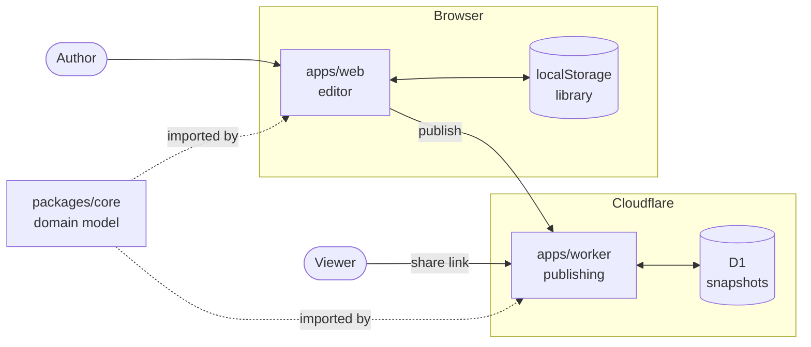

# Architecture

## Context

TransitMapper is a browser-based editor for regional transit systems. A user
draws streets, rail, stations, and the bus and train routes that run over
them, then optionally publishes a read-only snapshot at a public link.

There are no accounts. A system lives in the browser that made it, and
publishing produces a copy rather than a shared document.

## Domain model

Everything else follows from one distinction.

A **Way** is infrastructure: a physical street or rail alignment, with a
cross-section describing its lanes. A **Service** is a route that runs over
ways: a bus line, a subway line. One way carries many services, and one
service traverses many ways.

Conflating the two is the modelling mistake this project exists to avoid. A
bus route is not a road. Deleting a bus route should not delete the street,
and widening a street should not disturb the routes on it.

The remaining record types support that split:

| Type       | Meaning                                         |
| ---------- | ----------------------------------------------- |
| `System`   | One document: a whole regional network          |
| `Way`      | A physical alignment and its lane cross-section |
| `Service`  | A route traversing a sequence of ways           |
| `Node`     | A junction where ways meet                      |
| `Station`  | A place people board, with land and structures  |
| `Facility` | A structure within a station                    |
| `Group`    | Several stations treated as one interchange     |

Three properties of the model matter more than the types themselves.

**Kinds are data, not code.** Every transit mode, way type, lane kind, and
facility class is a record in the catalog. Supporting light rail is a table
entry. If adding a mode requires editing a conditional anywhere, something
was hardcoded that should not have been.

**Geometry is derived, never stored.** A way stores its centreline and its
cross-section. Lane polylines, junction footprints, and turn geometry are
computed from those. Storing them would mean two sources of truth that
disagree after the first edit.

**Appearance is separate from identity.** That a lane is 11 feet wide and
carries traffic is domain data. That it draws as grey asphalt is style. The
two are separate so a restyle never requires a data migration.

## Components

### `packages/core` — the domain

The record types, the catalog, geometry derivation, the routing graph, the
renderer, and the snapshot format. It takes data and returns data: no DOM,
no store, no framework, no network.

Every rule about what a transit system is lives here, which is why it can be
tested as plain function calls without a browser.

### `apps/web` — the editor

The single-page application: MapLibre for the map, React for the panels,
and one store through which every document mutation passes. Undo,
junction upkeep, and station re-anchoring live in the store's actions, so no
component can mutate around them.

It holds no domain rules. It asks `packages/core`.

### `apps/worker` — publishing

A Cloudflare Worker with a D1 database. It accepts a snapshot, serves it
back, and renders link previews and embeds. It validates a submitted system
by parsing it with the core's own parser rather than a second
implementation.

This is the only component that reads bytes from strangers.

## Flows

### Editing

Entirely local. A pointer gesture becomes a store action, the store calls
the core to re-derive geometry and routing, and the result renders and is
written to `localStorage`. Nothing leaves the machine.

### Publishing

1. The browser renders the link-preview image.
2. The editor sends the system and that image to the worker.
3. The worker validates both, assigns an id, and stores a snapshot with an
   expiry.
4. The author receives a link.

The snapshot is a copy. Later edits do not reach it.

### Viewing a share

The worker reads the snapshot and returns the application shell with the
snapshot's title and preview injected, so link unfurlers see real content
without running JavaScript. The application then renders it read-only.
Reading extends the expiry, so a link in use does not lapse.

### Embedding

A second, smaller entry point renders the map with no editor and no React,
because it loads inside a third party's page.

## Decisions

### Infrastructure separated from service

**Chosen:** ways and services are distinct records; a service references
ways.

**Rejected:** a route as a self-contained polyline.

**Constraint:** a real network has many routes over shared streets. Routes
as independent geometry means editing a street silently desynchronises every
route on it.

### Kinds in a catalog rather than in code

**Chosen:** modes, way types, lane kinds, and facility classes are records
read at runtime.

**Rejected:** union types with per-kind branching.

**Constraint:** the project must support modes nobody anticipated —
gondolas, ferries, bus rapid transit — without an editor rewrite each time.

### Geometry derived on demand

**Chosen:** store centrelines and cross-sections; compute everything else.

**Rejected:** storing lane polylines and junction shapes.

**Constraint:** derived geometry that is also stored is two truths that
diverge on the first edit, and every edit touches its neighbours because
junctions depend on all connecting ways.

### Local-first documents

**Chosen:** the browser holds work in progress; the server holds published
copies.

**Rejected:** server-authoritative documents.

**Constraint:** the editor must work for someone who never publishes, and
must not lose work if the service is withdrawn. A volunteer project cannot
promise indefinite hosting.

### Snapshots rather than synchronisation

**Chosen:** publishing copies the document; changes do not propagate back.

**Rejected:** live documents shared by link.

**Constraint:** share links are public and unauthenticated. A live document
behind a public link is editable by anyone holding it, which needs the
accounts this project does not have.

### One core across both runtimes

**Chosen:** the editor and the worker import the same `packages/core`.

**Rejected:** a separate server-side model.

**Constraint:** the published preview and the editor's map must draw
identically. Two implementations diverge. The cost is that the core must run
in a browser and in workerd, which the type system cannot enforce and a lint
rule does.

## Trust boundary

`apps/worker` is the only component processing input from unauthenticated
callers.

| Input                     | Constraint                                        |
| ------------------------- | ------------------------------------------------- |
| A submitted system        | Size-capped, then parsed by the core's parser     |
| A submitted preview image | Size-capped, structurally validated, served inert |
| A snapshot id             | Opaque, and parameterised at the query layer      |

Stored text is unauthenticated and unsanitised at rest. It reaches markup
through an escaping API rather than string construction.

Publishing is rate-limited per client address, because it is the only path
writing caller-supplied bytes to storage.

## Failure modes

| Failure                           | Effect                                              |
| --------------------------------- | --------------------------------------------------- |
| Worker unavailable                | Editing works. Publishing and share links fail.     |
| D1 unavailable                    | Editing works. Existing links error.                |
| Invocation budget exhausted       | Static assets served. API, shares, embeds rejected. |
| OpenStreetMap or GTFS unavailable | Import unavailable. Editing works.                  |
| Browser storage cleared           | Unpublished work is lost. Snapshots survive.        |

No server failure prevents editing. No client failure affects another user.

## Invariants

| Invariant                                               | Property preserved                                      |
| ------------------------------------------------------- | ------------------------------------------------------- |
| `packages/core` references no DOM, store, or framework  | It runs in both runtimes and is testable without either |
| All document mutation passes through store actions      | Undo and derived-state upkeep cannot be bypassed        |
| Kinds are catalog records, never branches in code       | A new transit mode is data, not a code change           |
| Derived geometry is computed, never stored              | One source of truth survives an edit                    |
| Appearance is separate from domain data                 | A restyle never requires a data migration               |
| One projector converts a system to renderable output    | Editor, embed, exports, and previews cannot diverge     |
| Stored values reach markup only through an escaping API | User-supplied text cannot become executable markup      |
| Snapshots are read through a versioned parser           | An old snapshot stays readable after the format changes |

## Unwired code

Identity, sessions, and snapshot ownership are implemented in
`packages/core` and covered by tests. No production code imports them.

There are no authentication routes, no user or session storage, and no owner
attribute on a snapshot.

The expiry sweep already exempts snapshots marked as owned, and the schema
reserves the field that would mark them. Every snapshot currently expires.
