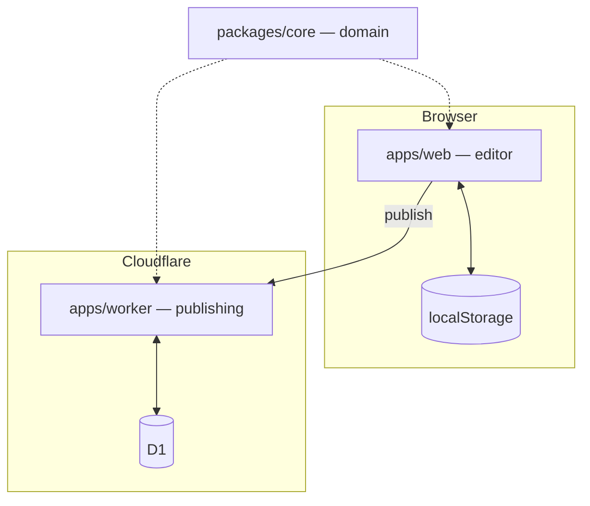
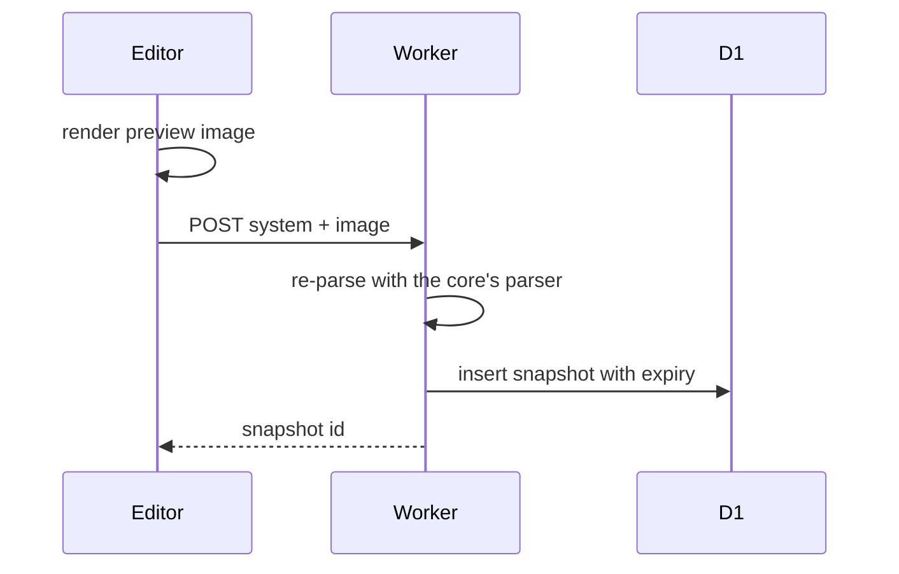
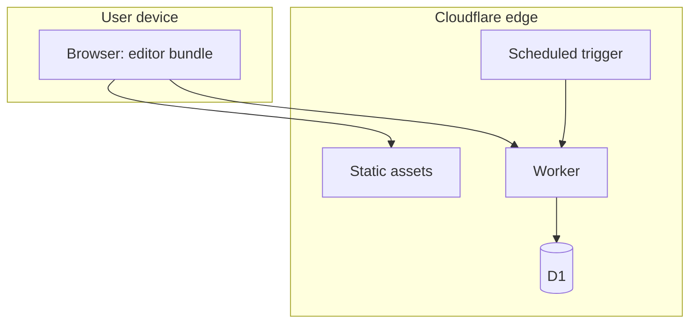
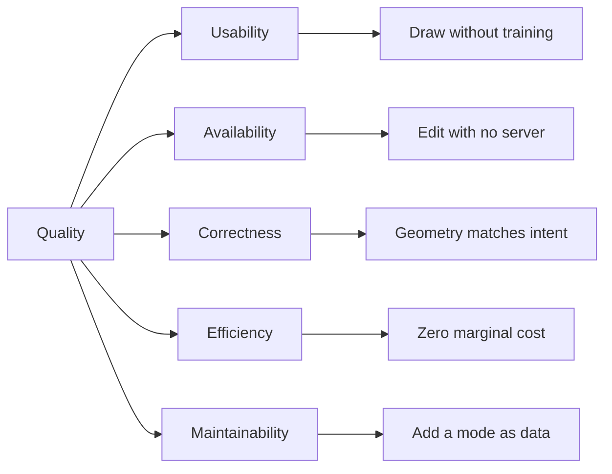

# Architecture

Structured to [arc42](https://arc42.org/overview).

## 1. Introduction and Goals

TransitMapper is a browser editor for regional transit systems. A user draws
streets and rail with real lane cross-sections, places stations, routes
services over that infrastructure, and publishes a read-only snapshot at a
public link.

It was built for Las Vegans for Better Transit to model a better network for
the Las Vegas Valley. Nothing in it is specific to one city or agency.

### Requirements overview

| Requirement         | Detail                                                                            |
| ------------------- | --------------------------------------------------------------------------------- |
| Draw infrastructure | Streets and rail with lane counts, medians, one-way traffic, divided carriageways |
| Derive junctions    | Intersections form where alignments cross, with computed turn lanes               |
| Route services      | Bus, rail, and other modes traverse sequences of ways                             |
| Design stations     | Land, platforms, structures, and bus bays rather than a point                     |
| Import real data    | Streets from OpenStreetMap, existing networks from agency GTFS                    |
| Publish             | A read-only link that unfurls with a preview and embeds in a page                 |

### Quality goals

| Priority | Goal                                           | Motivation                                                                                                                             |
| -------- | ---------------------------------------------- | -------------------------------------------------------------------------------------------------------------------------------------- |
| 1        | Usability by non-engineers                     | The intended authors are transit advocates and planners, not developers. A tool requiring training is a tool nobody uses.              |
| 2        | Editing availability independent of any server | The organization cannot promise indefinite hosting. Work must survive the service being withdrawn.                                     |
| 3        | Correctness of derived geometry                | Junction and lane geometry is computed, not drawn. If it is wrong the output misleads, and a plan that misleads is worse than no plan. |
| 4        | Operating cost near zero                       | A volunteer nonprofit funds this. A design with a per-user cost does not survive contact with a budget.                                |
| 5        | Contributor onboarding                         | The contributor pool is small and intermittent. Someone returning after two months must find their way without help.                   |

### Stakeholders

| Stakeholder      | Expectation                                              |
| ---------------- | -------------------------------------------------------- |
| Transit advocate | Sketch a credible network without learning GIS           |
| Planner          | Lane-level detail that survives scrutiny                 |
| Viewer           | Open a shared link and understand the proposal           |
| Contributor      | Find where a change belongs; know what it must not break |
| The organization | Run indefinitely on a volunteer budget                   |

## 2. Architecture Constraints

### Technical

| Constraint                                  | Consequence                                                                                                                                                              |
| ------------------------------------------- | ------------------------------------------------------------------------------------------------------------------------------------------------------------------------ |
| Cloudflare free tier                        | Per-request CPU in the tens of milliseconds, a daily invocation allowance, and a bounded database. Server-side rasterisation and per-request heavy compute are excluded. |
| Browser storage for working documents       | Capacity is finite and user-clearable. The library holds documents, not history.                                                                                         |
| `packages/core` runs in browser and workerd | No browser-only global may appear in it. The type system cannot express this, so a lint rule does.                                                                       |
| TypeScript 6, not 7                         | `typescript-eslint` cannot load under TypeScript 7 and there is no released support. The compiler is pinned until it lands.                                              |
| No accounts                                 | Every published link is public and unauthenticated. Nothing may depend on knowing who is asking.                                                                         |

### Organizational

| Constraint                               | Consequence                                                                                       |
| ---------------------------------------- | ------------------------------------------------------------------------------------------------- |
| Volunteer maintenance, intermittent      | Anything requiring routine manual attention will not receive it. Checks must be automatic.        |
| Small contributor pool, mixed experience | Conventions are enforced by tooling rather than carried by reviewers.                             |
| Public repository                        | Design assumes the code, the configuration, and the infrastructure layout are readable by anyone. |

### Conventions

Documented and enforced in [the enforcement model](enforcement-model.md).
The bar is `pnpm check`, which runs formatting, lint, typecheck, tests, and
the repository's own invariants.

## 3. Context and Scope

### Business context

| Partner             | Input                      | Output                                     |
| ------------------- | -------------------------- | ------------------------------------------ |
| Author              | Draws and edits a system   | A stored document, optionally a share link |
| Viewer              | Opens a share link         | A read-only rendering of a snapshot        |
| Third-party page    | Embeds a link              | An iframe rendering of a snapshot          |
| Link unfurler       | Requests a share URL       | Title, description, and a preview image    |
| OpenStreetMap       | Street geometry on request | Imported ways                              |
| Transit agency GTFS | A published feed           | An imported comparison network             |

### Technical context

| Channel                      | Protocol        | Carries                                  |
| ---------------------------- | --------------- | ---------------------------------------- |
| Editor to publishing service | HTTPS, JSON     | A system document and a preview image    |
| Viewer to publishing service | HTTPS, HTML     | Application shell with metadata injected |
| Service to database          | D1 binding      | Snapshot rows                            |
| Editor to OpenStreetMap      | HTTPS, Overpass | Way geometry and tags                    |
| Editor to GTFS feed          | HTTPS, zip      | Agency route and stop tables             |

### Out of scope

Ridership modelling, schedule optimisation, cost estimation beyond rough
capital figures, and hosting agency data. Collaboration and account-owned
documents are on the roadmap and absent today.

## 4. Solution Strategy

| Goal                            | Approach                                                                                                                                             |
| ------------------------------- | ---------------------------------------------------------------------------------------------------------------------------------------------------- |
| Usability by non-engineers      | Direct manipulation on a map. Infrastructure is drawn, not specified in forms. Junction geometry is derived so the author never places one.          |
| Editing availability            | Local-first. The browser holds the document; the server holds published copies only. No network call is on the editing path.                         |
| Correctness of derived geometry | The derivation is pure and lives in `packages/core`, so it is exercised by tests as plain function calls without a browser.                          |
| Operating cost                  | Static assets bypass the Worker. Preview images are rendered client-side. The Worker is invoked only for publishing, share pages, and embeds.        |
| Contributor onboarding          | Kinds are catalog data rather than branches in code, so adding a mode does not require reading the editor. Conventions are enforced by `pnpm check`. |

Top-level decomposition is three packages: a pure domain core, a browser
editor, and an edge publishing service. The core is imported by both
applications and depends on neither.

## 5. Building Block View

### Level 1

| Building block           | Responsibility                                                                              |
| ------------------------ | ------------------------------------------------------------------------------------------- |
| `packages/core`          | Every rule about what a transit system is and how it is drawn. Data in, data out.           |
| `apps/web`               | Interaction state, map rendering, and the single store all mutation passes through.         |
| `apps/worker`            | Accepting, storing, and serving snapshots. The only component reading bytes from strangers. |
| `packages/eslint-plugin` | Repository-specific lint rules, one per invariant the compiler cannot express.              |

### Level 2 — `packages/core`

| Block    | Responsibility                                                                  |
| -------- | ------------------------------------------------------------------------------- |
| Model    | Record types, the catalog of kinds, validation, versioned serialisation         |
| Geometry | Lane polylines, junction footprints, and turn geometry derived from centrelines |
| Routing  | The graph over ways and junctions that services traverse                        |
| Render   | System to styled output, shared by the map, exports, embeds, and previews       |
| Style    | Visual properties of catalog kinds, kept separate from domain data              |
| Share    | The wire contract, snapshot ownership, and claim logic                          |

### Level 2 — `apps/web`

| Block   | Responsibility                                                            |
| ------- | ------------------------------------------------------------------------- |
| Editor  | The store: every mutation, undo checkpoints, junction and station upkeep  |
| Map     | MapLibre integration, layer emission, and the pointer state machine       |
| UI      | React components. Read the store, dispatch actions, hold no domain logic. |
| Share   | Export formats, preview rendering, and the publishing client              |
| Storage | The local document library                                                |
| Sim     | Vehicle animation along service patterns                                  |

## 6. Runtime View

### Editing

A pointer gesture becomes a store action. The store calls the core to
re-derive geometry and routing for the affected ways and their neighbours,
the map re-renders from the result, and the document is written to
`localStorage`. No network call occurs.

### Publishing

The Worker validates by parsing with the same parser the editor uses, rather
than a second implementation. The snapshot is a copy; later edits do not
reach it.

### Viewing a share

The Worker reads the snapshot and returns the application shell with title
and preview injected, so a link unfurler sees content without executing
JavaScript. The application then renders the snapshot read-only. The read
extends the expiry, so a link in active use does not lapse.

### Expiry

A scheduled trigger deletes snapshots past their expiry. Snapshots marked as
owned are exempt; nothing marks them today.

## 7. Deployment View

| Element           | Detail                                                                                    |
| ----------------- | ----------------------------------------------------------------------------------------- |
| Static assets     | Served without invoking the Worker, which keeps them off the metered invocation allowance |
| Worker            | Invoked only for API paths, share pages, and embeds                                       |
| D1                | One database holding snapshot rows, with migrations applied by the deploy pipeline        |
| Scheduled trigger | Daily expiry sweep                                                                        |

One environment, production, deployed on merge to the default branch.
Operational procedure is in [operations](../../operations/how-to/operations.md).

## 8. Crosscutting Concepts

### Domain model

A **Way** is infrastructure: an alignment with a lane cross-section. A
**Service** is a route running over ways. One way carries many services; one
service traverses many ways.

| Type       | Meaning                                    |
| ---------- | ------------------------------------------ |
| `System`   | One document: a regional network           |
| `Way`      | A physical alignment and its cross-section |
| `Service`  | A route traversing a sequence of ways      |
| `Node`     | A junction where ways meet                 |
| `Station`  | A boarding place with land and structures  |
| `Facility` | A structure within a station               |
| `Group`    | Stations treated as one interchange        |

### Kinds as data

Modes, way types, lane kinds, and facility classes are catalog records read
at runtime. Application code reads fields off a record rather than testing
which one it received.

### Derived state

Ways store a centreline and a cross-section. Lane polylines, junction
footprints, and turn geometry are computed. Nothing derived is persisted.

### Domain and appearance separated

That a lane is a travel lane of a given width is domain data. That it draws
grey with white dashes is style. A restyle never requires a data migration.
A service's line colour is the exception, because "the red line" is part of
its identity.

### Persistence and versioning

Snapshots outlive the code that wrote them, so serialisation is versioned
and reads forward across versions.

### Security

Stored text is unauthenticated and unsanitised at rest. It reaches markup
through an escaping API rather than string construction. Uploaded preview
bytes are size-capped, structurally validated, and served inert. Publishing
is rate-limited per client address.

### Testing

The domain core is pure, so its rules are exercised as function calls
without a browser. The Worker is tested in a real runtime against a real
database with production migrations applied.

## 9. Architecture Decisions

### Infrastructure separated from service

Chosen: ways and services are distinct records; a service references ways.
Rejected: a route as a self-contained polyline. A real network runs many
routes over shared streets, and independent geometry desynchronises on the
first street edit.

### Kinds in a catalog

Chosen: modes and types are records read at runtime. Rejected: union types
with per-kind branching. The project must absorb modes nobody anticipated
without an editor rewrite.

### Geometry derived on demand

Chosen: store centrelines and cross-sections; compute the rest. Rejected:
storing lane polylines and junction shapes. Two representations of one truth
diverge on the first edit, and junctions depend on every connecting way.

### Local-first documents

Chosen: the browser holds work in progress. Rejected: server-authoritative
documents. The editor must work for someone who never publishes and must not
lose work if the service is withdrawn.

### Snapshots rather than synchronisation

Chosen: publishing copies the document. Rejected: live documents shared by
link. A live document behind a public, unauthenticated link is editable by
anyone holding it.

### One core across both runtimes

Chosen: editor and Worker import the same core. Rejected: a separate
server-side model. The published preview and the editor's map must draw
identically, and two implementations diverge.

### Client-side preview rendering

Chosen: the browser renders the preview and uploads it. Rejected: rendering
in the Worker. The per-request CPU budget is an order of magnitude below
what rasterisation costs. The consequence is that preview bytes are
caller-supplied and must be validated.

## 10. Quality Requirements

### Quality tree

### Scenarios

| Quality         | Scenario                                                    | Expected                                                             |
| --------------- | ----------------------------------------------------------- | -------------------------------------------------------------------- |
| Usability       | An advocate with no GIS experience draws a two-line network | Completed without documentation                                      |
| Availability    | The publishing service is unreachable                       | Editing, saving, and exporting continue                              |
| Availability    | Browser storage is cleared                                  | Unpublished work is lost; published snapshots survive                |
| Correctness     | Two ways cross                                              | A junction forms with turn lanes consistent with both cross-sections |
| Correctness     | A snapshot written against an older format is opened        | It parses and renders                                                |
| Efficiency      | A visitor loads the editor                                  | The Worker is not invoked                                            |
| Efficiency      | A document of hostile size is submitted                     | Rejected before storage                                              |
| Maintainability | A new transit mode is added                                 | One catalog record, no conditional edited                            |
| Maintainability | A contributor returns after two months                      | `pnpm check` states the bar; a failure names its fix                 |

## 11. Risks and Technical Debt

| Item                                                  | Effect                                                                                                                                                          | Status                                                           |
| ----------------------------------------------------- | --------------------------------------------------------------------------------------------------------------------------------------------------------------- | ---------------------------------------------------------------- |
| Wall-clock performance assertion                      | A spatial-grid bound is asserted in elapsed milliseconds, measured between 178ms and 3,229ms for identical code. It can fail for reasons unrelated to the code. | Mitigated by running tests serially; needs a deterministic proxy |
| Single maintainer                                     | Review, deployment, and credentials rest with one person                                                                                                        | Open                                                             |
| Unwired account code                                  | Identity, sessions, and ownership are implemented and imported by nothing. It reads as dead code and is not.                                                    | Documented in §12 and in the code map                            |
| TypeScript pinned to 6                                | The toolchain cannot move to 7 until `typescript-eslint` supports it                                                                                            | Blocked upstream                                                 |
| Merge queue unavailable                               | The repository is owned by a personal account, so concurrent merges are not tested against the merged result                                                    | Unblocked by transferring to the organization                    |
| Browser storage as the only home for unpublished work | Clearing site data loses documents, with no recovery path                                                                                                       | Accepted; publishing is the backup                               |
| Two test suites                                       | A sequential `check()` script and Vitest coexist. The former resists being split.                                                                               | Accepted; new tests go to Vitest                                 |

## 12. Glossary

| Term          | Definition                                                                                                    |
| ------------- | ------------------------------------------------------------------------------------------------------------- |
| Catalog       | The table of kinds — modes, way types, lane kinds, facility classes — read at runtime rather than branched on |
| Cross-section | The lane-by-lane composition of a way: travel lanes, medians, direction                                       |
| Facility      | A structure within a station, such as a platform or a bus bay                                                 |
| Group         | Several stations treated as one interchange                                                                   |
| Junction      | Derived geometry where ways meet; a `Node` in the model                                                       |
| Mode          | A means of transport: subway, light rail, bus, tram, ferry, gondola                                           |
| Service       | A route traversing a sequence of ways                                                                         |
| Snapshot      | A published copy of a system, stored server-side with an expiry                                               |
| Station       | A boarding place with land and structures, not a point                                                        |
| System        | One document: a whole regional network                                                                        |
| Way           | A physical alignment — street or track — and its cross-section                                                |
