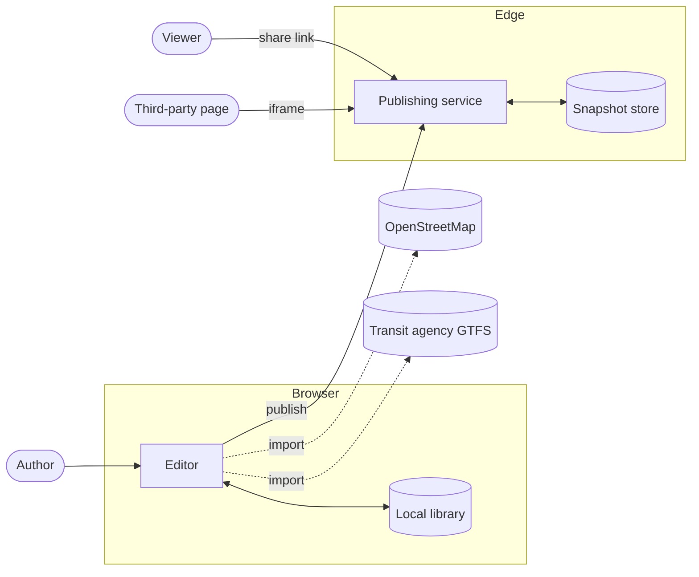

# Architecture

## Context

TransitMapper is a browser-based editor for regional transit systems. A
system is a document. It is created, edited, and stored in the browser, and
can be published as a read-only snapshot at a public link.

There are no accounts. Systems are not synchronised across devices or shared
for editing.

OpenStreetMap and GTFS feeds are read-only import sources. Both are
optional.

## Components

### Domain core

The core contains the data model, geometry derivation, routing graph,
renderer, and the published-snapshot format. It references no DOM, no
store, and no framework.

The core defines what a transit system is and how it is drawn. It holds no
state.

### Editor

The editor is the single-page application. It holds interaction state,
renders the map, and routes every document mutation through one store. It
delegates all domain rules to the core.

### Publishing service

The publishing service is an edge worker with an attached database. It
accepts a snapshot, serves it back, and renders link previews and embeds.
It controls snapshot lifetime and validates submitted systems using the
core's parser.

## Flows

### Editing

Editing happens entirely in the browser. The editor mutates the store, the
store calls the core to derive geometry and routes, and the result is
written to the local library. No request leaves the machine.

### Publishing

1. The author requests a share.
2. The browser renders the link-preview image.
3. The editor sends the system and the image to the publishing service.
4. The service validates both, assigns an identifier, and stores a snapshot
   with an expiry.
5. The author receives a link.

The snapshot is a copy. Later edits to the system do not change it.

### Viewing a share

1. A viewer opens the link.
2. The service reads the snapshot and returns the application shell with the
   snapshot's metadata injected for link unfurling.
3. The application renders the snapshot read-only.
4. The read extends the snapshot's expiry.

### Embedding

A separate entry point renders the map without the editor or its framework.
It loads inside a third party's page, so it carries as little as possible.

### Expiry

A scheduled sweep deletes snapshots past their expiry. Snapshots marked as
owned are exempt. Nothing currently marks them.

## Decisions

### Local-first documents

**Chosen:** the browser holds work in progress. The service holds published
copies.

**Rejected:** server-authoritative documents with the editor as a client.

**Constraint:** the editor must work for someone who never publishes, and
must not lose work if the service is unavailable or withdrawn.

### Snapshots rather than synchronisation

**Chosen:** publishing copies the document. Changes do not propagate back.

**Rejected:** live documents shared by link.

**Constraint:** share links are public and unauthenticated. A live document
at a public link is editable by anyone holding it, which requires the
accounts and permissions this project does not have.

### Client-side preview rendering

**Chosen:** the browser renders the link-preview image and uploads it.

**Rejected:** rendering it in the edge worker.

**Constraint:** the edge runtime's per-request compute budget is an order of
magnitude below the cost of rasterisation. The consequence is that preview
bytes are caller-supplied, so they are validated structurally and served
inert.

### Static assets bypass the worker

**Chosen:** only the API, share, and embed paths invoke the worker.

**Rejected:** routing all requests through it.

**Constraint:** worker invocations are metered; static asset requests are
not. Exhausting the invocation budget degrades every path rather than one.

### One domain core across both runtimes

**Chosen:** the editor and the publishing service import the same core.

**Rejected:** a separate server-side model.

**Constraint:** the published preview and the editor's map must render
identically. The cost is that the core must run in both runtimes, which the
type system cannot enforce and a lint rule does.

## Trust boundary

The publishing service is the only component that processes input from
unauthenticated callers.

| Input                     | Constraint                                                                     |
| ------------------------- | ------------------------------------------------------------------------------ |
| A submitted system        | Size-capped, then parsed by the core's parser                                  |
| A submitted preview image | Size-capped, structurally validated, served with a policy preventing execution |
| A snapshot identifier     | Opaque, and parameterised at the query layer                                   |

Stored text is unauthenticated and unsanitised at rest. It reaches markup
through an escaping API rather than string construction.

Publishing is rate-limited per client address. It is the only path that
writes caller-supplied bytes to storage.

## Failure modes

| Failure                           | Effect                                                  |
| --------------------------------- | ------------------------------------------------------- |
| Publishing service unavailable    | Editing works. Publishing and share links fail.         |
| Snapshot store unavailable        | Editing works. Existing links error.                    |
| Invocation budget exhausted       | Static assets served. API, shares, and embeds rejected. |
| OpenStreetMap or GTFS unavailable | Import unavailable. Editing works.                      |
| Browser storage cleared           | Unpublished work is lost. Published snapshots survive.  |

No service failure prevents editing. No client failure affects another user.

## Invariants

| Invariant                                               | Property preserved                                      |
| ------------------------------------------------------- | ------------------------------------------------------- |
| The domain core references no DOM, store, or framework  | It runs in both runtimes and is testable without either |
| All document mutation passes through store actions      | Undo and derived-state upkeep cannot be bypassed        |
| Visual properties are separate from domain data         | Adding a transit mode does not modify the renderer      |
| One projector converts a system to renderable output    | Editor, embed, exports, and previews cannot diverge     |
| Stored values reach markup only through an escaping API | User-supplied text cannot become executable markup      |
| Snapshots are read through a versioned parser           | An old snapshot stays readable after the format changes |

## Unwired code

Identity, sessions, and snapshot ownership are implemented in the domain
core and covered by tests. No production code imports them.

There are no authentication routes, no user or session storage, and no owner
attribute on a snapshot.

The expiry sweep already exempts snapshots marked as owned, and the schema
reserves the field that would mark them. Every snapshot currently expires.
