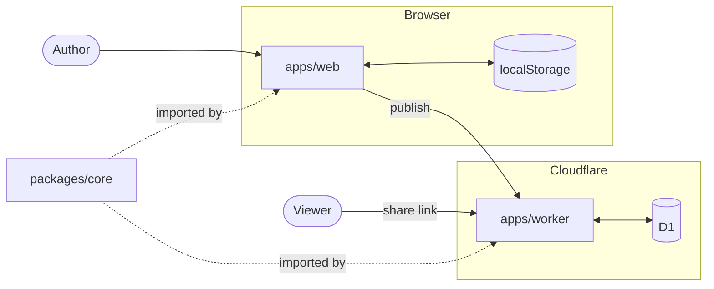

# Architecture

## Context

A browser editor for regional transit systems. A user draws streets, rail,
stations, and the routes running over them, then optionally publishes a
read-only snapshot at a public link.

There are no accounts. A system lives in the browser that made it.
Publishing produces a copy, not a shared document.

Ridership modelling, schedule optimisation, and agency data hosting are out
of scope. OpenStreetMap and GTFS feeds are read-only import sources.

## Domain model

A **Way** is infrastructure: a street or rail alignment with a lane
cross-section. A **Service** is a route running over ways. One way carries
many services; one service traverses many ways.

| Type       | Meaning                                    |
| ---------- | ------------------------------------------ |
| `System`   | One document: a regional network           |
| `Way`      | A physical alignment and its cross-section |
| `Service`  | A route traversing a sequence of ways      |
| `Node`     | A junction where ways meet                 |
| `Station`  | A boarding place, with land and structures |
| `Facility` | A structure within a station               |
| `Group`    | Stations treated as one interchange        |

Modes, way types, lane kinds, and facility classes are catalog records read
at runtime, not variants in code.

Ways store a centreline and a cross-section. Lane polylines, junction
footprints, and turn geometry are computed from those.

## Code map

### `packages/core`

Record types, catalog, geometry derivation, routing graph, renderer,
snapshot format. Data in, data out.

Owns every rule about what a transit system is. Owns no storage, no
transport, no interaction state.

### `apps/web`

The editor: MapLibre for the map, React for panels, one store through which
every mutation passes. Undo, junction upkeep, and station re-anchoring live
in store actions, so no component can mutate around them.

Owns no domain rules.

### `apps/worker`

Publishing: accepts a snapshot, serves it back, renders link previews and
embeds. Validates submitted systems with the core's parser rather than a
second implementation.

The only component reading bytes from strangers.

### `packages/eslint-plugin`

Repository-specific lint rules, one per invariant the compiler cannot
express.

## Runtime topology

`packages/core` compiles into both the browser bundle and the Worker.

The Worker runs on workerd with a per-request CPU budget in the tens of
milliseconds, and a metered daily invocation allowance. Static assets are
served without invoking it.

The editor runs in the browser with no server dependency.

## Flows

### Editing

A pointer gesture becomes a store action, the store calls the core to
re-derive geometry and routing, and the result renders and is written to
`localStorage`. Nothing leaves the machine.

### Publishing

The browser renders the preview image, then sends the system and image to
the Worker. The Worker re-parses the system with the core's parser, assigns
an id, and writes a row with an expiry. The author receives a link.

The snapshot is a copy. Later edits do not reach it.

### Viewing a share

The Worker reads the snapshot and returns the application shell with title
and preview injected, so link unfurlers see content without running
JavaScript. Reading extends the expiry.

## Invariants

| Invariant                                               | Property preserved                                      | Enforced by |
| ------------------------------------------------------- | ------------------------------------------------------- | ----------- |
| `packages/core` references no DOM, store, or framework  | It runs in both runtimes and is testable without either | `lint`      |
| Kinds are catalog records, never branches in code       | A new mode is data, not a code change                   | nothing     |
| Derived geometry is computed, never stored              | One source of truth survives an edit                    | nothing     |
| Appearance is separate from domain data                 | A restyle never requires a data migration               | nothing     |
| All mutation passes through store actions               | Undo and derived-state upkeep cannot be bypassed        | nothing     |
| One projector converts a system to renderable output    | Editor, embed, exports, previews cannot diverge         | nothing     |
| Stored values reach markup only through an escaping API | User text cannot become executable markup               | nothing     |
| Snapshots are read through a versioned parser           | An old snapshot stays readable after a format change    | tests       |

## Decisions

### Infrastructure separated from service

Chosen: ways and services are distinct records; a service references ways.
Rejected: a route as a self-contained polyline. A real network has many
routes over shared streets, and independent geometry desynchronises on the
first street edit.

### Kinds in a catalog

Chosen: modes and types are records read at runtime. Rejected: union types
with per-kind branching. The project must absorb modes nobody anticipated
without an editor rewrite.

### Geometry derived on demand

Chosen: store centrelines and cross-sections. Rejected: storing lane
polylines and junction shapes. Two representations of the same truth diverge
on the first edit, and junctions depend on every connecting way.

### Local-first documents

Chosen: the browser holds work in progress. Rejected: server-authoritative
documents. The editor must work for someone who never publishes, and must
not lose work if the service is withdrawn.

### Snapshots rather than synchronisation

Chosen: publishing copies. Rejected: live documents shared by link. A live
document behind a public, unauthenticated link is editable by anyone holding
it.

### One core across both runtimes

Chosen: editor and Worker import the same core. Rejected: a separate
server-side model. The published preview and the editor's map must draw
identically, and two implementations diverge.

## Trust boundary

`apps/worker` is the only component processing input from unauthenticated
callers.

| Input                     | Constraint                                        |
| ------------------------- | ------------------------------------------------- |
| A submitted system        | Size-capped, then parsed by the core's parser     |
| A submitted preview image | Size-capped, structurally validated, served inert |
| A snapshot id             | Opaque, parameterised at the query layer          |

Stored text is unsanitised at rest and reaches markup through an escaping
API. Publishing is rate-limited per client address.

## Failure modes

| Failure                           | Effect                                              |
| --------------------------------- | --------------------------------------------------- |
| Worker unavailable                | Editing works. Publishing and share links fail.     |
| D1 unavailable                    | Editing works. Existing links error.                |
| Invocation budget exhausted       | Static assets served. API, shares, embeds rejected. |
| OpenStreetMap or GTFS unavailable | Import unavailable. Editing works.                  |
| Browser storage cleared           | Unpublished work is lost. Snapshots survive.        |

## Absences

Identity, sessions, and snapshot ownership are implemented in
`packages/core` and tested. Nothing imports them. There are no
authentication routes, no session storage, and no owner column.

The expiry sweep already exempts snapshots marked as owned, and the schema
reserves the field that would mark them. Every snapshot currently expires.
