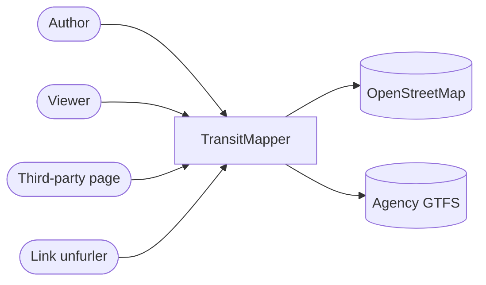
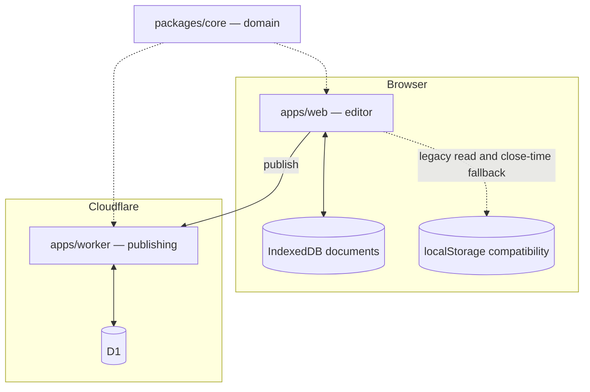
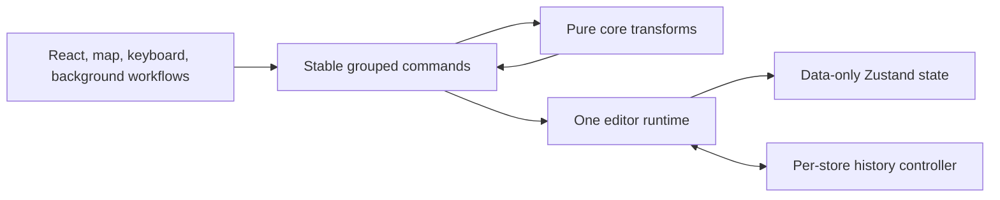
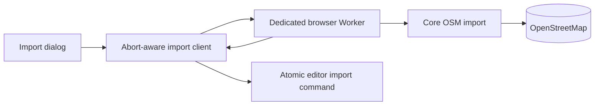
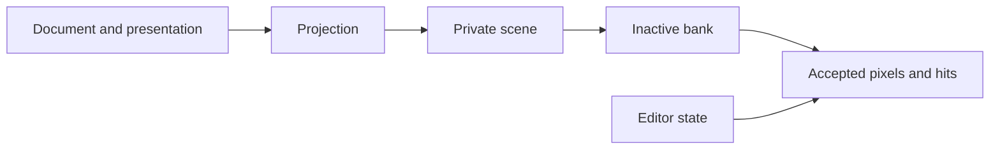
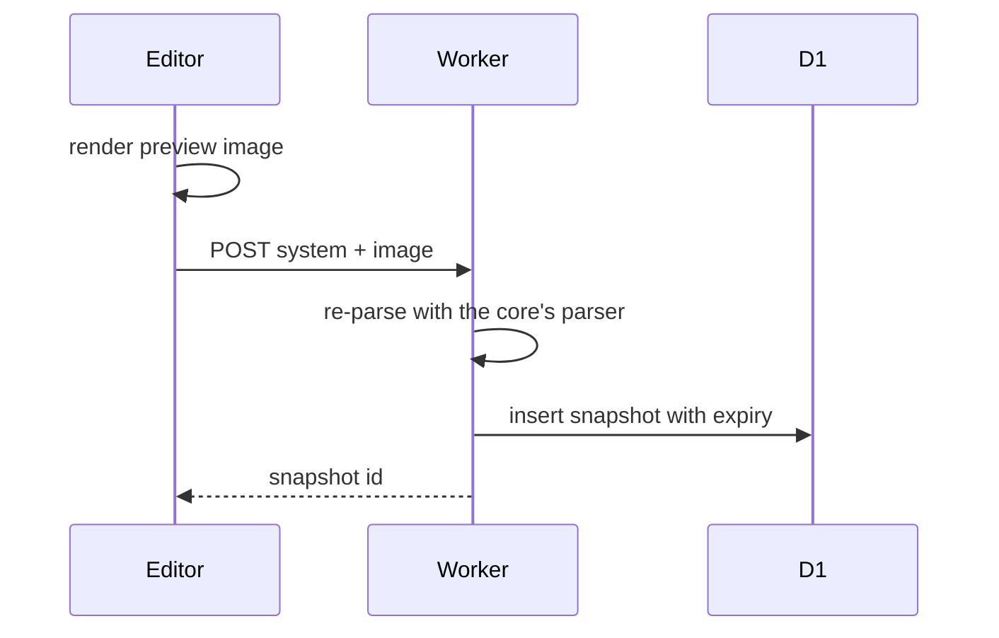
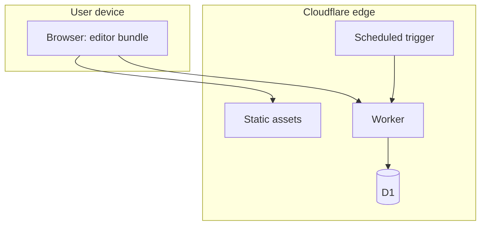
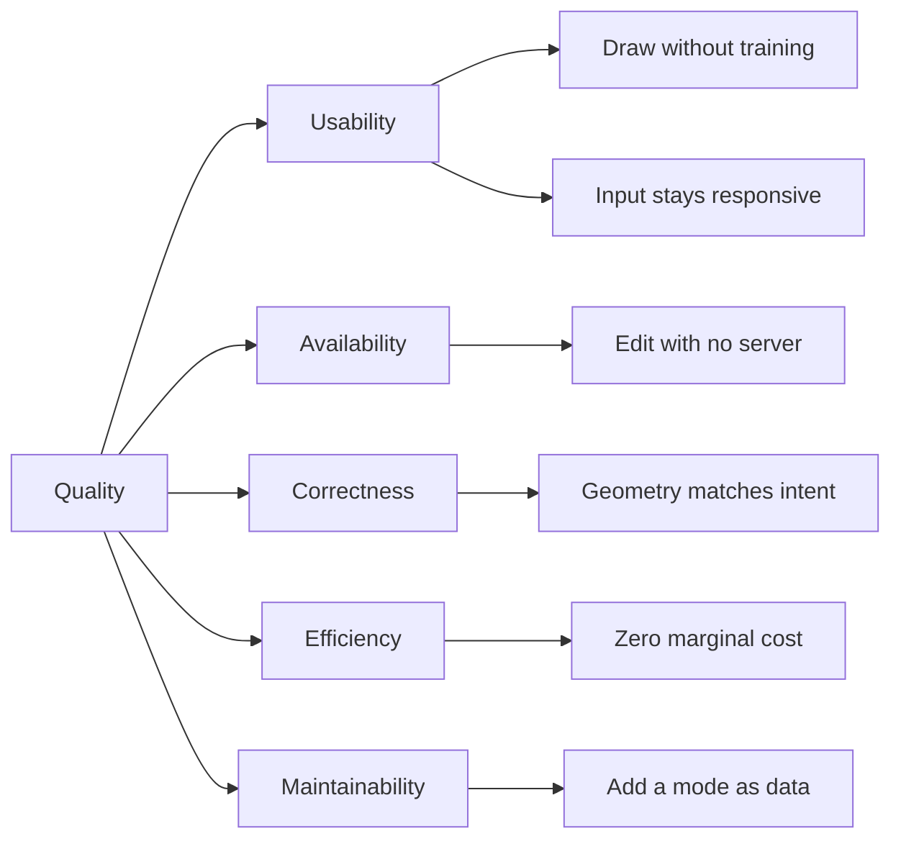

# Architecture

Structured to [arc42](https://arc42.org/overview).

## 1. Introduction and Goals

TransitMapper is a browser editor for regional transit systems. You draw
streets and rail with real lane cross-sections, place stations, route
services over that infrastructure, and publish a read-only snapshot at a
public link.

Las Vegans for Better Transit built it to model a better network for the Las
Vegas Valley. Nothing in it is specific to one city or agency.

Transit advocacy produces proposals nobody can evaluate. A line drawn on a
screenshot says nothing about whether the street is wide enough, where the
vehicle turns, or what happens at the intersection. The tools that answer
those questions are professional GIS packages, priced and shaped for agency
staff. TransitMapper answers them and can still be handed to a volunteer.

### Requirements overview

| Requirement         | Detail                                                                            |
| ------------------- | --------------------------------------------------------------------------------- |
| Draw infrastructure | Streets and rail with lane counts, medians, one-way traffic, divided carriageways |
| Derive junctions    | Intersections form where alignments cross, with computed turn lanes               |
| Route services      | Bus, rail, and other modes traverse sequences of ways                             |
| Design stations     | Land, platforms, structures, and bus bays instead of a point                      |
| Import real data    | Streets from OpenStreetMap, existing networks from agency GTFS                    |
| Publish             | A read-only link that unfurls with a preview and embeds in a page                 |

### Quality goals

Ordered. Where two conflict, the higher-numbered goal yields.

| Priority | Goal                                           | Motivation                                                      |
| -------- | ---------------------------------------------- | --------------------------------------------------------------- |
| 1        | Immediate response to direct manipulation      | An editor that lags under a real system is not usable           |
| 2        | Usability by non-engineers                     | The intended authors are advocates and planners, not developers |
| 3        | Editing availability independent of any server | The organization cannot promise indefinite hosting              |
| 4        | Correctness of derived geometry                | A plan that misleads is worse than no plan                      |
| 5        | Operating cost near zero                       | A volunteer nonprofit funds this                                |
| 6        | Contributor onboarding                         | The contributor pool is small and intermittent                  |

The order settles arguments. Direct manipulation therefore uses progressive
detail rather than making the pointer wait for a complete derived map.
Progressive detail may postpone expensive recomputation, but it cannot freeze
animation, hide feedback, or disable an editing capability to make a metric
pass. Usability beats correctness, so the editor accepts a half-drawn network
and shows what is wrong instead of refusing input until it validates.
Availability beats cost, so documents live in the browser even though a server
would be easier to build. Cost beats onboarding, so the Worker stays small
enough to be awkward to read, and we document the awkwardness rather than
spend money removing it.

### Stakeholders

| Stakeholder      | Expectation                                              |
| ---------------- | -------------------------------------------------------- |
| Transit advocate | Sketch a credible network without learning GIS           |
| Planner          | Lane-level detail that survives scrutiny                 |
| Viewer           | Open a shared link and understand the proposal           |
| Contributor      | Find where a change belongs; know what it must not break |
| The organization | Run indefinitely on a volunteer budget                   |

The advocate and the planner want opposite things, and that shapes most of
the interface. The advocate wants a line between two neighbourhoods in under
a minute. The planner wants to know how many lanes that line consumes and
what it does to the cross-street. TransitMapper derives the detail instead
of demanding it: you draw a centreline, the cross-section starts from a
preset, and you open the preset when you care.

## 2. Architecture Constraints

### Technical

The deployment target is the Cloudflare free tier, and it shapes the design
more than anything else. Compute is metered per request in the tens of
milliseconds, invocations are capped daily, and the database has a hard size
ceiling. Nothing that needs sustained server-side computation can run here.
Image rendering is the visible case: it happens in the browser because it
cannot happen in the Worker.

The domain package runs in two runtimes: the browser for editing, workerd
for publishing. It can therefore use nothing that only one of them provides.
The compiler cannot catch a violation, because the package needs typings
both runtimes share and those ship alongside browser-only ones. A lint rule
catches it.

TypeScript is pinned to version 6. Version 7 is released and faster, but
`typescript-eslint` refuses to load against it, so upgrading would turn
linting off.

There are no accounts. Every published link is public, and nothing in the
system can depend on knowing who is asking.

Desktop is the primary authoring surface, and it sets the editing vocabulary.
Touch reaches every operation that vocabulary contains, through a grammar
suited to fingers rather than a reduced set of features. Two device properties
decide this and they are read separately: viewport width selects the layout,
and pointer capability selects the input grammar and the hit tolerances. A
device can be wide and coarse, so deciding either from the other is wrong on
real hardware.

Working documents live in browser-owned IndexedDB, with localStorage retained
only for migration and close-time recovery. Browser quotas are finite, and the
user can clear either store at any moment.

### Organizational

Maintenance is volunteer and intermittent. Anything needing regular manual
attention will not get it, so every convention that matters is a command
that fails, not a rule someone remembers.

Contributors range from first-timers to transit advocates who write some
TypeScript, and there may be no reviewer free when one of them opens a pull
request. The tooling has to carry what a reviewer would.

The repository is public. Anyone can read the code, the configuration, and
the shape of the infrastructure, and the design assumes they will.

### Conventions

The bar is `pnpm check`: formatting, lint, typecheck, tests, and the
repository's own invariants. It runs without a browser or a network, and CI
runs the same command. See [the enforcement model](enforcement-model.md).

## 3. Context and Scope

### Business context

Authors describe a network. Viewers read it. Two external sources supply
data, both optional and both read-only.

| Partner             | Input                      | Output                                     |
| ------------------- | -------------------------- | ------------------------------------------ |
| Author              | Draws and edits a system   | A stored document, optionally a share link |
| Viewer              | Opens a share link         | A read-only rendering of a snapshot        |
| Third-party page    | Embeds a link              | An iframe rendering of a snapshot          |
| Link unfurler       | Requests a share URL       | Title, description, and a preview image    |
| OpenStreetMap       | Street geometry on request | Imported ways                              |
| Transit agency GTFS | A published feed           | An imported comparison network             |

The link unfurler is not a viewer. It is a crawler, it does not run
JavaScript, and it needs the title and preview in the first HTML response.
That one requirement is why a Worker serves share pages at all. Without it,
the single-page application could handle every route.

### Technical context

| Channel                      | Protocol        | Carries                                  |
| ---------------------------- | --------------- | ---------------------------------------- |
| Editor to publishing service | HTTPS, JSON     | A system document and a preview image    |
| Viewer to publishing service | HTTPS, HTML     | Application shell with metadata injected |
| Service to database          | D1 binding      | Snapshot rows                            |
| Editor to OpenStreetMap      | HTTPS, Overpass | Way geometry and tags                    |
| Editor to GTFS feed          | HTTPS, zip      | Agency route and stop tables             |

### Out of scope

Ridership modelling, schedule optimisation, cost estimation beyond rough
capital figures, and hosting agency data. Collaboration and account-owned
documents are on the roadmap and absent today.

## 4. Solution Strategy

The first two quality goals decide most of the architecture.

The editor has to work without a server, so the document lives in the
browser and the server holds only published copies. Nothing on the editing
path touches the network, so nothing on the editing path can fail. That
forces the next decision: with no server in the loop there is nowhere
central to validate a system, so the rules about what a transit system is
have to run in the browser. Those rules are the domain package.

The server applies the same rules when it stores a snapshot, so both
applications import that one package. Two implementations of the same
geometry would drift apart, and the first symptom would be a published
preview that does not match what the author drew.

Cost has to stay near zero, so the Worker runs as rarely as possible. Static
assets skip it entirely. The browser renders the preview image and uploads
it. That leaves the Worker two jobs, storing a snapshot and serving one, and
both are cheap.

Contributors come and go, so the parts people extend most often are data. A
new transit mode is a catalog record. A new lane type is a catalog record.
Neither requires understanding the editor.

Ways store a centreline and a cross-section, and lanes, junctions, and turn
geometry are computed from those on demand. The document stays small, the
geometry tests as plain functions, and stored data can never disagree with
what it was derived from.

## 5. Building Block View

### Level 1

The split is by purity, not by feature. `packages/core` holds everything
expressible as a function from data to data, `apps/web` holds everything
needing a browser, and `apps/worker` holds everything needing a server.
Station design therefore spans all three, and that is deliberate: the
alternative files a feature's logic beside its UI, and logic that sits
beside UI can only be tested through the UI.

| Building block           | Responsibility                                                               | Does not contain                      |
| ------------------------ | ---------------------------------------------------------------------------- | ------------------------------------- |
| `packages/core`          | Every rule about what a transit system is and how it is drawn                | Storage, transport, interaction state |
| `apps/web`               | Interaction state, command composition, map rendering, and browser workflows | Domain rules                          |
| `apps/worker`            | Accepting, storing, and serving snapshots                                    | Domain rules; a second parser         |
| `packages/eslint-plugin` | Lint rules for invariants the compiler cannot express                        | Anything specific to one app          |

The core depends on neither application. Neither application depends on the
other. This package direction keeps core testable on its own. Inside the web
application, dependency-cruiser also keeps editor command groups independent:
they may use contracts, the shared runtime, shared internal operations, and
core transforms, but may not import sibling command groups or the public store
entry.

### Level 2 — `packages/core`

The layering runs model, then geometry and routing, then rendering. Each
layer depends only on the ones above it.

| Block    | Responsibility                                                                  |
| -------- | ------------------------------------------------------------------------------- |
| Model    | Record types, the catalog of kinds, validation, versioned serialisation         |
| Geometry | Lane polylines, junction footprints, and turn geometry derived from centrelines |
| Routing  | The graph over ways and junctions that services traverse                        |
| Render   | System to styled output, shared by the map, exports, embeds, and previews       |
| Style    | Visual properties of catalog kinds, kept out of the domain data                 |
| Share    | The wire contract, snapshot ownership, and claim logic                          |

Render produces styled output without a map. That is what lets a published
preview be drawn where there is no MapLibre and no DOM.

### Level 2 — `apps/web`

| Block   | Responsibility                                                               |
| ------- | ---------------------------------------------------------------------------- |
| Editor  | Reactive data, stable command composition, mutation policy, and undo history |
| Map     | MapLibre integration, layer emission, and the pointer state machine          |
| UI      | React components. Subscribe to data, invoke commands, hold no domain logic.  |
| Share   | Export formats, preview rendering, and the publishing client                 |
| Storage | The local document library                                                   |
| Import  | Browser Worker orchestration for external networks                           |
| Sim     | Vehicle animation along service paths                                        |
| PWA     | Editor-only installation and offline-runtime integration                     |

Map and Sim sit outside React on purpose. Both update every frame, and
reconciling a React tree that often is the difference between a map that
pans smoothly and one that stutters. They read the store and write to
MapLibre sources directly.

#### Editor mutation flow

`apps/web/src/editor/store.ts` is a thin public barrel. The
`create-editor-store` composition factory creates one vanilla Zustand store
and constructs the `document`, `history`, `tools`, `selection`, `ways`,
`network`, `imports`, `routing`, `services`, `stations`, `facilities`, and
`groups` command objects once. `EditorState` contains reactive data only;
`EditorStore` exposes read-only observation plus that stable `commands` object,
not raw `setState`.

Commands decide when an edit happens and which transient editor data changes
with it. Pure `TransitSystem` transformations belong in `packages/core`; they
preserve the input reference when nothing changes and know nothing about
timestamps or history. Shared web-only workflows needed by more than one
command group, such as finishing a drawn Way, live in internal operations
rather than one command group calling another. Orchestration used by only one
group stays with that group; routing commands, for example, materialize and
commit route drafts.

The runtime is the only raw Zustand mutation seam. An atomic content commit
checks loading and read-only state, finalizes one resulting system, prunes
lane-keyed data and transient pointers to removed records, stamps `updatedAt`
once, records one history entry, and writes associated transient changes in the
same store update. Transient selection and tool changes remain available in
read-only documents. Nested gesture checkpoints still use that one per-store
history controller. Saved viewport
persistence deliberately bypasses undo history and `updatedAt`; undo and redo
preserve the current viewport instead of restoring an older camera.

Commands that make a local physical edit also describe its affected Way, Node,
and Station records to the runtime. The runtime records that exact immutable
delta alongside the resulting system identity, so the live renderer can update
the local closure without rediscovering a document-wide change. Imports,
document replacement, and other bulk operations deliberately omit that
description and use cooperative full preparation instead.

Installing or creating a document resets state that belongs to the previous
document: selection and hover, active Service-path and terminus focus,
multi-selection, active Way drawing, route drafts, facility-group placement
and picking, Service addition, and pending Station-name focus. User choices for
future drafts, such as Way, Service, and Facility preferences, remain in the
editor instance.

#### Import Worker flow

OpenStreetMap fetch, retry, parsing, classification, and model construction run
in a dedicated browser Worker. The main thread sends only the bounding box,
category list, and driving side, then receives an `ImportedNetwork` built by
the same core transform used in tests. Cancellation terminates the Worker, so
no live `AbortSignal`, store, or browser callback crosses the structured-clone
boundary. The main thread remains responsible for accepting the result into
the intended document through one guarded editor command. GTFS follows the
same ownership rule: its Workers import core directly and return data rather
than mutating editor state.

### Geographic rendering

`RenderPresentation` separates saved facts from visible bounds, zoom, the CSS
projection viewport, final displayed size, and pixel ratio. The two CSS sizes
let an offscreen export choose detail for its displayed size; pixel ratio
changes sharpness, not LOD. Corridors choose detail from their displayed CSS
width rather than a global zoom:

| Displayed width | Presentation                                      |
| --------------- | ------------------------------------------------- |
| Below 2 px      | Overview corridor silhouette                      |
| 2–4 px          | Overview/District cross-fade                      |
| 4–9 px          | District physical corridor width                  |
| 9–12 px         | District/Street cross-fade                        |
| 12 px and above | Street lanes, markings, junctions, and connectors |

District enters at 3 px and leaves below 2 px; Street enters at 12 px and
leaves below 9 px. Hysteresis stabilizes the tier while deterministic weights
keep pixels history-independent. Availability fields retain the nearest tier
when projection falls behind the camera.

Core validates each projection as a `RenderScene`: stable scene-unique feature
IDs, canonical paint order, and separate interaction-hit geometry. Live,
static MapLibre, and SVG output share this normalization.

`MapCanvas` supplies document, camera, and editor events to one
`LiveMapRenderer`; it does not assemble the pipeline. A maintainer needs five
concepts:

| Concept      | Owning modules                                                 | Rule                                                     |
| ------------ | -------------------------------------------------------------- | -------------------------------------------------------- |
| Presentation | `render-presentation`, `camera-render-preload`                 | Describe display scale and reusable camera coverage.     |
| Projection   | `document-projection`, `resumable-feature-projection*`         | Produce detached features from immutable document state. |
| Scene        | `scene-draft*`, `accepted-scene-state`, `accepted-scene-store` | Normalize IDs and retain the accepted CPU scene.         |
| Bank         | `source-bank*`, `accepted-scene-recovery`                      | Switch complete visual and hit revisions together.       |
| Editor state | `editor-feature-state`, `editor-overlays`, `render-visibility` | Keep transient work out of committed projection.         |

`LiveMapRenderer` owns one `DocumentProjector`, one accepted scene store, and
the two physical banks. It alone advances the accepted revision. Dependency
and viewport indexes restrict work to the affected visible closure; a camera
still inside the accepted envelope performs no projection. Work stays private
and side-effect free until publication and yields between bounded units.

The inactive bank is prepared offscreen, loaded, and painted before one switch
makes its visual and hit layers authoritative. Failure rolls back to the old
bank. Small stable-ID changes use `updateData`; resets and recovery use
`setData`, and recovery replays the complete accepted scene without projecting
the document again.

`EditorFeatureState` owns selection, hover, halo visibility, and selected-route
focus. It follows the active bank using feature state and never uploads
geometry. `editor-overlays` owns the separate unbanked handles, service
termini, and junction guides; those may run a small editor-only projection.
Mode/type visibility remains a layer filter.

This pipeline changes presentation and delivery, not the underlying physical
geometry model. It does not yet derive watertight metric corridor polygons or
adaptively tessellated curves. Diagram remains on its existing layout path and
outside the cooperative geographic projection scheduler.

### Appearance and map styles

The operating system is the only appearance authority. `apps/web/src/theme/`
exposes `prefers-color-scheme` as a small external store for code that cannot
be driven by CSS, and `tokens.css` defines the MD3 color, type, shape, and
elevation roles used by application chrome. There is no theme setting,
browser-storage key, or serialized appearance field. Browsers without the
media-query API receive light mode.

The map has a parallel cartographic token layer. Positron is the light
OpenFreeMap style and Dark is the dark style; TransitMapper's sources and
layers are carried across a style diff. A full-rebuild fallback enters the
same idempotent recovery path, which restores sources, data, icons, selection,
focus, view visibility, landmarks, and simulation without moving the camera.
Style requests are deferred during drawing and direct manipulation, and a
failed runtime request leaves the working style in place.

Colors stored on Lines, Ways, facilities, lanes, and vehicles are domain
data. A theme may add a neutral contrast casing around them, but it must never
transform those colors. Downloaded PNG/SVG output and generated share
previews are a separate portability boundary and always render with the light
palette.

### Desktop installation

The editor's PWA install controller lives in `apps/web/src/pwa/`, outside
`packages/core` and outside the embedded share entry. It retains Chromium's
`beforeinstallprompt` event but calls `prompt()` only after a person presses
Install. Safari receives Add to Dock instructions; Firefox is told plainly
that desktop installation is unavailable and directed to a supported browser.

The contextual invitation appears only in an editable desktop session after
90 seconds and the first undoable edit. Its first dismissal is local to that
browser profile for seven days; later dismissals last fourteen. An installed
or standalone launch suppresses the invitation permanently. `Workbench`
owns the invitation's slot directly below top chrome, so responsive toolbar
height pushes the card down rather than letting it overlap editor controls.

The manifest carries content-versioned adaptive SVG and raster fallback icons
in regular and maskable forms. Every mark is generated from the same Lucide
Route nodes as the editor's Line tool, rotated for the app identity rather
than maintained as another drawing. SVG icons and browser theme metadata
select the LVBT light or dark palette from the device preference; a platform
may capture that state at installation instead of changing an installed icon
when the preference later changes. Static raster fallbacks use the light
brand pair.

The Apple touch icon is the deliberate platform-specific boundary. Apple's
Icon Composer applies Liquid Glass to one unioned Route silhouette, while the
repository records enough provenance to reject a stale manual export. The
[application icon how-to](../how-to/update-application-icons.md) owns the
generation, native export, installed-update, and verification procedures.
The production PWA verifier derives install assets from the manifest and
proves that first install does not precache this optional artwork. A browser
caches an icon when installation actually needs it. Settings also offers an
explicit request for persistent browser storage; that is a best-effort
eviction-resistance request, not a claim that storage can never be cleared.

First install caches only the static editor closure. Lazy tools, Workers,
telemetry, and install artwork enter a bounded CacheFirst store after use. A
returning or installed session may add 64 KiB after Save-Data, 2G, and storage
checks; first visits skip the manifest. `OfflineReadiness` distinguishes essential, pending, complete, and
deferred coverage. Complete excludes OpenFreeMap, so the blank-map fallback
remains truthful offline.

## 6. Runtime View

### Editing

A pointer gesture first updates a scratch MapLibre source containing only the
manipulated geometry. Full derived detail remains masked until commit, so raw
pointer movement never rebuilds the RTC-sized system. On commit, the store
calls the core to re-derive geometry and routing for the affected ways and
their neighbours. Dependency revisions select only the MapLibre sources whose
data can have changed; unrequested feature-building phases do not traverse
their collections.

An isolated station move in Network view is narrower still: core derives the
exact changed station feature and MapLibre replaces it by its promoted stable
ID. The scratch point stays visible and participates in ordinary station
hit-testing until the committed source has loaded and painted, so immediate
repeat drags remain available. A missing ID, overlapping dependency, view or
document change, source error, or timeout returns to the complete source
refresh path.

Neighbours are the part people miss. Editing one way moves the junctions at
both its ends, and that retrims every other way meeting those junctions. An
edit is never local to the thing edited.

Autosave coalesces content and live-camera changes, serializes the latest
snapshot in a Worker, and atomically commits the document and library row to
IndexedDB. While a pointer or camera gesture is active, the simulated clock
and vehicle painting continue against the last settled system. Transient edit
snapshots therefore do not rebuild simulation geometry on every pointer move;
the committed system is adopted once the gesture settles.

Browser termination cannot guarantee completion of an asynchronous IndexedDB
transaction. On `visibilitychange`/`pagehide`, each still-undurable document
therefore gets a best-effort synchronous localStorage recovery copy when it
fits. That copy carries its authority marker in the same write, so an
equal-timestamp camera snapshot cannot be mistaken for a stale migration copy
on the next launch. No network call happens anywhere in this flow.

### Publishing

The Worker validates by parsing the submitted document with the editor's own
parser. A second, looser validator would accept documents the editor cannot
open. A stricter one would reject documents the editor produces.

A snapshot is a copy. Later edits to the source never reach it, and no code
path would carry them.

### Viewing a share

The Worker reads the snapshot and returns the application shell with title
and preview injected into the initial HTML, so an unfurler sees content
without running JavaScript. The application then renders the snapshot
read-only.

Reading extends the expiry, so a link people keep opening stays alive and
one nobody opens lapses.

### Expiry

A daily trigger deletes snapshots past their expiry. Owned snapshots are
exempt, but nothing marks a snapshot as owned yet, so today every snapshot
eventually expires.

## 7. Deployment View

There is one environment. Conventional commits on the default branch update a
generated release pull request. Merging that pull request runs the checks,
creates and attests one deployment archive, applies pending database
migrations from it, deploys its exact Worker and static assets, and smoke-tests
the result. GitHub records the release and production deployment; the About
dialog exposes their version, revision, and provenance links to the viewer.

| Element           | Detail                                                                                |
| ----------------- | ------------------------------------------------------------------------------------- |
| Static assets     | Served without invoking the Worker, keeping them off the metered invocation allowance |
| Worker            | Invoked only for API paths, share pages, and embeds                                   |
| D1                | One database of snapshot rows, migrated by the deploy pipeline                        |
| Scheduled trigger | Daily expiry sweep                                                                    |

The split between assets and Worker matters. Route every request through the
Worker and the daily invocation allowance goes on files that need no logic,
and running out takes down every path at once instead of one feature.

Migrations apply before the Worker deploys, and rolling back does not undo
them. Every migration has to be safe against the Worker still running, which
means additive. Procedure is in
[operations](../../operations/how-to/operations.md).

## 8. Crosscutting Concepts

### Domain model

A **Way** is infrastructure: an alignment with a lane cross-section. A
**Line** is the name and color an agency designates on its public map. A
**Service** is one mode-specific operation under that Line, with one path and
schedule. One Way carries many Services; one Service traverses many Ways.

Keep them separate and you can widen a street without touching the routes on
it, or delete a route without deleting the street.

| Type       | Meaning                                    |
| ---------- | ------------------------------------------ |
| `System`   | One document: a regional network           |
| `Way`      | A physical alignment and its cross-section |
| `Line`     | A public identity grouping Services        |
| `Service`  | One mode-specific operation over Ways      |
| `Node`     | A junction where ways meet                 |
| `Station`  | A boarding place with land and structures  |
| `Facility` | A structure within a station               |
| `Group`    | Stations treated as one interchange        |

### Kinds as data

Modes, way types, lane kinds, and facility classes are catalog records read
at runtime. Code reads fields off a record; it does not check which record it
received. A branch on a specific mode is a defect, because it hardcodes
something the next mode will have to work around.

### Derived state

Nothing derived is persisted. The document holds centrelines and
cross-sections. Everything visible about lanes and junctions is computed when
needed and memoised in memory.

### Domain and appearance separated

That a lane is a travel lane of a given width is domain data. That it draws
grey with white dashes is style. Keeping them apart means a restyle never
needs a data migration. Line colour is the exception: the red line is
called the red line, so its colour is identity, not paint.

### Persistence and versioning

Snapshots outlive the code that wrote them. Serialisation is versioned and
reads forward, so a link shared months ago still opens.

### Security

Stored text arrives from anyone and is not sanitised on the way in. It
reaches markup through an escaping API, and no code builds markup by
concatenation. Uploaded preview bytes are size-capped, structurally
validated, and served inert. Publishing is rate-limited per client address,
being the only path that writes caller-supplied bytes to storage.

### Testing

The core is pure, so its rules are tested as function calls with no browser.
The Worker is tested in a real workerd against a real database with the
production migrations applied, because its failures are SQL and request
handling and a mock has neither.

## 9. Architecture Decisions

### Infrastructure separated from service

Chosen: ways and services are distinct records; a service references ways.
Rejected: a route as a self-contained polyline. Real networks run many routes
over shared streets, and giving each route its own geometry breaks all of
them on the first street edit.

### Kinds in a catalog

Chosen: modes and types are records read at runtime. Rejected: union types
with per-kind branching. The project has to absorb modes nobody planned for,
such as gondolas, ferries, and bus rapid transit, without rewriting the
editor each time.

### Geometry derived on demand

Chosen: store centrelines and cross-sections; compute the rest. Rejected:
storing lane polylines and junction shapes. Two copies of one truth drift on
the first edit, and a junction depends on every way that meets it.

### Local-first documents

Chosen: the browser holds work in progress. Rejected: server-authoritative
documents. The editor has to work for someone who never publishes, and must
not lose work if the service is withdrawn.

### Snapshots rather than synchronisation

Chosen: publishing copies the document. Rejected: live documents shared by
link. Anyone holding a public link could edit a live document, and stopping
that needs the accounts this project does not have.

### One core across both runtimes

Chosen: editor and Worker import the same core. Rejected: a separate
server-side model. The published preview and the editor's map have to draw
the same thing, and two implementations will not.

### Client-side preview rendering

Chosen: the browser renders the preview and uploads it. Rejected: rendering
in the Worker. The per-request CPU budget is an order of magnitude below what
rasterising costs. The cost is accepted deliberately: preview bytes now come
from the caller and get treated as hostile.

## 10. Quality Requirements

### Quality tree

### Scenarios

Every scenario can be shown false. Where nothing verifies one, section 11
says so.

| Quality         | Scenario                                                    | Expected                                                                |
| --------------- | ----------------------------------------------------------- | ----------------------------------------------------------------------- |
| Usability       | An advocate with no GIS experience draws a two-line network | Completed without documentation                                         |
| Usability       | An RTC-scale system is edited while deferred work runs      | Input-to-next-paint p95 is at most 50 ms; no unexpected task over 50 ms |
| Availability    | The publishing service is unreachable                       | Editing, saving, and exporting continue                                 |
| Availability    | Browser storage is cleared                                  | Unpublished work is lost; published snapshots survive                   |
| Correctness     | Two ways cross                                              | A junction forms with turn lanes consistent with both cross-sections    |
| Correctness     | A snapshot written against an older format is opened        | It parses and renders                                                   |
| Efficiency      | A visitor loads the editor                                  | The Worker is not invoked                                               |
| Efficiency      | A document of hostile size is submitted                     | Rejected before storage                                                 |
| Maintainability | A new transit mode is added                                 | One catalog record, no conditional edited                               |
| Maintainability | A contributor returns after two months                      | `pnpm check` states the bar; a failure names its fix                    |

No automated check covers the usability scenario. It is the only one that can
fail without turning a build red.

## 11. Risks and Technical Debt

| Item                                                  | Effect                                                                                                                                | Status                                                               |
| ----------------------------------------------------- | ------------------------------------------------------------------------------------------------------------------------------------- | -------------------------------------------------------------------- |
| Single maintainer                                     | Review, deployment, and credentials rest with one person                                                                              | Open                                                                 |
| Unwired account code                                  | Identity, sessions, and ownership are implemented and imported by nothing; it reads as dead code and is not                           | Documented in section 12 and the code map                            |
| TypeScript pinned to 6                                | The toolchain cannot move to 7 until `typescript-eslint` supports it                                                                  | Blocked upstream                                                     |
| Merge queue not configured                            | Concurrent pull requests are not retested against the merged result                                                                   | Configure the organization repository's merge queue when needed      |
| Browser storage as the only home for unpublished work | Clearing site data loses documents, with no recovery path                                                                             | Accepted; publishing is the backup                                   |
| Hard termination during an agency-scale save          | Browsers cannot guarantee an async IndexedDB commit after process termination; a synchronous fallback may exceed `localStorage` quota | Mitigated by flushing on visibility change and documenting the limit |
| Two test suites                                       | A sequential `check()` script and Vitest coexist; the former resists being split                                                      | Accepted; new tests go to Vitest                                     |
| Usability unverified                                  | The first quality goal has no automated check and no usability testing behind it                                                      | Open                                                                 |

Watch the usability entry. An unverified top-priority goal is a claim, not a
property.

## 12. Glossary

| Term          | Definition                                                                                                   |
| ------------- | ------------------------------------------------------------------------------------------------------------ |
| Catalog       | The table of kinds — modes, way types, lane kinds, facility classes — read at runtime instead of branched on |
| Cross-section | The lane-by-lane composition of a way: travel lanes, medians, direction                                      |
| Facility      | A structure within a station, such as a platform or a bus bay                                                |
| Group         | Several stations treated as one interchange                                                                  |
| Junction      | Derived geometry where ways meet; a `Node` in the model                                                      |
| Mode          | A means of transport: subway, light rail, bus, tram, ferry, gondola                                          |
| Service       | A route traversing a sequence of ways                                                                        |
| Snapshot      | A published copy of a system, stored server-side with an expiry                                              |
| Station       | A boarding place with land and structures, not a point                                                       |
| System        | One document: a whole regional network                                                                       |
| Way           | A physical alignment — street or track — and its cross-section                                               |
