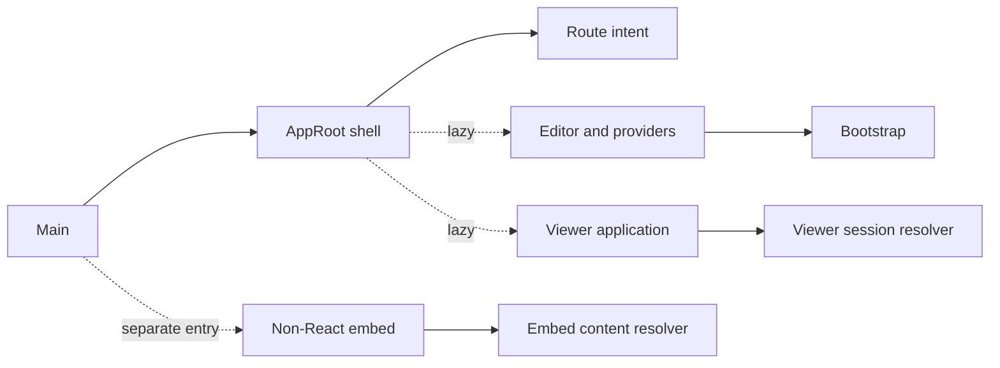
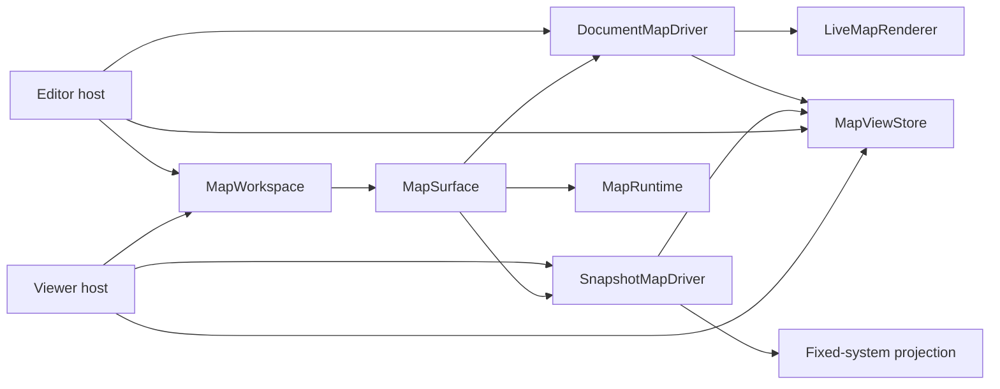

# Project structure

TransitMapper has four shared map packages, a domain package, a browser
application, and a Cloudflare Worker.

Use this reference to place code without reversing a package edge or adding
application policy to a reusable map component.

## Workspace

### Dependency direction

Dependencies flow from the applications toward shared packages:

```text
apps/web ────────┬──> packages/workspace ────> packages/map ──> packages/views
                 ├──> packages/renderer ─────> packages/core
                 ├──> packages/map ───────> packages/views
                 ├──> packages/views
                 ├──> packages/core
                 └──> packages/pwa-updater

apps/worker ──────┬──> packages/views
                  └──> packages/core

all TypeScript packages ──> packages/tsconfig
repository linting ───────> packages/config-eslint ──> packages/eslint-plugin
repository contribution tooling ──> pinned LVBT plugin release
```

The domain model does not import browser state, React, MapLibre, or Worker
bindings. The web application owns interactive state and browser integration;
the Worker owns network delivery and persistence. This direction keeps domain
rules portable across the browser and workerd runtimes.

### Tree

```text
packages/
  views/          Portable map View values and validation
  map/            Map runtime and presentation state
  workspace/      Shared React map and Workbench composition
  renderer/       Transit document projection and MapLibre publication
  core/           Shared domain, geometry, simulation, and contracts
  pwa-updater/    Editor update lifecycle
  config-eslint/  The org's ESLint baseline, as a function
  eslint-plugin/  Repository-specific lint rules
  tsconfig/       Shared TypeScript compiler policy
apps/
  web/            Vite and React editor, embed, and PWA
  worker/         Cloudflare Worker and D1 persistence
docs/             Product, development, operations, and security documentation
scripts/          Repository-wide generators and invariant checks
turbo/            Turborepo generators and templates
```

## Packages

### Views

`packages/views` owns portable, versioned View values and hostile-input
parsing. It imports no React, MapLibre, DOM, editor, or Worker framework code.
The package also owns the create, update, and response contracts for published
Views. The browser and Worker use those contracts without sharing HTTP or
storage code.

### Map

`packages/map` owns map state and the browser-only MapLibre lifecycle.
`MapViewStore` publishes immutable snapshots. `MapRuntime` manages the map,
controls, resize, camera sync, styles, and disposal. Hosts provide interactions,
document-layer carry, recovery, and errors. The package depends only on `views`
and MapLibre.

### Workspace

`packages/workspace` owns responsive React composition around one map surface.
Hosts inject named slots, state, and actions into `MapWorkspace` and Workbench.
The package depends on map, treats React as a peer, and imports no editor state.

### Renderer

`packages/renderer` owns document projection, source banks, recovery, workers,
and two `MapDriver` implementations. `DocumentMapDriver` publishes changing
editor documents through `LiveMapRenderer`. `SnapshotMapDriver` projects one
fixed system directly for readers. Hosts can attach neutral session extensions
to either driver. The package depends on core, map, views, and MapLibre. Its
bounded entries include `driver`, `snapshot`, `layers`, `projection`, `runtime`,
and `stats`.

`packages/renderer/src/layers` owns stable source and layer identities.
`packages/renderer/src/projection` owns feature building, preparation,
cooperative scheduling, resumable work, and projection measurements behind the
bounded `projection` entry.
`packages/renderer/src/sources` owns source banks, retained source state,
mutation plans, settlement, publication, and recovery behind the bounded
`layers` and `runtime` entries.
`packages/renderer/src/workers` keeps each worker client beside its protocol,
entry point, request lifecycle, and publication submission boundary.
`packages/renderer/src/presentation.ts` owns the document map definition and
the default document View. It also converts portable View filters to renderer
presentation values. The editor, viewer, and non-React embed use those same
defaults and conversions.

The web application supplies editor overlays, theme layers, and performance
reporting. `MapSurface` owns the stable MapLibre runtime. An injected
`MapDriver` owns content attachment and feature detail resolution.

### Core

`packages/core` owns deterministic logic shared by the editor and Worker. It
is consumed directly from TypeScript source and must run without browser-only
globals in both the browser and workerd.

#### Domain model

`packages/core/src/model` defines saved systems, catalogs, service paths,
validation, serialization, imports, routing, schematic layout, costs, and
units. Pure transforms reconcile imports and preserve no-op identity; web
commands compose them into undoable edits without importing Zustand.
`packages/core/src/api` owns `/api/v1`; `model/gtfs-feed.ts` publishes feed
metadata without upstream URLs.

Focused modules name the invariant they maintain: routing edits, endpoint
metadata, and stop reanchoring each have one owner. Lines are public identities
over technical Services. Stops are anchored boarding points; Stations are
optional physical places containing Stops. Diagram layout is a pure facade
returning one `DiagramLayoutResult`, with no MapLibre or editor dependency.

#### Geometry

`packages/core/src/geometry` derives lane centerlines, junction footprints,
connector curves, and other street geometry from the domain model.
`metric-plane.ts` and `metric-curves.ts` resolve a curved Way's local-meter
centerline from optional per-point radius controls; the render presentation
turns its final CSS-pixel error budget into the tessellation bound. The
document stores the authored radius, never a sampled mesh. These results are
memoized but never persisted. See
[Geometry and routing](../../product/explanation/geometry-and-routing.md).

#### Rendering

`packages/core/src/render` projects a system into styled geographic features
and SVG. It owns displayed-size LOD, dependency and viewport indexes, stable
identities, scene validation, and diffs. `RenderScene` separates visual and hit
geometry and fixes paint order; the static resolver emits SVG paint directly.

`SystemFeatures.stops` are boarding markers; physical Stations produce
footprints, platforms, and handles. The historical `tm-stations` source name
is translated only by `packages/renderer/src/system-feature-sources.ts`.
`service-lane-assignments.ts` resolves a directional service run once, so its
line, connector, and vehicle path agree. `packages/core/src/style` supplies
appearance without mixing it into the domain catalog.

#### Simulation

`packages/core/src/sim` owns timetable and vehicle-motion arithmetic. It has no
animation loop or map dependency; the web application supplies time and
renders the returned positions. See
[The simulation](../../product/explanation/simulation.md).

#### Sharing

`packages/core/src/share` owns the wire contract used by the web client and
Worker, along with pure ownership and claim decisions. It does not perform
HTTP requests or database writes. See
[Sharing surfaces](../../product/explanation/sharing-surfaces.md).

#### Performance sample contract

`packages/core/src/performance/contract.ts` validates the sampled browser-to-Worker payload.

#### Account groundwork

`packages/core/src/auth` contains pure OAuth, PKCE, token, cookie, and
return-path primitives. Claiming and ownership policy live in the sharing
module. This tested groundwork is not connected to routes, tables, or the
editor; live shares remain anonymous and expiring.

### PWA updater

`packages/pwa-updater` owns the React-facing update contract used by the
editor. It has no dependency on the domain model or editor store.

#### Update lifecycle

The updater translates service-worker registration events into a promptable
state. The web application decides where to show the update notice and when a
person may activate the waiting version. This prevents an update from
replacing an editing session without consent.

### Contribution tooling

TransitMapper inherits organization issue and pull request templates. The
pinned contribution plugin supplies agent tooling, and
`.lvbt/repository-tooling.json` records the verified release.

### ESLint baseline

`packages/config-eslint` exports the type-aware and syntax-only organization
rule sets consumed by the root lint configuration.

#### Baseline rules

The baseline contains no repository paths. Root configuration adds local
scope and records any departure from upstream presets.

### ESLint plugin

`packages/eslint-plugin` owns static repository invariants that TypeScript
cannot express.

#### Repository rules

Rules protect runtime and module boundaries. The root configuration decides
where each rule applies. See [the enforcement model](../explanation/enforcement-model.md).

### TypeScript configuration

`packages/tsconfig` owns shared compiler policy. Each source package adds its
runtime libraries and output behavior.

## Applications

### Web

`apps/web` owns the Vite and React editor, read-only embed, browser storage,
and installable PWA. It depends on core for domain decisions and on the PWA
updater for activation state.

#### Application host

This component diagram shows `apps/web/src/app` ownership:



The editor owns `/`. The viewer owns both shared-system routes at `/s/:id` and
published View routes at `/v/:id`. A shared-system route synthesizes default
presentation state. A published View route loads its saved state and then
loads the referenced shared system. Both routes mount the same viewer
workspace and snapshot map driver without constructing editor state or the
live document renderer.

The separate embed entry owns `/e/:id` and `/embed/:id`. It imports neither
React nor editor code. `/e/:id` applies the same synthetic default View as
`/s/:id`; `/embed/:id` restores the same published state as `/v/:id`.

#### Viewer

`apps/web/src/viewer` resolves shared-system and published-View sessions. It
composes reader controls around `MapWorkspace`, attaches the snapshot driver,
and resolves selected feature details. It may lazy-load the editor persistence
path only after someone chooses Fork and edit.

#### Editing

`apps/web/src/editor` owns the Zustand store, undo history, grouped editor
commands, selection, keyboard routing, and gesture transactions.

`apps/web/src/editor/store.ts` is a public barrel over one vanilla Zustand
store and stable command groups. Its reactive snapshot is data only; consumers
read state, subscribe, or invoke commands, never raw `setState`. The runtime
is the only writer. An atomic commit applies guards, prunes invalid transient
references, stamps once, and records history in the same write. Viewport
persistence bypasses history, while read-only documents still permit tools and
selection. Commands use core transforms and internal operations, never sibling
command groups. Installing a document clears its transient editor state but
retains preferences for future drafts.

`apps/web/src/editor/pointerIntent.ts` resolves a press into an operation from
its target and modifier channels alone, without browser or map state, so
presentation and dispatch reach the same decision.
`apps/web/src/editor/input-tuning.ts` declares the hit, snap, and drag
tolerances for each pointer precision. The web root injects one `MapViewStore`
into map, editor, persistence, and sharing paths. `document-view-adapter.ts`
copies its camera into saves, shares, and exports. Domain mutations pass
through grouped editor commands; map and UI modules do not modify records.
`document-view-controls.ts` adapts the renderer's document filter definition
to editor controls without creating another provider or store.

`apps/web/src/ui/sidebarOutline.ts` is the pure outline projection boundary;
`SidebarPanel.tsx` owns search, expansion, bounded rendering, keyboard focus,
and recovery. Stop editing manages boarding points and membership; Station
editing manages physical passenger-place geometry.

#### Map rendering

`packages/map` owns the MapLibre lifecycle. `apps/web/src/map` provides editor
interaction, overlays, theme layers, and exports. `packages/renderer` projects
committed documents and publishes sources. `packages/workspace` keeps one
`MapSurface` mounted while host chrome changes.

This component diagram shows the runtime ownership inside the editor and
viewer hosts:



The embed uses the same View values and renderer presentation. It owns a
smaller non-React runtime instead of importing the workspace component tree.

| Modules                                                                    | Responsibility                                                          |
| -------------------------------------------------------------------------- | ----------------------------------------------------------------------- |
| `packages/renderer/src/render-presentation.ts`, `camera-render-preload.ts` | Describe display scale and reusable camera coverage.                    |
| `packages/renderer/src/render-visibility.ts`                               | Apply reader-neutral representation, mode, and way-type visibility.     |
| `apps/web/src/map/editor-feature-state.ts`, `editor-overlays.ts`           | Own selection paint, hover, route focus, and transient editor geometry. |

The live renderer's worker protocol contains serializable document and
presentation facts, never MapLibre objects or an editor store. The snapshot
driver and embed use the same pure feature projection and presentation values
without importing accepted-scene publication or source banks.

Scoped scenes retain a stable source base and small deltas. Static map, embed,
export, and SVG share scene normalization. Handles, termini, and movement
guides remain unbanked editor sources; camera changes inside the accepted
envelope reuse the committed scene. Junction surfaces, traffic controls,
markings, and lane-continuous services derive from the same resolved geometry.

#### UI

`apps/web/src/ui` owns editor presentation, controls, dialogs, onboarding, and
accessibility. It adapts editor state and actions into workspace slots.
Onboarding projects one valid Las Vegas system through shared production UI.
`apps/web/src/ui/app-banner.ts` decides which single application-level message
is showing and what it says, as a pure function of save state, startup outcome,
update state, and connectivity; it holds the copy for every one of them.
`apps/web/src/theme` maps the operating system color preference to application
tokens. `apps/web/src/assets` holds source-distributed browser binaries beside
their required licenses, while `apps/web/src/i18n` owns user-visible message
selection.
`apps/web/src/services` exposes browser-local preferences to UI consumers.
These modules may read the editor store and invoke grouped commands but do not
duplicate domain rules.

`packages/workspace/src/workbench.tsx` owns responsive chrome placement. Its
stylesheet supplies the package's structural styles and layout variables, while
the web host supplies the shared Material theme tokens. Application notices
choose either centered or panel-aligned placement as part of their named slot.
`apps/web/src/ui/workspace-adapter.ts` maps editor representations and content
to package labels and detents. See [The compact layout](../explanation/compact-layout.md).

#### Device

`apps/web/src/device` exposes viewport size, pointer precision, and hover as
independent browser facts. Layout and input tolerance use the relevant fact;
purely visual differences stay in nearby CSS media queries.

#### Storage

`apps/web/src/storage` owns browser persistence, recovery, and schema-aware
loading for editable systems. Stored values cross into the domain through
core serialization, keeping migrations and validation independent from the
storage engine.

`apps/web/src/views` owns transient links, the named View HTTP client, and the
browser-local View library. Local Views use a separate IndexedDB database
keyed by document ID. Saving, renaming, or deleting one therefore does not
write a transit document or enter editor history.

#### Imports and networking

`apps/web/src/import` owns browser requests, progress, cancellation, and the
structured-clone boundary; short-lived Workers return core-built candidates for
commands to accept atomically. `apps/web/src/network` owns browser request
scheduling and connectivity state. Classification and model construction stay
in core.

#### Simulation host

`apps/web/src/sim` hosts the animation clock and MapLibre updates for positions
calculated by core; it owns neither timetable nor motion policy.

#### Sharing and embedding

`apps/web/src/share` owns publishing requests, browser-side preview
rasterization, and downloadable formats. `apps/web/src/embed` owns the
read-only entry and its host-page contract. The embed resolves either a legacy
shared-system reference or a published View reference before loading MapLibre.
It restores the same camera, representation, and filters as the full viewer
without importing React or editor state.

#### Platform integration

`apps/web/src/pwa` owns installation and editor-only service-worker behavior.
Application identity is generated into browser metadata and manifest assets;
see [Update application icons](../how-to/update-application-icons.md).

#### Build identity

The About dialog reads one immutable Vite-injected build record. Only the web
build includes revision and dirty state in its cache key; a source archive
without Git reports that its revision is unavailable rather than inventing one.

#### Performance

`apps/web/src/perf` owns performance policy, fixtures, reports, precache
validation, and measurement-only renderer counters. Browser traces consume
that policy without redefining its budgets. `apps/web/scripts/renderer-capture`
owns the Playwright driver, deterministic basemap, and contact sheets. Its
camera seam waits for projection and final MapLibre paint, but never enters the
public application graph. Additive acceptance suites carry their own IDs,
provenance, hashes, and assertions without changing the fixed baseline corpus.

`apps/web/src/pwa/adaptive-cache-contract.ts` owns optional assets and offline
readiness. The client obeys network, quota, and 64 KiB limits.

`field-sampling.ts` checks privacy, release, origin, and sampling before
loading the URL-free client.

Vite builds the editor, embed, and no-script privacy page.

### Worker

`apps/worker` owns the Cloudflare deployment that serves the web build,
publishes shared systems and named Views, and persists their records. It
imports portable core and View contracts but never imports browser or editor
modules.

#### HTTP delivery

The Worker routes API requests, shares, embeds, static assets, sampled reports,
and maintenance. Stored text enters HTML through `HTMLRewriter`.

`api-v1.ts` mounts new resources below `/api/v1`; legacy APIs remain
unversioned. `views-api.ts` owns public View creation, reads, edits, deletion,
expiry, and edit-token checks. The main router injects shared-system lookup so
a View read can keep its map alive without coupling the two route modules.
The Worker serves metadata-rich reader pages at `/v/:id`, frameable embed
shells at `/embed/:id`, and oEmbed records for both named Views and legacy
shared systems. Reader pages reject framing. Embed routes allow it explicitly.
`gtfs-feeds.ts` owns reviewed metadata and R2 archive lookup.

`POST /api/performance-samples` accepts 8 KiB of same-origin JSON, honors
GPC/DNT, validates it, and stores allowlisted columns.

#### Persistence

D1 stores shared systems, named View records, preview metadata, and short-lived
sampled data. A View stores validated presentation state and a mutable shared
system ID. It has no foreign key because share expiry and cleanup must remain
independent. A read deletes a View whose referenced system no longer exists.
R2 stores one current last-good GTFS archive per configured slug.
Migrations are append-only and Wrangler applies them in filename order. See
[Operations](../../operations/how-to/operations.md).

`performance-samples.ts` owns ingestion; `performance-maintenance.ts` owns
daily summaries and retention. Raw rows expire after seven days and aggregates
after 90.

## Repository support

### Tests

Each package or application owns a `tests/` tree at its root. Test paths mirror
production modules. Shared fixtures remain explicit test-only exports.

### Generators and checks

Repository checks live under `scripts/`; package scaffolding lives under
`turbo/`. See
[the enforcement model](../explanation/enforcement-model.md) for check
ownership.

### Performance tooling

Browser scenarios, baselines, and renderer captures live under `apps/web`.
Generated evidence stays ignored until maintainers promote an approved fixture.
