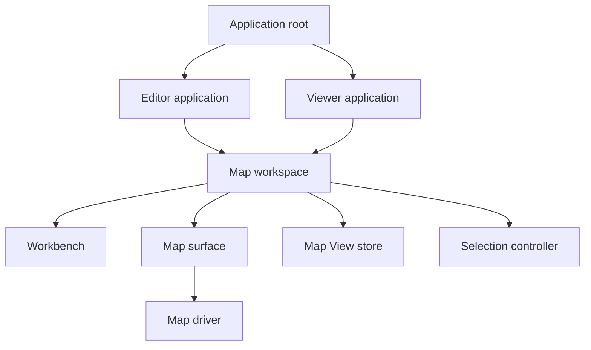

# Views and Map Workspace Refactoring Implementation Plan

**Goal:** Separate TransitMapper's application shell, map workspace, editor, reader, and embed responsibilities so people can save and share Views without turning geographic scope into application behavior.

**Architecture:** The application shell will resolve a route to a concrete editor or viewer host. Both hosts will compose one `MapWorkspace` from a map driver, instance-owned View state, selection state, and explicit Workbench slots. The embed will remain a separate non-React entry that shares portable View contracts and pure map behavior without importing the React workspace or editor.

**Tech Stack:** TypeScript, React, Zustand, MapLibre GL JS, Vite, Hono, Cloudflare Workers, D1, Vitest, and Playwright Core.

---

This plan is for TransitMapper maintainers who must refactor a production application without breaking editor behavior, local documents, share links, embeds, offline startup, or renderer performance. A maintainer who completes the plan should be able to add a new View or map driver without changing editor commands or adding a branch for geographic extent.

The current-state findings reflect `origin/main` at commit `55c2c5d5` on August 24, 2026. The implementation branch started from that commit. Each phase must compare its behavior and performance with evidence captured from that baseline.

## Decision

TransitMapper will use **Views** as the working product name for saved map presentation. A View records where someone is looking and which map information they chose to show. A View does not define a transit document, application mode, renderer, deployment, or geographic scope.

The refactor will preserve two existing behaviors while moving their ownership:

- Workbench will continue to own responsive chrome placement after it moves out of the editor application.
- `LiveMapRenderer` will continue to own accepted document-scene publication and recovery after the document renderer becomes its own package.

The refactor will replace three forms of coupling:

- The application shell will stop assuming that every route creates an editor.
- The map surface will stop reading the editor store and presentation provider directly.
- The reader and embed will stop depending on separate ad hoc definitions of View state.

Geographic extent will remain data. The implementation will not add a national route type, national session, national map driver, national capability, or national renderer branch.

## Current architecture

The production editor already separates domain logic from browser integration. `packages/core` owns `TransitSystem`, rendering preparation, stable feature identities, `RenderScene`, static output, and shared API contracts. `apps/web` owns React, MapLibre, browser storage, editor commands, and the embed. `apps/worker` owns HTTP delivery and D1 persistence.

The workspace boundary is still too coarse for development and delivery. Most browser code belongs to `@transitmapper/web`, so an editor-only change invalidates that package's typecheck, test, and production-build work. The Vite build uses path-based manual chunk rules for MapLibre, React, renderer files, and editor interactions. Those rules improve browser caching, but they do not establish package ownership. Moving more files into directories under `apps/web` would make this problem worse.

The current browser composition is too editor-specific:

- `apps/web/src/main.tsx` mounts `EditorProvider`, `ViewProvider`, `SimProvider`, and editor-specific providers for every full application route.
- `apps/web/src/App.tsx` parses `/s/:id`, loads documents, attaches persistence, controls PWA updates, resolves banners, mounts the map, composes Workbench slots, and owns every dialog.
- `apps/web/src/editor/store/state.ts` stores `readOnly` beside mutable document state. Shared-system UI branches on that flag.
- `apps/web/src/ui/ViewProvider.tsx` stores Network, Infrastructure, Diagram, mode visibility, infrastructure visibility, and landmarks as ephemeral React state.
- `apps/web/src/camera/liveCamera.ts` stores one module-global camera. Persistence and sharing fold the camera back into `TransitSystem.viewport` during serialization.
- `apps/web/src/map/MapCanvas.tsx` imports the editor store and View provider. It also owns MapLibre construction, camera synchronization, document projection, feature state, editor interactions, simulation painting, style recovery, and performance hooks.
- `/s/:id` loads the full editor and installs one `TransitSystem` with `readOnly: true`.
- `/e/:id` uses a separate non-React Vite entry. It loads the full system, calls `buildFeatures`, and owns a second MapLibre source lifecycle.
- D1 stores one mutable shared-system snapshot. The client rejects a share body above 1 MB.
- Core viewport indexes cull after the complete `TransitSystem` is in memory. They do not provide viewport-loaded data delivery.

These choices work for one editable regional document. They do not provide a clean owner for portable View state or another map delivery strategy.

## Target boundaries

The application will group abstractions by the concern they own. It will not create a general registry or a directory of unrelated interfaces.

The following component diagram shows the browser application boundary:



`AppRoot` will own route parsing, route-level loading, accepted host selection, and global error reporting. It will not load documents or render toolbars.

`EditorApplication` will own local-library bootstrap, editor providers, document persistence, imports, simulation, PWA updates, dialogs, and editor Workbench slots.

`ViewerApplication` will own shared-system loading, reader selection, reader details, reader actions, and viewer Workbench slots. It will not create an `EditorStore`.

`MapWorkspace` will own the common visual composition. It will render `MapSurface` and `Workbench` as siblings so Zen mode can continue hiding chrome without hiding the map. It will receive explicit slot props rather than a capability object.

`MapViewStore` will own camera, representation, and filters for one mounted workspace. `SelectionController` will own transient feature selection separately. A View serializer will combine both when a link or named View needs selection state.

`MapDriver` will attach one content implementation to `MapSurface`. A document driver will adapt `TransitSystem` and `LiveMapRenderer` without importing an editor store. A later published driver may use vector tiles and feature-detail requests. The drivers will share workspace-facing behavior rather than projection or transport internals.

The application shell must remain mounted while a route resolves. The map runtime may remount when a route changes to another driver or content identity. Cohesive UX requires stable application structure and truthful loading state. It does not require one MapLibre object to survive unrelated content.

## Package and module ownership

The refactor will use four packages for stable responsibilities. Each package will own production code, tests, lint, typecheck, verify, and an emitted `dist/` build. Each package will use the repository-standard `tsc -p tsconfig.build.json` build script. Turborepo will discover the package graph from workspace dependencies and cache the declared `dist/**` outputs through its existing `^build` edge. Development exports will point at source. Production exports will point at emitted JavaScript and declarations.

```text
packages/views/
  src/
    contract.ts               Portable View and feature-reference values.
    parse.ts                  Untrusted-input validation and schema migration.
    url-state.ts              Compact transient View encoding and decoding.
    api-contract.ts           Worker-neutral request and response values.

packages/map/
  src/
    map-view-store.ts         Instance-owned camera, representation, and filters.
    selection-controller.ts   Reader/editor-neutral selection state.
    map-driver.ts             Minimal workspace-facing driver contract.
    map-runtime.ts            MapLibre construction, disposal, theme, and resize ownership.
    startup-milestones.ts     Surface-neutral startup measurement contract.

packages/workspace/
  src/
    map-workspace.tsx         Common map and Workbench composition.
    map-surface.tsx           React owner for one attached map runtime.
    map-view-provider.tsx     React access to one MapViewStore.
    workbench.tsx             Responsive chrome placement with explicit slots.
    workspace-slots.ts        Named Workbench slot contracts.

packages/renderer/
  src/
    document-map-driver.ts    TransitSystem adapter for MapDriver.
    live-map-renderer.ts      Accepted scene publication and recovery.
    projection/               Document projection and cooperative scheduling.
    sources/                  Source banks, patches, settlement, and recovery.
    layers/                   Shared document layer and visibility definitions.
    workers/                  Projection and diagram worker entry points.

apps/web/src/app/
  app-root.tsx              Route-level orchestration and lazy host ownership.
  route-intent.ts           Pure pathname parsing into concrete route intents.

apps/web/src/editor/
  editor-application.tsx    Concrete editor host and provider composition.
  editor-bootstrap.ts       Local document load and recovery.
  document-view-adapter.ts  TransitSystem.viewport compatibility.
  editor-map-attachment.ts  Editing gestures, handles, and simulation attachment.

apps/web/src/viewer/
  viewer-application.tsx    Concrete reader host.
  shared-system-session.ts  Shared-system fetch and synthetic View resolution.
  feature-details.tsx       Reader feature details without editor commands.

apps/web/src/views/
  api.ts                    Named View HTTP client.
  local-view-library.ts     Browser-local named Views by document ID.
  view-link.ts              Route and fragment restoration.
```

`@transitmapper/views` will run in browsers and workerd. It will import no React, MapLibre, DOM, editor, or Worker framework code.

`@transitmapper/map` will run in a browser without React. It will depend on `@transitmapper/views` and MapLibre. It will import no `TransitSystem`, editor, viewer, or application-shell code.

`@transitmapper/workspace` will own the React composition and responsive Workbench. It will depend on `@transitmapper/map`, `@transitmapper/views`, and React. It will import no editor, viewer, persistence, import, simulation, or PWA code.

`@transitmapper/renderer` will own document projection and rendering. It will depend on `@transitmapper/core`, `@transitmapper/map`, and MapLibre types. It will import no React, editor store, application shell, viewer, or PWA code.

`@transitmapper/web` will remain the deployable composition root. It will own route hosts, application chrome content, editor commands, persistence, imports, simulation, PWA behavior, and the HTTP clients. Its main entry will lazy-load `EditorApplication` or `ViewerApplication` after `AppRoot` has rendered the shell. The non-React embed entry will import `views`, `map`, and `renderer` directly. It will not import `workspace` or an application host.

The plan will not create a package for each interface. These four packages correspond to runtime and change boundaries. A View-schema change, MapLibre-runtime change, document-renderer change, and application-host change have different consumers and should invalidate different work.

New modules must use kebab-case. Existing modules may keep their names until the final cleanup removes their compatibility role.

## Portable View contract

`@transitmapper/views` will own a small versioned contract. Version 1 will describe current product behavior. It will not invent bearing, pitch, arbitrary provider names, numeric filters, or revision behavior that current storage cannot honor.

```ts
export type MapFilterValue = boolean | string | readonly string[];

export interface MapCameraStateV1 {
  center: [number, number];
  zoom: number;
}

export interface MapFeatureReferenceV1 {
  source: string;
  kind: string;
  id: string;
}

export interface MapPresentationStateV1 {
  schemaVersion: 1;
  camera: MapCameraStateV1;
  representationId: string;
  filters: Record<string, MapFilterValue>;
}

export interface MapViewStateV1 extends MapPresentationStateV1 {
  selection?: MapFeatureReferenceV1;
}

export interface SharedSystemMapReferenceV1 {
  kind: 'shared-system';
  id: string;
}

export interface SavedViewV1 {
  schemaVersion: 1;
  id: string;
  title: string;
  description?: string;
  map: SharedSystemMapReferenceV1;
  state: MapViewStateV1;
}
```

`representationId` will remain a bounded string in the portable contract. The resolved map definition will validate it against that map's representations. The current document definition will expose `network`, `infrastructure`, and `diagram`.

The parser will bound body size, string length, filter count, array length, coordinates, and zoom. The map definition will validate filter keys and values before a driver sees them. An unknown representation or filter will fall back to the map definition's default. A missing selected feature will clear selection without blocking the View.

Version 1 will accept at most 32 filters and 64 selected values per multi-select filter. A representation ID, filter ID, filter value, feature source, and feature kind may contain at most 64 UTF-8 bytes each. A feature ID may contain at most 256 UTF-8 bytes. The parser will reject a camera outside longitude `-180...180`, latitude `-90...90`, or zoom `0...24`. A named View request may contain at most 32 KiB before JSON parsing. A transient fragment may contain at most 8 KiB after URL decoding. These limits keep View state separate from transit data and bound work on unauthenticated Worker paths.

Version 1 public Views will reference the current shared-system resource. They will always resolve the latest content stored at `/api/systems/:id`. They will not claim to pin an immutable revision.

A local editor View will use a web-only `{ kind: 'local-document'; id: string }` reference. The Worker will never accept that reference. Publishing a local View will first create or update the existing shared-system resource and then create a public View over its share ID.

A View will not store editor tool state, undo history, open panels, breakpoint state, MapLibre source data, tile URLs, hostnames, credentials, or embed state.

## Map driver contract

The runtime contract will remain small enough for document and non-document drivers to implement without pretending that their transports match.

```ts
import type { Map as MapLibreMap } from 'maplibre-gl';

export interface MapRepresentationDefinition {
  id: string;
  label: string;
}

export interface MapFilterOption {
  id: string;
  label: string;
}

export type MapFilterDefinition =
  | {
      kind: 'toggle';
      id: string;
      label: string;
      defaultValue: boolean;
    }
  | {
      kind: 'multi-select';
      id: string;
      label: string;
      options: readonly MapFilterOption[];
      defaultValue: readonly string[];
    };

export interface MapAttribution {
  label: string;
  url?: string;
}

export interface MapDefinition {
  id: string;
  title: string;
  representations: readonly MapRepresentationDefinition[];
  filters: readonly MapFilterDefinition[];
  attribution: readonly MapAttribution[];
}

export interface MapFeatureDetails {
  reference: MapFeatureReferenceV1;
  title: string;
  fields: readonly { label: string; value: string }[];
}

export interface MapRuntimeHost {
  map: MapLibreMap;
  reportError(error: unknown): void;
}

export interface MapViewStore {
  getSnapshot(): MapPresentationStateV1;
  replace(next: MapPresentationStateV1): void;
  subscribe(listener: (state: MapPresentationStateV1) => void): () => void;
}

export interface SelectionController {
  getSnapshot(): MapFeatureReferenceV1 | undefined;
  select(reference: MapFeatureReferenceV1 | undefined): void;
  subscribe(listener: (reference: MapFeatureReferenceV1 | undefined) => void): () => void;
}

export interface MapStartupMilestones {
  contentCommitted(): void;
  interactive(): void;
}

export interface MapDriverAttachOptions {
  host: MapRuntimeHost;
  viewStore: MapViewStore;
  selection: SelectionController;
  milestones: MapStartupMilestones;
  signal: AbortSignal;
}

export interface MapDriver {
  readonly definition: MapDefinition;
  attach(options: MapDriverAttachOptions): Promise<MapDriverAttachment>;
}

export interface MapDriverAttachment {
  resolveFeature(
    reference: MapFeatureReferenceV1,
    signal: AbortSignal,
  ): Promise<MapFeatureDetails | null>;
  dispose(): void;
}
```

`MapDriverAttachOptions` will provide the MapLibre host, `MapViewStore`, `SelectionController`, startup milestones, and cancellation signal. The attachment will subscribe to the stores it needs. The workspace will not expose projection requests, source banks, vector-tile URLs, editor mutations, or cache methods.

Location search will remain an application service. A later transit-feature search service may belong to a driver. The refactor will not combine those two search meanings under one method.

## Five-phase implementation

Each phase must deploy independently. Each phase must preserve production behavior before the next phase begins.

### Phase 1: Freeze behavior and extract View state

**Outcome:** The repository will have cacheable package-build boundaries, and the current editor will use one instance-owned View store and one portable View parser. No route or visible control will change.

**Files:**

- Create `packages/views/package.json`, TypeScript configs, production modules, and tests.
- Create `packages/map/package.json`, TypeScript configs, initial View modules, and tests.
- Create `apps/web/src/editor/document-view-adapter.ts`.
- Create tests under `apps/web/tests/editor/`.
- Modify the affected package manifests and the workspace lockfile.
- Modify `apps/web/src/ui/ViewProvider.tsx`, `apps/web/src/camera/liveCamera.ts`, `apps/web/src/storage/persistenceCoordinator.ts`, `apps/web/src/ui/TopBar.tsx`, `apps/web/src/ui/LayersPopover.tsx`, and their current tests.
- Update `docs/development/reference/project-structure.md` and `docs/development/explanation/enforcement-model.md` with the package-build contract.

- [x] Record the exact implementation baseline in this plan.
- [ ] Capture desktop and mobile editor, share, and embed screenshots.
- [ ] Run the `rtc`, `viewer`, and `embed` performance scenarios on desktop and mobile through `pnpm perf -- --scenario <id> --profile <profile>`.
- [x] Record one populated build and one no-change build, then inspect the Turbo graph for editor-only, renderer-only, and View-contract invalidation. Do not mutate sources or add another build runner to simulate cache behavior.
- [x] Give the initial runtime packages repository-standard `build` scripts with `dist/**` output. Point production and type resolution at `dist`. Add a `development` export condition that lets Vite development consume `src` without requiring a package watcher.
- [x] Keep dependency versions in the workspace catalog. Use peer dependencies for React and MapLibre only when the consuming application must provide the runtime singleton.
- [x] Let every application build depend on the production builds of its workspace dependencies through the existing `^build` Turbo edge.
- [x] Enforce package dependency direction with the repository's dependency rules. Do not add another package build orchestrator or cache wrapper.
- [x] Add characterization tests for shell-before-document behavior, camera persistence, current share camera capture, representation switching, filters, selection, forking, and embed startup ordering.
- [x] Add the View contract and hostile-input parser to `@transitmapper/views`.
- [x] Rename the internal `ViewMode` type to `RepresentationId`. Keep Network, Infrastructure, and Diagram labels unchanged.
- [x] Implement `createMapViewStore()` in `@transitmapper/map` with camera, representation ID, and filters.
- [x] Adapt current React controls to the instance store without changing their markup or keyboard behavior.
- [x] Keep selection in `EditorStore` during this phase. Implement only the adapter needed to capture and restore an optional selection.
- [x] Initialize the View store from `TransitSystem.viewport`.
- [x] Fold the current camera back into `TransitSystem.viewport` only at save, share, and export boundaries.
- [x] Prove that camera and filter changes do not mutate the editor document, stamp `updatedAt`, or enter undo history.
- [x] Keep `TransitSystem` at schema version 16.

The August 25, 2026 cache check populated the five runtime builds in 39.275
seconds. The immediate no-change build restored all five from Turbo in 255
milliseconds. The dry task graph reports release metadata only for
`@transitmapper/web#build`. An editor change therefore invalidates the web
build, a renderer change invalidates renderer and its web consumer, and a View
contract change invalidates views and its downstream package consumers through
the existing `^build` edges.

**Exit gate:** The editor behaves and looks the same. Presentation state has one instance owner. `views` can parse a portable View without a browser. A no-change build restores every package and application build from the Turbo cache. An editor-only change does not rebuild `core`, `views`, `map`, or `pwa-updater`.

**Rollback:** The change can restore `ViewProvider` and `liveCamera` without touching stored documents or Worker data. The package boundary landed separately from the View-state consumer cutover, so either change can be reverted alone.

### Phase 2: Extract the application and workspace boundaries

**Outcome:** The existing editor will run as one concrete host of `MapWorkspace`. The map surface will no longer import editor providers.

**Files:**

- Create the remaining `packages/map/` modules listed under Package and module ownership.
- Create `packages/workspace/` with its package manifest, TypeScript configs, production modules, styles, and tests.
- Create `packages/renderer/` with its package manifest, TypeScript configs, production modules, workers, and tests.
- Create the `apps/web/src/app/` modules listed under Package and module ownership.
- Create `apps/web/src/editor/editor-application.tsx`.
- Create `apps/web/src/editor/editor-bootstrap.ts`.
- Create `apps/web/src/editor/editor-map-attachment.ts`.
- Create tests under `apps/web/tests/app/` and `apps/web/tests/editor/`.
- Modify `apps/web/src/main.tsx`, `apps/web/src/App.tsx`, `apps/web/src/map/MapCanvas.tsx`, `apps/web/src/map/staged-map.tsx`, and the current editor UI composition.
- Modify `apps/web/vite.config.ts`, `apps/web/src/perf/chunkPolicy.ts`, its tests, and the bundle-report tests.
- Update `docs/development/reference/project-structure.md`, `docs/product/explanation/design-principles.md`, and `docs/development/how-to/measure-performance.md` as each ownership and cache boundary lands.

- [x] Move pathname parsing into the pure `route-intent.ts` module.
- [x] Make `AppRoot` render the shell first and dynamically import the accepted route host. The initial entry must import no editor, viewer, document renderer, persistence, import, simulation, or PWA implementation.
- [x] Move local-library bootstrap, persistence, editor dialogs, imports, simulation, installation, and PWA updates into `EditorApplication`.
- [x] Move Workbench's responsive layout into `@transitmapper/workspace`. Replace its direct editor, UI-provider, and View-provider imports with explicit state and slot props.
- [x] Make `MapWorkspace` render the map and Workbench as siblings.
- [x] Define explicit Workbench slot interfaces for brand, primary actions, representation controls, simulation controls, main panel, supplemental panel, tool dock, import status, and application notices.
- [x] Move MapLibre construction, disposal, resize observation, theme switching, base-style recovery, and common camera publication into `@transitmapper/map`.
- [x] Move `LiveMapRenderer`, document projection, source banks, layer definitions, and their workers into `@transitmapper/renderer` without changing their accepted-scene contracts.
- [x] Implement `DocumentMapDriver` over `TransitSystem` and `LiveMapRenderer`. Pass document snapshots through an attachment port instead of importing `EditorStore`.
- [x] Keep editing gestures, handles, termini, route previews, and simulation painting in `apps/web/src/editor/editor-map-attachment.ts`.
- [x] Reduce `MapCanvas.tsx` to a compatibility wrapper while callers move to `MapSurface`.
- [x] Prove with dependency tests that `workspace`, `map`, and `renderer` import no editor provider or editor command.
- [x] Allow `MapSurface` to remount its MapLibre runtime when the driver or content identity changes.
- [x] Keep the application shell and Workbench structure mounted during that remount.
- [x] Preserve source-bank rollback, accepted-scene recovery, gesture settlement, style recovery, and startup milestones.
- [x] Replace path-regex renderer chunks with package-owned `views`, `map`, `workspace`, and `renderer` cache chunks. Keep MapLibre and React in their current stable vendor chunks.
- [x] Keep editor-host and viewer-host code in separate dynamic chunks. Keep editor commands, persistence, imports, simulation, and PWA code out of the viewer and embed entry closures.
- [x] Add manifest tests that fail when an entry imports a forbidden package or when a stable package chunk disappears into an application chunk.
- [x] Enforce stable package chunk identities with manifest tests and package build inputs with the Turbo configuration contract. Do not add a second build orchestrator.
- [x] Run focused renderer tests serially with `--maxWorkers=1 --no-file-parallelism`.
- [ ] Compare the RTC screenshots and performance report with Phase 1.

**Exit gate:** The production editor is a concrete `MapWorkspace` host. No user-visible behavior changes. The common workspace contains no read-only or geography-specific branch. Package builds restore independently. Editor-only delivery changes do not invalidate stable shared chunks or the embed entry.

**Rollback:** `App.tsx` can render the compatibility `MapCanvas` through the previous provider tree. No API or data migration exists.

### Phase 3: Build the reader and transient Views

**Outcome:** `/s/:id` will use a reader host instead of a read-only editor. A link can restore the current camera, representation, filters, and selection.

**Files:**

- Create `apps/web/src/viewer/viewer-application.tsx`.
- Create `apps/web/src/viewer/shared-system-session.ts`.
- Create `apps/web/src/viewer/feature-details.tsx`.
- Create `apps/web/src/views/view-link.ts`.
- Create tests under `apps/web/tests/viewer/` and `apps/web/tests/views/`.
- Modify `apps/web/src/app/app-root.tsx`, `apps/web/src/app/route-intent.ts`, `apps/web/src/share/api.ts`, `apps/web/src/ui/Inspector.tsx`, `apps/web/src/ui/ShareDialog.tsx`, and the reader-facing top-bar components.

- [x] Resolve every existing `/s/:id` as a synthetic View over `{ kind: 'shared-system', id }`.
- [x] Derive the synthetic View camera from `TransitSystem.viewport`.
- [x] Derive the synthetic View representation and filters from current defaults.
- [x] Implement `ViewerApplication` with its own View store and `SelectionController`.
- [x] Reuse common Workbench slots for layers, representation controls, selection details, attribution, and share actions.
- [x] Keep editing tools, history, persistence, imports, simulation, install behavior, and editor dialogs out of the reader graph.
- [x] Split reader feature facts from editing controls. Keep editing controls in the right-hand editor inspector.
- [x] Implement Fork as a viewer-host action that creates a new local document and navigates to the editor.
- [x] Encode transient View state as `#view=<base64url MapViewStateV1 JSON>`. Reject a fragment above 8 KiB after URL decoding. Do not encode document geometry or provider configuration.
- [x] Update fragment state with `history.replaceState` after `moveend`, filter changes, representation changes, and selection changes.
- [x] Add **Copy link to this view** without removing the existing **Share this system** action.
- [x] Validate the new reader through a development-only entry or harness before replacing `/s/:id`.
- [x] Add separate `viewer` performance and bundle scenarios. Do not reuse the current `share` allowance after the read-only editor is gone.
- [ ] Cut `/s/:id` over only after screenshot, keyboard, accessibility, cache-boundary, bundle, and the launch performance gates pass. Parity with the current slow reader is not sufficient.
- [x] Preserve share expiry touches, edit tokens, previews, oEmbed, revocation, deduplication, and one-link-per-document behavior.
- [x] Use deployment rollback rather than a permanent runtime flag. No data change prevents the previous release from serving `/s/:id`.

**Exit gate:** `/s/:id` loads no editor store or editor command. A transient View link restores presentation state over the same shared system.

**Rollback:** Deploy the previous application build. The route and stored share format remain unchanged.

### Phase 4: Add named Views and View embeds

**Outcome:** A person can save a local View, publish it, open `/v/:id`, and embed that same View without changing the underlying shared system.

**Files:**

- Add `packages/views/src/api-contract.ts` and its tests.
- Create `apps/worker/src/views-api.ts`.
- Create `apps/worker/src/migrations/0009_views.sql`.
- Create `apps/worker/tests/views.test.ts` against real workerd and D1.
- Extend `apps/worker/src/api-v1.ts`, `apps/worker/src/index.ts`, and `apps/worker/wrangler.toml`.
- Create `apps/web/src/views/api.ts`.
- Create `apps/web/src/views/local-view-library.ts`.
- Add the approved Views UI under `apps/web/src/ui/`.
- Create matching tests under `apps/web/tests/views/` and `apps/web/tests/ui/`.
- Modify `apps/web/src/embed/main.ts`, `apps/web/src/embed/embed-bootstrap.ts`, and `apps/web/src/embed/embed-map-runtime.ts`.

- [x] Approve a focused Views UX specification before writing UI. The specification must choose the visible name, placement, empty state, Save current view flow, Rename flow, Share flow, and Delete confirmation.
- [x] Store local named Views in IndexedDB by document ID.
- [x] Keep local View changes out of editor history and `TransitSystem.updatedAt`.
- [x] Publish a local View by calling the existing system-share flow first and then creating a View over the resulting share ID.
- [x] Add `POST /api/v1/views`, `GET /api/v1/views/:id`, `PATCH /api/v1/views/:id`, and `DELETE /api/v1/views/:id`.
- [x] Make each `POST` create a new View ID. Return its raw edit token once, and store only the SHA-256 token hash. Do not deduplicate Views because two authors may publish the same state with different names and ownership.
- [x] Make `GET` public. Make `PATCH` and `DELETE` require the existing `x-edit-token` header convention. Let `PATCH` change the title, description, and state, but not the View ID or shared-system reference.
- [x] Add this append-only table in `0009_views.sql`:

```sql
CREATE TABLE views (
  -- The Worker generates an opaque public identifier.
  id TEXT PRIMARY KEY,
  -- This version covers the row shape and the JSON state contract.
  schema_version INTEGER NOT NULL CHECK (schema_version = 1),
  -- The title and description are untrusted display text.
  title TEXT NOT NULL CHECK (length(title) BETWEEN 1 AND 120),
  description TEXT CHECK (description IS NULL OR length(description) <= 500),
  -- A View points at the existing mutable shared-system resource.
  shared_system_id TEXT NOT NULL,
  -- The Worker stores only validated MapViewStateV1 JSON here.
  state_json TEXT NOT NULL CHECK (json_valid(state_json)),
  -- All timestamps use Unix milliseconds, as the systems table does.
  created_at INTEGER NOT NULL CHECK (created_at >= 0),
  updated_at INTEGER NOT NULL CHECK (updated_at >= created_at),
  -- NULL means permanent. Version 1 anonymous rows receive an expiry.
  expires_at INTEGER CHECK (expires_at IS NULL OR expires_at >= created_at),
  -- The Worker stores a token hash. It never stores or returns the token again.
  edit_token_hash TEXT
);

CREATE INDEX idx_views_shared_system_id ON views (shared_system_id);
CREATE INDEX idx_views_expires_at ON views (expires_at);
```

- [x] Keep `shared_system_id` free of a foreign key. Existing share expiry deletes system rows independently, and View reads will remove dangling references without making the current share cleanup order depend on another table.
- [x] Bound a View request to 32 KiB before parsing JSON. Validate it with the core contract, and reject `local-document` references at the Worker boundary.
- [x] Rate-limit View creation as a separate caller-controlled write path.
- [x] Give anonymous Views a seven-day sliding expiry. A successful `GET` or `PATCH` must slide the View expiry. Opening a View must also load the referenced shared system so its existing expiry touch still runs.
- [x] Return 404 for a View whose shared system has expired. Delete the dangling View during bounded maintenance or on access.
- [x] Add `/v/:id` as the canonical full reader route for a named View.
- [x] Reuse the referenced shared system's preview for initial View metadata. Do not add per-View browser rasterization in Version 1.
- [x] Keep the embed as a separate non-React Vite entry.
- [x] Share View parsing, representation/filter restoration, feature identity, and pure layer definitions with the embed.
- [x] Add `/embed/:viewId` for named Views.
- [x] Keep `/e/:shareId` working through the same synthetic View semantics used by `/s/:shareId`.
- [x] Do not require the embed to import the React workspace or the full document map driver when that would violate its bundle budget.
- [x] Enforce the embed closure through manifest and dependency tests. Do not generate a second build solely to compare hashes.
- [x] Extend oEmbed for `/v/:id`.
- [x] Add `/v/*` and `/embed/*` to Worker-first routing and PWA navigation-fallback exclusions.
- [x] Keep the editor and full viewer unframeable. Allow cross-origin framing only on embed routes.

**Exit gate:** Local and public named Views work. `/v/:id` and `/embed/:id` resolve the same View state. Existing `/s/:id` and `/e/:id` links remain valid.

**Rollback:** Disable View creation and named View routes. The additive table may remain unused. Existing systems, shares, and embeds remain independent.

### Phase 5: Remove compatibility code and prove the extension point

**Outcome:** The repository will enforce the final ownership boundaries. A test-only non-document driver will prove that `MapWorkspace` does not depend on `TransitSystem`.

**Files:**

- Create a fixture driver under `apps/web/tests/support/`.
- Create driver contract tests under `apps/web/tests/map/runtime/`.
- Modify `dependency-cruiser.config.mjs`.
- Modify `docs/development/reference/project-structure.md`, `docs/product/explanation/design-principles.md`, and `docs/product/explanation/sharing-surfaces.md`.
- Delete compatibility modules only after production evidence identifies no caller.

- [ ] Run the shared-system reader and named View reader in production for one stable release before cleanup.
- [x] Add a fixture driver that registers bounded map content and resolves feature details without constructing a `TransitSystem` or `EditorStore`.
- [x] Run the same workspace, View restoration, filter, selection, and responsive-chrome contract tests against the document and fixture drivers.
- [ ] Remove `readOnly` from `EditorState` after no reader constructs an editor store.
- [x] Remove the module-global camera after every session owns a View store.
- [x] Remove `ViewProvider` after every consumer uses `MapViewStore`.
- [x] Remove `MapCanvas` after every caller uses `MapSurface`.
- [x] Remove the embed's duplicate View parsing and filter defaults.
- [x] Add dependency rules that prevent workspace modules from importing editor modules.
- [x] Add dependency rules that prevent viewer modules from importing editor commands, persistence, imports, simulation, or PWA modules.
- [x] Add dependency rules that prevent embed modules from importing React or editor code.
- [x] Add package dependency rules that enforce `views -> map -> workspace` and `core + map -> renderer` without a reverse edge.
- [x] Update architecture documentation with the implemented ownership and route behavior.
- [x] Run `CI=1 pnpm check` with bounded package concurrency.
- [ ] Run desktop and mobile performance audits for `rtc`, `viewer`, and `embed` against the checked baseline.
- [ ] Run production smoke tests for `/`, `/s/:id`, `/v/:id`, `/e/:id`, `/embed/:id`, oEmbed, previews, offline editor startup, and View deletion.

The August 26, 2026 local production-build smoke covered the editor, shared
reader, named View reader, both embed routes, oEmbed, preview delivery, offline
editor startup, View state restoration, representation switching, and View
deletion. It used 1440 by 900 and 390 by 844 browser viewports. The reader and
embed painted transit content without browser page errors. The smoke run also
confirmed that an unauthorized View deletion returns 403, an authorized
deletion returns 204, and the deleted View then returns 404.

The bounded performance pass rebuilt both the public and instrumented
artifacts. The current viewer entered its measured interaction run, but the
harness timed out before it produced a sample. The generated bundle report
records 413,053 gzip bytes for the viewer closure, 412,627 for the embed
closure, and 619,541 for the main closure. These values miss the launch
budgets, and this implementation pass does not claim otherwise.

The deployed-production gate remains open. The August 23, 2026 production
workflow run 32629385997 passed validation, failed its performance jobs, and
skipped deployment. The new readers have therefore not completed one stable
production release, and the `readOnly` rollback path must remain until they do.

**Exit gate:** The repository enforces the separation. The extension driver works without editor or document imports. No compatibility flag or reader-owned editor state remains.

**Rollback:** Revert the cleanup commit. Phase 5 must not delete stored data or change public resource formats.

## Performance gates

The current scenario ceilings are emergency backstops. They are not launch targets for this refactor. The checked-in August 15, 2026 first-session evidence reports its existing first-system-paint milestone at 3,389.5 ms for the editor, 2,633.7 ms for the share page, and 2,319.5 ms for the embed. This plan treats all three values as baseline debt and replaces the ambiguous milestone with the stricter transit-paint definition below.

The launch gates will use the existing desktop and mobile protocol. That protocol uses five measured runs, four-times CPU throttling, Fast 4G, a cleared cache before the cold run, and an enabled HTTP cache for the warm run. Timing gates use the five-run p95. A surface must pass its absolute gate and must not regress more than 5 percent from its Phase 1 median. The stricter result wins.

The implementation will add explicit `shellVisibleMs`, `firstTransitPaintMs`, and `interactionReadyMs` measurements. The shell milestone means that application structure and truthful loading state are visible. The transit-paint milestone means that at least one route, stop, station, or infrastructure feature from the requested map has painted. A blank canvas or basemap-only frame does not count. The interaction milestone means that pan, zoom, filters, representation controls, and feature selection can respond. Network idle remains diagnostic and cannot delay any of these milestones.

The three launch surfaces must meet these limits:

| Metric                                        | RTC editor | Full viewer | Embed     |
| --------------------------------------------- | ---------- | ----------- | --------- |
| Shell visible, cold p95                       | 750 ms     | 500 ms      | 250 ms    |
| First contentful paint, cold p95              | 1,000 ms   | 750 ms      | 500 ms    |
| Largest contentful paint, cold p95            | 2,000 ms   | 1,750 ms    | 1,500 ms  |
| Browser load event, cold p95                  | 2,500 ms   | 2,000 ms    | 1,750 ms  |
| First transit paint, cold p95                 | 2,500 ms   | 2,000 ms    | 1,750 ms  |
| Interaction ready, cold p95                   | 2,750 ms   | 2,250 ms    | 2,000 ms  |
| Interaction ready, warm p95                   | 1,000 ms   | 750 ms      | 500 ms    |
| Total long-task time before interaction       | 500 ms     | 300 ms      | 200 ms    |
| Encoded bytes before first transit paint      | 1,000,000  | 1,200,000   | 1,100,000 |
| Encoded automatic bytes after network settles | 3,000,000  | 2,000,000   | 2,250,000 |
| First-party JavaScript closure, gzip          | 450,000    | 300,000     | 300,000   |

The viewer and embed must paint transit independently from basemap completion. A slow style, sprite, glyph, or third-party tile request cannot hold the requested transit network behind an empty map.

Every interactive surface must keep interaction-to-next-paint p95 at or below 50 ms. Painted-frame p95 must remain at or below 16.7 ms. Fewer than 1 percent of painted frames may exceed 33.3 ms. No unexpected long task may exceed 50 ms. These limits apply during startup as soon as the shell accepts input. The implementation cannot defer all input until the map becomes interactive to avoid measuring it.

The main editor closure must fall from its current 518,144 gzip ceiling to 450,000 gzip bytes. The embed closure must fall from its current 358,400 gzip ceiling to 300,000 gzip bytes. The new viewer has its own 300,000 gzip ceiling. A normal JavaScript chunk may not exceed 500,000 raw bytes. The MapLibre engine chunk may not exceed 810,000 raw bytes. No phase may raise a budget to make a failing implementation pass.

## Build and cache gates

The package split must improve local, CI, and browser cache behavior. Directory structure alone does not count.

The implementation must enforce these build-graph results:

- A no-change `pnpm build` executes zero build tasks after Turborepo restores the previous outputs.
- An editor-host-only change executes the web application build. It does not rebuild `core`, `pwa-updater`, `views`, `map`, `workspace`, or `renderer`.
- A Workbench-only change rebuilds `workspace` and the web application. It does not rebuild `views`, `map`, `renderer`, `core`, or the Worker.
- A renderer-only change rebuilds `renderer` and its application consumers. It does not rebuild `views`, `map`, `workspace`, `core`, or the Worker.
- A View-contract change rebuilds `views` and its transitive consumers. It does not rebuild unrelated configuration or lint packages.

The production manifest must expose stable `map-engine`, `react-runtime`, `views`, `map`, `workspace`, and `renderer` cache boundaries. The report must list each boundary's module owners, raw bytes, gzip bytes, Brotli bytes, and consuming entries.

An editor-host-only change may invalidate the app shell and editor-host chunks. It must leave MapLibre, React, View state, map runtime, map workspace, document renderer, viewer-only, and embed-only content hashes unchanged. The returning editor may download at most 125,000 gzip bytes because of that release. A viewer-host-only change may invalidate the app shell and viewer-host chunks. It may make a returning viewer download at most 75,000 gzip bytes, and it must leave the editor-only and embed-only chunks unchanged.

The application must lazy-load editor-only dialogs, imports, simulation, export implementations, and PWA management after the editor host has rendered. The viewer must never request those chunks. The embed must never request React, Workbench, editor, viewer, persistence, import, simulation, export, or PWA chunks.

## Compatibility rules

Every phase must preserve these contracts:

- The app shell renders before storage, route data, Views, or transit content resolve.
- Existing schema version 16 documents continue to load and save.
- Existing `/s/:id` and `/e/:id` links continue to work.
- Existing share expiry, deduplication, edit-token, preview, revoke, and oEmbed behavior remains unchanged.
- Editor mutations pass only through `EditorCommands` and remain undoable.
- View changes never enter editor history or change document timestamps.
- `packages/core` remains valid in browser and workerd runtimes.
- The embed remains a separate non-React entry.
- Saved Views cannot provide arbitrary URLs, style documents, executable data, or credentials.
- A missing representation, filter, or selected feature cannot block the map.
- Geographic extent never selects application code.

## Deferred work

This plan does not implement a published transit-data pipeline. That work needs its own plan after Phase 5 proves the driver boundary.

The follow-on plan must choose the tile format, publication process, immutable revision model, R2 object layout, cache policy, feature-detail API, search behavior, attribution updates, freshness reporting, and operational rollback. It should add another `MapDriver` package named for the data product that plan defines. The viewer will load it through the explicit map-reference resolver. A country-scale public transit map can use that driver as one configured View. It must not change `workspace`, `renderer`, or editor code.

This plan does not implement accounts. Version 1 named Views will use anonymous edit tokens and expiry. Account ownership can replace expiry for owned Views through an additive migration after authentication exists.

This plan does not choose the final Views UI placement. A focused UX specification must make that decision before Phase 4. The architecture requires the actions and state boundaries. It does not require a sidebar section.

## Rejected approaches

The implementation will not add `/national` to the editor. It will not add a national browsing state or national source type.

The implementation will not keep mounting the editor and hiding mutations behind `readOnly`.

The implementation will not require one MapLibre object to survive every route change.

The implementation will not use a string provider registry. A new content transport will add an explicit discriminated reference and resolver.

The implementation will not promise pinned Views over the current mutable shared-system row.

The implementation will not force document projection and vector-tile delivery through one transport interface.

The implementation will not replace the embed with the full React workspace.

The implementation will not start the published-data pipeline inside this refactor.

## Completion criteria

The work is complete when the editor and reader are concrete hosts of one `MapWorkspace`, portable View state restores independently from a `TransitSystem`, named Views work without changing shared systems, and the embed uses the same View semantics without importing React. The repository must enforce those boundaries. A non-document fixture driver must pass the workspace contract without importing editor or document code. Runtime packages must build and cache independently. Application-only changes must preserve stable browser chunk hashes. Every launch surface must pass the startup, interaction, byte, bundle, and cache gates without raising a budget.
