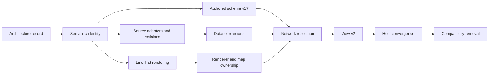

# Transit content and rendering implementation plan

> **For agentic workers:** REQUIRED SUB-SKILL: Use
> `superpowers:subagent-driven-development` or `superpowers:executing-plans` to
> implement this plan task by task. Every step uses a checkbox for tracking.

**Goal:** Implement the approved transit-content architecture, correct the
passenger map, and make authored systems and source-backed datasets resolve
through one renderer-neutral map contract.

**Architecture:** Four storage roots own four lifecycles: `TransitSystem` owns
authored content, `Source` owns external-series identity, `TransitDataset` owns
immutable normalized revisions, and `View` owns a content reference plus query
and presentation. Source adapters convert provider data into core records. A
content provider and network resolver produce bounded semantic facts, the
renderer projects those facts into a scene, and the map package alone publishes
the scene through MapLibre.

**Tech stack:** TypeScript, Vitest, React, MapLibre, IndexedDB, Cloudflare
Workers, D1, R2, Vite, pnpm, and Turborepo.

**Specs:**
[Transit content architecture](../specs/2026-08-28-transit-content-architecture.md),
[Transit data types](../specs/2026-08-28-transit-data-types.md), and
[Map data and rendering boundaries](../specs/2026-08-28-map-data-rendering-boundaries-design.md).

**Baseline:** This plan was rewritten against TransitMapper 0.7.3 at commit
`5a8825d8` on 2026-08-28. An executor must inspect the current checkout before
each task and adapt paths when later commits have moved an owner without
changing its responsibility.

## Global constraints

- `TransitSystem`, `Source`, `TransitDataset`, and `View` are the only
  product-level storage roots in this program.
- Geographic scale never becomes a content kind, route, renderer branch, or
  application mode. A country-scale map is an ordinary View over a broad
  dataset query.
- `Line` is passenger identity. `ServicePlan` groups one mode beneath a Line.
  `Pattern` owns ordered path and stop calls. `Schedule` owns time.
- Raw GTFS, GTFS Realtime, OpenStreetMap, MBTA, database, browser-storage, and
  MapLibre records never become core domain or public API aliases.
- Missing provider facts remain unknown. An alert never proves replacement
  geometry, stop order, or a timetable.
- `TransitSystem` and `TransitDataset` share a read model. They do not share a
  persistence aggregate.
- A View stores `ContentRef`, `ViewQuery`, and `MapPresentation`. It stores no
  transit records, selection, permissions, chrome, or MapLibre identifiers.
- The renderer receives resolved facts and presentation. It never resolves
  source precedence, calendars, remote queries, editor commands, or storage.
- Derived chunks, indexes, and scenes remain disposable caches.
- The application shell renders before storage, document, style, or network
  work resolves. No task may add a full-screen blocking loader.
- The shell renders within 500 ms in the editor, 400 ms in the reader, and
  250 ms in the embed under the fixed audit profile.
- The shell accepts its first input within 1,000 ms in the editor and 750 ms in
  reader and embed hosts under the fixed audit profile.
- First meaningful transit geometry paints within 2,000 ms in the editor,
  1,500 ms in the reader, and 1,250 ms in the embed.
- Input-to-next-paint p95 remains at or below 50 ms during startup, import,
  filtering, selection, and editing. Unexpected main-thread tasks may not
  exceed 50 ms.
- Long-task time before first accepted input stays below 300 ms in the editor
  and 200 ms in the reader and embed.
- Import reports progress or publishes its first batch within 250 ms.
  Cancellation prevents new commits within 100 ms.
- Tests assert behavior, semantic counts, and public contracts. They do not
  freeze hashed filenames, generated asset inventories, entire GeoJSON
  payloads, private module paths, or full screenshots.
- Every source package declares `lint`, `typecheck`, and `verify`. Packages that
  emit `dist` retain their existing `build` task. Turbo owns orchestration and
  caching. No custom TypeScript package builder is permitted.
- New packages use the repository's `pnpm gen` package generator. New D1
  migrations use its migration generator. Applied migrations are immutable.
- Each task produces one narrow commit after its focused checks pass. A phase
  ends with `pnpm check`, `pnpm build`, and its named browser or migration gate.
- Commit scopes come only from `.lvbt/commit-scopes.txt`. Cross-boundary commits
  omit a scope.
- Current-state documents change only in the same commit as the behavior they
  describe.

## Verification contract

Every task runs the complete gate for each package it changes. The plan does
not rely on a hand-maintained list of individual test filenames. A newly added
test therefore cannot disappear from a task gate because somebody renamed or
split its file. Vitest runs with at most two workers. Each command must exit
zero, execute at least one test, and leave no new skipped or todo case.

```bash
# core
pnpm --filter @transitmapper/core exec vitest run --maxWorkers=2
pnpm --filter @transitmapper/core typecheck

# sources, after Task 5.2 creates it
pnpm --filter @transitmapper/sources exec vitest run --maxWorkers=2
pnpm --filter @transitmapper/sources typecheck

# renderer, map, views, or workspace
pnpm --filter @transitmapper/renderer exec vitest run --maxWorkers=2
pnpm --filter @transitmapper/renderer typecheck
pnpm --filter @transitmapper/map exec vitest run --maxWorkers=2
pnpm --filter @transitmapper/map typecheck
pnpm --filter @transitmapper/views exec vitest run --maxWorkers=2
pnpm --filter @transitmapper/views typecheck
pnpm --filter @transitmapper/workspace exec vitest run --maxWorkers=2
pnpm --filter @transitmapper/workspace typecheck

# web
pnpm --filter @transitmapper/web exec vitest run --maxWorkers=2
pnpm --filter @transitmapper/web typecheck

# Worker, including its ordered compatibility verifier
pnpm --filter @transitmapper/worker exec node \
  --conditions=development --import tsx tests/verify.test.ts
pnpm --filter @transitmapper/worker exec vitest run --maxWorkers=2
pnpm --filter @transitmapper/worker typecheck
```

A checklist instruction to run focused package tests means this complete
package gate. The engineer may run the named new test first for a fast red-green
cycle, but that run never replaces the package gate. A task that changes a
package boundary also runs `pnpm check:boundaries`, `pnpm check:contract`, and
`pnpm check:deadcode`. A task that adds or reads D1 schema also runs
`pnpm check:migrations`. A task that changes documentation runs
`pnpm check:docs` and `pnpm check:documents`.

Release and browser gates use these repository commands. The performance
harness uses its fixed one-warmup and five-measured-run audit profile unless a
task explicitly asks for a one-run functional smoke.

```bash
pnpm --filter @transitmapper/web smoke:release
pnpm --filter @transitmapper/web perf -- --headless
pnpm --filter @transitmapper/web perf -- --first-session --headless
pnpm --filter @transitmapper/web renderer:capture
pnpm check:migrations
pnpm check
pnpm build
```

Every phase gate names the applicable commands from this list and states the
expected behavior or budget. A future journey added by this plan must register
a stable scenario ID in `apps/web/src/perf/scenarios.ts`; its task must run
`pnpm --filter @transitmapper/web perf -- --scenario <id> --headless` before
the full phase audit.

## Program sequence

The following dependency diagram shows phase order. It contains phases only.
It does not mix packages, files, or runtime calls into the same view.



The sequence fixes the existing passenger map before it changes stored
documents. Source ingestion can proceed after semantic identity exists, but no
public dataset host ships until the resolver and renderer boundaries are
complete.

## Phase 0: Synchronized architecture record

This phase makes the target state and execution order reviewable before code
changes begin.

### Task 0.1: Binding architecture documents

**Files:**

- Create `docs/superpowers/specs/2026-08-28-transit-content-architecture.md`.
- Create `docs/superpowers/specs/2026-08-28-transit-data-types.md`.
- Create `docs/superpowers/specs/2026-08-28-map-data-rendering-boundaries-design.md`.
- Replace `docs/superpowers/plans/2026-08-28-map-data-rendering-boundaries.md`.

**Produces:** One approved target architecture and this executable sequence.

- [x] Confirm that all four storage roots have one authority and lifecycle.
- [x] Confirm that every target type belongs to one root, one supporting
      revision family, one boundary family, or one private adapter family.
- [x] Confirm that no planned contract contains a national mode, MapLibre ID,
      provider row, database row, or browser-storage row.
- [x] Run `pnpm check:docs` and expect every relative link to resolve.
- [x] Run `pnpm check:documents` and expect all required documents to conform.
- [x] Run Prettier over these four files and expect no diff.
- [x] Commit only the four architecture files. Do not stage unrelated planning
      edits.

**Commit:** `chore: Define transit content and rendering boundaries`

## Phase 1: Semantic identity and read contracts

This phase adds the provider-neutral identity used by provenance, Views,
renderer indexes, selection, and network queries. It changes no persisted
document, route, or map behavior.

### Task 1.1: Transit entity references

**Files:**

- Create `packages/core/src/model/transit-entity-ref.ts`.
- Modify `packages/core/src/model/system.ts`.
- Modify `packages/core/src/render/render-identity.ts`.
- Create `packages/core/tests/model/transit-entity-ref.test.ts`.
- Modify `packages/core/tests/render/render-identity.test.ts`.

**Consumes:** Existing `RenderDomainIdentity` and its byte-compatible legacy
encoding.

**Produces:**

```ts
export type TransitEntityRef =
  | { kind: 'publisher'; id: string }
  | { kind: 'agency'; id: string }
  | { kind: 'operator'; id: string }
  | { kind: 'alignment'; id: string }
  | { kind: 'way'; id: string }
  | { kind: 'line'; id: string }
  | { kind: 'service-plan'; id: string }
  | { kind: 'pattern'; id: string }
  | { kind: 'schedule'; id: string }
  | { kind: 'calendar'; id: string }
  | { kind: 'trip'; id: string }
  | { kind: 'frequency-rule'; id: string }
  | { kind: 'operational-change'; id: string }
  | { kind: 'advisory'; id: string }
  | { kind: 'stop'; id: string }
  | { kind: 'station'; id: string }
  | { kind: 'facility'; id: string }
  | { kind: 'group'; id: string }
  | { kind: 'node'; id: string }
  | { kind: 'named-way'; id: string }
  | { kind: 'median'; id: string }
  | { kind: 'lane-connector'; id: string }
  | { kind: 'turn-restriction'; id: string }
  | { kind: 'approach-control'; id: string };

declare const transitEntityKeyBrand: unique symbol;

export type TransitEntityKey = string & {
  readonly [transitEntityKeyBrand]: 'TransitEntityKey';
};

export function transitEntityKey(reference: TransitEntityRef): TransitEntityKey;
```

Schema-v16 `service` does not enter this union. The compatibility adapter in
Phase 2 maps each current Service to transient ServicePlan and Pattern
identities.

- [ ] Add failing model tests that prove every kind encodes deterministically,
      IDs containing delimiters remain distinct, and blank IDs fail.
- [ ] Run the focused model test and confirm that the missing module causes the
      expected failure.
- [ ] Implement length-safe component encoding in the model module. Do not
      import renderer types into that module.
- [ ] Add a `renderDomainIdentity(reference)` overload. Retain the current
      `(kind, id)` overload and exact encoded bytes for compatibility.
- [ ] Add a renderer-identity test that proves both overloads encode the same
      Line reference and that one identity owns several visual fragments
      without duplicate feature IDs.
- [ ] Run:

  ```bash
  pnpm --filter @transitmapper/core exec vitest run --maxWorkers=2 \
    tests/model/transit-entity-ref.test.ts \
    tests/render/render-identity.test.ts
  pnpm --filter @transitmapper/core typecheck
  pnpm check:boundaries
  pnpm check:contract
  ```

- [ ] Commit the focused change.

**Commit:** `chore(core): Add stable transit entity references`

### Task 1.2: Portable source references

**Files:**

- Create `packages/core/src/source/value-types.ts`.
- Create `packages/core/src/source/source-reference.ts`.
- Create `packages/core/tests/source/source-reference.test.ts`.
- Export the values through a focused core source entry.

**Produces:**

```ts
export interface ExternalRef {
  sourceId: string;
  kind: string;
  id: string;
}

export type ExternalRecordRef =
  | (ExternalRef & { stability: 'source-stable' })
  | (ExternalRef & {
      stability: 'revision-local';
      sourceRevisionId: string;
    });

export type ExternalFactRef = ExternalRef & {
  sourceRevisionId: string;
  stability: 'source-stable' | 'revision-local';
};

export interface SourceCitation {
  sourceId: string;
  name: string;
  publisher?: PublisherRef;
  attribution: Attribution;
  license?: LicenseRef;
}
```

- [ ] Add failing tests for stable portable identity, delimiter-bearing values,
      exact revision lineage, identity stability, attribution, and missing
      optional publisher and license values.
- [ ] Define and parse `PublisherRef`, `Attribution`, `LicenseRef`,
      `ContentDigest`, `ArtifactDescriptor`, and the exact external reference
      union from the binding type reference. Reject blank values, malformed
      SHA-256 digests, negative byte lengths, invalid media types, and
      non-HTTP(S) citation URLs.
- [ ] Permit citation URLs in publisher, attribution, and license values.
- [ ] Keep endpoints, credentials, feed slugs, database keys, and connector
      configuration out of these values.
- [ ] Run focused core tests and runtime-purity checks.
- [ ] Commit the portable reference contract.

**Commit:** `feat(core): Define portable source references`

### Task 1.3a: Content query and presentation values

**Files:**

- Create `packages/core/src/network/content-reference.ts`.
- Create `packages/core/src/network/resolved-content-reference.ts`.
- Create `packages/core/src/network/query.ts`.
- Create `packages/core/src/geography/bounds.ts`.
- Create `packages/core/src/geography/coverage.ts`.
- Create `packages/core/src/presentation/map-presentation.ts`.
- Add focused tests under `packages/core/tests/network/query/`.

**Produces:** `ContentRef`, `ResolvedContentRef`, content descriptor, map
definition, `ViewQuery`, `NetworkQuery`, geographic coverage, and
`MapPresentation` from the binding reference.

- [ ] Add failing compiler contract tests for both content roots, every
      revision selector, bounds, time, modes, filters, detail band, concrete
      descriptor, attribution, and both GeographicCoverage branches. The five
      independent `CoverageAssessment` axes belong to Task 1.3c.
- [ ] Use the explicit `{ kind: 'all' } | { kind: 'only'; ids }` mode
      selector. An empty `only` list means that the user disabled every mode.
- [ ] Require user-facing labels on every filter and option. Include bounded
      Source name, attribution, last-updated time, and freshness status in the
      content descriptor. Generic hosts must not hard-code provider copy.
- [ ] Keep provider, database, browser-storage, renderer, and MapLibre values
      out of every boundary type.
- [ ] Do not add hostile-input parsers in this task. Task 7.1 owns runtime
      parsing under the binding reference's numeric ranges, size limits,
      `network-query-v1` canonicalization, and fallback rules.
- [ ] Run focused core tests and runtime-purity checks.
- [ ] Commit the value contract.

**Commit:** `feat(core): Define transit content queries`

### Task 1.3b: Canonical value encoding

**Files:**

- Create `packages/core/src/encoding/canonical-value.ts`.
- Create `packages/core/tests/encoding/canonical-value.test.ts`.

**Produces:** The dependency-leaf `canonical-value-v1` byte encoder used by
normalization, immutable revision digests, reviewed-import baselines, and
network page assembly. It owns no transit policy and computes no digest.

- [ ] Add failing tests for every scalar tag, recursive length framing,
      unsigned UTF-8 object-key order, array order, negative zero, and nested
      values.
- [ ] Reject nonfinite numbers, undefined, sparse arrays, functions, symbols,
      bigint, non-plain objects, unpaired surrogates, and any encoded count or
      byte length above `2^32 - 1`.
- [ ] Keep top-level identity framing separate. Recursive canonical values do
      not gain a `frame` part count.
- [ ] Run focused core tests and runtime-purity checks.
- [ ] Commit the encoder before any caller depends on it.

**Commit:** `feat(core): Encode canonical transit values`

### Task 1.3c: Bounded network transfer

**Files:**

- Create `packages/core/src/transit/value-types.ts` for target-schema values
  that both authored and normalized content use.
- Create `packages/core/src/network/result.ts`.
- Create `packages/core/src/network/resolved-network-chunk.ts`.
- Add focused tests under `packages/core/tests/network/result/`.

**Consumes:** Phase 1 semantic identity, Task 1.3a query values, and the
`canonical-value-v1` encoder from Task 1.3b.

**Produces:** Stable Line order, coverage assessment, fragmented
`ResolvedNetworkChunk`, cursor, replacement, operational summary, and
self-contained infrastructure transfer records from the binding reference.

- [ ] Add contract tests that prove an empty chunk can coexist with unknown
      service evidence. Only `serviceEvidence: 'known-none'` means known
      absence.
- [ ] Define `KnownOrUnknown`, `Applicability`, `TransitCarrierRef`, target
      Grade and lane values, Pattern direction, operational scope, and
      advisory text in the neutral transit value module. Do not reuse the
      incompatible schema-v16 `LegDirection`, `LaneSpec`, `CrossSection`, or
      `CurveControl` records.
- [ ] Keep domain identity stable across chunks and pages. Split geometry into
      stable carrier and Pattern-leg fragments. `canonical-value-v1` is the
      required comparison encoding for duplicate entity, relationship, or
      fragment IDs. Task 7.1 owns runtime comparison and deduplication.
- [ ] Carry optional supplied stop-call path anchors as leg index plus
      complete-carrier position. The contract represents bounding calls and
      their Stop or parent Station identities. Authored and Dataset provider
      tasks prove nearest-anchor inclusion and the ban on proximity inference.
- [x] Carry one `ResolvedTopologyWindow` with the complete ordered Pattern-leg
      fragment IDs and anchored calls for each supplied interval. Bind every
      call to a fragment boundary index so a leg transition requires no
      geometry inference. Cache overflow is storage-internal. A provider
      dereferences it before returning an ordinary semantic page, so no
      artifact descriptor or storage locator enters `ResolvedNetworkChunk`.
- [ ] List visible Pattern-leg fragment IDs separately. Only that list may
      authorize paint, hits, or export. Topology-only fragments remain
      comparison evidence.
- [ ] Require callers to send `nextCursor` back through `NetworkQuery.cursor`
      to request the next page. Task 7.1 owns concrete-content and canonical
      query binding. Provider tasks reject cross-query reuse.
- [ ] Include provider-neutral Node, NamedWay, median, lane-connector, turn
      restriction, approach-control, Facility, Group, and clipped area values
      in self-contained `Resolved*` transfer records. Phase 1 must not import
      the normalized Dataset aggregate introduced in Phase 6.
- [ ] Preserve operational replacement links, point Facilities, Station
      footprints, and fragment-local curve controls. The value contract
      defines ranges on the complete Alignment. Provider tests own clipping
      and curve-control remapping.
- [ ] Keep `ResolvedServicePlanStatus` in the entity-details contract from
      Task 1.3d. Chunk-level operational summary consists of effective
      `ResolvedServicePlan.activity`, operational changes, and Advisories.
- [ ] Keep provider, storage, renderer, and MapLibre values out of the transfer.
- [ ] Run focused core tests and runtime-purity checks.
- [ ] Commit the bounded transfer separately from provider behavior.

**Commit:** `feat(core): Define bounded network transfer`

### Task 1.3d: Content provider ports and API envelopes

**Files:**

- Create `packages/core/src/network/content-provider.ts`.
- Create `packages/core/src/network/content-search-provider.ts`.
- Create `packages/core/src/network/entity-details-provider.ts`.
- Create `packages/core/src/network/api-contract.ts`.
- Add focused tests under `packages/core/tests/network/provider/`.

```ts
export interface ContentProvider {
  describe(reference: ContentRef, options?: ResolveOptions): Promise<ResolvedContentDescriptor>;
  resolve(
    content: ResolvedContentRef,
    query: NetworkQuery,
    options?: ResolveOptions,
  ): Promise<NetworkQueryResult>;
}
```

- [ ] Add cancellation tests for describe, resolve, search, and details. A
      superseded request must observe its `AbortSignal` and cannot publish a
      late result.
- [ ] Add bounded search and details tests. Search returns semantic identity,
      label, and optional location or extent. Details page Calendar, Trip,
      frequency, stop-call, ServicePlan status, operational change, and
      Advisory summaries without adding Schedule records to renderer chunks.
- [ ] Page entity details as one discriminated item stream. Preserve schedule
      precision and boarding rules in every stop-call summary.
- [ ] Define and validate the four exact resource routes, request values,
      success envelopes, failure envelopes, status mappings, and error codes in
      the binding reference. Do not leave route names or error semantics for a
      Worker task to invent.
- [ ] Keep provider, database, browser-storage, renderer, and MapLibre values
      out of every boundary type.
- [ ] Run focused core tests and runtime-purity checks.
- [ ] Commit the ports and wire envelopes.

**Commit:** `feat(core): Define transit content provider ports`

### Task 1.4: Schema-v16 system provider

**Files:**

- Create `packages/core/src/network/schema-v16-system-provider.ts`.
- Create focused compatibility helpers under
  `packages/core/src/network/schema-v16-system/` for identity, bounds,
  directional Pattern expansion, topology, infrastructure, and chunk
  assembly. Keep the public provider file as the only entry point.
- Create `packages/core/tests/network/schema-v16-system-provider.test.ts`.

**Consumes:** One schema-v16 `TransitSystem`, a matching
`transit-system/latest` reference, and `NetworkQuery`.

**Produces:** `NetworkQueryResult` with transient ServicePlan and directional
Pattern records. It is a compatibility provider, not renderer policy.

- [x] Add failing tests for one bidirectional Service, a defensive
      empty-inbound legacy path, short turn, circle, invalid legacy reference,
      bounds, mode filter, and stable Line order. Schema v16 cannot faithfully
      store a general one-way Service, so the provider must not claim that it
      can.
- [x] Keep each Service ID as its transient ServicePlan ID. Use the binding's
      `legacyDerivedId` framing for Patterns, stop calls, links, topology
      windows, and geometry fragments. Schema-v16 sections have no stable
      identity, so neither Line IDs nor array positions may replace the
      binding's Service-and-run Pattern identity. Do not add `service` to
      `TransitEntityRef`.
- [x] Resolve the accepted latest selector to a working `ResolvedContentRef`
      with SHA-256 over canonical value bytes. The preimage is
      `{ encodingVersion: 'transit-system-json-v1', schemaVersion: 16, system }`.
      Reject pinned System revisions as unavailable until Phase 4 creates
      immutable SystemRevision storage.
- [x] Preserve unknown geometry instead of inventing Alignment or Way facts.
- [x] Emit stop-call path anchors only from existing Stop anchors on the exact
      Pattern leg. Include the bounding calls needed for visible topology
      comparison and complete topology windows between them. Do not snap by
      coordinate proximity.
- [x] Derive Line order from `TransitSystem.lines` inside this provider only.
- [x] Run focused core tests and typecheck.
- [x] Commit the compatibility provider without changing paint.

**Commit:** `chore(core): Read schema v16 through the network contract`

## Phase 2: Line-first passenger rendering

This phase fixes the unreadable passenger map while stored systems remain
schema v16. Renderer compatibility records expose current Services as
transient ServicePlans and directional Patterns. They never enter storage.

### Task 2.1: Resolved-network projection entry

**Files:**

- Create `packages/renderer/src/network/resolved-network-projection.ts`.
- Create `packages/renderer/tests/network/resolved-network-projection.test.ts`.
- Modify `packages/renderer/src/projection.ts` to export the adapter through
  the existing bounded projection entry.

**Consumes:** `NetworkQueryResult` and `MapPresentation`. Renderer receives no
`TransitSystem` or persistence aggregate.

**Produces:** Renderer-owned projection input indexed by semantic Line,
ServicePlan, Pattern, Stop, Station, Alignment, Way, Advisory, and canonical
TopologyWindow references.

- [x] Add failing tests that pass schema-v16 provider results and hand-built
      dataset-shaped results through the same projection entry.
- [x] Run the focused test and confirm that the entry is absent.
- [x] Preserve coverage and chunk boundaries outside scene geometry. Renderer
      must not reinterpret missing or unavailable content.
- [x] Preserve `NetworkQueryResult.lineOrder` without consulting source
      document arrays or async completion order.
- [x] Keep unknown Pattern paths unknown and render only facts that the result
      supplies.
- [x] Treat topology-window fragments as comparison evidence. Project route
      geometry only from `visiblePatternLegFragmentIds`.
- [x] Compare every repeated record consumed by the projection with
      `canonical-value-v1`. Coalesce equal records and reject conflicts before
      an insertion-order index can hide them. Leave cursor and cross-page
      validation to the core page assembler.
- [x] Run the focused renderer test and renderer typecheck.
- [x] Commit the adapter without changing paint behavior.

**Commit:** `chore(renderer): Project resolved transit networks`

### Task 2.2: Line spans and corridor bundles

**Files:**

- Create `packages/core/src/network/carrier-alignment.ts`.
- Modify `packages/core/src/network/resolved-network-chunk.ts`.
- Modify `packages/core/src/network/schema-v16-system/chunk.ts`.
- Create `packages/core/src/network/schema-v16-system/carrier-transfer.ts`.
- Modify `packages/core/src/network/schema-v16-system/selection.ts`.
- Create `packages/renderer/src/line/line-spans.ts`.
- Create `packages/renderer/src/line/pattern-leg-index.ts`.
- Create `packages/renderer/src/line/line-span-candidates.ts`.
- Create `packages/renderer/src/line/line-span-candidate-groups.ts`.
- Create `packages/renderer/src/line/line-span-atoms.ts`.
- Create `packages/renderer/src/line/line-overlap.ts`.
- Create `packages/renderer/src/line/line-bundles.ts`.
- Create `packages/core/tests/network/carrier-alignment.test.ts`.
- Create `packages/renderer/tests/line/line-spans.test.ts`.
- Create `packages/renderer/tests/line/line-span-atoms.test.ts`.
- Create `packages/renderer/tests/line/line-bundles.test.ts`.
- Create `packages/renderer/tests/line/gtfs-line-projection.test.ts`.

**Consumes:** Resolved Pattern facts and dataset-neutral Line order from Task
2.1.

**Produces:**

```ts
export interface LineSpanContributor {
  servicePlanId: string;
  patternId: string;
  legIndex: number;
  carrier: TransitCarrierRef;
  carrierRange: readonly [number, number];
  spanRange: readonly [number, number];
}

export interface LineSpan {
  id: string;
  lineId: string;
  contributors: readonly LineSpanContributor[];
  canonicalCarrier: TransitCarrierRef;
  canonicalCarrierRange: readonly [number, number];
}

export interface VisibleLineSpanFragment {
  id: string;
  lineSpanId: string;
  canonicalCarrierRange: readonly [number, number];
  sourceShardIds: readonly [string, ...string[]];
  geometry: LineString;
}

export interface LineBundleMember {
  lineId: string;
  spans: readonly [LineSpan, ...LineSpan[]];
}

export type LineBundleCasingCandidate =
  | {
      kind: 'exact-carrier';
      canonicalCarrier: TransitCarrierRef;
      canonicalCarrierRange: readonly [number, number];
    }
  | {
      kind: 'topology';
      topologyWindowIds: readonly [string, string];
      startAnchorKey: TransitEntityKey;
      endAnchorKey: TransitEntityKey;
    }
  | { kind: 'line-span'; lineSpanId: string };

export interface LineBundle {
  id: string;
  casing: LineBundleCasingCandidate;
  members: readonly [LineBundleMember, ...LineBundleMember[]];
}

export interface VisibleLineBundleFragment {
  id: string;
  lineBundleId: string;
  lineId: string;
  lineSpanId: string;
  canonicalCarrierRange: readonly [number, number];
  sourceShardIds: readonly [string, ...string[]];
  geometry: LineString;
}
```

- [x] Implement the pure `line-overlap-v1` metric kernel with its fixed local
      projection, millimetre quantization, symmetric sampling, distance gate,
      tangent gate, invalid-geography rejection, and caller-controlled work
      budget. Keep transit policy and transfer assembly outside this kernel.
- [x] Preserve complete logical Pattern-leg identity and carrier range on
      every query-clipped transfer shard so viewport bounds cannot change Line
      span identity.
- [x] Normalize transferred carrier and Pattern-leg shards from raw chunks.
      Coalesce byte-equal repeats, reject conflicting identities and invalid
      logical groups, and build one validated Pattern-leg index for candidate
      and topology preparation. Keep stable semantic spans separate from
      query-local visible geometry fragments. Topology comparison must consume
      this index instead of reconstructing physical facts from projection maps.
- [x] Resolve a complete topology window only by its canonical projection ID
      and the Pattern-leg index from that exact result. Preserve supplied call
      boundary placement, canonical Stop and Station identity, and fragment
      traversal order. Defer only missing paged evidence. Do not derive a
      topology boundary from a Stop-call path anchor or raw geometry.
- [x] Classify shared topology anchors by exact Stop identity or the same
      explicit Station. Preserve an exact Stop match as stronger evidence for
      later repeated-anchor selection. Do not infer a match from a label or
      coordinate proximity.
- [x] Bind each transferred logical Pattern leg to exactly one Line and one
      candidate per resolved ServicePlan occurrence. Reject a missing
      ServicePlan, missing or unknown Pattern, missing or ambiguous Line
      ownership, and noncontiguous dataset-neutral Line order before span
      derivation. Retain resolved ServicePlan mode and Way-grade evidence with
      the candidate for later topology policy.
- [x] Return the bounded same-Line semantic carrier closure for each visible
      `(Line, carrier)` seed independently from paint authorization. Do not
      widen closure to another carrier from the same Pattern, another Line, or
      a mode-excluded ServicePlan.
- [x] Preserve each logical Pattern piece's complete Alignment range separately
      from its carrier range. Validate Alignment, Way, and lane references
      before exact carrier grouping can trust them.
- [x] Put each Way's monotonic affine Alignment mapping on the Way. Validate
      logical pieces and transferred shards against that shared mapping so one
      Pattern occurrence cannot redefine physical correspondence.
- [x] Split exact same-Line carriers at every contributor boundary. Network
      and Diagram use a shared Alignment. Infrastructure uses the same resolved
      Way and lane while deferring bare Alignments and unresolved lanes.
- [x] Keep exact span identity independent of schedule variants, temporary
      service, query shards, viewport clipping, and completion order. Keep
      query-local shard evidence outside the semantic atom.
- [x] Resolve one Line partition per exact-carrier call. Normalize duplicates
      before representation-specific grouping. Require one visible seed in
      each exact group, then retain its closure-only contributors with empty
      query evidence. Keep deferred semantic work separate from its logical and
      query-local shard evidence.
- [x] Materialize one requested Line partition into stable exact-carrier
      `LineSpan` records and source-clipped `VisibleLineSpanFragment` records.
      Hash semantic and query-local identities separately. Use only visible
      transferred shards, preserve a closure-only span contributor, and leave
      Worker scheduling, bundles, source replacement, and map paint unchanged.
- [x] Integrate normalization through a browser-owned projection Worker. Keep
      raw projection indexes private, advance ranked Lines serially, return no
      partial result, and terminate superseded work. Do not scan or sort a
      broad result as one main-thread task. (`b3b395c1`)

#### Task 2.2D: Exact-carrier Line correspondence

**Consumes:** One complete private Line materialization and the validated
topology evidence that produced it.

**Produces:** Renderer-only proof that distinct Line spans share one exact
carrier interval. It does not emit a scene, touch MapLibre, or publish a
partial bundle.

- [x] Add behavioral cases for exact shared carrier intervals, invalid carrier
      ranges, and deterministic `lineOrder` membership.
- [x] Derive exact-carrier correspondence from complete Line spans. Reject
      nonfinite, out-of-range, and non-positive carrier intervals before sweep
      events. Preserve each Line identity and stable `lineOrder`.
- [x] Keep correspondence private to aggregate materialization in the
      projection Worker. A rejected result produces no bundle output.
- [x] Ship exact correspondence with aggregate bundle assembly before scene
      projection.

**Commit:** `chore(renderer): Derive complete Line bundles`

#### Task 2.2E: Topology Line correspondence

**Consumes:** The exact-carrier correspondence and complete validated
`ResolvedTopologyWindow` evidence.

**Produces:** Renderer-only proof for Line spans that share an accepted
topology interval despite different legacy carriers. It does not emit a scene,
touch MapLibre, or permit coordinate-only grouping.

- [x] Add behavioral cases for authored-anchor matches, grade-separated
      rejection, nearby routes without anchors, shared known-mode rejection,
      repeated anchors, and reversed travel.
- [x] Build topology candidates only from complete window boundaries and
      authored Stop or Station anchors. Use `line-overlap-v1`. Do not compare
      raw visible fragments or infer a correspondence from coordinates alone.
- [x] Carry matched anchor occurrences into the comparison. Reject a known
      grade conflict and require a shared known mode for topology fallback
      between distinct Lines.
- [x] Keep candidate state inside aggregate materialization in the projection
      Worker. A pending, cancelled, or rejected materialization produces no
      bundle output.
- [x] Ship topology correspondence with aggregate bundle assembly before scene
      projection.

**Commit:** `chore(renderer): Derive complete Line bundles`

#### Task 2.2F: Complete Line bundles

**Consumes:** Exact-carrier and topology correspondence for a complete
materialization result.

**Produces:** Stable `LineBundle` and `VisibleLineBundleFragment` records with
one common casing candidate and ordered Line members. The output still does not
mutate a scene or a map source.

- [x] Add behavioral cases for exact and topology casing candidates, ordered
      member Lines, source-clipped fragments, and cancelled or rejected
      aggregate publication.
- [x] Create bundle IDs from ordered member Line spans and accepted
      correspondence. Keep semantic bundle identity separate from visible
      fragment geometry and query shards.
- [x] Return one complete bundle result from the Worker only after every Line
      and correspondence step has settled. Keep per-Line sessions and
      projection indexes private to the Worker.
- [x] Ship bundle assembly before Line scene projection.

**Commit:** `chore(renderer): Derive complete Line bundles`

- [ ] Add failing tests for 100 coincident Services under one Line, a short
      turn, a real branch, repeated geometry, circular geometry, two Lines on
      one proven corridor, a grade-separated crossing, and nearby parallel
      corridors with no shared topology.
- [ ] Test the `line-overlap-v1` boundaries at and immediately beyond 25
      metres of accepted run, 20 metres of symmetric separation, 40 degrees
      of undirected heading, `1e-9` of carrier-range continuity, and 0.75
      metres of fragment-endpoint continuity.
- [ ] Test coordinate-identical paths with no semantic anchors, reversed
      directions, different vertex density, repeated circular anchors, one
      logical overlap delivered through one and three chunks, reversed page
      order, reversed Worker completion, viewport clipping, and adjacent
      carriers with opposite stored directions.
- [ ] Add the full same-Line carrier matrix. Equivalent directions, schedule
      variants, stopping variants, short turns, and temporary service paint the
      Line once on every shared span. A physically divergent branch, a separate
      parallel carrier, or a grade-separated carrier may create separate Line
      geometry only for its nonshared extent. Mode alone never authorizes a
      second stripe.
- [ ] In Infrastructure representation, collapse sibling Patterns only when
      resolved lane or track carrier, extent, connector, and grade identity all
      match. Separate any case where one of those physical identities differs.
      Do not use topology fallback in Infrastructure.
- [ ] Assert semantic outcomes instead of complete GeoJSON: coincident sibling
      Patterns produce one Line span, a branch splits only at divergence, and
      different Lines retain distinct members in one proven bundle.
- [ ] Run the focused tests and confirm that the derivation is absent.
- [ ] Implement `line-overlap-v1` exactly as the binding renderer design
      defines it. Exact carrier-range overlap needs no tolerance. Topology
      fallback requires complete anchor-to-anchor topology windows, two
      supplied Stop or Station path anchors, monotonic correspondence, the
      fixed distance and heading gates, and no known grade conflict. Never snap
      Stops to geometry to manufacture evidence.
- [ ] Use the binding contract's candidate-local azimuthal-equidistant
      projection, millimetre quantization, 0.25-metre curve sagitta, exact
      bidirectional samples, nearest-segment rule, and vertex-tangent rule.
      Never use MapLibre, Web Mercator, camera, LOD, or display tessellation in
      overlap acceptance.
- [ ] Require a shared known mode for cross-Line topology fallback. Ignore mode
      for same-Line consolidation and exact shared carriers.
- [ ] Keep logical span identity independent of query and viewport clipping.
      Reject mismatched duplicate fragments and keep the last accepted scene.
- [ ] Use the fixed canonical-contributor tuple. Do not average coordinates or
      select a carrier by geometric closeness.
- [ ] Use `lineOrder` for bundle member order. Never use async completion or
      chunk order. Reject missing, duplicate, negative, or fractional ranks.
- [ ] Orient connected bundles through stable junction order. Resolve a cycle
      tie with the lexicographically lower orientation-specific component
      endpoint signature.
- [ ] Run the focused tests and renderer typecheck.
- [ ] Commit the pure renderer derivation.

**Commit:** `fix(renderer): Consolidate sibling service paths by line`

### Task 2.3: Atomic Line scene projection

**Files:**

- Modify `packages/renderer/src/projection/resumable-feature-projection.ts`.
- Create `packages/renderer/src/projection/line-scene-projection.ts`.
- Modify `packages/renderer/src/scene-draft.ts`.
- Modify `packages/renderer/src/scene-draft-assembly.ts`.
- Modify `packages/renderer/src/document-map-feature-details.ts`.
- Create `packages/renderer/tests/line/line-scene-projection.test.ts`.
- Modify `packages/renderer/tests/resumable-feature-projection.test.ts`.

**Produces:** One noninteractive common casing per LineBundle and one adjacent
stripe per visible LineSpan in stable `lineOrder`. The map may reuse each stripe
feature in wider interaction styling, but renderer does not duplicate
transparent route GeoJSON for hit testing. Each stripe hit target binds only to
its Line. The semantic index retains its contributing ServicePlans, Patterns,
and carriers for details without exposing them as route hits.

- [ ] Add failing tests that count permanent route geometry, wide interaction
      layers, and semantic bindings for the Phase 2.2 fixtures. A wider layer
      may reuse a feature; it may not require duplicate GeoJSON.
- [ ] Add a failing cancellation test that rejects every partial or stale
      bundle from publication.
- [ ] Run the focused tests and confirm current Service-occurrence projection
      violates the expected counts.
- [ ] Project complete bundles in resumable units smaller than 50 ms. Publish a
      replacement bundle atomically after all of its units complete.
- [ ] Join one bundle casing through bends and intersections. Keep adjacent
      Line stripes continuous through bundle joins, caps, merges, and branch
      splits without doubled-width seams.
- [ ] Keep existing source-bank recovery and last-accepted-scene behavior.
- [ ] Make ordinary hit testing resolve `TransitEntityRef` with `kind: 'line'`
      from the rendered stripe. When interaction widths overlap, choose the
      nearest stripe or open a labeled Line chooser. Repeated clicks must not
      cycle through hidden Services.
- [ ] Add targeted region checks for casing count, adjacent stripe order,
      joins, caps, stripe continuity, branch splits, and seam width. Do not add
      full-screen golden screenshots.
- [ ] Run the focused renderer suite and typecheck.
- [ ] Commit the new passenger projection.

**Commit:** `fix(renderer): Paint one passenger stripe per line span`

### Task 2.4: Editor-only Pattern inspection overlay

**Files:**

- Create `apps/web/src/editor/map/pattern-inspection-overlay.ts`.
- Modify the selection-to-map extension beside the existing editor map host.
- Modify `apps/web/src/ui/inspector/LineInspector.tsx` and the migrated
  ServicePlan inspector owner.
- Create `apps/web/tests/editor/pattern-inspection-overlay.test.ts`.
- Modify `packages/renderer/tests/document-map-driver.test.ts`.

**Produces:** A temporary overlay for one explicitly selected transient Pattern
or schema-v16 Service. Reader, embed, preview, SVG, and PNG paths cannot create
it.

- [ ] Add failing tests for overlay creation, selection change, deselection,
      driver disposal, and reader/embed absence.
- [ ] Implement the overlay as an editor-host extension. Do not add a permanent
      renderer source or serialize the overlay.
- [ ] Keep direction arrows, termini, and occurrence handles inside this
      overlay only.
- [ ] Show labeled ServicePlans in the Line inspector and expose one explicit
      `Edit path` action for each Pattern. Selecting Line geometry stays on the
      Line and never silently descends into a ServicePlan or Pattern.
- [ ] Run focused web and renderer tests.
- [ ] Commit the editor behavior.

**Commit:** `fix: Isolate service path inspection from passenger paint`

### Task 2.5: Passenger-place level of detail

**Files:**

- Modify the renderer LOD policy modules under
  `packages/renderer/src/projection/`.
- Modify the Stop and Station feature builders consumed by the renderer.
- Create `packages/renderer/tests/line/passenger-place-lod.test.ts`.
- Extend `apps/web/scripts/renderer-capture/` with a `line-first` acceptance
  phase.
- Extend `apps/web/tests/support/renderer-lod-acceptance.test.ts`.

**Produces:** Overview, district, and street detail bands from the approved UX
contract.

- [ ] Add failing tests that prove Overview hides ordinary Stop labels while
      retaining major Stations, major Stops, and interchanges. District shows
      ordinary Stop markers with collision-free labels. Street adds remaining
      detail without duplicating place labels or symbols.
- [ ] When a Stop belongs to a Station at the same boarding place, render one
      overview interchange symbol and one winning label. Keep both semantic
      identities available for hit resolution and details.
- [ ] Add Diagram parity cases to the existing Network and Infrastructure LOD
      acceptance suite.
- [ ] Implement selection and interchange priority without changing semantic
      Stop or Station identity between detail bands.
- [ ] Add targeted image-region checks and semantic feature-count checks. Do
      not add whole-screen golden screenshots.
- [ ] Run focused tests and the existing LOD acceptance suite.
- [ ] Commit the LOD behavior.

**Commit:** `fix: Make passenger detail follow map scale`

### Task 2.6a: Succinct inspector surfaces

**Files:**

- Audit `apps/web/src/ui/inspector/*.tsx`.
- Add inspector copy and accessibility tests under `apps/web/tests/ui/`.
- Create one reusable rich-help surface under the existing shared UI owner.

- [ ] Classify every permanent explanatory sentence as necessary status,
      error recovery, safety warning, complex-domain help, or removable
      narration.
- [ ] Audit every inspector panel. Do not limit the cleanup to Line or
      ServicePlan surfaces.
- [ ] Remove narration that defines ordinary visible controls or explains the
      object model beside controls whose labels can state the action.
- [ ] Replace vague labels with short nouns and verbs. Keep primary actions
      visibly labeled.
- [ ] Preserve instructions required for an active placement mode, destructive
      consequence, inaccessible visual, error recovery, or data-loss warning.
- [ ] Move complex-domain help into one reusable rich-help surface with
      keyboard focus, pointer and touch activation, `aria-describedby`, and
      Escape dismissal. Do not use native `title` as the help contract.
- [ ] Add behavior tests for labels, accessible names, help disclosure, and
      absence of the removed permanent prose. Do not snapshot whole panels.
- [ ] Inspect every changed panel at desktop and mobile widths.
- [ ] Commit the inspector cleanup.

**Commit:** `fix(web): Make inspector controls self-evident`

### Task 2.6b: Succinct workbench chrome

**Files:**

- Audit toolbars, sidebars, menus, and popovers under `apps/web/src/ui/`.
- Audit shared menu and toolbar surfaces under `packages/workspace/src/`.
- Add focused copy, overflow, and accessibility tests.

- [ ] Remove permanent narration around ordinary map controls. Replace vague
      labels with short nouns and verbs.
- [ ] Keep primary actions labeled. Keep each action row on one line and move
      lower-priority actions into one accessible overflow.
- [ ] Reuse the Task 2.6a rich-help surface only for complex concepts. Preserve
      active placement, destructive, error-recovery, and data-loss guidance.
- [ ] Prove pointer, touch, keyboard, narrow-width, and Escape behavior without
      whole-panel snapshots.
- [ ] Inspect editor chrome at desktop and mobile widths and commit it
      separately from workflow dialogs.

**Commit:** `fix: Simplify map workbench chrome`

### Task 2.6c: Succinct workflow surfaces

**Files:**

- Audit schedules, imports, sharing, exports, settings, systems, and
  vehicle-kind dialogs and popovers under `apps/web/src/ui/`.
- Add focused workflow copy and accessibility tests.

- [ ] Remove text that only restates visible fields or buttons. Keep necessary
      status, validation, recovery, destructive, and data-loss guidance.
- [ ] Give every field and action a short visible label. Put complex optional
      explanation behind the shared rich-help surface.
- [ ] Prove keyboard, pointer, touch, screen-reader, narrow-width, and Escape
      behavior for every changed workflow.
- [ ] Inspect changed workflows at desktop and mobile widths.
- [ ] Commit workflow language independently.

**Commit:** `fix(web): Simplify editor workflows`

### Task 2.7: Line-first release gate

**Files:**

- Update current product documents whose map behavior changes.
- Update the automated renderer acceptance scenario and its checked-in
  semantic expectations.

- [ ] Run `pnpm check`.
- [ ] Run `pnpm build`.
- [ ] Run the full five-run `pnpm perf` audit.
- [ ] Run the Line-first and existing LOD renderer acceptance phases across
      editor, reader, embed, SVG, and PNG output.
- [ ] Inspect desktop and mobile evidence for Network, Infrastructure, and
      Diagram in every supported theme.
- [ ] Confirm that permanent route geometry and semantic hit bindings grow with
      visible Line spans and physical carriers, not Service or Pattern count.
      Wide interaction styling reuses route geometry.
- [ ] Commit only documentation and acceptance-baseline adjustments that the
      preceding behavior made true.

**Commit:** `chore(renderer): Record the line-first release evidence`

## Phase 3: Renderer and map ownership

This phase removes MapLibre, Views, and browser publication from the renderer.
It also moves projection policy out of core while preserving the Line-first
behavior and every public host.

### Task 3.1: Leaf scene and map port contracts

**Files:**

- Create `packages/core/src/render-contract/identity.ts`.
- Create `packages/core/src/render-contract/scene.ts`.
- Create `packages/core/src/render-contract/patch.ts`.
- Create `packages/core/src/application/map-surface-port.ts`.
- Modify existing `packages/core/src/render/render-identity.ts`,
  `render-scene.ts`, and `render-scene-diff.ts` into compatibility exports.
- Move their tests under `packages/core/tests/render-contract/` while retaining
  behavior, not old file layout, as the assertion.
- Modify `dependency-cruiser.config.mjs` to reject imports from
  `model`, `source`, `dataset`, or `network` into `render-contract`.

**Produces:** A leaf scene protocol plus neutral `MapSurfacePort`. Renderer,
map, workspace, and web can import the contracts without making persisted
transit modules depend on rendering policy. The port consumes the neutral
`MapPresentation` value from Task 1.3.

```ts
export interface MapScreenPoint {
  x: number;
  y: number;
}

export type MapScenePublication =
  { kind: 'replace'; scene: RenderScene } | { kind: 'patch'; patch: RenderScenePatch };

export interface MapCameraChange {
  camera: MapCamera;
  phase: 'moving' | 'settled';
  origin: { kind: 'user' } | { kind: 'programmatic'; token?: string };
}

export interface MapSurfacePort {
  publish(publication: MapScenePublication): Promise<void>;
  setPresentation(presentation: MapPresentation, token?: string): void;
  subscribeCamera(listener: (change: MapCameraChange) => void): () => void;
  resolveHit(point: MapScreenPoint): readonly TransitEntityRef[];
  dispose(): void;
}
```

`MapScreenPoint` uses finite CSS-pixel coordinates relative to the map
viewport. A `replace` publication installs one complete scene. A `patch`
publication applies only to the base generation named by `RenderScenePatch`.
The discriminant prevents a caller from sending a full scene and a patch in
one contradictory request. Each map instance owns its subscriptions. A
programmatic camera event repeats the caller token. Workspace uses that token
to avoid feeding the same presentation back into the map. User events have no
token. The unsubscribe function removes one listener. `dispose` removes every
remaining listener and emits no later change.

- [ ] Add a failing boundary test that imports every persisted domain barrel
      and proves none imports `render-contract`.
- [ ] Move branded scene, patch, feature, and identity values without changing
      their wire or in-memory behavior.
- [ ] Reject non-finite screen points, stale patch generations, and patches
      whose base scene is no longer accepted.
- [ ] Add camera tests for user pan and zoom, programmatic changes with tokens,
      moving and settled phases, two independent map instances, unsubscribe,
      and disposal. Workspace must never reach through the port to MapLibre.
- [ ] Retain compatibility exports until Task 3.5 proves that every caller
      moved.
- [ ] Run core tests, `pnpm check:boundaries`, and `pnpm check:deadcode`.
- [ ] Commit the leaf contract.

**Commit:** `chore(core): Isolate the renderer scene protocol`

### Task 3.2a: Pure scene projection

**Files:**

- Move resolved-network projection, identity-index construction, and scene
  construction from `packages/core/src/render/` into focused modules under
  `packages/renderer/src/projection/`.
- Move affected tests to `packages/renderer/tests/projection/`.

**Consumes:** Resolved networks and the leaf scene protocol.

**Produces:** Pure projection policy under the renderer package. Existing
browser publication compatibility remains until Tasks 3.3 and 3.4 move its
runtime owners.

- [ ] Add failing parity tests around the accepted Line-first scene before
      moving policy.
- [ ] Move only pure projection, identity-index, and scene-construction policy.
      Leave scene diff, static output, browser, and MapLibre modules for their
      own tasks.
- [ ] Replace imports through public package entries. Do not add a broad
      catch-all renderer entry.
- [ ] Run renderer and core tests and typechecks.
- [ ] Commit the policy move before changing runtime dependencies.

**Commit:** `chore(renderer): Own transit scene projection`

### Task 3.2b: Pure scene diff and static output

**Files:**

- Move scene-diff policy from `packages/core/src/render/` into
  `packages/renderer/src/projection/`.
- Move static SVG and image projection policy into focused renderer modules.
- Keep domain-neutral geometry helpers in core only when renderer and a
  non-rendering consumer both use them.
- Move focused tests to `packages/renderer/tests/`.

- [ ] Add failing parity tests for scene patches, SVG, and image output before
      moving each owner.
- [ ] Keep scene generation, patch bytes, SVG, and image behavior identical to
      the accepted Line-first scene.
- [ ] Leave browser scheduling and MapLibre publication untouched.
- [ ] Run renderer and core tests and typechecks.
- [ ] Commit pure diff and static output separately from live projection.

**Commit:** `chore(renderer): Own scene diff and static output`

### Task 3.3: Browser projection host

**Files:**

- Move Worker clients, Worker entry points, message adapters, cancellation,
  supersession, and projection scheduling from `packages/renderer/src/` into
  `apps/web/src/map/projection/`.
- Keep pure job creation and projection steps in renderer.
- Add tests under `apps/web/tests/map/projection/`.

**Produces:** A browser host that drives pure renderer jobs and owns Worker,
`MessageChannel`, timer, and animation-frame APIs.

- [ ] Add failing tests for Worker startup, bounded job steps, paint
      opportunities, cancellation generations, stale replies, host disposal,
      and synchronous fallback after Worker failure.
- [ ] Pass a host-owned `shouldYield` callback into pure renderer work. Renderer
      must not read time, animation frames, timers, Worker globals, or browser
      message objects.
- [ ] Preserve the last accepted scene and allow pan, zoom, and selection while
      the next projection runs.
- [ ] Run web and renderer tests, typechecks, and boundary checks.
- [ ] Commit the browser ownership transfer.

**Commit:** `chore: Own projection scheduling in the browser host`

### Task 3.4: MapLibre publication adapter

**Files:**

- Move source-bank, layer-installation, accepted-scene, style-recovery, and hit
  publication modules from `packages/renderer/src/` to `packages/map/src/`.
- Modify `packages/map/package.json` to depend on core contracts and remove its
  dependency on Views.
- Add focused tests under `packages/map/tests/publication/`.
- Leave compatibility exports in renderer only for one migration task.

**Consumes:** `MapSurfacePort` from the neutral core application-port module.
The map package implements it without exporting MapLibre state.

- [ ] Add failing tests for atomic source-bank promotion, retained accepted
      scenes, style recovery, hit translation, and disposal.
- [ ] Move MapLibre source and layer identifiers without exposing them through
      `MapSurfacePort`.
- [ ] Keep the last accepted scene interactive during replacement projection.
- [ ] Run map and renderer tests, typechecks, and boundary checks.
- [ ] Commit the ownership transfer.

**Commit:** `chore: Give the map package sole MapLibre ownership`

### Task 3.5: Renderer dependency closure

**Files:**

- Modify `packages/renderer/package.json` to remove `@transitmapper/map`,
  `@transitmapper/views`, and `maplibre-gl`.
- Remove the temporary compatibility exports used by the browser and map
  ownership moves.
- Modify `dependency-cruiser.config.mjs` with the target renderer rule.
- Add focused package-boundary tests.

- [ ] Add a failing dependency rule for React, MapLibre, Views, workspace, web,
      provider types, and browser globals.
- [ ] Remove the prohibited runtime dependencies only after Tasks 3.3 and 3.4
      have moved every caller.
- [ ] Prove that renderer accepts resolved networks and leaf scene contracts
      without importing application or map owners.
- [ ] Run renderer, map, and web tests, typechecks, boundary checks, and
      dead-code checks.
- [ ] Commit the closed package boundary.

**Commit:** `chore(renderer): Close projection dependencies`

### Task 3.6: Injected workspace surface

**Files:**

- Modify `packages/workspace/src/` so `MapWorkspace` receives
  the core `MapSurfacePort` and presentation state through named props.
- Modify `packages/workspace/package.json` to depend on core and views, not
  MapLibre state.
- Modify editor, reader, and embed composition in `apps/web/src/`.
- Add host-parity tests under `packages/workspace/tests/` and
  `apps/web/tests/`.

- [ ] Add failing tests that mount two workspace instances with independent
      surfaces and prove that camera, selection, and disposal do not leak.
- [ ] Remove every raw MapLibre object from workspace props and context.
- [ ] Keep editor mutation commands outside workspace.
- [ ] Prove reader and embed mount the same surface contract without editor
      state.
- [ ] Run workspace, map, and web tests plus boundary checks.
- [ ] Commit the composition boundary.

**Commit:** `chore: Inject the map surface into workspace`

### Task 3.7: Package and cache gate

**Files:**

- Update `docs/development/reference/project-structure.md`.
- Update the renderer and application building-block sections in
  `docs/development/explanation/architecture.md`.
- Update package-boundary tests and Turbo verification scripts only where the
  new ownership invalidates their current expectations.

- [ ] Run `pnpm check:contract`, `pnpm check:boundaries`,
      `pnpm check:structure`, and `pnpm check:deadcode`.
- [ ] Run `pnpm check` and `pnpm build`.
- [ ] Run the Turbo build graph twice. Confirm that the second run restores
      unchanged package tasks from cache.
- [ ] Change one editor-only test input and confirm that core, views, renderer,
      and map build outputs remain cached.
- [ ] Run the Line-first and LOD visual acceptance suites to prove that module
      movement did not change paint.
- [ ] Commit the current architecture documentation.

**Commit:** `chore: Record renderer and map package ownership`

## Phase 4: Authored schema v17

This phase gives authored systems the target vocabulary. It preserves every
schema-v16 Line and Service through a deterministic migration. It does not yet
load external datasets or change public routes.

### Task 4.1: Authored transit records

**Files:**

- Create `packages/core/src/model/system/alignment.ts`.
- Create `packages/core/src/model/system/service-plan.ts`.
- Create `packages/core/src/model/system/pattern.ts`.
- Create `packages/core/src/model/system/schedule.ts`.
- Create `packages/core/src/model/system/calendar.ts`.
- Create `packages/core/src/model/system/trip.ts`.
- Create `packages/core/src/model/system/legacy-compatibility.ts`.
- Create `packages/core/src/model/source-binding.ts`.
- Create `packages/core/src/model/import-history.ts`.
- Modify `packages/core/src/model/system/document.ts` with a versioned v17
  interface while retaining the v16 decoder input.
- Add model tests under `packages/core/tests/model/system/`.

**Produces:** The exact `Alignment`, `Line`, `ServicePlan`, `Pattern`,
`Schedule`, `Calendar`, `Trip`, `FrequencyRule`, and `PatternPath` ownership
defined by the binding type reference. Core also exports one discriminated
`AuthoredTransitEntity` union over every entity collection owned by
`TransitSystem`. Import plans use that union instead of an untyped document
patch. The v17 document owns empty-capable `sourceCitations`, `sourceBindings`,
and `importHistory` arrays before migration begins. It also owns
`LegacyServiceAlias` and `LegacySourceReference` compatibility arrays.

- [ ] Add failing structural and semantic validation tests. Include unknown
      Pattern paths, service-day times above 86,400 seconds, Calendar
      exceptions, optional arrival and departure, and one-mode ServicePlans.
- [ ] Represent Calendar timezone as a known IANA value or explicit unknown.
      Do not derive it from viewport coordinates.
- [ ] Keep optional authored peak headway and span in
      `ServicePlan.planningSummary`. Effective-service resolution must not
      treat that summary as an exact Calendar or Schedule.
- [ ] Implement v17 records without optional Way infrastructure fields.
- [ ] Store only `Line.servicePlanIds`. Do not add `ServicePlan.lineId`.
- [ ] Add optional `FrequencyRule.label` so migration can preserve each
      authored SchedulePeriod label.
- [ ] Keep legacy aliases and opaque source markers outside
      `AuthoredTransitEntity`, `TransitEntityRef`, and active provenance.
- [ ] Reject bare Alignment legs when a Way owns that Alignment.
- [ ] Keep Pattern direction optional and provider-neutral.
- [ ] Run core model tests and both browser and workerd typechecks.
- [ ] Commit the target authored vocabulary.

**Commit:** `feat(core): Add authored service plans and schedules`

### Task 4.2: Schema-v16 migration

**Files:**

- Modify `packages/core/src/model/serialize.ts`.
- Create `packages/core/src/model/migrations/schema-v16-to-v17.ts`.
- Create `packages/core/tests/model/migrations/schema-v16-to-v17.test.ts`.
- Extend the saved fixture corpus with representative v16 systems.

**Produces:** A pure migration that maps each v16 Service to one ServicePlan and
up to two directional Patterns. It preserves geometry, Stop anchors, schedules,
opaque source markers, and exact compatibility aliases.

The migration consumes the parsed schema-v16 `TransitSystem`, not raw JSON. It
returns either `{ kind: 'migrated'; system: TransitSystemV17 }` or
`{ kind: 'incompatible'; system: TransitSystemV16; issues:
readonly [LegacyMigrationIssue, ...LegacyMigrationIssue[]] }`. Issue codes are
`missing-legacy-line-membership`, `duplicate-legacy-line-membership`,
`invalid-legacy-leg-extent`, `invalid-legacy-service-time`, and
`invalid-legacy-headway`.

```ts
interface LegacyMigrationIssue {
  code:
    | 'missing-legacy-line-membership'
    | 'duplicate-legacy-line-membership'
    | 'invalid-legacy-leg-extent'
    | 'invalid-legacy-service-time'
    | 'invalid-legacy-headway';
  path: readonly (string | number)[];
}
```

- [ ] Add failing migration tests for bidirectional, one-way, short-turn,
      circular, incomplete, and GTFS-imported Services.
- [ ] Keep every existing Line, Way, Stop, and Station ID. For each Way, create
      an Alignment with the same ID and copy `points` and `geometry` in order.
      Rename each curve-control `radiusM` to `radiusMeters` without changing
      its number or position. Keep the Way ID and physical fields. Set its
      `alignmentId` to the same value. Rename each lane `widthM` to
      `widthMeters`; map lane direction `backward` to `reverse`; preserve the
      other lane-direction values and lane order.
- [ ] Rewrite each Stop anchor from `{ wayId, t }` to
      `{ alignmentId: wayId, t }` in the same array position. Preserve every
      other Stop field and every Way-based infrastructure reference.
- [ ] Keep each Service ID as its ServicePlan ID and replace each Line's
      `serviceIds` with same-order `servicePlanIds`. Reject missing or duplicate
      Line membership instead of choosing an owner. Copy Service `name`,
      `modeId`, and `vehicleKindId` exactly.
- [ ] Use `legacyDerivedId(kind, ...parts)` for each new identity. Encode
      `v16:<kind>:<utf8-byte-length>:<part>:...` without case or Unicode
      normalization.
- [ ] Derive outbound and optional inbound Patterns through the existing v16
      run expansion. Preserve Way, lane, Stop-call order, repeated calls, and
      skipped-Stop behavior. Map expanded `RunLeg.forward` to target direction
      after run reversal; do not map the stored leg direction. Map whole extent
      to `{ start: 0, end: 1 }` and stretch extent to `{ start: fromT, end:
toT }`. Do not reorder extent endpoints. Give each Pattern its exact run
      direction key. Represent an empty outbound path as unknown.
- [ ] Derive stop calls by ordered run-leg occurrence and matching Stop anchor.
      Do not use the set-based `patternStops` helper or coordinate projection.
      Preserve later visits to one Stop. Collapse only the same Stop at the
      exact boundary between two adjacent run-leg occurrences. Use the
      post-collapse call index in its derived ID.
- [ ] Populate each ServicePlan's Pattern and Schedule IDs. Populate each
      Schedule with no Trips and FrequencyRule IDs in period and Pattern order.
- [ ] Map each detailed SchedulePeriod to one unbounded recurring Calendar and
      one labeled headway-precision FrequencyRule for each migrated Pattern.
      Include Service ID, period index, period ID, and run in their derived
      IDs. Convert `daily`, `weekday`, and `weekend` to exact weekday sets.
      Preserve an unknown timezone. Use no Calendar exceptions or template stop
      times. Parse trimmed `HH:MM` values with the existing grammar, add 86,400
      seconds when end is less than or equal to start, and require positive
      safe-integer headway seconds. Do not invent service dates or stop times.
- [ ] Preserve optional quick headway and span in
      `ServicePlan.planningSummary` after the same minute-to-second and
      overnight conversion. Do not create a FrequencyRule from values that
      lack Calendar or operating-window evidence.
- [ ] Reject migration without overwriting the v16 value when a present time
      is invalid, a headway is nonfinite, nonpositive, or fractional after
      conversion, or a stretch extent is nonfinite, out of range, or
      equal-ended. Keep the v16 compatibility provider available for that
      document.
- [ ] Prove that the migration does not guess duplicate GTFS identity, merge
      records, or invent physical infrastructure.
- [ ] Record one `LegacyServiceAlias` per Service. Resolve old reader and embed
      focus to Line, editor selection to ServicePlan, and run-qualified path
      references to Pattern. Never choose a Pattern for directionless focus.
- [ ] Preserve every string-valued `Way.source`, including an empty string, in
      one `LegacySourceReference`. Do not create a Source, citation, binding,
      or import-history event.
- [ ] Initialize `sourceCitations`, `sourceBindings`, and `importHistory` as
      empty arrays. Migration does not manufacture acquisition provenance.
- [ ] Copy document metadata, Station, Facility, Group, Node, NamedWay,
      VehicleKind, palette, driving-side, turn-restriction, median, and
      approach-control values without reordering or reinterpretation. Copy
      each Stop and replace only its anchor shape.
- [ ] Emit Alignments and Ways in Way order, Lines in Line order, ServicePlans
      and aliases in Service order, legacy source references in Way order,
      Patterns in Service and outbound-before-inbound order, Schedules in
      Service order, and Calendar and FrequencyRule records in Service,
      SchedulePeriod, and Pattern order. Emit no Trips because schema v16 has
      no exact Trip records.
- [ ] Serialize only v17 after a successful read. Continue accepting v16.
- [ ] Run the complete core serialization and migration suites.
- [ ] Commit the migration.

**Commit:** `feat(core): Migrate authored systems to schema v17`

### Task 4.3: Authored provenance reconciliation

**Files:**

- Create `packages/core/src/model/source-reconciliation.ts`.
- Add tests under `packages/core/tests/model/source-reconciliation/`.

**Consumes:** The authored provenance records introduced in Task 4.1.

**Produces:** Hashing, uniqueness, reviewed update, and reconciliation behavior
for these existing records:

```ts
export interface SourceBinding {
  external: ExternalRef;
  target: TransitEntityRef;
  lastAppliedRevisionId: string;
  baseline: {
    sourceHash: string;
    targetHash: string;
    schemaVersion: '17';
    normalizerVersion: 'reviewed-import-v1';
  };
}

export interface ImportHistoryEntry {
  id: string;
  importedAt: string;
  origin:
    | { kind: 'managed-dataset'; datasetRevisionId: string }
    | {
        kind: 'one-time-upload';
        artifactDigest: ContentDigest;
        mediaType: string;
        label?: string;
        attribution?: Attribution;
        license?: LicenseRef;
      };
}
```

- [ ] Add failing tests for stable binding uniqueness, no-op reimport, local
      edits, one external fact split across targets, and one target supported
      by several facts.
- [ ] Implement the exact `source-binding-baseline-v1` and
      `target-binding-baseline-v1` canonical value preimages. Hash one
      normalized record and one authored entity with their respective
      identities. Do not hash an entire Dataset or System.
- [ ] Keep import history out of active bindings.
- [ ] Let only a managed Dataset import create SourceCitations and active
      SourceBindings. A one-time upload records its artifact citation in
      `importHistory` and has no portable reconciliation authority.
- [ ] Do not reinterpret `LegacyServiceAlias` or `LegacySourceReference` as
      managed provenance. A later reviewed import may create active bindings
      only from an explicit portable Source identity.
- [ ] Run focused model tests and serialization tests.
- [ ] Commit provenance support.

**Commit:** `feat(core): Preserve authored source provenance`

### Task 4.4a: Additive system revision storage

**Files:**

- Create `packages/core/src/model/system-revision.ts`.
- Generate one append-only Worker migration for `system_revisions`,
  `system_revision_heads`, and bounded backfill status.
- Add immutable revision repository methods in `apps/worker/src/`.
- Add focused core and real D1 tests.

**Produces:** `SystemRevision` owns immutable document JSON, schema version,
semantic content digest, creation time, and `systemId`. The SQL migration
creates empty tables. It never parses document JSON or computes a digest.
Existing publish and read routes do not change in this task.

```ts
export interface SystemRevision {
  id: string;
  systemId: string;
  createdAt: string;
  schemaVersion: number;
  contentDigest: ContentDigest;
  system: TransitSystem;
}
```

The semantic digest and revision ID use the exact `transit-system-json-v1` and
`system-revision-v1` preimages in the binding reference. `createdAt` does not
enter either digest. A repeat publish of the same semantic document returns the
existing revision and preserves its first creation time.

- [ ] Add failing tests for canonical semantic digests, immutable inserts,
      retrieval by revision ID, and mutation rejection.
- [ ] Keep the mutable local document lifecycle outside the revision model.
- [ ] Do not add a trigger, route cutover, dual write, or data backfill.
- [ ] Run focused core tests, real D1 tests, and migration checks.
- [ ] Commit the additive schema and repository contract.

**Commit:** `feat: Add immutable system revision storage`

### Task 4.4b: Atomic revision publication

**Files:**

- Adapt the published-system repository in `apps/worker/src/`.
- Add focused real D1 publication tests.

**Produces:** One publish transaction inserts an immutable revision, advances
the System head, and updates the current `systems` compatibility projection.
The projection remains until Phase 10. Repository methods resolve one pinned
revision or the current head without changing live route reads yet.

- [ ] Add failing tests for first publish, replacement publish, latest
      resolution, pinned retrieval, transaction rollback, and v16 publication
      through the shared migration.
- [ ] Preserve public ID, expiry, edit-token hash, preview, and compatibility
      content hash as publication-resource fields. Do not copy them into
      `SystemRevision`.
- [ ] Reject an attempt to mutate an existing revision.
- [ ] Run focused Worker tests and migration checks.
- [ ] Commit the publish transaction.

**Commit:** `feat(worker): Publish immutable system revisions`

### Task 4.4c: Bounded legacy revision backfill

**Files:**

- Create `apps/worker/src/system-revision-backfill.ts`.
- Add focused real D1 backfill and race tests.

**Produces:** An idempotent Worker backfill reads legacy systems in bounded
batches. It records original schema version and byte digest. It runs the shared
decoder and v16-to-v17 migration before it computes the v17 semantic digest.
Each System transaction inserts a deterministic legacy revision. It inserts a
head only through compare-and-set when no head exists.

The backfill computes the schema-v17 semantic digest after migration and uses
the normal `system-revision-v1` formula with the legacy System ID. It does not
invent a backfill-only ID or include batch order, retry count, legacy row ID,
or backfill time. An identical migrated document therefore produces the same
revision ID in every retry.

- [ ] Add failing tests for empty tables, successful batches, retry,
      interruption, nullable legacy content hashes, invalid JSON, and already
      migrated rows. A retry cannot duplicate a revision or advance a failed
      row.
- [ ] Race a v17 publish between the backfill read and commit. Prove that the
      publish head wins. The legacy revision may remain immutable history. A
      retry cannot replace the newer head.
- [ ] Leave an invalid row in legacy storage. Record
      `invalid-legacy-system` without manufacturing a revision.
- [ ] Run focused Worker tests and migration checks.
- [ ] Commit the bounded backfill.

**Commit:** `chore(worker): Backfill system revisions`

### Task 4.4d: Revision-first published reads

**Files:**

- Adapt current published-system reads in `apps/worker/src/`.
- Add shared-route and fallback smokes.

**Produces:** Reads prefer a concrete revision or current revision head. They
use the existing legacy decode path only until that System has a successful
head. Invalid legacy content returns the existing validation error.

- [ ] Add failing tests for revision-first latest reads, pinned reads,
      concurrent fallback reads, invalid legacy rows, and a head appearing
      during fallback.
- [ ] Resolve every existing shared-system URL without changing its public
      resource identity or edit authorization.
- [ ] Keep the legacy fallback and compatibility projection until Phase 10.
- [ ] Run focused Worker tests, public route smokes, and migration checks.
- [ ] Commit the read cutover.

**Commit:** `fix(worker): Read published system revisions`

### Task 4.5: Authored schema release gate

- [ ] Run every stored-system fixture through parse, migrate, validate,
      serialize, reload, render, and edit operations.
- [ ] Run `pnpm check` and `pnpm build`.
- [ ] Run the full performance and renderer acceptance suites.
- [ ] Confirm that v16 load adds no full-screen loader and that migration work
      yields before a 50 ms main-thread task.
- [ ] Update the current data-model, geometry, architecture, and project
      structure documents in the same commit as the shipped schema behavior.

**Commit:** `chore(core): Record the schema v17 compatibility gate`

## Phase 5: Source adapters and immutable acquisition

This phase creates the only new package in the target graph. `sources` parses
provider formats. Core owns provider-neutral source contracts, normalization,
and authored import policy. Worker owns connector configuration and captured
artifacts.

### Task 5.1: Source and revision contracts

**Files:**

- Create `packages/core/src/source/source.ts`.
- Create `packages/core/src/source/source-revision.ts`.
- Create `packages/core/src/source/source-facts.ts`.
- Create `packages/core/src/source/source-fact-artifact.ts`.
- Create `packages/core/src/source/fact-values.ts`.
- Create `packages/core/tests/source/source-revision.test.ts`.
- Create `packages/core/tests/source/source-facts.test.ts`.

**Produces:** `Source`, `SourceRevision`, `ArtifactDescriptor`,
`UpstreamValidators`, `RevisionCompleteness`, `SourceCapabilities`, exact
provider-neutral fact values, the generic fact algebra, immutable fact
artifacts, and materialized fact batches from the binding type reference.

Each `*Fact` interface uses provider-neutral values and `ExternalRef` links.
It preserves source omissions and precision. It does not reuse a persisted
entity interface when doing so would imply normalized identity or ownership.
Each immutable fact artifact carries the exact portable Source snapshot and
SourceRevision that supplied its attribution, license, capabilities,
completeness, service validity, adapter version, and artifact identity. A full
or unknown revision stores a nonempty snapshot. An incremental revision stores
nonempty upserts and deletes against one same-Source base. The repository
materializes the complete effective batch before Dataset build. That result may
be empty after a deletion-only chain.

- [ ] Add failing tests that keep Source ID, SourceRevision ID, artifact digest,
      publisher version, fetch time, publication time, and service validity
      independent.
- [ ] Add type and runtime validation for full, incremental, and unknown
      completeness.
- [ ] Permit publisher, attribution, and license citation URLs. Ensure Source
      contains no acquisition endpoint, credential, polling schedule, retry
      policy, raw provider field, or artifact bytes.
- [ ] Validate `Source.relationships`. An `updates` relationship must name an
      existing Source and cannot point back to itself. Keep relationships out
      of adapter payloads.
- [ ] Keep Publisher, Agency, and Operator facts separate. One publisher may
      own several Sources, and one Source may contain several Agencies.
- [ ] Make source facts preserve missing values and source precision.
- [ ] Validate occurrence kinds and every provider-neutral link. A
      source-stable identity omits a revision from its effective key. A
      revision-local identity always includes one. Never infer stability from
      a format or ID.
- [ ] Validate that `revision.sourceId` equals `source.id`. Reject mixed
      Sources, malformed fact occurrences, and nonaccepted artifacts before
      materialization.
- [ ] Materialize a revision chain oldest to newest. Reject a missing or
      cross-Source base, a cycle, a rejected member, a duplicate effective
      identity, and a revision-local link to an occurrence outside the chain.
      Preserve the exact original occurrence revision for every unchanged
      surviving fact.
- [ ] Normalize a Way only from complete physical evidence. Preserve partial
      physical evidence and unknown paths, locations, modes, and timezones
      without fabricating defaults.
- [ ] Run focused core tests and runtime-purity checks.
- [ ] Commit the source contracts.

**Commit:** `feat(core): Define external source revisions`

### Task 5.2: Sources package

**Files:**

- Generate `packages/sources/` with `pnpm gen` and the repository package
  generator.
- Add `@transitmapper/core` through the workspace catalog.
- Replace the generated placeholder test with adapter-contract tests.
- Replace the generated Node-oriented `tsconfig.build.json` with the same
  dual-runtime library surface used by core. Exclude Node types and include
  only runtime-neutral WHATWG globals shared by browser Workers and workerd.
- Let the generator update
  `docs/development/reference/project-structure.md`.

**Produces:** A private adapter boundary that receives raw bytes and portable
format context. Planned adapters return either rejected validation or the
binding contract's exact `PlannedAdapterResult`. Its accepted branch carries
final accepted validation and one nonempty snapshot-or-changes
`AdapterFactBatch`. Its rejected branch carries final rejected validation and
no batch. Each adapter-local reference carries namespace, kind, ID, and
declared identity stability. A managed acquisition host qualifies those
references with the exact Source and candidate SourceRevision identity. A
one-time import host accepts only a snapshot and qualifies it with
UploadFactRefs. The acquisition owner constructs the final SourceRevision and
immutable SourceFactArtifact only after validation. The repository materializes
SourceFactBatch. An adapter never fabricates source authority or an accepted
SourceRevision.

- [ ] Generate the package instead of copying another package by hand.
- [ ] Confirm that its manifest has repository-standard `lint`, `typecheck`,
      and `verify` scripts and no custom builder.
- [ ] Add a dependency rule that permits only core and format-decoding
      libraries. Reject renderer, map, React, workspace, web, and Worker.
- [ ] Extend runtime-purity lint and dual-runtime typechecks to `sources`.
      Reject Node built-ins, `window`, `document`, Worker bindings, and direct
      browser lifecycle APIs inside adapter code.
- [ ] Add contract tests for accepted and rejected adapter results, nonempty
      snapshots and changes, stable and revision-local adapter references,
      upserts, deletes, finalized validation evidence, and raw provider types
      that cannot escape the adapter module.
- [ ] Run `pnpm install`, package tests, `pnpm check:contract`,
      `pnpm check:structure`, and `pnpm check:boundaries`.
- [ ] Commit the generated package and boundary.

**Commit:** `chore: Add the sources package boundary`

### Task 5.3: GTFS Schedule adapter

**Files:**

- Move archive decoding and GTFS row parsing from core and web into
  `packages/sources/src/gtfs-schedule/`.
- Keep connector and managed-feed HTTP code in web or Worker hosts.
- Move format fixtures into `packages/sources/tests/gtfs-schedule/`.
- Add provider-neutral output tests.

- [ ] Add failing tests for routes, shapes, stops, trips, stop times,
      calendars, calendar exceptions, frequencies, pickup and drop-off rules,
      values above 24:00:00, absent shapes, and shuffled row order.
- [ ] Parse raw rows only inside the adapter.
- [ ] Emit stable adapter-local references and provider-neutral fact values.
      Prove that the managed host qualifies them into exact ExternalFactRefs.
      Do not emit a `TransitSystem`, mutate an editor document, choose a
      representative trip, or reduce schedules to coarse headways.
- [ ] Treat GTFS shapes as Alignments, never Ways.
- [ ] Run sources tests through two temporary hosts. The managed host remains
      until Task 5.6 installs acquisition. The one-time browser host remains
      until Task 6.5 cuts the live callers over to the off-main-thread host.
- [ ] Commit the Schedule adapter.

**Commit:** `feat: Preserve complete GTFS schedule facts`

### Task 5.4: OpenStreetMap adapter

**Files:**

- Move OSM element parsing into `packages/sources/src/openstreetmap/`.
- Keep Overpass request policy and credentials in application connectors.
- Move fixtures into `packages/sources/tests/openstreetmap/`.

- [ ] Add failing tests for namespaced external IDs, alignments, Ways, tags,
      turn restrictions, missing infrastructure fields, and shuffled element
      order.
- [ ] Emit a Way only when OSM evidence supports physical infrastructure.
- [ ] Keep unmatched or geometry-only records as Alignment facts.
- [ ] Preserve external namespaces in every adapter-local reference and every
      managed ExternalFactRef qualified from it.
- [ ] Run sources tests and existing OSM import behavior tests.
- [ ] Commit the OSM adapter.

**Commit:** `feat: Preserve OpenStreetMap source facts`

### Task 5.5: Source repository

**Files:**

- Generate a new append-only Worker migration for Source and SourceRevision
  metadata.
- Create `apps/worker/src/source-repository.ts`.
- Create `apps/worker/src/source-artifacts.ts` for R2 descriptors and bytes.
- Create `apps/worker/src/source-fact-artifacts.ts` for recoverable normalized
  fact batches.
- Add real workerd and D1 tests under `apps/worker/tests/sources.test.ts`.

**Produces:** Immutable acquisition metadata in D1 and content-addressed
raw and normalized artifacts in R2. Connector configuration remains in Worker
bindings or operations configuration. The first normalized encoding is
`source-facts-json-v1`: canonical UTF-8 JSON for one complete
`SourceFactArtifact`. The bytes include the exact Source snapshot,
SourceRevision, encoding version, and snapshot or changes payload. Its
`SourceFactArtifactManifest` records the SourceRevision ID, encoding version,
adapter version, semantic digest, and artifact descriptor. This supporting
record is not a new storage root.

The host sorts facts and changes by the exact binding-contract keys. It hashes
the complete `SourceFactArtifact` with the canonical value encoder for the
semantic digest. It writes the same value as RFC 8785 canonical JSON and hashes
those exact bytes for the artifact descriptor. These two digests are distinct.

- [ ] Add failing tests for immutable revisions, exact historical Source
      snapshots, duplicate artifact digests, distinct publisher versions,
      validators, failed validation, missing bases, cycles, cross-Source
      bases, and missing raw or normalized R2 objects.
- [ ] Store metadata and bytes through separate adapters. A database row must
      not become the core contract.
- [ ] Persist a valid SourceRevision and its normalized-fact manifest in one D1
      transaction only after both content-addressed R2 objects exist. Persist a
      rejected SourceRevision only after validation finishes, and never attach
      a normalized-fact manifest to it.
- [ ] Reject revision, validation, and fact-manifest mutation after creation.
- [ ] Reconstruct and validate each exact SourceFactArtifact from its own R2
      bytes. Never join historical revisions to the current mutable Source row.
- [ ] Materialize a SourceFactBatch by recursively loading its base chain and
      applying upserts and deletes. Preserve original occurrence lineage for
      unchanged facts. Cache the materialized value only as rebuildable data.
- [ ] Return portable Source values with no endpoint or credential fields.
- [ ] Run worker tests, `pnpm check:migrations`, and Worker typecheck.
- [ ] Commit the repository and migration.

**Commit:** `feat(worker): Store immutable source revisions`

### Task 5.6: Source acquisition orchestration

**Files:**

- Create `apps/worker/src/source-acquisition.ts`.
- Create `apps/worker/src/source-adapter-dispatch.ts`.
- Keep connector endpoints, credentials, polling, retry, and refresh cadence in
  Worker configuration and connector modules.
- Add integration tests under `apps/worker/tests/source-acquisition.test.ts`.

**Produces:** One runtime path from captured connector response through raw
artifact storage, parsing, final validation, normalized fact-artifact storage,
and an atomic immutable SourceRevision commit. Phase 6 loads a materialized
batch and connects it to the Dataset builder after the builder exists.

- [ ] Add failing tests for first acquisition, unchanged validator, changed
      bytes, same bytes with a new publisher version, invalid content, adapter
      failure, R2 failure, D1 failure, retry, and orphan artifact cleanup.
- [ ] Write raw content-addressed bytes first. Construct a candidate revision
      identity, then parse with the exact adapter contract and finalize
      validation before writing SourceRevision metadata.
- [ ] Dispatch by the portable Source format through an exhaustive private
      switch. Provider endpoints and credentials never enter Source or adapter
      output.
- [ ] Qualify every accepted adapter-local reference with the exact Source and
      candidate revision identity. Construct the final SourceRevision and
      SourceFactArtifact only after validation has completed, then reject any
      mismatch in the resulting envelope. Resolve revision-local links against
      the current artifact or exact base chain. Reject ambiguity.
- [ ] For a full or unknown revision, encode one nonempty snapshot. For an
      incremental revision, require one same-Source base and encode nonempty
      upserts and deletes. Reject a completeness and payload mismatch.
- [ ] Canonically encode the validated artifact, store that content-addressed
      object, and then commit the finalized SourceRevision plus fact-artifact
      manifest in one D1 transaction. A failed transaction may leave
      recoverable unreferenced R2 objects. Metadata must never point at missing
      bytes.
- [ ] Load the persisted SourceFactBatch back through the repository before
      returning it. Acquisition never calls renderer, map, workspace, or
      editor.
- [ ] Prove that a build made after the adapter code changes reads the stored
      `source-facts-json-v1` artifact and reproduces the original facts without
      reparsing raw provider bytes.
- [ ] Run Worker and sources tests plus migration checks.
- [ ] Commit the acquisition path.

**Commit:** `feat(worker): Connect source acquisition to dataset builds`

### Task 5.7: Source-adapter release gate

- [ ] Parse the deterministic GTFS and OSM fixture corpus through the new
      adapters and verify exact external references, omissions, precision, and
      source capabilities.
- [ ] Prove that GTFS output retains every Calendar, Trip, stop time,
      frequency, exception, and unknown path needed by the Dataset builder.
- [ ] Prove that OSM output distinguishes physical Ways from bare Alignments.
- [ ] Prove that no sources module imports authored edit plans, renderer, map,
      React, workspace, web, Worker, or connector configuration.
- [ ] Run sources tests, `pnpm check:contract`, `pnpm check:boundaries`,
      `pnpm check:structure`, `pnpm check`, and `pnpm build`.
- [ ] Commit current project-structure and source-boundary documentation.

**Commit:** `chore: Record the source adapter boundary`

## Phase 6: Dataset revisions and operational snapshots

This phase builds source-backed content without forcing it into an authored
document. Dataset revisions are immutable semantic networks. Cache manifests
and chunks are rebuildable delivery artifacts.

### Task 6.1: Dataset contracts and provenance

**Files:**

- Create `packages/core/src/dataset/transit-dataset.ts`.
- Create `packages/core/src/dataset/dataset-revision.ts`.
- Create `packages/core/src/dataset/normalized-transit-network.ts`.
- Create `packages/core/src/dataset/provenance.ts`.
- Create `packages/core/src/dataset/cache-manifest.ts`.
- Add tests under `packages/core/tests/dataset/`.

**Produces:** `TransitDataset`, `NormalizedTransitNetwork`, `DatasetRevision`,
`DatasetBuildManifest`, canonical `DatasetNetworkArtifact` and
`DatasetNetworkEnvelope`, `DatasetProvenance`, `DatasetCapabilities`,
`ChunkIndexManifest`, and `DatasetCacheManifest` exactly as defined by the
binding type reference.

- [ ] Add failing tests that require one or more SourceRevision IDs, exact
      normalization and policy versions, semantic content digests, service
      validity, coverage, timezones, languages, attribution, licenses, and
      capabilities.
- [ ] Parse only the Version 1 manifest literals `normalize-v1`, `dataset-v1`,
      `pattern-match-v1`, `external-identity-v1`, and
      `reject-conflicts-v1`. Require `sourcePriority` to be a nonempty exact
      permutation of participating Source IDs.
- [ ] Require every SourceRevision chain member needed to reconstruct the
      selected materialized facts. Reject a missing, cyclic, cross-Source, or
      rejected member.
- [ ] Keep Publishers, Agencies, Operators, Lines, ServicePlans, Patterns,
      Schedules, Calendars, Trips, FrequencyRules, Stops, Stations,
      Alignments, Ways, Nodes, NamedWays, medians, lane connectors, turn
      restrictions, approach controls, Facilities, Groups, and explicit Line
      order in the normalized aggregate. Do not alias it to `TransitSystem`.
- [ ] Use source-backed `NormalizedPattern` and `NormalizedAlignment` values.
      Preserve unknown leg direction, extent, Way lane, and Alignment path.
      Do not reuse authored `Pattern` or invent geometry and curve controls.
- [ ] Preserve unknown Alignment paths, Node locations, and Facility geometry
      in the normalized aggregate. Unknown evidence retains provenance and
      coverage, but it produces no geometry fragment.
- [ ] Store Line-ServicePlan and ServicePlan-Pattern membership as explicit
      relationship records. Do not duplicate membership in both entities.
- [ ] Preserve turn restrictions as from, to, via, movement, mode
      applicability, and lane applicability. Compile lane-level allowed
      targets only in routing when the required topology and lanes are known.
- [ ] Require one canonical `normalized-network-json-v1` artifact descriptor
      on each revision. Its immutable envelope contains both the normalized
      network and complete provenance graph. Keep chunk encoding and cache
      indexes outside it.
- [ ] Add provenance tests for direct, normalized, matched, and derived facts.
      Cover normalized entities and explicit Line-ServicePlan and
      ServicePlan-Pattern links. Prove both target-to-fact and fact-to-target
      lookup from one canonical entry set.
- [ ] Keep chunk encoding, index locations, and builder version in
      `DatasetCacheManifest`, not `DatasetRevision`.
- [ ] Validate unique contiguous Line ranks from zero and deterministic index
      order.
      Include bounds, detail, modes, service validity, primary artifact, and
      overflow artifacts in every chunk index entry.
- [ ] Prove that deleting a cache manifest does not delete or alter the
      DatasetRevision.
- [ ] Run focused core tests and runtime-purity checks.
- [ ] Commit the dataset contracts.

**Commit:** `feat(core): Define immutable transit dataset revisions`

### Task 6.2a: Deterministic normalization kernel

**Files:**

- Create `packages/core/src/normalization/normalize-facts.ts`.
- Create `packages/core/src/normalization/source-priority.ts`.
- Create `packages/core/src/normalization/entity-matching.ts`.
- Create `packages/core/src/normalization/pattern-matching.ts`.
- Add focused tests under `packages/core/tests/normalization/`.

**Consumes:** Provider-neutral fact values, caller-supplied managed or upload
evidence, and the five fixed Version 1 policy values.

**Produces:** One provider-neutral normalized network plus complete typed
evidence for every direct, normalized, matched, and derived result. It does not
construct a DatasetRevision or encode an artifact.

- [ ] Add failing tests for stable and revision-local external identity,
      delimiter-bearing IDs, equal duplicates, conflicting duplicates,
      unknown Pattern leg and Alignment fields, derived fields, shuffled facts,
      duplicate Lines across Sources, source-priority permutations, and
      contiguous Line ranks.
- [ ] Implement `normalize-v1` identity from length-prefixed UTF-8 evidence
      components and SHA-256. Never include label, public code, coordinate,
      row position, provider format, or Source priority in identity.
- [ ] Implement `external-identity-v1`. Collapse only canonically equal facts
      under the same derived identity. Union provenance. Reject a different
      payload with `conflicting-external-identity`. Never fuzzy-match entities
      across Sources.
- [ ] Implement `reject-conflicts-v1`. Direct known evidence owns its field.
      Derived evidence fills only absent or unknown fields. Keep ordered
      values atomic. Deduplicate set relationships by endpoint identity. Reject
      two distinct direct known values with `conflicting-normalized-field`.
- [ ] Require `sourcePriority` to contain each participating Source exactly
      once. Sort Lines by Source priority and portable Line key. Assign
      contiguous ranks from zero. A priority change may reorder Lines. It may
      not change any entity ID.
- [ ] Implement `pattern-match-v1`. Use a provider Pattern ID only when it is
      source-stable. Otherwise hash Line external identity, optional direction,
      ordered Stop external identities, and known path digest or `unknown`.
      Exclude boarding rules, schedule, headway, Trip order, row order, and
      archive order. Never match Patterns across Sources.
- [ ] Resolve Pattern Line identity through the exact relationship graph.
      Permit several ServicePlans only when they resolve to one distinct Line.
      Reject zero or multiple Line owners with
      `ambiguous-pattern-line-ownership`.
- [ ] Derive Ways only from facts that prove infrastructure. Retain GTFS paths
      as Alignments. Preserve unknown geometry and semantic turn restrictions
      without inventing lane topology.
- [ ] Exercise the same kernel with generation-scoped `UploadFactRef` evidence.
      Prove that upload and managed evidence cannot convert implicitly.
- [ ] Derive `upload-v1` identity from upload ID, artifact digest, normalized
      kind, upload record kind and ID, and stability. A new upload generation
      always gets a new identity scope.
- [ ] Give one-time upload evidence one implicit priority scope. Apply the same
      identity, conflict, canonicalization, Pattern, and Line-rank algorithms
      without constructing a Source or Dataset manifest.
- [ ] Run focused tests twice with permuted inputs and compare semantic output.
- [ ] Commit the normalization kernel.

**Commit:** `feat(core): Normalize transit facts deterministically`

### Task 6.2b: Dataset build and canonical artifact

**Files:**

- Create `packages/core/src/dataset/build/build-dataset.ts`.
- Create `packages/core/src/dataset/build/semantic-digest.ts`.
- Add focused tests under `packages/core/tests/dataset/build/`.

**Consumes:** Exact SourceRevision fact batches and one Version 1
`DatasetBuildManifest`.

**Produces:**

```ts
export interface BuildDatasetInput {
  dataset: TransitDataset;
  sourceRevisions: readonly [SourceFactBatch, ...SourceFactBatch[]];
  manifest: DatasetBuildManifest;
}

export interface BuildDatasetResult {
  revision: DatasetRevision;
  network: NormalizedTransitNetwork;
  provenance: DatasetProvenance;
  networkArtifactBytes: Uint8Array;
}

export function buildDataset(input: BuildDatasetInput): BuildDatasetResult;
```

- [ ] Add failing tests for every manifest literal, SourceRevision lineage,
      service validity, capabilities, attribution, licenses, semantic digest,
      canonical bytes, corrupted bytes, and unknown encoding versions.
- [ ] Derive metadata only from every exact envelope in the materialized
      chains. Reject a Source outside `dataset.sourceIds`, a repeated or
      rejected revision, an incomplete chain, or an invalid priority
      permutation.
- [ ] Convert normalization evidence into complete `DatasetProvenance`. Keep
      UploadFactRefs out of this wrapper.
- [ ] Canonically encode the normalized network and provenance graph in one
      `normalized-network-json-v1` envelope. Sort each network collection and
      provenance list by the exact binding-contract keys. Hash canonical value
      bytes for `DatasetRevision.contentDigest`, encode the artifact as RFC
      8785 canonical JSON in UTF-8, and record that exact JSON byte descriptor
      in `DatasetRevision.networkArtifact`.
- [ ] Add version-dispatch, semantic round-trip, stable-digest, corruption, and
      permuted-input tests.
- [ ] Run focused Dataset build tests and runtime-purity checks.
- [ ] Commit the Dataset wrapper.

**Commit:** `feat(core): Build immutable transit datasets`

### Task 6.3: Reviewed import planning

**Files:**

- Create `packages/core/src/import/create-dataset-import-plan.ts`.
- Create `packages/core/src/import/import-origin.ts`.
- Create `packages/core/src/import/reconcile-dataset-import.ts`.
- Add tests under `packages/core/tests/import/`.

**Consumes:** One discriminated input, the accepted entity subset, and the
current `TransitSystem`.

```ts
export type ReviewedImportInput =
  | {
      kind: 'managed-dataset';
      revision: DatasetRevision;
      network: NormalizedTransitNetwork;
      provenance: DatasetProvenance;
    }
  | {
      kind: 'one-time-upload';
      history: ImportHistoryEntry;
      network: NormalizedTransitNetwork;
      provenance: UploadImportProvenance;
    };

export interface UploadImportProvenanceEntry {
  target: DatasetProvenanceTarget;
  facts: readonly [UploadFactAttribution, ...UploadFactAttribution[]];
}

export interface UploadFactAttribution {
  fact: UploadFactRef;
  relation: 'direct' | 'normalized' | 'matched' | 'derived';
  policyVersion: string;
}

export interface UploadImportProvenance {
  entries: readonly UploadImportProvenanceEntry[];
}

export interface ReviewedImportCandidate {
  target: TransitEntityRef;
  label: string;
  requires: readonly TransitEntityRef[];
  availability:
    | { kind: 'ready' }
    | {
        kind: 'blocked';
        issues: readonly [ReviewedImportCandidateIssue, ...ReviewedImportCandidateIssue[]];
      };
}

export interface ReviewedImportCandidateIssue {
  code:
    | 'missing-required-authored-value'
    | 'ambiguous-authored-membership'
    | 'invalid-authored-conversion';
  fieldPath: readonly (string | number)[];
}

export interface ReviewedImportCandidateSet {
  id: ContentDigest;
  inputDigest: ContentDigest;
  candidates: readonly ReviewedImportCandidate[];
}

export interface ReviewedImportCandidateChunk {
  candidateSetId: ContentDigest;
  sequence: number;
  digest: ContentDigest;
  candidates: readonly [ReviewedImportCandidate, ...ReviewedImportCandidate[]];
}

export interface ReviewedImportSelection {
  candidateSetId: ContentDigest;
  accepted: readonly TransitEntityRef[];
}

export interface ReviewedImportSelectionIssue {
  code:
    | 'wrong-candidate-set'
    | 'unknown-candidate'
    | 'duplicate-candidate'
    | 'out-of-order-candidate'
    | 'blocked-candidate'
    | 'missing-required-candidate';
  target?: TransitEntityRef;
  requiredBy?: TransitEntityRef;
}

export interface ReviewedImportDecision {
  reviewId: ContentDigest;
  conflictResolutions: Readonly<Record<string, 'keep-local' | 'take-incoming'>>;
}

export interface ReviewedImportConflict {
  id: string;
  target: TransitEntityRef;
  fieldPath: readonly (string | number)[];
  localDigest: ContentDigest;
  incomingDigest: ContentDigest;
}

export type ReviewedImportPatch =
  | { kind: 'upsert-entity'; entity: AuthoredTransitEntity }
  | { kind: 'delete-entity'; target: TransitEntityRef }
  | { kind: 'upsert-source-citation'; citation: SourceCitation }
  | { kind: 'upsert-source-binding'; binding: SourceBinding }
  | { kind: 'append-import-history'; entry: ImportHistoryEntry };

export interface ReviewedImportPatchChunk {
  sequence: number;
  digest: ContentDigest;
  patches: readonly [ReviewedImportPatch, ...ReviewedImportPatch[]];
}

export interface ReviewedImportReview {
  id: ContentDigest;
  inputDigest: ContentDigest;
  candidateSetId: ContentDigest;
  baseSystemDigest: ContentDigest;
  accepted: readonly TransitEntityRef[];
  affected: readonly TransitEntityRef[];
  conflicts: readonly ReviewedImportConflict[];
}

export interface ReviewedImportPlan {
  id: ContentDigest;
  reviewId: ContentDigest;
  baseSystemDigest: ContentDigest;
  affected: readonly TransitEntityRef[];
  conflictResolutions: ReviewedImportDecision['conflictResolutions'];
  chunks: readonly ReviewedImportPatchChunk[];
  finalSystemDigest: ContentDigest;
}

export type InspectReviewedImportResult =
  | { kind: 'ready'; review: ReviewedImportReview }
  | {
      kind: 'rejected';
      issues: readonly [ReviewedImportSelectionIssue, ...ReviewedImportSelectionIssue[]];
    };

export function listReviewedImportCandidates(
  input: ReviewedImportInput,
): ReviewedImportCandidateSet;

export function inspectReviewedImport(
  input: ReviewedImportInput,
  current: TransitSystem,
  candidates: ReviewedImportCandidateSet,
  selection: ReviewedImportSelection,
): InspectReviewedImportResult;

export function finalizeReviewedImportPlan(
  input: ReviewedImportInput,
  current: TransitSystem,
  review: ReviewedImportReview,
  decision: ReviewedImportDecision,
): ReviewedImportPlan;
```

Every reviewed-import digest uses the canonical value encoder from the binding
reference and returns `{ algorithm: 'sha-256', value }` with lowercase hex.
Version 1 uses these exact preimages:

```text
managed input = DatasetRevision.contentDigest
upload input = {
  version: 'one-time-upload-v1',
  importHistoryId,
  artifactDigest,
  network,
  provenance
}
candidate set = {
  version: 'candidate-set-v1',
  inputDigest,
  candidates
}
candidate chunk = {
  version: 'candidate-chunk-v1',
  candidateSetId,
  sequence,
  candidates
}
review = {
  version: 'review-v1',
  inputDigest,
  candidateSetId,
  accepted,
  baseSystemDigest,
  affected,
  conflicts
}
patch chunk = {
  version: 'import-patch-chunk-v1',
  sequence,
  patches
}
plan = {
  version: 'import-plan-v1',
  reviewId,
  baseSystemDigest,
  affected,
  conflictResolutions,
  chunks,
  finalSystemDigest
}
```

The upload preimage includes `ImportHistoryEntry.id`, so two accepted uploads
of the same bytes remain separate review events. Candidates use topological
candidate order. `accepted` is the unique candidate-order subset. `affected`
uses canonical `TransitEntityRef` byte order. Conflicts sort by conflict ID.
Chunks sort by contiguous sequence. Conflict-resolution object keys sort by
the canonical encoder. The final System digest uses
`transit-system-json-v1`.

Each conflict ID is the bare lowercase SHA-256 digest of
`frame(['import-conflict-v1', targetBytes, fieldPathBytes])`.
`targetBytes` is `frame([target.kind, target.id])`. `fieldPathBytes` is the
canonical value encoding of the typed field-path array. No other ID preimage
uses `frame` unless this contract says so.

**Produces:** A pure reviewed authored edit plan with conflicts, stable
affected identities, bounded patches, and authority-specific provenance. A
managed Dataset import may plan SourceCitations and SourceBindings. A one-time
upload plans only an ImportHistoryEntry with its artifact digest and supplied
citation. It cannot claim refresh or reconciliation authority.

- [ ] Add failing tests for dependency-closed accepted subsets, exact revision
      provenance, managed-source idempotent reimport, stable bindings, local
      edits, field conflicts, unknown geometry, unavailable candidates, and
      affected-identity-only patches.
- [ ] Add one-time-upload tests that record citation and history but create no
      SourceCitation, SourceBinding, `lastAppliedRevisionId`, refresh action, or
      idempotent-reconciliation claim. Uploading the same bytes again starts a
      new review, though the UI may warn that the artifact digest matches.
- [ ] Reject a managed revision paired with UploadImportProvenance and an
      upload paired with DatasetProvenance. The two authority branches share
      edit planning but never share provenance or persistence authority.
- [ ] Copy only accepted facts. A Dataset remains immutable and does not become
      an editor dependency after import. The planner never adds a dependency
      that the accepted list omits.
- [ ] Build candidates after normalization. Hash `candidate-set-v1`, the exact
      input digest, and each canonical ordered candidate's target,
      dependencies, availability, and issues into the candidate-set ID. Reject
      a selection from another set or a reference outside that set.
- [ ] Canonicalize accepted references as a unique subset in candidate order.
      A duplicate or out-of-order accepted reference rejects the selection.
- [ ] Compute direct dependencies before presenting candidates. A Way requires
      its Alignment. A Stop requires its Station when present and every carrier
      named by an anchor. A ServicePlan requires its sole owning Line. A Pattern
      requires each owning ServicePlan, every Stop in its stop calls, and every
      carrier in a complete authored path. A Schedule requires each owning
      ServicePlan. A Trip or FrequencyRule requires each owning Schedule plus
      its Pattern and Calendar. The candidate order is a deterministic
      topological order with dependency targets before dependants. Candidate
      construction rejects a cycle or a missing target.
- [ ] Require the accepted subset to contain the transitive closure of every
      accepted candidate's `requires` list. Reject blocked candidates and
      missing dependencies through `InspectReviewedImportResult`. The UI may
      select or clear dependencies as one user action, but core never infers
      acceptance from a parent label.
- [ ] Construct authored membership arrays only from accepted endpoints.
      Selecting a Line or ServicePlan does not force every child into the
      import. Selecting a child requires its owner. This rule permits a
      reviewed route subset without dangling authored references.
- [ ] Mark a normalized Line unavailable when its authored name or color is
      absent. Mark a ServicePlan unavailable when mode is unknown. Mark a Stop
      or Station unavailable when location is unknown. Mark an Alignment
      unavailable when its path is unknown. Convert a known normalized
      Alignment to authored points with `geometry: 'freeform'` and no curve
      controls. This is the one fixed source-to-authored representation rule.
- [ ] Preserve an incomplete normalized Pattern as an authored unknown path.
      A complete path requires known direction, extent, and Way lane values
      and accepted carriers. Never invent one of those values. Preserve the
      Pattern's direction metadata and accepted stop calls in either path
      state.
- [ ] Preserve local edits through versioned baseline hashes. Never overwrite a
      conflicting target because an external ID still matches.
- [ ] Bound every patch by entity count and encoded byte size. Make patch order
      deterministic and independent of input or object order.
- [ ] Use the exact managed and upload input preimages above. Reject mismatched
      network or provenance content.
- [ ] Discover conflicts in `ReviewedImportReview` before accepting any
      resolution. Hash the exact `review-v1` preimage above and recompute it
      during finalization.
- [ ] Derive each conflict ID as the lowercase SHA-256 hex digest of the framed
      `import-conflict-v1`, target identity key, and canonical typed field path.
      Sort conflicts by that ID and reject duplicate IDs.
- [ ] Finalization requires the exact review ID and one resolution for every
      conflict. Reject unknown, missing, or extra conflict IDs.
- [ ] Hash the exact `import-plan-v1` preimage above. Number chunks contiguously
      from zero. A finalized plan carries the exact final System digest.
- [ ] Reject application when the current System digest no longer matches the
      plan's base digest. Do not rebase a reviewed decision implicitly.
- [ ] Run focused core tests and commit the pure planner before building its
      Worker host.

**Commit:** `feat(core): Plan reviewed transit imports`

### Task 6.4: Browser import planning host

**Files:**

- Create `apps/web/src/import/dataset-import-protocol.ts`.
- Create `apps/web/src/import/dataset-import-worker.ts`.
- Create `apps/web/src/import/start-dataset-import-worker.ts`.
- Add tests under `apps/web/tests/import/`.

**Produces:** One additive web-owned Worker boundary for the complete heavy
import path. Existing GTFS and OSM entry points remain unchanged in this
commit, so the repository stays usable before Task 6.5 performs the cutover.
Raw archive decode, adapter parsing, fact validation, normalization, matching,
and Task 6.3 edit planning all run outside the main thread. Managed inputs may
also build an exact Dataset revision. One-time uploads use UploadFactRefs and
never manufacture a managed Source identity. Core and sources remain
browser-neutral.

```ts
interface ImportWorkerInput {
  origin:
    | {
        kind: 'managed-source';
        source: Source;
        dataset: TransitDataset;
        manifest: DatasetBuildManifest;
      }
    | { kind: 'one-time-upload'; history: ImportHistoryEntry };
  artifact: ArtifactDescriptor;
  artifactBytes: ArrayBuffer;
  baseSystemDigest: ContentDigest;
}

type ImportWorkerCommand =
  | { kind: 'start'; generationId: string; input: ImportWorkerInput }
  | {
      kind: 'system-chunk';
      generationId: string;
      sequence: number;
      digest: ContentDigest;
      entities: readonly AuthoredTransitEntity[];
    }
  | { kind: 'finish-input'; generationId: string; chunkCount: number }
  | {
      kind: 'submit-selection';
      generationId: string;
      selection: ReviewedImportSelection;
    }
  | {
      kind: 'submit-review';
      generationId: string;
      decision: ReviewedImportDecision;
    }
  | {
      kind: 'acknowledge-candidate-chunk';
      generationId: string;
      sequence: number;
      digest: ContentDigest;
    }
  | {
      kind: 'acknowledge-chunk';
      generationId: string;
      sequence: number;
      digest: ContentDigest;
    }
  | { kind: 'cancel'; generationId: string };

type ImportWorkerEvent =
  | {
      kind: 'progress';
      generationId: string;
      stage: 'decode' | 'parse' | 'normalize' | 'build' | 'match' | 'plan';
      completed: number;
      total?: number;
    }
  | {
      kind: 'input-acknowledged';
      generationId: string;
      sequence: number;
      digest: ContentDigest;
    }
  | {
      kind: 'candidate-set';
      generationId: string;
      id: ContentDigest;
      inputDigest: ContentDigest;
      candidateCount: number;
    }
  | {
      kind: 'candidate-chunk';
      generationId: string;
      chunk: ReviewedImportCandidateChunk;
    }
  | {
      kind: 'candidates-ready';
      generationId: string;
      candidateSetId: ContentDigest;
      chunkCount: number;
    }
  | { kind: 'review'; generationId: string; review: ReviewedImportReview }
  | { kind: 'plan'; generationId: string; plan: Omit<ReviewedImportPlan, 'chunks'> }
  | { kind: 'patch-chunk'; generationId: string; chunk: ReviewedImportPatchChunk }
  | {
      kind: 'complete';
      generationId: string;
      planId: ContentDigest;
      chunkCount: number;
      finalSystemDigest: ContentDigest;
    }
  | { kind: 'cancelled'; generationId: string }
  | { kind: 'failed'; generationId: string; code: string; message: string };
```

One generation moves through `created`, `receiving-input`, `running`,
`streaming-candidates`, `awaiting-selection`, `awaiting-review`,
`awaiting-ack`, and exactly one of `completed`, `cancelled`, or `failed`. The
host sends one System chunk and waits for `input-acknowledged` before sending
the next. The Worker emits a review before it accepts conflict resolutions.
After normalization, it emits the candidate-set descriptor and then one
candidate chunk at a time. Each chunk contains at most 256 candidates and at
most 64 KiB of canonical encoded candidate data. The Worker waits for the exact
sequence and digest acknowledgement before it emits another chunk. It emits
`candidates-ready` only after all chunks are acknowledged. A
`submit-selection` command must carry that candidate-set ID and only references
from that set. The Worker then inspects conflicts and emits the digest-bound
review. A `submit-review` command must carry that exact review ID and every
required resolution. The Worker then emits the finalized plan and posts one
patch chunk at a time. It waits for an acknowledgement with the same sequence
and digest before posting the next. A terminal generation accepts no command
and emits no later event.

- [ ] Add a failing protocol test for stage progress, ordered result chunks,
      post-normalization candidates, submitted selection, review discovery,
      submitted conflict resolutions, acknowledgements, superseded
      generations, cancellation, worker failure, and malformed messages.
- [ ] Validate every message discriminant, generation ID, sequence, digest,
      progress value, and terminal-state transition before acting on it.
- [ ] Post accepted progress before starting archive work. Report each of
      `decode`, `parse`, `normalize`, `build`, `match`, and `plan` through one
      stable progress value.
- [ ] Transfer archive bytes instead of copying them. Stream the current
      TransitSystem snapshot to the Worker in bounded entity batches and yield
      between batches, so preparing the request creates no main-thread task
      longer than 50 ms.
- [ ] Run every adapter, Dataset-build call, normalization call, match, and
      Task 6.3 planner inside the Worker. No main-thread fallback may do that
      work.
- [ ] Terminate a cancelled or superseded Worker generation from the main
      thread. Ignore every later message from that generation and acknowledge
      cancellation within 100 ms even when worker code is inside a synchronous
      decoder.
- [ ] Require acknowledgement before the Worker posts another result chunk.
      Bound both directions of the protocol instead of accumulating one large
      structured clone.
- [ ] Stream candidate chunks with the same acknowledgement backpressure.
      Recompute candidate-set ID and count on the main thread before enabling
      selection. Never clone the complete candidate array in one message.
- [ ] Prove first progress within 250 ms, trusted pan and zoom
      input-to-next-paint p95 at or below 50 ms, and no unexpected main-thread
      task longer than 50 ms across the complete decode-to-plan path.
- [ ] Run focused web tests and the five-run import planning journey.
- [ ] Prove the new host through direct protocol tests without routing a live
      import caller through it.
- [ ] Commit the additive Worker host before changing live document
      application.

**Commit:** `chore(web): Move import planning off the main thread`

### Task 6.5: Reviewed import application

**Files:**

- Create `apps/web/src/import/apply-reviewed-import.ts`.
- Replace direct GTFS and OSM document construction in `apps/web/src/` with the
  Task 6.4 Worker host and Task 6.3 plan.
- Add tests under `apps/web/tests/import/`.

**Produces:** Responsive, atomic application of an accepted plan. The main
thread applies acknowledged bounded patches to an isolated provisional
`TransitSystem`. The current document and accepted map scene remain live. The
final acknowledgement swaps the completed document into the store, records
its ImportHistoryEntry and bindings, and creates one undo transaction in the
same store commit.

This task is the only live entry-point cutover. It changes each GTFS and OSM
caller only after the additive Worker protocol and planner pass their own
tests. Its commit therefore starts and ends with a working import path.

- [ ] Add failing tests for managed and one-time inputs, ordered patch
      acknowledgements, conflict review and resolution, final atomic commit,
      one undo operation, Worker failure, cancellation before every stage, and
      superseded generations.
- [ ] Do not mutate the live document before the final accepted patch. A
      cancellation or failure discards the provisional document and history
      checkpoint. No partial import, SourceBinding, citation, or history entry
      may survive.
- [ ] Verify each contiguous sequence and chunk digest before applying it to
      the provisional System. Before the final swap, verify the plan ID, final
      System digest, chunk count, and unchanged live base-System digest. Reject
      any mismatch without rebasing or partially committing.
- [ ] Bound main-thread patch application and yield between acknowledgements.
      Publish first progress within 250 ms, keep trusted pan and zoom
      input-to-next-paint p95 at or below 50 ms, and acknowledge cancellation
      within 100 ms.
- [ ] Keep the prior accepted scene visible until the committed document has a
      replacement scene. Never mount a blocking import overlay.
- [ ] Run focused tests and the full five-run import performance journey.
- [ ] Commit the reviewed import application.

**Commit:** `fix: Keep dataset imports responsive and reviewable`

### Task 6.6a: Dataset revision repository

**Files:**

- Generate append-only Worker migrations for Dataset and DatasetRevision
  metadata.
- Create `apps/worker/src/dataset-repository.ts`.
- Create `apps/worker/src/dataset-build-service.ts`.
- Add real D1 and R2 tests under `apps/worker/tests/datasets.test.ts`.

**Produces:** D1 owns bounded Dataset and revision metadata. R2 owns the exact
content-addressed `normalized-network-json-v1` artifact. The repository can
resolve a concrete pinned revision or one latest revision. It does not build
or query delivery chunks in this task.

- [ ] Add failing tests for immutable revisions, latest resolution, pinned
      retrieval, exact SourceRevision lineage, missing artifacts, corrupted
      artifacts, and transaction rollback.
- [ ] Require the build service to load validated SourceFactBatches by exact
      SourceRevision ID and accept an explicit DatasetBuildManifest. Persist
      exactly the SourceRevision IDs returned by the core builder.
- [ ] Store `networkArtifactBytes` at the recorded content-addressed descriptor
      before committing revision metadata. Reload and decode the bytes before
      returning the committed revision.
- [ ] Add an integration test from captured immutable Source artifacts through
      adapter dispatch, fact reload, lineage validation, Dataset build, and
      revision reload. Provider and storage rows may not enter core.
- [ ] Run focused Worker tests and migration checks.
- [ ] Commit the semantic repository.

**Commit:** `feat(worker): Store transit dataset revisions`

### Task 6.6b: Bounded Dataset cache

**Files:**

- Create `apps/worker/src/dataset-cache-repository.ts`.
- Add focused R2 cache and index tests.
- Update current operations documentation with the implemented cache format.

**Cache decision:** Version 1 uses `dataset-chunk-json-v1`. Each R2 object is a
canonical UTF-8 JSON envelope for provider-neutral normalized Dataset facts in
one bounds-first quadtree cell and detail band. The semantic digest covers the
uncompressed bytes. HTTP compression does not change the encoding version.
Entities and relationships may repeat only with identical canonical bytes.
Geometry uses stable carrier, Pattern-leg, and area fragment IDs with ranges
on the complete semantic carrier. The builder subdivides before an encoded
chunk exceeds 1 MiB. One indivisible value above that limit enters a referenced
overflow object. This cache never enters `DatasetRevision`.

- [ ] Add failing tests for encode and decode, unknown versions, semantic
      round-trip, deterministic rebuild, subdivision, overflow, corruption,
      cache deletion, and cache recovery. Do not assert object names or
      compressed bytes.
- [ ] Rebuild a deleted cache only from the retained canonical network and
      provenance artifact. Never rerun an old normalizer or read current Source
      rows, adapters, or policy to recover a committed revision.
- [ ] Add an integration test that reloads a committed Dataset revision,
      rebuilds its cache, and queries its index without passing D1 or R2 rows
      into core.
- [ ] Index by geographic bounds, service validity, mode, and detail. Keep
      domain identity stable at chunk boundaries.
- [ ] Store explicit Line order in the index. Prove that page order, chunk
      arrival, subdivision, and overflow loading do not change assembled bytes
      or display order.
- [ ] Resolve `latest` to one concrete DatasetRevision ID before cache lookup.
- [ ] Run focused Worker tests and deterministic rebuild tests.
- [ ] Commit the bounded cache.

**Commit:** `feat(worker): Index bounded transit data`

### Task 6.7: Operational records

**Files:**

- Create `packages/core/src/operations/operational-snapshot.ts`.
- Create `packages/core/src/operations/operational-state.ts`.
- Create `packages/core/src/operations/materialize-operational-snapshot.ts`.
- Create `packages/core/src/operations/operational-change.ts`.
- Create `packages/core/src/operations/advisory.ts`.
- Add tests under `packages/core/tests/operations/`.

**Produces:** Immutable OperationalSnapshots with an exact base
DatasetRevision, exact SourceRevision lineage, full, delta, or unknown basis,
freshness, the exact `OperationalBuildManifest`, a bounded operational entity
overlay, structured operations, Advisories, and deterministic delta
materialization.

- [ ] Add failing tests for full and delta snapshots, missing bases, mismatched
      Dataset revisions, service-date scope, absolute scope, combined scope,
      stale snapshots, out-of-order arrival, upserts, deletes, cycles, and
      dangling overlay references.
- [ ] Parse only `operational-normalize-v1`, `operational-precedence-v1`, and
      `operational-latest-v1`. Require realtime `sourcePriority` to be an exact
      nonempty permutation of participating realtime Sources. Keep it separate
      from planned Dataset Source priority.
- [ ] Store complete state for full and unknown snapshots. Store ordered
      overlay, change, and Advisory upserts or deletes for delta snapshots.
      Materialize the exact base chain before effective-service resolution.
- [ ] Implement the provider-neutral cancel, add, replace-pattern, skip-stop,
      change-stop-times, and suspend operation algebra.
- [ ] Support existing ServicePlan, new ServicePlan beneath an existing Line,
      and a temporary replacement Line without duplicating persisted membership
      arrays.
- [ ] Allow an overlay to supply temporary Lines, ServicePlans, Patterns,
      Stops, Stations, and Alignments. Store Line-ServicePlan and
      ServicePlan-Pattern links separately, and let those links join overlay
      entities to existing base entities. Reject a duplicate or shadowed
      identity. Operational path evidence cannot create a Way or other physical
      infrastructure.
- [ ] Use `NormalizedPattern` in the overlay. Preserve unknown direction,
      extent, lane, and Alignment path evidence. Do not coerce operational
      evidence into authored `Pattern` or `Alignment` values.
- [ ] Let each OperationalTrip reference one ServicePlan and Pattern. Resolve
      their Line through the sole membership links instead of repeating
      membership on the Trip.
- [ ] Keep Advisory text and affected selectors separate from operations.
- [ ] Prove that an Advisory cannot create geometry, a stop sequence, a Trip,
      or a Schedule.
- [ ] Keep vehicle positions and predictions outside these records.
- [ ] Run focused core tests and commit the operation contracts.

**Commit:** `feat(core): Model time-bounded operational changes`

### Task 6.8a: Operational source fact contract

**Files:**

- Create `packages/core/src/operations/operational-facts.ts`.
- Add tests under `packages/core/tests/operations/operational-facts.test.ts`.

- [ ] Implement the exact operational claim, snapshot-or-changes batch,
      accepted-or-rejected adapter result, upsert, deletion, and immutable
      artifact unions from the binding reference.
- [ ] Qualify added and replacement Trip identities through the occurrence
      type. Never preserve an unqualified provider string as identity.
- [ ] Require accepted validation on every stored operational artifact.
- [ ] Run focused core tests and runtime-purity checks.
- [ ] Commit the fact contract.

**Commit:** `feat(core): Define operational source facts`

### Task 6.8b: GTFS Realtime adapter

**Files:**

- Add GTFS Realtime adapters under `packages/sources/src/gtfs-realtime/`.
- Add adapter tests under `packages/sources/tests/gtfs-realtime/`.

- [ ] Add failing tests that distinguish Trip Updates, Trip Modifications,
      Service Alerts, `FeedEntity.is_deleted`, and unsupported vehicle
      observations.
- [ ] Emit the binding contract's `OperationalAdapterResult`. Map
      `FULL_DATASET` to a full snapshot, `DIFFERENTIAL` to changes, and a
      missing or unknown incrementality value to an unknown snapshot. Never
      route these claims through the planned `AdapterFactBatch`.
- [ ] Preserve adapter-local identity and final validation. A rejected result
      carries no batch.
- [ ] Run focused sources tests and boundary checks.
- [ ] Commit the format adapter.

**Commit:** `feat: Parse GTFS Realtime claims`

### Task 6.8c: Realtime source acquisition

**Files:**

- Modify `apps/worker/src/source-adapter-dispatch.ts` to dispatch planned and
  operational formats to distinct artifact paths.
- Create `apps/worker/src/operational-acquisition.ts`.
- Create `apps/worker/src/source-operational-fact-artifacts.ts`.
- Add tests under `apps/worker/tests/operational-acquisition.test.ts`.

- [ ] Require the realtime Source to name exactly one planned Source through
      an `updates` relationship. Accept an explicit target DatasetRevision and
      validate that its canonical provenance includes that planned Source.
- [ ] Capture raw bytes, qualify claim occurrences with the realtime revision,
      qualify planned links with the related Source, and persist and reload one
      exact `operational-facts-json-v1` artifact before returning.
- [ ] Sort claims and changes by the exact binding-contract keys. Hash the
      complete `OperationalFactArtifact` with the canonical value encoder for
      its semantic digest. Encode the same value as RFC 8785 canonical JSON and
      hash those exact bytes for its artifact descriptor.
- [ ] Use `SourceRevision.completeness` as the only persisted feed basis. Full
      and unknown revisions store snapshot claims. Incremental revisions store
      explicit upserts and deletions against one base Source revision.
- [ ] Serialize acquisition per realtime Source. Commit a differential only
      when the accepted head still matches the base observed before parsing.
      Quarantine first, gapped, stale, and superseded differentials.
- [ ] Run focused Worker and sources tests.
- [ ] Commit acquisition and artifact persistence.

**Commit:** `feat(worker): Store realtime source artifacts`

### Task 6.8d: Operational normalization

**Files:**

- Create `packages/core/src/operations/normalize-operational-facts.ts`.
- Add tests under `packages/core/tests/operations/normalization/`.

- [ ] Resolve planned links only through the exact target Dataset revision and
      its canonical provenance. Quarantine ambiguous or dangling targets with
      stable validation codes.
- [ ] A full artifact produces complete operational state even when empty. A
      delta requires exact materialized Source and Snapshot bases. An unknown
      artifact produces standalone state from supplied claims over planned
      service. It inherits nothing from an earlier realtime revision and leaves
      omitted operational coverage unknown.
- [ ] Normalize only supplied evidence. A detour path may create an Alignment,
      but it cannot create a Way or physical infrastructure.
- [ ] Implement the exact `operational-normalize-v1` identity preimages,
      duplicate handling, canonical collection order, and snapshot digest from
      the binding reference. Reject conflicting same-source identities.
- [ ] Apply `operational-precedence-v1` by semantic conflict key. Reject two
      different same-source values. Resolve cross-source fields by realtime
      Source priority. Apply cancellation last. Union Advisories without
      treating them as operations.
- [ ] Preserve exact SourceRevision and Dataset lineage in the resulting
      Snapshot value and build manifest.
- [ ] Run focused core tests and commit normalization.

**Commit:** `feat(core): Normalize operational claims`

### Task 6.8e: Operational snapshot repository

**Files:**

- Create `apps/worker/src/operational-snapshot-repository.ts`.
- Generate an append-only migration for snapshot metadata.
- Add tests under `apps/worker/tests/operational-snapshots.test.ts`.

- [ ] Store snapshots immutably. Validate and materialize every delta base
      before commit. Implement `operational-latest-v1`: select the greatest
      parsed `capturedAt`, break an equal-instant tie with the smallest
      snapshot ID by unsigned UTF-8 bytes, and use `freshUntil` only as a
      freshness label. Never use arrival order.
- [ ] Recompute the exact snapshot semantic digest and
      `operational-snapshot-v1` ID before commit. Reject a noncanonical Source
      order or a mismatched digest.
- [ ] Reload and materialize the committed Snapshot before returning it.
- [ ] Add one end-to-end test from captured GTFS Realtime bytes through
      artifact persistence, target resolution, normalization, Snapshot commit,
      repository reload, and effective service.
- [ ] Run Worker tests and migration checks.
- [ ] Commit the repository and migration.

**Commit:** `feat(worker): Store operational snapshots`

### Task 6.9: Base revision retention

**Files:**

- Add revision-retention configuration and tests beside Worker repositories.
- Update operations documentation with retention, deletion, restoration, and
  dependency behavior.

**Retention decision:** Version 1 always retains the latest accepted
SourceRevision per Source and every SourceRevision required by a retained
DatasetRevision or OperationalSnapshot. It retains unreferenced accepted
SourceRevisions for 30 days and rejected revisions for 7 days. It retains the
latest DatasetRevision and the previous two revisions for at least 30 days. It
retains the latest valid OperationalSnapshot per Dataset revision and
unreferenced snapshots for 7 days. It retains the latest published
SystemRevision, while other SystemRevisions remain for 30 days. Rebuildable
caches may be evicted at any time. An unreferenced R2 object from a failed
transaction may be collected after 24 hours. Phase 8 adds View-driven retention
after the v2 View repository and its indexed references exist.

- [ ] Encode every Version 1 duration and dependency rule as named repository
      configuration. Do not scatter numeric literals through cleanup jobs.
- [ ] Reject deletion of a SourceRevision required by a retained
      DatasetRevision and an OperationalSnapshot required by a retained
      revision chain.
- [ ] Follow every incremental Source base and delta Snapshot base. Never keep
      a child while deleting an ancestor required to materialize it.
- [ ] Treat repository descriptors as retention edges. A retained
      SourceRevision protects its raw artifact plus its SourceFactArtifact or
      OperationalFactArtifact and every base revision. A retained
      DatasetRevision protects its canonical network-and-provenance artifact
      plus every Source revision chain it names. A retained
      OperationalSnapshot protects its Dataset revision, Source revisions,
      overlay data, and Snapshot bases. A retained SystemRevision protects its
      immutable document row.
- [ ] Collect an R2 object after 24 hours only when no committed revision,
      manifest, retained dependency, or in-flight transaction reaches its exact
      descriptor. Prove the graph traversal before deleting bytes.
- [ ] Permit cache deletion and rebuild without invalidating its semantic
      DatasetRevision.
- [ ] Prove that permanent System publication and expiring unreferenced
      revisions follow explicit policy rather than a null-value accident.
- [ ] Run repository, migration, and recovery tests.
- [ ] Commit retention behavior and documentation.

**Commit:** `feat(worker): Enforce transit revision retention`

## Phase 7: Network resolution and content providers

This phase creates the common read path for authored and dataset content. The
resolver applies time and source authority before renderer projection.

### Task 7.1: Network boundary validation

**Files:**

- Create `packages/core/src/network/parse-content-reference.ts`.
- Create `packages/core/src/network/parse-network-query.ts`.
- Create `packages/core/src/network/parse-network-result.ts`.
- Create `packages/core/src/network/parse-api-envelope.ts`.
- Create `packages/core/src/network/network-page-assembly.ts`.
- Add hostile-input tests under `packages/core/tests/network/parsing/`.

**Consumes:** The Phase 1.3 content, query, result, cursor, and presentation
contracts. This task does not redefine them.

- [ ] Add failing tests for unsupported content kinds, malformed revision and
      snapshot selectors, invalid instants, invalid bounds, oversized filters,
      invalid cursors, duplicate semantic IDs, and contradictory coverage
      assessments.
- [ ] Parse into core boundary types without reusing HTTP, D1, R2, IndexedDB,
      renderer, or MapLibre records.
- [ ] Parse the exact `transit-network-v1` request, success, and failure
      envelopes from Task 1.3. Reject another version before parsing
      content-specific fields.
- [ ] Validate the exact content-description, network-page, search-page, and
      entity-detail-page request values and every documented error code.
- [ ] Preserve unknown representation, mode, and filter identifiers for the
      content-aware host to validate later.
- [ ] Compare duplicate entity, relationship, and fragment records with
      `canonical-value-v1`. Deduplicate equal records and reject a repeated ID
      with different bytes within or across accepted pages.
- [ ] Keep accepted page state bound to one `ResolvedContentRef`, canonical
      semantic query, and Line order. Reject a late or cross-query page before
      it changes the assembled result.
- [ ] Treat cache overflow as a provider implementation detail. Network page
      parsing accepts semantic values only and never an R2 descriptor, object
      key, signed URL, or other storage locator.
- [ ] Run focused core tests and runtime-purity checks.
- [ ] Commit the hostile-input boundary.

**Commit:** `feat(core): Validate transit network requests`

### Task 7.2: Planned and operational resolver

**Files:**

- Create `packages/core/src/network/resolve-effective-network.ts`.
- Create `packages/core/src/network/calendar-evaluation.ts`.
- Create `packages/core/src/network/apply-operational-snapshot.ts`.
- Add tests under `packages/core/tests/network/effective-service/`.

- [ ] Add failing tests for service-day timezone conversion, daylight-saving
      transitions, Calendar exceptions, Trips, frequencies, skipped Stops,
      cancellations, detours, temporary replacement buses, stale snapshots,
      and advisory-only disruptions.
- [ ] Resolve one fixed instant through each Calendar timezone.
- [ ] Return unknown service evidence for an unknown Calendar timezone instead
      of assuming UTC or deriving a timezone from map position.
- [ ] Apply planned normalization and Line order from the Dataset build
      manifest. Apply realtime conflict resolution from the selected
      OperationalSnapshot build manifest. Do not use one manifest as authority
      for the other source family.
- [ ] Resolve `latest` through `operational-latest-v1` before producing chunks.
      Apply `operational-precedence-v1` field assertions and cancellation order
      exactly. A stale or absent Snapshot leaves planned service visible.
- [ ] Project structured changes and Advisories through the bounded resolved
      contracts. Preserve scope, affected identities, replacements, exact
      Source evidence, and last-updated time for the map and detail providers.
- [ ] Materialize the Snapshot's exact delta chain before applying it. Resolve
      every overlay entity and replacement relationship against the overlay or
      exact Dataset revision. Reject dangling references instead of dropping
      them.
- [ ] Keep planned service when live data is stale or missing.
- [ ] Never infer a replacement path from advisory text.
- [ ] Run focused tests and commit the pure resolver.

**Commit:** `feat(core): Resolve effective service by time and authority`

### Task 7.3: Authored-system provider

**Files:**

- Create `packages/core/src/network/system-content-provider.ts` for the pure
  in-memory provider.
- Use it in editor, reader, embed, preview, and export composition.
- Replace the Phase 2 schema-v16 adapter after v17 migration.
- Add provider tests under `packages/core/tests/network/` and host tests under
  `apps/web/tests/`.

- [ ] Add failing parity tests that query the same v17 System through editor,
      reader, embed, SVG, and PNG hosts and compare semantic results.
- [ ] Implement `ContentProvider`, `ContentSearchProvider`, and
      `EntityDetailsProvider` over the same exact working or published System
      revision. Search and details never bypass content resolution.
- [ ] Derive stable Line order from `TransitSystem.lines` only inside this
      provider.
- [ ] Emit stop-call path anchors only from explicit Alignment anchors and
      Pattern membership. Include the bounding calls needed by visible known
      legs and complete topology windows between those calls.
- [ ] Apply bounds, modes, time, and detail before renderer projection.
- [ ] Keep the current accepted scene interactive while a query replacement
      resolves.
- [ ] Run focused tests and commit the authored provider.

**Commit:** `chore: Read authored systems through the network contract`

### Task 7.4: Dataset query API and client

**Files:**

- Implement `POST /api/transit/content-descriptions` and
  `POST /api/transit/network-pages` under `apps/worker/src/`.
- Create `apps/web/src/content/dataset-content-provider.ts`.
- Add hostile-input API contracts in core without reusing D1 row types.
- Add Worker tests and web provider tests.

- [ ] Add failing tests for latest and pinned revisions, planned and latest
      operational selection, mismatched pinned snapshots, bounds, modes,
      detail, cursor, unavailable chunks, stale data, and known-empty service.
- [ ] Resolve all latest selectors to concrete IDs before cache-key creation.
- [ ] Implement `describe` separately from `resolve`. Return the concrete
      Dataset revision and Snapshot, filter labels and options, source status,
      attribution, and licenses before the first bounded query.
- [ ] Push query bounds, time, mode, and detail into repository indexes.
- [ ] Stream or page bounded chunks without changing semantic Line order.
- [ ] Include the nearest preceding and following supplied stop-call path
      anchors for every visible known Pattern leg. These lightweight
      relationships may lie outside query bounds. Do not derive them from
      proximity.
- [ ] Return complete topology windows and every ordered fragment ID needed for
      anchor-to-anchor comparison. Page or overflow the evidence without
      treating a partial window as complete.
- [ ] Keep prior accepted chunks interactive until replacements arrive.
- [ ] Cancel superseded requests through `AbortSignal` and reject a late page
      whose concrete content identity or canonical query no longer matches.
- [ ] Run Worker and web tests, route smokes, and migration checks.
- [ ] Commit the dataset provider.

**Commit:** `feat: Query source-backed transit datasets`

### Task 7.5: Bounded search and details

**Files:**

- Implement `POST /api/transit/search-pages` and
  `POST /api/transit/entity-detail-pages` under `apps/worker/src/`.
- Extend `apps/web/src/content/dataset-content-provider.ts` with
  `ContentSearchProvider` and `EntityDetailsProvider`.
- Add Worker, core contract, and web provider tests.

- [ ] Add failing tests for Line, Pattern, Stop, Station, Facility, and broad
      place search. Return only semantic identity, label, and optional location
      or extent. Bind every cursor to the concrete content identity and query.
- [ ] Add failing details tests for one discriminated page containing Calendar,
      Trip, frequency, stop-call, ServicePlan status, structured operational
      change, and Advisory summaries. Preserve exact time precision, pickup,
      drop-off rules, scope, replacement links, Source-revision evidence, and
      last-updated time.
- [ ] Push bounds and text into search indexes. Push entity, service instant or
      window, limit, and cursor into details indexes. Do not load an entire
      Dataset or Schedule graph for either request.
- [ ] Enforce request and response size limits, stable page order, hostile
      input parsing, cancellation, and stale-response rejection.
- [ ] Compare authored and Dataset providers for the same semantic fixture.
      They must return the same provider-neutral result shape.
- [ ] Run Worker, core, and web tests plus route smokes.
- [ ] Commit the bounded discovery ports.

**Commit:** `feat: Search transit content and inspect service details`

### Task 7.6: Bounded-query performance gate

- [ ] Add a deterministic broad dataset fixture with dense and sparse regions,
      known coverage holes, multiple modes, and at least two revision states.
- [ ] Pan continuously across chunk boundaries while recording accepted input,
      next paint, query cancellation, stale response rejection, and visible
      coverage status.
- [ ] Prove that input-to-next-paint p95 stays at or below 50 ms and no
      unexpected main-thread task exceeds 50 ms.
- [ ] Prove that first meaningful geometry paints within 1,500 ms in the reader
      and 1,250 ms in the embed under the fixed audit profile.
- [ ] Prove that feature counts follow visible Line spans and carriers instead
      of total Dataset size.
- [ ] Run `pnpm check`, `pnpm build`, the five-run audit, and renderer
      acceptance.
- [ ] Commit the performance journey and current architecture documentation.

**Commit:** `chore(web): Gate progressive dataset browsing`

## Phase 8: Generic View v2

This phase migrates Views from renderer state to a generic content reference,
network query, and presentation. It supports both storage roots without a
geography-specific product branch.

### Task 8.1: View v2 contracts and decoders

**Files:**

- Modify `packages/views/src/contract.ts`.
- Modify `packages/views/src/parse.ts`.
- Add `packages/views/src/v1-compatibility.ts`.
- Modify `packages/views/package.json` to add the cataloged core dependency.
- Modify `dependency-cruiser.config.mjs` so views may import only the focused
  core content-reference, query, identity, and presentation contracts.
- Update tests under `packages/views/tests/`.

**Consumes:** `ContentRef` and `ViewQuery` from the core network contract and
`MapPresentation` from the core presentation contract.

**Produces:** `NamedViewV2`, `ViewLinkStateV2`, `LegacyServiceFocus`,
`ViewV1OpenConversion`, and `SavedViewV1Conversion` from the binding type
reference without duplicating those shared value types. The exported
`convertSavedViewV1` returns `SavedViewV1Conversion` exactly.

**V1 migration decision:** A v1 saved View becomes a `transit-system` reference
with `{ kind: 'latest' }`. Its v2 ViewQuery uses
`serviceTime: { kind: 'live' }`, `modes: { kind: 'all' }`, and copies
`state.filters` without reinterpretation. `{ kind: 'only', ids: [] }` means
that the user disabled every mode and is never an alias for all modes. Its
MapPresentation copies camera and `representationId`. A known v1 selection
becomes link focus only for the current open. It never enters NamedViewV2 or
the migrated database row. One exported pure conversion owns these defaults
for URL, IndexedDB, and D1 migrations.

For `selection.kind === 'service'`, the converter returns a pending
`LegacyServiceFocus` beside the transient open result. It does not put
`{ kind: 'service' }` into `TransitEntityRef` or View v2. Named migrations
discard the pending focus with every other persisted selection.

`LegacyServiceFocus` is `{ kind: 'legacy-service'; serviceId: string }`.
`ViewV1OpenConversion` is either `{ kind: 'ready'; linkState:
ViewLinkStateV2 }` or `{ kind: 'pending-legacy-service'; linkState:
Omit<ViewLinkStateV2, 'focus'>; focus: LegacyServiceFocus }`.
`SavedViewV1Conversion` contains `{ view: NamedViewV2; open:
ViewV1OpenConversion }`. Named-record migrations persist only `view`. Hosts
consume `open` for the current navigation.

- [ ] Add failing tests for system and dataset references, latest and pinned
      revisions, planned, latest, and pinned operational selection, fixed and
      live service time, modes, filters, camera, representation, and hostile
      input sizes.
- [ ] Keep focus out of NamedViewV2. Permit semantic focus only in copied link
      state.
- [ ] Decode ordinary known v1 selection into semantic focus. Return Service
      selection as pending legacy focus. Ignore `selection.source` in both
      cases.
- [ ] Add exact v1 conversion tests for live time, all modes, filter copying,
      latest system content, camera, representation, and discarded persisted
      selection.
- [ ] Parse structurally valid pinned snapshot references. The Dataset provider
      validates the stored snapshot's base revision during resolution.
- [ ] Keep API metadata and edit tokens outside the domain View.
- [ ] Keep the views dependency rule closed to core model, storage, renderer,
      map, workspace, React, and application modules.
- [ ] Run views tests and typecheck.
- [ ] Commit the v2 contract.

**Commit:** `feat: Add generic saved view contracts`

### Task 8.2: Local View migration

**Files:**

- Modify the IndexedDB View library under `apps/web/src/views/`.
- Add an append-only browser-storage upgrade and compatibility reader.
- Update tests under `apps/web/tests/views/`.

- [ ] Add failing upgrade tests for v1 records, v2 system Views, v2 dataset
      Views, interrupted upgrades, stale selection, and missing referenced
      local content.
- [ ] Persist the complete NamedViewV2 value. Keep local publication state and
      editor chrome outside it.
- [ ] Use the Task 8.1 conversion. Do not duplicate migration defaults in the
      IndexedDB owner.
- [ ] Resolve latest selectors only when opening or publishing, not by
      rewriting the saved preference.
- [ ] Keep the shell interactive while the library opens and upgrades.
- [ ] Run focused web tests and the startup performance journey.
- [ ] Commit the local migration.

**Commit:** `feat(web): Store generic views in the local library`

### Task 8.3a: Published View v2 repository

**Files:**

- Generate a new append-only D1 migration. Do not edit `0009_views.sql`.
- Modify `apps/worker/src/views-api.ts` and its repository owner.
- Update API contracts and tests in views and Worker.

**Storage decision:** The SQL migration creates an empty `published_views`
table with `schema_version = 2` and a bounded backfill-status table. SQL never
tries to interpret v1 JSON. New writes target only `published_views`; no code
dual-writes two canonical copies. The old `views` table remains read-only
compatibility storage until Phase 10.

The new table stores resource metadata separately from explicit content columns:
`content_kind`, nullable `system_id` and `dataset_id`, `revision_kind`, nullable
`system_revision_id` and `dataset_revision_id`, `operational_kind`, nullable
`operational_snapshot_id`, `query_json`, and `presentation_json`. SQL checks
require exactly one root ID and only the revision and operational columns valid
for that ContentRef branch. Indexed revision columns support retention checks.
The repository converts rows to NamedViewV2 and never exposes a D1 row as the
API type.

- [ ] Add failing tests for system and dataset content, optimistic updates, v2
      creates and updates, and deletion.
- [ ] Add SQL migration tests for empty v2 tables, schema version checks,
      indexes, and contradictory content rows.
- [ ] Add SQL-check tests for both valid branches and every contradictory
      combination of root, revision, operational selector, and pinned snapshot.
- [ ] Store content kind and revision selection explicitly. Do not use a
      systems-only foreign key or reuse a D1 row as the API type.
- [ ] Keep tokens, timestamps, and publication metadata in the API resource,
      not NamedViewV2.
- [ ] Make `/api` paths name resources and use HTTP methods for actions.
- [ ] Run Worker tests, views tests, route smokes, and migration checks.
- [ ] Commit the v2 repository and API before adding compatibility reads.

**Commit:** `feat: Publish views over systems and datasets`

### Task 8.3b: Published View backfill and cutover

**Files:**

- Create `apps/worker/src/view-v2-backfill.ts`.
- Add compatibility reads and backfill tests beside the View repository.

An idempotent Worker backfill reads legacy rows in batches and parses them
through the Task 8.1 converter. The repository reads `published_views` first
and falls back to converting one legacy row on demand until the full backfill
passes. Structurally invalid v1 rows remain in legacy storage, receive the
stable status `invalid-v1-view-state`, and return the existing validation error
instead of a fabricated v2 View.

The backfill inserts a v2 row only when no `published_views` row exists for the
resource. It never updates an existing v2 row. A concurrent v2 create or update
wins. The backfill may record the legacy row as superseded, but it cannot move
the resource back to converted v1 state.

- [ ] Add Worker backfill tests that copy every valid v1 row once and preserve
      identifiers, edit-token hashes, expiry, and timestamps.
- [ ] Use the Task 8.1 conversion for every backfilled or fallback row. Do not
      define separate Worker defaults.
- [ ] Add interrupted-batch, retry, concurrent fallback, invalid-v1-state, and
      already-migrated tests. A retry must neither duplicate a View nor advance
      a failed row silently.
- [ ] Race a v2 update between the backfill read and insert. Prove that the v2
      row wins and that neither fallback nor retry overwrites it.
- [ ] Run focused Worker and views tests plus route smokes.
- [ ] Commit compatibility reads and backfill separately from the schema.

**Commit:** `chore(worker): Backfill published views safely`

### Task 8.3c: View-driven revision retention

**View retention decision:** A retained expiring View protects its exact
SystemRevision or DatasetRevision and OperationalSnapshot through expiry plus a
7-day recovery window. A permanent View protects that chain until deletion.
Dataset protection follows every required SourceRevision and incremental base.
Snapshot protection follows every delta base and every artifact descriptor
protected by Phase 6. Deleting a View releases only its own reference. The
Phase 6 root policy still decides when an otherwise unreferenced dependency can
be collected.

- [ ] Add repository reference checks that reject deletion of a SystemRevision,
      DatasetRevision, or OperationalSnapshot used by a retained pinned View.
- [ ] Add transitive retention tests for permanent Views, expiring Views before
      and after the recovery window, deleted Views, shared dependencies, Source
      revision chains, Snapshot chains, and canonical artifacts.
- [ ] Run focused repository, retention, and recovery tests.
- [ ] Commit retention independently of API and backfill behavior.

**Commit:** `feat(worker): Retain revisions used by published views`

### Task 8.4: Shared View resolver

**Files:**

- Create one View resolver in `apps/web/src/views/`.
- Use it from editor, reader, and non-React embed entries.
- Update editor, route, and embed tests.

- [ ] Add failing parity tests that resolve the same View through editor,
      reader, and embed and compare content revision, operational snapshot,
      query, representation, camera, focus, and attribution.
- [ ] Validate representation, modes, and filter IDs against resolved content.
      Unknown values fall back without blocking the map.
- [ ] Compose saved ViewQuery with current bounds and derived detail to form
      NetworkQuery.
- [ ] After a concrete TransitSystem revision loads, resolve pending legacy
      Service focus through `LegacyServiceAlias`. Reader and embed focus its
      Line. Editor selection uses its ServicePlan. A missing alias drops focus
      without blocking the accepted map.
- [ ] Keep host chrome decisions outside the resolver.
- [ ] Delete any second editor-only View interpretation path. The editor adds
      mutation capabilities after resolution, not a different View contract.
- [ ] Run editor, reader, embed, View, and provider tests.
- [ ] Commit the shared resolver.

**Commit:** `chore(web): Resolve saved views once for every host`

### Task 8.5: View migration gate

- [ ] Run v1 and v2 API clients against the same Worker test database.
- [ ] Prove that legacy Service focus resolves to its Line in reader and embed.
      The editor resolves it to its ServicePlan. It may open a Pattern overlay
      only after the explicit `Edit path` action. Neither compatibility value
      enters the v2 contract.
- [ ] Rename a MapLibre source and prove public focus does not change.
- [ ] Run `pnpm check:migrations`, `pnpm check`, and `pnpm build`.
- [ ] Run reader, embed, SVG, and PNG browser evidence for both content kinds.
- [ ] Keep existing bundle budgets active and inspect reader and embed chunks.
- [ ] Run the View-driven retention matrix through the real repositories and
      prove that no pinned dependency or transitive base can be collected.
- [ ] Update current sharing and View documentation.

**Commit:** `chore: Record the generic view migration gate`

## Phase 9: Adaptive hosts and broad browsing

This phase exposes the completed architecture through one editor and reader
surface whose chrome adapts to capability. It does not add a national product
mode.

### Task 9.1: Capability-based host chrome

**Files:**

- Define host capabilities beside web application composition.
- Modify shared workspace chrome to consume capabilities.
- Add editor, reader, and embed interaction tests.

- [ ] Add failing tests for mutation, search, filters, details, sharing, pan,
      and zoom capabilities in each host.
- [ ] Keep selection-dependent controls in the right inspector.
- [ ] Keep primary actions labeled and move lower-priority actions into one
      overflow without wrapping action rows.
- [ ] Remove permanent prose that explains ordinary controls. Use a reusable
      accessible rich-help surface only for complex concepts.
- [ ] Prove keyboard, pointer, and touch access plus Escape dismissal.
- [ ] Commit the adaptive chrome.

**Commit:** `feat: Adapt map chrome to host capabilities`

### Task 9.2: Progressive dataset browsing

**Files:**

- Compose dataset-backed Views in the existing reader route and embed entry.
- Add mode filters, time selection, and coverage through `ContentProvider`.
- Add search through `ContentSearchProvider` and details through
  `EntityDetailsProvider`.
- Add browser tests for wide-area navigation and deep links.

- [ ] Open one broad Dataset View and drag continuously across multiple regions
      without a picker, route change, or product-mode change.
- [ ] Preserve the actual network shape at overview scale and progressively add
      Stops and Stations through the approved detail bands.
- [ ] Show loading, stale, unavailable, filtered, and known-no-service states
      without blanking the accepted scene or blocking interaction.
- [ ] Toggle modes through ViewQuery and keep Line order stable as chunks arrive.
- [ ] Search the concrete content revision without changing the map query.
      Fetch `Stops & times` through bounded details pages instead of adding
      complete schedules to `ResolvedNetworkChunk`.
- [ ] Open semantic deep links for Lines, Patterns, Stops, and Stations without
      embedding MapLibre identifiers.
- [ ] In reader and embed, a Pattern deep link opens Pattern details and
      emphasizes its parent Line. It never draws Pattern geometry, arrows,
      termini, or occurrence hits. Only the editor's explicit `Edit path`
      action may create the temporary Pattern overlay.
- [ ] Commit the broad browsing behavior.

**Commit:** `feat(web): Browse source-backed networks continuously`

### Task 9.3a: Planned temporary service

**Files:**

- Modify the Line inspector and viewer details.
- Add focused renderer presentation and web interaction tests.

**Produces:** Planned temporary ServicePlans use the same Line and bundling
surface as ordinary planned service. The UI uses short labels and progressive
disclosure. It does not explain the domain model in permanent prose.

- [ ] For a planned shuttle with Calendar, Stops, times, and supplied path,
      show `Shuttle bus · Aug 30–Sep 2`, render the supplied path, and expose
      `Stops & times` in Line details.
- [ ] Keep one passenger Line when the publisher places rail and temporary bus
      plans beneath that Line. List both plans in its Services section. A
      separate temporary Line keeps its identity and shows `Replaces <line>`.
- [ ] Send planned service through ordinary effective-network resolution and
      Line bundling. Shared spans collapse. No temporary layer draws a complete
      route independently.
- [ ] Keep a supplied-Stop, unknown-path plan unknown. Selection may show a thin
      dashed `Approximate connection` aid. That aid cannot enter Alignments,
      packing, hit identity, exports, or the unselected map.
- [ ] Add browser and renderer cases for both identity choices, known and
      unknown paths, and active and inactive dates.
- [ ] Commit the planned-service surface.

**Commit:** `feat(web): Show planned temporary service`

### Task 9.3b: Structured operational changes

**Files:**

- Create `apps/web/src/ui/inspector/service-change-summary.tsx`.
- Modify affected Line, Stop, and Station inspectors.
- Add focused renderer presentation and web interaction tests.

**Produces:** Structured changes alter only facts that the operational Source
supplied for the effective period.

- [ ] Apply only supplied path, Stop, and Schedule facts. Route the result
      through ordinary Line bundling before projection.
- [ ] Use rider labels such as `Shuttle buses`, `Skipped stop`, and `Detour`.
      Show the effective period, `Source`, and `Last updated` as short labeled
      values.
- [ ] Keep a separate replacement Line separate. Join its common casing only
      where `line-overlap-v1` proves a shared corridor.
- [ ] Add keyboard, pointer, touch, screen-reader, narrow-width, and reduced
      motion tests. Do not add an explanatory paragraph or object-model copy.
- [ ] Commit the structured-change surface.

**Commit:** `feat(web): Show structured service changes`

### Task 9.3c: Advisories and freshness

**Files:**

- Modify Line, Stop, and Station inspectors.
- Modify `apps/web/src/viewer/feature-details.tsx` and shared map status.
- Add focused renderer presentation and web interaction tests.

**Produces:** Advisory-only, stale, and unknown evidence remains visible without
pretending that the Source supplied a path or timetable.

- [ ] Show one nonblocking warning on each known affected entity. Do not draw a
      shuttle path, synthesize Stops, or convert advisory text into geometry.
- [ ] Let a Line-level Advisory add a status badge or whole-Line identity
      emphasis. Only explicit Stop, Station, or segment evidence may receive
      spatial emphasis.
- [ ] Keep planned service visible under stale or unknown operational evidence.
      Use `Update delayed` and `Live service unavailable`. Keep `Source` and
      `Last updated` visible.
- [ ] Use expanded help only for a concept that a short label and value cannot
      explain. Add no permanent data-model definitions.
- [ ] Add browser and renderer cases for active, inactive, stale, unknown, and
      advisory-only content. Cover keyboard, pointer, touch, screen reader,
      narrow width, and reduced motion.
- [ ] Commit the advisory and freshness surface.

**Commit:** `feat(web): Show service alerts and freshness`

### Task 9.4: Reader and embed distribution

**Files:**

- Update sharing UI to copy View and embed links.
- Update route metadata and attribution handling for dataset Views.
- Add public-route and embed browser tests.

- [ ] Prove that one View can open in the full reader and reduced embed without
      changing its content, query, presentation, or attribution.
- [ ] Keep the embed non-React entry and exclude editor code from its bundle.
- [ ] Make dataset-backed preview fallback explicit without pretending that a
      dataset has a shared-system ID.
- [ ] Run public route smokes and inspect generated bundles without asserting
      hashed filenames.
- [ ] Commit distribution support.

**Commit:** `feat(web): Share and embed source-backed views`

### Task 9.5: Host release gate

- [ ] Run `pnpm check`, `pnpm build`, and public route smokes.
- [ ] Run the full five-run performance audit for editor, reader, embed,
      filtering, selection, import, and broad panning journeys.
- [ ] Run a five-run operational journey that changes effective time, accepts a
      new snapshot, opens affected details, and pans during the update. Keep the
      accepted scene visible, publish replacements atomically in sub-50 ms
      units, and keep trusted input-to-next-paint p95 at or below 50 ms.
- [ ] Exercise shared-corridor hit targets and the labeled Line chooser with
      pointer, touch, keyboard, and narrow-width input during that journey.
- [ ] Run Line-first and LOD acceptance across desktop, mobile, every theme,
      Network, Infrastructure, Diagram, SVG, and PNG.
- [ ] Capture planned shuttle, structured change, and advisory-only evidence in
      editor, reader, and embed. Confirm that advisory-only content adds no
      route geometry.
- [ ] Confirm that no host renders a full-screen blocking loader.
- [ ] Confirm that no production source contains a national content kind,
      renderer branch, host mode, or route-specific data contract.
- [ ] Update current product, sharing, architecture, project structure,
      performance, and operations documents.

**Commit:** `chore: Record adaptive host release evidence`

## Phase 10: Evidence-based compatibility removal

Compatibility stays until repository and production evidence prove that stored
resources no longer need it. A release date alone does not prove safe removal.

### Task 10.1: Legacy-use evidence

**Files:**

- Add privacy-safe compatibility counters at existing diagnostics boundaries.
- Add an offline corpus audit for v16 systems, v1 Views, legacy Service focus,
  and unpinned source imports.
- Document how to read and remove those counters.

- [ ] Run the saved fixture corpus through current readers and record every
      compatibility path used.
- [ ] Record v1 API reads, v16 migration reads, legacy Service focus, pinned
      revision retention, and dataset-backed View reads without storing user
      content or identifiers.
- [ ] Keep counters diagnostic. Do not block the UI or release on one noisy
      sample.
- [ ] Commit evidence collection.

**Commit:** `chore: Measure remaining compatibility use`

### Task 10.2a: Schema-v16 read removal

- [ ] Confirm that the schema-v16 counter and complete saved-system corpus have
      recorded zero required reads for the approved window.
- [ ] Delete only the schema-v16 decoder, migration-in-code, compatibility
      provider, and their tests. Keep every applied SQL migration file.
- [ ] Run the complete core serialization, migration, network-provider, and
      saved-system fixture suites. Run core typecheck and `pnpm check:docs`.
- [ ] Update current schema and operations documentation in the same commit.

**Commit:** `chore(core): Remove retired schema v16 reads`

### Task 10.2b: View-v1 read removal

- [ ] Confirm that the View-v1 counter and complete local and published View
      corpus have recorded zero required reads for the approved window.
- [ ] Delete only the View-v1 parser, converter, IndexedDB reader, D1 reader,
      and their tests. Keep the applied D1 migration files.
- [ ] Run views, local View, published View, public-route, and embed suites. Run
      views, web, and Worker typechecks plus `pnpm check:migrations`.
- [ ] Update current View, sharing, and operations documentation in the same
      commit.

**Commit:** `chore: Remove retired view v1 reads`

### Task 10.2c: Legacy Service focus removal

- [ ] Confirm that the legacy-Service-focus counter and complete link corpus
      have recorded zero required resolutions for the approved window.
- [ ] Delete only `LegacyServiceFocus`, its View open result branch, host
      resolver, legacy alias lookup, and their tests. Do not remove the v17
      records until this task proves that no retained v17 document needs them.
- [ ] Run core alias, views conversion, editor selection, reader, embed, and
      public-route suites. Run core, views, web, and Worker typechecks.
- [ ] Update current link and compatibility documentation in the same commit.

**Commit:** `chore: Remove retired service focus compatibility`

### Task 10.2d: Legacy source-import removal

- [ ] Confirm that unpinned source-import and legacy-source-reference counters
      plus the import corpus have recorded zero required reads for the approved
      window.
- [ ] Delete only legacy import adapter exports, unpinned import readers,
      `LegacySourceReference` handling, and their tests. Keep active Source,
      SourceRevision, provenance, and reviewed-import contracts.
- [ ] Run sources, import planning, reconciliation, Worker repository,
      migration, and recovery suites. Run package typechecks and boundary
      checks.
- [ ] Update current import and source documentation in the same commit.

**Commit:** `chore: Remove retired source import compatibility`

### Task 10.2e: Compatibility diagnostics removal

- [ ] Confirm that Tasks 10.2a through 10.2d have shipped and that no active
      code increments the compatibility counters.
- [ ] Delete the now-unused counters, corpus report fields, dashboards, and
      removal runbook entries. Keep audit records required by operations.
- [ ] Run `pnpm check`, `pnpm build`, the full five-run performance audit,
      public route smokes, and both renderer acceptance suites.
- [ ] Reopen a pinned system View, pinned dataset View, live dataset View,
      editor document, reader, and embed after removal.
- [ ] Record the final corpus result and update current architecture,
      operations, and project-structure documentation.

**Commit:** `chore: Remove retired compatibility diagnostics`

## Final acceptance

The goal is complete only when evidence proves every item below.

- [ ] All four storage roots exist with separate repositories, authorities,
      and revision lifecycles.
- [ ] SourceRevision, DatasetRevision, SystemRevision, and OperationalSnapshot
      references reproduce their exact inputs.
- [ ] Dataset provenance resolves in both directions from one canonical entry
      set.
- [ ] Authored systems persist v17 Lines, ServicePlans, Patterns, Schedules,
      Calendars, Trips, FrequencyRules, Alignments, citations, bindings, and
      import history.
- [ ] Planned and operational service resolve before renderer projection.
- [ ] Advisories never invent operations or geometry. Vehicle observations
      remain outside OperationalChange.
- [ ] Authored and dataset content pass through the same NetworkQueryResult and
      renderer input.
- [ ] Coverage, availability, freshness, service evidence, and filter effect
      remain independent throughout the API and UI.
- [ ] Passenger paint consolidates sibling Patterns by Line and splits only at
      real branches or distinct carriers.
- [ ] Renderer depends on core contracts only. Map alone owns MapLibre.
- [ ] Views store generic content, query, and presentation without focus,
      chrome, permissions, content records, or renderer identifiers.
- [ ] Editor, reader, embed, preview, SVG, and PNG use the same semantic map
      surface and identities.
- [ ] A person can pan continuously across a broad dataset while modes, time,
      Stops, Stations, details, and coverage update progressively.
- [ ] The shell and accepted map remain interactive during startup, import,
      query, filter, projection, publication, cancellation, and style recovery.
- [ ] Every fixed performance gate, migration gate, package boundary, Turbo
      cache gate, public route smoke, and visual acceptance suite passes.
- [ ] Current documentation describes the shipped architecture. Target records
      retain only decisions or known future gaps that remain accurate.
