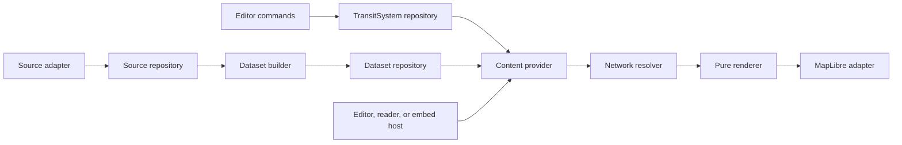

# Transit content migration implementation plan

For TransitMapper maintainers: use this plan to move the production editor,
reader, and embed onto the approved content architecture without turning a
working map into an unavailable one. Finish one checked phase and its stated
commit boundary before starting the next phase.

> **For agentic workers:** REQUIRED SUB-SKILL: Use
> `superpowers:subagent-driven-development` or `superpowers:executing-plans`
> to implement this plan task by task. Steps use checkbox (`- [ ]`) syntax for
> tracking.

**Goal:** Give every host one responsive, Line-first map surface over either
an editable TransitSystem or an immutable TransitDataset. Add portable Views
and reproducible revisions without making geography, MapLibre, or provider
syntax part of the content model.

**Architecture:** Four roots own different lifecycles: TransitSystem is
authored and mutable, Source records immutable external evidence,
TransitDataset records immutable normalized content, and View records a
portable content reference, query, and presentation. A host resolves content
into a bounded semantic network. The renderer projects that network into a
Line-first scene. The map adapter alone publishes the scene to MapLibre.

**Tech stack:** TypeScript, pnpm workspaces, Turborepo, Vitest, React,
MapLibre, Cloudflare Worker, D1, and R2.

The binding contracts are
[transit content architecture](../specs/2026-08-28-transit-content-architecture.md),
[transit data types](../specs/2026-08-28-transit-data-types.md), and
[map data and rendering boundaries](../specs/2026-08-28-map-data-rendering-boundaries-design.md).
Those contracts win when this plan and current code disagree.

## Decision and baseline

On August 30, 2026, the current branch contains a partial schema-v17
compatibility projection and an incomplete Line scene bridge. Neither reaches
production storage or all map hosts. The bridge only changes Network paint in
the editor. Diagram, viewer, embed, SVG, PNG, and static previews still use
per-Service geometry. The renderer package also imports MapLibre, map, and
Views packages. That leaves rendering, map publication, and host state coupled
in one package.

The previous work order was wrong. It put the visible Line-first recovery
behind Sources and Datasets. It also allowed pinned Views before immutable
authored revisions and operational snapshots existed. This plan fixes the map
first through the schema-v16 compatibility path. It then builds the immutable
content boundaries that Views require.

The following component diagram shows the target dependency flow. It shows
module responsibilities. It does not require a package for every box.

The migration has four non-negotiable boundaries.

1. No storage root, host route, renderer mode, or map driver represents a
   geographic product concept. A nationwide map is a View over a Dataset. A
   local map uses the same types.
2. Passenger Network and Diagram views render Lines. ServicePlans, Patterns,
   trips, schedules, and short turns cannot multiply permanent route paint.
   A Pattern appears separately only in an explicit editor overlay.
3. A failed, loading, superseded, or cancelled request keeps the last accepted
   scene interactive. The shell and controls render before document, map style,
   source, or content loading completes.
4. Provider rows, database rows, React state, MapLibre values, and renderer
   drafts stay private to their adapters. A public boundary carries only
   validated domain, transfer, API, or render contracts.

## Phase 1: Recover one Line-first scene across every map host

This phase fixes the visible harm before it changes storage. It uses the
existing schema-v16 system provider as a compatibility source of resolved
network facts. It does not introduce a Dataset or change a stored document.

The Network and Diagram views must show a normal transit map. One Line has one
passenger stripe on a shared span even when several ServicePlans or Patterns
occupy it. Different Lines remain distinguishable ordered stripes in one
casing. Infrastructure shows physical carriers. Editing a Pattern shows only
the selected Pattern as a transient overlay. The ordinary click target is a
Line, not a Service or Pattern.

### 1A: Make the Line scene a pure renderer entry

- [ ] Add a renderer entry that accepts `NetworkQueryResult` and a core
      `RenderPresentation`, then returns a `RenderScene`, Line hit bindings,
      and contributor metadata. It must import only `@transitmapper/core`.
- [ ] Move the shared RenderScene, patch, feature ID, and identity types into
      the dependency-leaf core render contract. Persisted v16 and v17 records
      must not import that contract.
- [ ] Keep exact carrier correspondence and topology overlap under
      `packages/renderer/src/line/`. Preserve the approved `line-overlap-v1`
      rules: a same-Line collapse needs membership plus exact carrier or proven
      topology correspondence. Coordinate proximity alone never creates a
      passenger identity.
- [ ] Add behavior tests under `packages/renderer/tests/line/` for one Line
      with many ServicePlans, two Lines on one carrier, a short turn, a
      temporary replacement ServicePlan under an existing Line, and a missing
      topology proof. The tests inspect scene identities and stripe counts, not
      generated filenames or feature ordering unrelated to the rule.
- [ ] Commit only the pure scene contract and its renderer tests.

**Exit:** The new entry has no MapLibre, React, map, Views, browser, editor, or
storage dependency. A same-Line scene has one logical Line span per proven
span.

### 1B: Use live query and filter values for Network and Diagram

- [ ] Make the web host provide current bounds, detail band, selected modes,
      and presentation to the compatibility provider. Remove the whole-world
      and persisted-viewport shortcuts from the Line-scene path.
- [ ] Requery and repack when mode filters change. A hidden mode removes its
      Line geometry rather than merely hiding an unrelated layer.
- [ ] Route both Network and Diagram through the pure Line scene. Diagram may
      use its layout geometry, but it keeps the same Line identity, hit target,
      filter behavior, and scene replacement rules.
- [ ] Add web and renderer tests that prove a mode toggle removes the correct
      Lines, a camera query does not expand to the whole system, and a Diagram
      scene does not fall back to per-Service occurrences.
- [ ] Capture desktop Network and Diagram screenshots with a dense shared
      corridor. They must show compact Lines, not parallel copies of one line.
- [ ] Commit the host integration separately from the pure scene entry.

**Exit:** Network and Diagram use the same Line-first visual language at every
zoom band. Overview hides individual stop labels and Street reveals them only
when they remain readable. A mode change never leaves stale route paint.

### 1C: Give viewer, embed, export, and previews the same scene

- [ ] Replace the legacy feature builders in viewer, embed, SVG, PNG, and
      static preview paths with the pure scene entry. Keep each host's chrome
      and capability set separate from scene construction.
- [ ] Resolve a route click to a `Line` in the viewer. Keep ServicePlan and
      Pattern details behind a concise labeled control in the Line inspector.
- [ ] Preserve one shared semantic focus protocol. A copyable link may focus a
      Line, Pattern, Stop, Station, or other transit entity. A named View does
      not store focus or selection.
- [ ] Add parity tests for one system rendered by editor, viewer, embed, SVG,
      and PNG. Assert equivalent Line IDs and geometry counts rather than SVG
      byte snapshots or MapLibre source IDs.
- [ ] Capture one reader and one embed screenshot. Neither may carry editor
      controls or a full-screen loading mask.
- [ ] Commit each host conversion as its own change.

**Exit:** A shared route looks the same to an editor, a reader, and an embed.
The embed is read-only because the host withholds mutation capabilities, not
because the map uses a different data model.

### 1D: Move map publication out of the renderer

- [ ] Move MapLibre drivers, source banks, layers, style recovery, and source
      settlement from `packages/renderer/` to `packages/map/`. The map adapter
      accepts core `RenderScene` values and never imports renderer internals.
- [ ] Move map presentation boundary types out of `@transitmapper/views` so
      `@transitmapper/map` depends only on core. Make `@transitmapper/views`
      depend on core and remain portable.
- [ ] Remove `@transitmapper/map`, `@transitmapper/views`, and `maplibre-gl`
      from `@transitmapper/renderer`. Keep `packages/workspace` independent of
      `packages/map`; web composes workspace and map.
- [ ] Test that a rejected or cancelled scene leaves the previous MapLibre
      source bank and hit index active. Test style recovery by replaying the
      last accepted scene without reprojecting user content.
- [ ] Commit the package move only after imports and Turbo graph edges prove
      the target dependency direction.

**Exit:** Renderer depends only on core. Map owns MapLibre. Views own no map
library state. A map style failure cannot erase the visible network.

## Phase 2: Complete the schema-v17 authored document boundary

This phase makes v17 an accepted authored value instead of an in-memory
projection. It does not replace schema-v16 loading until every v17 parser and
compatibility case passes.

### 2A: Repair the compatibility projection before extending it

- [ ] Restore verbatim migration of schema-v16 `groups` and other retained
      infrastructure records. The rendering contract requires their values and
      order to survive unchanged. Typed `NormalizedGroup.members` belongs to
      Dataset normalization, not to the v16 authored migration.
- [ ] Remove the unsupported `vehicle-kind` branch from `TransitEntityRef` and
      remove the migration inference that introduced it. A vehicle kind is a
      value record, not a portable transit entity reference.
- [ ] Keep the one Way-to-one Alignment compatibility mapping, same IDs,
      Stop-anchor conversion, Line-owned ServicePlan membership, Pattern
      derivation, schedule conversion, legacy aliases, and opaque source
      markers already required by the contract.
- [ ] Add tests that a Group value retains its old member IDs and order, an
      incompatible migration leaves the v16 document readable, and the
      migration never invents a SourceBinding from a legacy source marker.
- [ ] Commit this corrective compatibility change before parser work.

### 2B: Parse and validate v17 before any digest or storage write

- [ ] Add strict schema-v17 parsers in
      `packages/core/src/model/schema-v17-system/`. The parser validates root
      arrays, IDs, text, references, timestamps, geometry, cross sections,
      bounds, URL and digest values, and every ownership relationship.
- [ ] Reject dangling or duplicate Line-to-ServicePlan,
      ServicePlan-to-Pattern, ServicePlan-to-Schedule, Schedule-to-time-rule,
      Pattern-to-stop, Stop-to-Alignment, and source-binding relationships.
      Enforce zero or one Way owner for every Alignment. Reject a bare
      Alignment Pattern leg if a Way owns that Alignment.
- [ ] Keep unknown geometry explicit. An empty known Pattern path is invalid.
      The parser must not guess a lane, direction, grade, stop location,
      calendar, source citation, or external identity.
- [ ] Validate source bindings and import history: active bindings are unique
      by external identity and authored target; a bound Source has a citation;
      one-time uploads never create a binding; baseline hashes use the stated
      canonical inputs.
- [ ] Add focused parser tests under
      `packages/core/tests/model/schema-v17-system/`. Each test names a
      business rule and passes a semantic object, not a serialized fixture file.
- [ ] Commit parsing and validation separately from revision identity.

**Exit:** A v17 document either passes every structural and relationship rule
or produces a deterministic validation result. No storage adapter, renderer,
or host can bypass that boundary.

## Phase 3: Store immutable authored revisions and expose a v17 content path

This phase gives published and pinned system content a durable identity. It
comes before Views because a pinned system reference without a SystemRevision
is a lie.

- [ ] Add `SystemRevision` creation after strict parsing. Hash canonical
      `{ encodingVersion: 'transit-system-json-v1', schemaVersion: 17,
    system }` bytes for `contentDigest`. Create `id` from framed
      `system-revision-v1`, system ID, algorithm, and digest value. Do not put
      `createdAt` in either digest.
- [ ] Add a system revision repository and additive Worker migration. Publishing
      the same parsed semantic document twice returns the existing immutable
      revision and its original creation time.
- [ ] Add a v17 system content provider that resolves working and published
      system references into the common `ResolvedContentRef` and bounded
      network transfer. Keep the v16 provider as the fallback for an
      incompatible legacy document.
- [ ] Add tests for canonical deduplication, differing semantic content,
      immutable published reads, failed legacy migration fallback, and a pinned
      system reference that resolves through the v17 provider.
- [ ] Commit core revision identity, Worker storage, and provider wiring as
      separate changes.

**Exit:** The editor still edits only a mutable TransitSystem. Publishing
creates an immutable snapshot. A reader or later View can pin that snapshot
without loading a live working copy.

## Phase 4: Separate Sources from provider adapters and retain evidence

This phase creates `@transitmapper/sources` only after provider parsing moves
there. It does not invent a new package for storage or UI code.

- [ ] Define provider-neutral Source, SourceRevision, SourceFactArtifact,
      OperationalFactArtifact, ExternalRef, citation, validation,
      completeness, and artifact descriptor contracts under core source and
      transit modules. Connector URLs, credentials, refresh cadence, and retry
      settings stay in deployment configuration.
- [ ] Move GTFS, GTFS Realtime, OSM, archive decoding, and provider row types
      into `packages/sources/src/adapters/`. Adapters return either one
      validated provider-neutral batch or rejected validation with no batch.
      Raw GTFS and OpenStreetMap values never leave an adapter.
- [ ] Persist accepted and rejected SourceRevision metadata. Accepted planned
      revisions retain an exact canonical fact artifact. Rejected revisions
      retain final validation evidence but cannot build a Dataset.
- [ ] Validate complete and incremental fact chains, canonical sort order,
      byte digest, semantic digest, source relationship rules, and exact
      retained artifact identity. A historical build reads retained facts and
      never reruns an adapter.
- [ ] Add repository tests for accepted/rejected evidence, reproducible
      retained facts, and an advisory that cannot manufacture geometry or a
      timetable.
- [ ] Commit the pure adapter package, the immutable source repository, and
      the Worker persistence layer separately.

**Exit:** Source data has clear authority and immutable evidence. A rejected
feed is auditable but cannot leak partial facts into a map.

## Phase 5: Build immutable Datasets and bounded content delivery

This phase turns exact accepted source revisions into a normalized Dataset
without changing how the renderer asks for data.

- [ ] Implement the fixed builder policies: `normalize-v1`, `dataset-v1`,
      `external-identity-v1`, `reject-conflicts-v1`, and `pattern-match-v1`.
      The manifest records every exact input revision and policy version.
- [ ] Normalize source identity, deduplicate only canonically equal evidence
      under one identity, retain full provenance, and reject conflicts. Do not
      conflate two sources by names, codes, coordinates, paths, or stops.
- [ ] Enforce that GTFS shape evidence creates an Alignment only. A Dataset
      creates a Way only when a source proves complete physical infrastructure.
      Unknown geometry stays unknown instead of becoming a fake road or lane.
- [ ] Enforce Pattern membership through exact Line-to-ServicePlan and
      ServicePlan-to-Pattern links. Zero or several Line owners reject the
      build. Record Line order in the Dataset manifest rather than deriving it
      from cache chunks or provider arrival.
- [ ] Persist one canonical `DatasetNetworkArtifact` with complete provenance.
      Treat `DatasetCacheManifest` and chunks as rebuildable caches. A cache
      rebuild decodes the Dataset artifact and runs neither adapters nor the
      normalizer.
- [ ] Implement the common `ContentProvider` transfer: resolved content,
      coverage, stable Line order, chunks, same-Line semantic closure, and an
      opaque cursor bound to the concrete content and canonical query.
- [ ] Add worker resource routes for content descriptions, network pages,
      search pages, and entity detail pages. Wire contracts use
      `transit-network-v1`; they do not reuse D1 rows.
- [ ] Add tests for source conflict rejection, Alignment-only GTFS data,
      no cross-source conflation, artifact-only cache rebuild, query pagination
      order, cursor misuse, and unknown coverage.
- [ ] Commit normalization, repository/artifact storage, and bounded delivery
      as separate phases.

**Exit:** An authored system and a Dataset return the same semantic network
transfer shape. The renderer cannot discover which root supplied it.

## Phase 6: Build reproducible operational snapshots before Views

This phase models real temporary operations without treating service alerts or
vehicle positions as invented network truth.

- [ ] Normalize planned and realtime evidence separately. A realtime Source
      must name exactly one planned Source through `updates`. It cannot target
      a different planned source or create a physical Way.
- [ ] Persist `OperationalFactArtifact` chains. Full revisions may clear prior
      claims, unknown revisions never infer omitted claims, and deltas name one
      exact base revision. Reject missing bases, cycles, cross-source deletes,
      and noncanonical mutation order.
- [ ] Materialize immutable OperationalSnapshots against one exact
      DatasetRevision. Record `operational-normalize-v1`,
      `operational-precedence-v1`, `operational-latest-v1`, exact source
      revisions, and deterministic source priority. Arrival order must never
      decide a conflict.
- [ ] Apply the selected snapshot in the network resolver before it produces a
      RenderScene input. A stale or unavailable snapshot falls back to planned
      Dataset service. It never erases the planned network.
- [ ] Model a Red Line closure in three evidence grades: a known temporary
      bus ServicePlan under Red Line; a distinct Line if the publisher gives a
      distinct passenger identity; or an Advisory alone when no path is known.
      Vehicle positions and predictions remain outside this phase.
- [ ] Add tests for full, unknown, and delta materialization; precedence;
      pinned snapshot replay; known shuttle geometry; and advisory-only
      disruption with no claimed route.
- [ ] Commit operational artifact handling, snapshot materialization, and
      effective-network resolution separately.

**Exit:** Temporary service changes the effective map only where the source
proves it. A pinned Dataset plus snapshot and fixed time reproduces one
effective-service state.

## Phase 7: Move Views and host chrome onto portable content references

This phase creates the product feature that enables a national, regional,
local, or international map without embedding any of those concepts in code.

- [ ] Add strict `ContentRef`, `ResolvedContentRef`, `ViewQuery`,
      `MapPresentation`, `NamedViewV2`, and `ViewLinkStateV2` parsers to core
      and `packages/views`. A named View has content, query, and presentation.
      A copied link may add semantic focus.
- [ ] Resolve every `latest` reference before cache lookup. A pinned System
      names `SystemRevision`. A pinned Dataset names `DatasetRevision`,
      `OperationalSnapshot`, and a fixed service instant. Reject a snapshot
      from another Dataset revision.
- [ ] Convert legacy Service focus only after content resolution using
      `LegacyServiceAlias`. Persist neither legacy focus nor selection in a
      migrated View record.
- [ ] Let the host choose capabilities. The editor exposes mutation. The
      reader exposes browse, filters, details, and sharing. The embed exposes
      an allowed reduced set. All hosts mount the same map surface and content
      contract.
- [ ] Keep interface copy terse. Labels state the available action. Complex
      behavior gets an expanded MD3-style help surface or tooltip. Remove
      permanent prose that explains controls already visible on screen.
- [ ] Add parser, route, and browser tests for hosted System and Dataset Views,
      pinned replay, legacy links, editor/read-only isolation, and an embed
      with no authoring controls.
- [ ] Capture editor, reader, and embed screenshots from the same saved View.
- [ ] Commit the core/View migration, Worker route migration, and host chrome
      changes separately.

**Exit:** The app has one map product surface. Saved views decide content and
presentation. Hosts decide which actions people may take.

## Phase 8: Replace direct managed imports with reviewed content imports

This phase changes managed update authority only after the source and Dataset
paths exist.

- [ ] Keep one-time file uploads as authored imports with a content digest and
      supplied citation. They never create a SourceBinding or automatic update
      path.
- [ ] Build a reviewable import plan from one concrete DatasetRevision. Copy
      approved facts into TransitSystem, record citation, import history, and
      stable external bindings, then retain a baseline for future comparison.
- [ ] Present a source update as a review. It may propose changes but cannot
      overwrite a local authored edit. A user accepts or rejects each planned
      change through ordinary editor commands.
- [ ] Keep import work cancellable and cooperative. Show progress within
      250 ms. Commit a completed candidate only if its base document identity
      still matches. An import never replaces the map with partial or raw
      provider geometry.
- [ ] Add tests for one-time upload authority, managed binding uniqueness,
      concurrent local edits, cancellation, no partial publication, and a
      reviewed temporary-service import.
- [ ] Capture an import-progress screenshot that shows the prior accepted map
      still usable.
- [ ] Commit import planning, editor presentation, and source update review
      separately.

**Exit:** The source update workflow has provenance and explicit user control.
An import cannot freeze the browser or silently rewrite authored work.

## Phase 9: Enforce responsiveness, cache, retention, and release gates

This phase adds gates only after the behavior exists. It measures user
interactivity rather than celebrating bundle size.

- [ ] Measure five desktop runs on Fast 4G with four-times CPU throttling.
      Record shell paint, first accepted input, first meaningful geometry,
      input-to-next-paint p95, unexpected main-thread work, and import
      progress/cancellation timing.
- [ ] Enforce these maximums: editor shell 500 ms and first input 1,000 ms;
      reader shell 400 ms and first input 750 ms; embed shell 250 ms and first
      input 750 ms; editor geometry 2,000 ms; reader geometry 1,500 ms; embed
      geometry 1,250 ms; input-to-next-paint p95 50 ms; unexpected tasks 50
      ms; cumulative startup long tasks 300 ms for editor and 200 ms for
      reader/embed. Import progress appears within 250 ms and cancellation
      stops new commits within 100 ms.
- [ ] Split projection, cache decode, and large import preparation into
      cancelable worker or frame-bounded work. Preserve pan, click, selection,
      and cancellation between slices. A browser unresponsive dialog is a
      release-blocking failure.
- [ ] Assert no full-screen blocking loader during document loading, map style
      recovery, source resolution, import, or scene replacement. The shell
      stays actionable and the last accepted scene remains visible.
- [ ] Enforce Turbo package boundaries through normal workspace dependencies
      and declared `build` tasks. An unchanged build restores cache entries. An
      editor-only change must not rebuild stable core, renderer, map, or Views
      packages. Do not add a custom TypeScript build runner or literal output
      filename test.
- [ ] Implement retention and recovery: retain latest roots, every dependency
      of retained or recoverable pinned Views, accepted Source revisions for
      30 days, previous two Dataset revisions for at least 30 days, rejected
      Source revisions and unreferenced operational snapshots for 7 days, and
      expiring View dependencies through expiry plus 7 days. Run recovery
      against a staged cleanup before deleting any retained artifact.
- [ ] Run browser smoke evidence for editor, reader, embed, public sharing,
      offline startup, style recovery, and large import before a public route
      cutover. Treat one failed interaction or blank map as a release blocker.
- [ ] Commit performance gates, retention, and release checks only after their
      measured behavior is real.

**Exit:** Every host stays usable while it loads, filters, pans, imports,
publishes, or recovers. Independent modules cache through Turbo without hiding
an invalid dependency edge.

## Completion audit

The migration is complete only when all of these statements have current code
and browser evidence:

| Requirement                | Proof                                                                                                      |
| -------------------------- | ---------------------------------------------------------------------------------------------------------- |
| Four storage roots only    | Core and repository tests reject product roots beyond TransitSystem, Source, TransitDataset, and View.     |
| One passenger map          | Editor, reader, embed, SVG, PNG, and previews project the same Line-first scene from equivalent content.   |
| No geographic product mode | A wide-area View and a local View use the same ContentRef, query, renderer, and host code paths.           |
| Reproducible content       | A pinned SystemRevision or DatasetRevision plus snapshot and instant resolves without a live source fetch. |
| Clear source authority     | Retained immutable artifacts reproduce a Dataset; rejected evidence cannot create one.                     |
| Honest temporary service   | A source may add a proven replacement service, a new Line, or an Advisory. It cannot invent a path.        |
| Portable Views             | Saved View records contain only content, query, and presentation. Hosts own chrome and permissions.        |
| Responsive interaction     | The stated latency gates pass while a user pans, selects, filters, imports, and recovers a map style.      |
| Efficient builds           | Turbo cache and dependency evidence show the package graph without a custom build script.                  |

Do not call this complete because typechecking, a clean build, or one screenshot
passes. The release evidence must show each behavior at the boundary where it
can fail.
