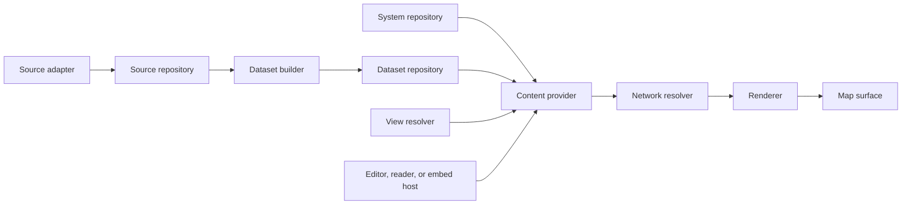

# Transit content migration plan

For TransitMapper maintainers: use this plan when changing source-backed
transit data, the map content boundary, saved Views, or the existing editor
import path. Finish the current phase, its behavior checks, and its visual
proof before starting another phase.

> **For agentic workers:** Work one phase at a time. Do not start a package
> extraction, a data migration, and a renderer change in the same commit.
> Re-read the three binding documents before changing their boundary.

**Goal:** Move TransitMapper from a schema-v16 editor document with direct
GTFS imports to the approved content model without breaking editing, sharing,
embedding, or map responsiveness.

**Architecture:** TransitSystem remains the mutable authored document. Source
and TransitDataset own immutable external evidence and normalized content.
View stores only a content reference, query, and presentation. Both authored
and source-backed content resolve to the same bounded network transfer before
the renderer creates a Line-first RenderScene.

**Tech stack:** TypeScript, pnpm workspaces, Turborepo, Vitest, React,
MapLibre, Cloudflare Worker, D1, and R2.

**Binding documents:**

- docs/superpowers/specs/2026-08-28-transit-content-architecture.md
- docs/superpowers/specs/2026-08-28-transit-data-types.md
- docs/superpowers/specs/2026-08-28-map-data-rendering-boundaries-design.md

## Current state and decision

The August 29, 2026 baseline is commit d5aff139. The current application
stores schema-v16 TransitSystem documents. Managed GTFS import creates a Way
for every shape and commits each batch into that document before the
reconciliation Worker merges compatible corridors.

The Network renderer already takes a Line-first route. It replaces the legacy
per-Service source with projectLineScene, and it emits one stripe per Line on
a shared carrier. Infrastructure and explicit Pattern editing still use
per-Service geometry by design.

The old execution plan remains a record of the earlier workspace refactor. It
is not the implementation plan for this architecture. In particular, do not
create a custom TypeScript build helper. Turbo owns package build ordering and
caching through normal workspace dependencies and its existing ^build edge.

The existing packages have useful names and remain in place. Create
@transitmapper/sources only when provider adapters move out of core. Do not
create packages to mirror every box in the architecture diagram.

## Non-negotiable rules

1. The only product-level storage roots are TransitSystem, Source,
   TransitDataset, and View.
2. Geographic scope is content and query data. No type, route host, renderer,
   or map driver receives a geographic-scope mode.
3. A temporary service is an ordinary ServicePlan, Pattern, Schedule, and
   OperationalChange under a Line. It is not a fifth storage root.
4. A Line owns the passenger identity. A ServicePlan owns operations. A
   Pattern owns directional travel and stop calls. A Schedule owns time.
5. Raw provider values stop at source adapters. Database rows, View wire
   values, editor commands, and MapLibre objects do not enter the renderer.
6. A View references content. It never embeds transit records, permissions,
   selection, focus, MapLibre identifiers, or application chrome.
7. The map keeps its last accepted scene interactive while a new query,
   filter, import, or renderer generation is pending.
8. Only visible Line spans and physical carriers control permanent map feature
   count. Trips, schedules, and Pattern variants cannot multiply permanent
   paint or hit features.

The following component diagram is a component diagram. It shows module
responsibilities, not a required package split.

## Work order

The phases below are ordered by user harm and dependency. A phase may not
start because an adjacent phase looks easy. Each phase has one mergeable
outcome and one rollback boundary.

### Phase 1: Publish GTFS imports only after the candidate network is coherent

This phase fixes the visible import failure first. It does not introduce
Sources or a new persistence schema.

**Files and ownership:**

- Modify apps/web/src/import/run-gtfs-import.ts to accumulate parsed batches
  outside the live editor document.
- Modify apps/web/src/editor/store/contracts/import-routing-commands.ts and
  apps/web/src/editor/store/commands/import-commands.ts to accept one
  reconciled candidate snapshot atomically.
- Create packages/core/src/model/gtfs-import-staging.ts for pure batch
  accumulation and final candidate assembly. It must not import React,
  Workers, MapLibre, or editor state.
- Modify apps/web/src/import/reconcile-gtfs.ts only if the final candidate
  needs a transfer-safe Worker input.
- Extend apps/web/tests/import/run-gtfs-import.test.ts and add
  packages/core/tests/model/gtfs-import-staging.test.ts.
- Extend packages/renderer/tests/line/line-scene.test.ts with the
  same-Line, same-carrier assertion.

**Interfaces:**

- GtfsImportDraft contains the import target system ID, the base document
  identity, accumulated GTFS pieces, and the imported Service IDs.
- appendGtfsImportBatch(draft, pieces) returns a new draft without changing a
  TransitSystem.
- finalizeGtfsImport(baseSystem, draft) returns one candidate TransitSystem
  that reconciliation can process.
- applyCompletedGtfsImport accepts the base system identity and the
  reconciled candidate. It commits only when the base identity still matches.

**Steps:**

- [ ] Add a failing test that receives several GTFS batches and proves the
      live editor document identity does not change before final acceptance.
- [ ] Add a failing test that cancellation leaves the document unchanged and
      discards the candidate.
- [ ] Add a failing test that an edit during import rejects the stale
      candidate, retains the edit, and retries finalization against the current
      document rather than publishing partial geometry.
- [ ] Add a renderer behavior test with two Services under one Line on one
      carrier. The Network scene must contain one casing and one Line stripe. It
      must not inspect generated file names or hash values.
- [ ] Implement the pure draft accumulator and replace per-batch
      applyGtfsImportBatch calls with final candidate acceptance.
- [ ] Keep the existing progress control and cancellation action. Progress
      must update within 250 ms of parse start, but it must never replace the
      map with un-reconciled route geometry.
- [ ] Capture one desktop import screenshot while a candidate is assembling
      and one after acceptance. The first shows the prior map and progress. The
      second shows the completed Line-first network.
- [ ] Commit this phase alone.

**Exit gate:** Import never exposes raw per-shape geometry to Network view.
The user can pan, select, and use controls while it runs. Cancellation and a
concurrent edit preserve the last accepted document.

**Rollback:** Revert the atomic publication commit. No stored document format
or public API changes in this phase.

### Phase 2: Establish the schema-v17 authored compatibility boundary

This phase introduces the target authored vocabulary without pretending that a
schema migration acquired a Source. It keeps schema-v16 reads and current
shares working through one explicit compatibility adapter.

**Files and ownership:**

- Add schema-v17 authored records under packages/core/src/transit/ and
  packages/core/src/model/schema-v17-system/.
- Keep scalar and shared structural types in
  packages/core/src/transit/value-types.ts.
- Add the v16-to-v17 compatibility adapter beside
  packages/core/src/network/schema-v16-system-provider.ts.
- Add parsers, canonical serialization, and migration tests under
  packages/core/tests/transit/ and packages/core/tests/model/.
- Update docs/development/reference/project-structure.md when the new
  directory becomes real.

**Steps:**

- [ ] Define Alignment, Way, Line, ServicePlan, Pattern, Schedule, Calendar,
      Trip, FrequencyRule, Stop, Station, SourceCitation, SourceBinding,
      ImportHistoryEntry, LegacyServiceAlias, and LegacySourceReference exactly
      in the target family.
- [ ] Keep Line.servicePlanIds authoritative. Do not add
      ServicePlan.lineId.
- [ ] Convert each schema-v16 Service to one compatibility ServicePlan and
      preserve every legacy Service ID through LegacyServiceAlias.
- [ ] Add behavior tests for a Line with a temporary rail and bus
      ServicePlan, for an unknown Pattern path, and for a v16 share whose Service
      focus resolves to a Line after content resolution.
- [ ] Add canonical schema-v17 parsing and immutable SystemRevision digest
      tests. Reject provider rows, database records, renderer values, and
      MapLibre values at this boundary.
- [ ] Write a one-way schema-v16-to-v17 migration. Do not edit a published
      migration or overwrite an existing document on load.
- [ ] Commit the compatibility boundary before moving source adapters.

**Exit gate:** The editor can read a migrated document, a renderer can receive
resolved v17 facts, and old documents, undo records, and share links remain
readable through compatibility records.

**Rollback:** Continue serving schema-v16 documents through the existing
provider. Schema-v17 records remain additive until a later cutover.

### Phase 3: Move provider parsing into Sources and persist immutable evidence

This phase separates provider authority from authored editing. It creates the
only new package in this plan because GTFS, GTFS Realtime, OSM, archive
decoding, and provider-specific types now have a distinct stable boundary.

**Files and ownership:**

- Create packages/sources with normal package scripts: lint, typecheck,
  verify, and build when it emits dist.
- Move GTFS and OSM provider parsing from packages/core/src/model into
  packages/sources/src/adapters/.
- Keep provider-neutral Source, SourceRevision, SourceFactArtifact,
  OperationalFactArtifact, ExternalRef, and SourceCitation contracts in
  packages/core/src/source/.
- Add Worker repositories and append-only migrations in apps/worker for Source
  metadata and bounded revision metadata. Put retained artifacts in R2.
- Add focused adapter and repository tests under their owning tests trees.

**Steps:**

- [ ] Define Source and SourceRevision with attribution, capabilities,
      relationship, digest, validation, completeness, and adapter version.
- [ ] Make each accepted adapter result produce one nonempty
      provider-neutral fact batch. Make a rejected result produce no batch.
- [ ] Store raw artifact descriptors and recoverable fact artifacts by digest.
      Keep endpoints, credentials, refresh schedules, and retry policy outside
      portable Source values.
- [ ] Require stable ExternalRef identity before a managed import can create
      a SourceBinding. A revision-local ID remains provenance only.
- [ ] Add tests that a historical Dataset build decodes retained facts without
      rerunning an adapter, and that an advisory cannot manufacture a path or
      timetable.
- [ ] Add dependency checks that sources imports core only and never imports
      renderer, map, React, workspace, or web.
- [ ] Use normal Turbo package dependencies and ^build. Do not add a package
      build runner, hash comparison build, or source-copy wrapper.
- [ ] Commit the package and immutable source boundary separately from Dataset
      normalization.

**Exit gate:** A managed source revision is reproducible from retained
artifacts. Provider syntax cannot leak into the editor, renderer, View, or
database-facing API.

**Rollback:** Keep the direct schema-v16 import path available until the
Dataset-backed import cutover in Phase 6.

### Phase 4: Build immutable Datasets and a bounded content provider

This phase creates the source-backed read path. It does not give the renderer
storage or acquisition responsibilities.

**Files and ownership:**

- Add ContentRef, ResolvedContentRef, DatasetRevision,
  DatasetNetworkArtifact, DatasetCacheManifest, OperationalSnapshot,
  normalized transit facts, and provenance under packages/core/src/transit/
  and packages/core/src/network/.
- Add Dataset builder policy under packages/core/src/source/ or a focused
  core normalization module. It must remain provider-neutral.
- Add source, dataset, and content repositories in apps/worker.
- Add the four versioned resource routes in apps/worker.
- Add a dataset content-provider client in apps/web that implements the
  core ContentProvider port.
- Add Worker, core, and web behavior tests under their current tests trees.

**Steps:**

- [ ] Normalize exact accepted SourceRevision IDs with the fixed Version 1
      policies: normalize-v1, dataset-v1, external-identity-v1,
      reject-conflicts-v1, and pattern-match-v1.
- [ ] Reject conflicting normalized facts. Collapse canonically equal facts
      while retaining all provenance. Never infer equivalence across Sources from
      names, codes, coordinates, paths, or stop sequences.
- [ ] Store one immutable canonical DatasetNetworkArtifact and complete
      provenance graph per DatasetRevision. Store only bounded metadata in D1.
- [ ] Define ContentRef and ResolvedContentRef before the provider. Create
      dataset-chunk-json-v1 behind ContentProvider. The provider accepts bounds,
      service time, modes, filters, detail, and cursor. It returns coverage, line
      order, chunks, and an opaque next cursor.
- [ ] Resolve latest content references to concrete revisions before building
      cache keys. Reject a cursor reused with another reference or query.
- [ ] Return same-Line semantic carrier closure for selected visible carriers.
      Do not return unrelated carriers or Lines merely because they are nearby.
- [ ] Add tests for pagination-order independence, cache rebuild without
      adapters, explicit unknown coverage, and an aborted query that cannot
      publish a partial accepted scene.
- [ ] Commit Dataset storage and content-provider delivery separately.

**Exit gate:** A bounded query of a Dataset and a query of an authored System
return the same resolved network transfer shape. The renderer cannot tell
which storage root supplied it.

**Rollback:** Dataset routes and repositories are additive. Existing authored
systems and share routes remain unchanged.

### Phase 5: Complete the shared Line-first rendering contract

This phase moves every passenger-facing surface onto the same resolved
Line-first scene. It does not change the editor's explicit Pattern tools.

**Files and ownership:**

- Keep Line span, bundle, scene, diff, and identity work in packages/renderer.
- Keep shared RenderScene, patch, feature ID, and identity protocols in a
  dependency-leaf core contract module.
- Keep MapLibre source banks, layers, camera, and hit testing in packages/map.
- Keep Pattern overlays and editing gestures in apps/web/src/editor/.
- Add renderer and map behavior tests under their owning tests trees.

**Steps:**

- [ ] Remove renderer dependencies on map and views. Renderer receives only
      core resolved-network and presentation contracts, then exposes a pure
      RenderScene and identity index to its host.
- [ ] Make Network projection collapse sibling Patterns from one Line on each
      shared Alignment or resolved Way lane. Keep separate Lines as separate
      ordered stripes inside one casing.
- [ ] Keep Infrastructure projection distinct by physical carrier. A bare
      Alignment or unresolved lane defers Infrastructure detail instead of
      guessing a lane.
- [ ] Make ordinary map hits resolve to a Line. When wide stripes overlap,
      choose the nearest stripe or open a labeled Line chooser. Do not descend to
      Service from ordinary selection.
- [ ] Keep ServicePlan and Pattern geometry transient and editor-only. It
      appears only after the user explicitly enters the relevant editing task.
- [ ] Keep the last accepted RenderScene and source-bank state during
      resolution, projection, style recovery, or cancellation. Publish one
      complete replacement bundle atomically.
- [ ] Add tests for mode filtering, temporary bus replacement under a rail
      Line, non-overlapping service branches, query clipping, and no permanent
      route multiplication from Trips, Schedules, or Pattern variants.
- [ ] Capture desktop and mobile Network, Infrastructure, explicit Pattern
      editing, and temporary-service screenshots. Remove explanatory empty-state
      copy where the controls already state the task.
- [ ] Commit each renderer/map boundary separately.

**Exit gate:** The normal map looks like a transit map. Passenger Lines are
readable, shared corridors are compact, and operational variants do not turn
into stacks of identical routes.

**Rollback:** Retain the last accepted scene protocol. Revert a projection
slice without changing content storage.

### Phase 6: Move Views and hosts onto ContentRef

This phase makes a saved View portable across authored and source-backed
content. The editor, full reader, and embed remain different hosts over one
map surface and one content contract.

**Files and ownership:**

- Update packages/views contracts, parser, URL state, and tests.
- Update apps/worker View resources and migration only when the V2 record is
  ready to persist.
- Update apps/web viewer, embed, share, and editor host adapters.
- Update apps/web tests for reader, embed, routes, and host capability
  boundaries.

**Steps:**

- [ ] Adopt the core ContentRef union for TransitSystem and TransitDataset.
      Keep revision and operational selection explicit in every View parser and
      API resource.
- [ ] Define ViewQuery with live-or-instant service time, all-or-only modes,
      and filters. An empty only-mode list means no modes. Let the map host combine
      this portable query with visible bounds and derived detail as NetworkQuery.
- [ ] Define NamedViewV2 and ViewLinkStateV2. Persist presentation and query.
      Keep focus only in copied link state.
- [ ] Convert a legacy Service focus after content resolution through
      LegacyServiceAlias. Do not persist a legacy focus in a migrated View row.
- [ ] Make the host choose capabilities. The editor exposes mutation, the
      reader exposes browse and share, and the embed exposes the permitted
      reduced controls. None gets a geography-specific branch.
- [ ] Add behavior tests for pinned Dataset and OperationalSnapshot replay,
      local and public Views, old share routes, embed isolation, and hostile
      View input.
- [ ] Commit View contract migration separately from route cleanup.

**Exit gate:** A View can open either content root, reproduce a pinned state,
and use the same map surface without importing editor state or MapLibre state.

**Rollback:** Continue decoding current View records and current share routes
until one stable release proves the V2 reader and embed.

### Phase 7: Replace direct managed imports and add operational content

This phase makes a reviewed Dataset import the only managed update path. It
also adds scheduled and structured temporary-service evidence without
inventing unproved routes.

**Files and ownership:**

- Update the web import host and inspector surfaces.
- Add source-backed import planning and provenance handling in core and
  Worker repositories.
- Add operational normalizer and resolver work in core and Worker
  repositories.
- Add reader and inspector tests for Line, ServicePlan, Pattern, Advisory,
  and OperationalChange details.

**Steps:**

- [ ] Replace direct managed GTFS document mutation with a reviewed import
      plan from a concrete DatasetRevision. One-time file uploads remain authored
      imports with a digest and citation, not active Source bindings.
- [ ] Copy accepted facts into TransitSystem and record SourceBinding,
      SourceCitation, and ImportHistoryEntry. A later source update may offer a
      review. It cannot overwrite a local edit.
- [ ] Resolve Calendars, Schedules, and OperationalChanges before rendering.
      Keep GTFS Realtime, advisory, and planned source authority separate.
- [ ] Model a Red Line closure with either known temporary bus ServicePlans
      under Red Line, a replacement Line when the publisher gives it a new
      identity, or an Advisory alone when no route evidence exists.
- [ ] Show Line details first. Place ServicePlan, Pattern, schedule, and
      temporary-operation details behind concise labeled controls or an expanded
      helper. Do not use self-referential instructional paragraphs.
- [ ] Add behavior and visual tests for each evidence level. Verify that
      unknown geometry never paints as a claimed route.
- [ ] Commit content migration and operational UI separately.

**Exit gate:** A managed source refresh has clear authority, provenance, and
review behavior. A temporary shuttle changes ordinary operations without
creating an architectural exception.

**Rollback:** Preserve the source-backed Dataset revision and authored
document separately. Reverting an import presentation change cannot destroy
either.

### Phase 8: Enforce performance, cache, and release gates

This phase proves user-facing responsiveness. It does not substitute bundle
size for interaction measurements.

**Files and ownership:**

- Update existing performance scenarios and launch-gate tests under
  apps/web/src/perf and apps/web/tests/perf.
- Update dependency and Turbo task-graph checks only where a real package
  boundary was introduced.
- Update docs/development/how-to/measure-performance.md and project structure
  documentation with implemented, not proposed, ownership.

**Steps:**

- [ ] Measure five desktop runs on Fast 4G with four-times CPU throttling.
      Record shell paint, first accepted input, first meaningful geometry,
      input-to-next-paint p95, and unexpected long-task time.
- [ ] Enforce these maximums: editor shell 500 ms, editor first input
      1,000 ms, viewer shell 400 ms, viewer first input 750 ms, embed shell
      250 ms, embed first input 750 ms, editor geometry 2,000 ms, viewer
      geometry 1,500 ms, embed geometry 1,250 ms, input-to-next-paint p95
      50 ms, and no unexpected main-thread task over 50 ms.
- [ ] Enforce import progress or first batch within 250 ms and cancellation
      stopping new commits within 100 ms.
- [ ] Prove an unchanged Turbo build restores every declared package task
      from cache. Prove an editor-only change does not rebuild core, views,
      renderer, or map.
- [ ] Use normal package build tasks and Turbo dependencies. Do not add a
      custom build orchestrator, synthetic hash comparison build, or literal
      output-filename test.
- [ ] Run production route and offline-startup smoke checks after each public
      route cutover. Treat a browser failure as release-blocking evidence.
- [ ] Commit only the gate changes that measure a completed behavior.

**Exit gate:** The application remains responsive during startup, import,
filtering, selection, editing, and scene replacement. Stable packages cache
independently without hiding a broken dependency edge.

## Completion audit

The migration is complete only after a maintainer can prove every row below
from current code and runtime evidence.

| Requirement                                     | Evidence                                                                                                         |
| ----------------------------------------------- | ---------------------------------------------------------------------------------------------------------------- |
| Four storage roots only                         | Core parser and repository tests reject an extra root or provider state in TransitSystem                         |
| Authored and Dataset content share one transfer | Content-provider contract tests run against both roots                                                           |
| No geographic product mode                      | Dependency and route-host tests cover broad and bounded View content through the same ContentRef union           |
| Line-first passenger map                        | Renderer and browser screenshots show one stripe per Line on each shared carrier                                 |
| Explicit operational detail                     | Inspector tests show ordinary selection stays at Line and Pattern tools require an explicit task                 |
| Source reproducibility                          | A Dataset rebuild reads retained source facts without an adapter run                                             |
| Portable Views                                  | V2 parser, migration, reader, and embed tests restore only reference, query, presentation, and copied-link focus |
| Interactive replacement                         | Browser performance audit records accepted input and retained last scene during import and query changes         |
| Efficient builds                                | Turbo graph and cache evidence proves the declared package boundaries without a custom build runner              |

Do not mark the migration complete from passing typechecks, a clean build, or
one screenshot. The evidence must cover the stated behavior at the boundary
where it can fail.
