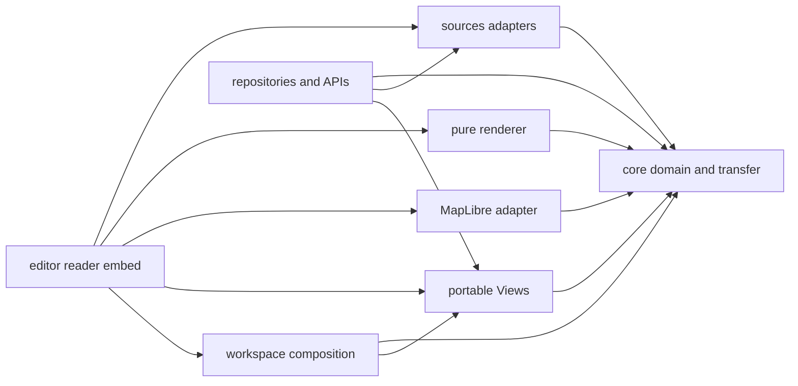

# Transit Content Remaining Work Implementation Plan

> **For agentic workers:** REQUIRED SUB-SKILL: Use
> `superpowers:subagent-driven-development` or `superpowers:executing-plans`
> to implement this plan task by task. Steps use checkbox (`- [ ]`) syntax for
> tracking.

**Goal:** Finish the approved transit-content and Line-first rendering
architecture from the current branch without redoing completed work or adding
product-specific geography to the domain model.

**Architecture:** A host resolves a mutable authored System or an immutable
Dataset through one content-provider contract. The renderer turns the resolved
semantic network into a Line-first `RenderScene`. The map package alone
publishes that scene to MapLibre. Views store portable content, query, and
presentation values.

**Tech Stack:** TypeScript, pnpm workspaces, Turborepo, Vitest, React,
MapLibre, Cloudflare Worker, D1, and R2.

**Spec:** The following three files are binding. They override this plan when
wording differs:

- `docs/superpowers/specs/2026-08-28-transit-content-architecture.md`
- `docs/superpowers/specs/2026-08-28-transit-data-types.md`
- `docs/superpowers/specs/2026-08-28-map-data-rendering-boundaries-design.md`

## Global constraints

- Work on `codex/transit-content-provider`. The draft pull request is #139.
- Treat `690ace2b6d73828c6e925e76c46b4a17e8b9fb61` as the implementation
  baseline. The commit changes the pure Line-scene boundary to use core
  `RenderPresentation` and adds scene-level short-turn and temporary-plan
  tests.
- Finish one task, run its focused proof, and commit it before starting the
  next task. Do not bundle cleanup from a later phase into an earlier commit.
- Preserve the existing map while new content resolves. No task may introduce
  a full-screen blocking loader or make selection, pan, zoom, or cancellation
  wait for a projection or import.
- Network and Diagram paint public Lines. They do not paint complete
  ServicePlan or Pattern occurrences. A Pattern may appear separately only in
  the explicit editor overlay.
- Different Lines remain distinct stripes. Same-Line Patterns collapse only
  through exact carrier identity or the approved topology proof. Coordinate
  distance alone never merges transit identity.
- Do not add a geographic mode, route, renderer branch, storage root, or
  content kind. Geographic scale is a query and presentation concern.
- Provider rows, D1 rows, MapLibre values, React state, worker messages, and
  renderer drafts stay private to their adapters.
- Use Turbo's normal package tasks and cache graph. Do not add a custom
  TypeScript package builder.
- Do not write tests against generated filenames, hashed asset names,
  incidental feature order, or private MapLibre source names.
- Use at most two workers for local tests and builds.
- Use only declared commit scopes. Do not invent `sources`, `views`, or
  another scope in a commit message. Add a scope to the repository policy in a
  separate deliberate change if package ownership requires one.
- Every agent-assisted commit uses a message file with `git commit -F` and
  contains `Co-Authored-By: Codex <noreply@openai.com>`.

## Current state

The branch contains more than Phase 1 work. Do not redo these pieces:

- Core owns the portable content-reference, network-query, resolved-network,
  render-scene, patch, and identity contracts.
- Renderer contains the `line-overlap-v1` implementation and the pure
  `projectResolvedLineScene` entry.
- The pure Line scene now accepts `NetworkQueryResult` and
  `RenderPresentation`. Tests cover shared carriers, short turns, and a
  temporary ServicePlan under one Line.
- Schema-v16 migration preserves Groups, opaque legacy source values, Line
  ownership, ServicePlan and Pattern derivation, stop-call order, and
  incompatible-document fallback.
- The schema-v17 parser validates structural, passenger, and infrastructure
  relationships. It does not yet validate every provenance relationship.
- Core creates stable `SystemRevision` identities. The Worker stores and
  publishes immutable System revisions through migration
  `0010_system_revisions.sql`.

The following component diagram shows the dependency order for the remaining
work. Every arrow points toward a dependency.

## Task 1: Finish live Line-scene integration

This task completes Phase 1B. It must produce one committed live editor path
before any read-only host conversion begins.

**Files:**

- Modify: `packages/renderer/src/line/line-scene.ts`
- Modify: `packages/renderer/src/workers/feature-projection-worker-entry.ts`
- Modify: `packages/renderer/src/render-visibility.ts`
- Modify only as required: `apps/web/src/map/editor-map-driver.ts`
- Test: `packages/renderer/tests/line/line-scene.test.ts`
- Test: `packages/renderer/tests/feature-projection-worker.test.ts`
- Test: `apps/web/tests/editor/document-map.test.ts`

**Interfaces:**

- Consume `createSchemaV16SystemProvider(system)`, `NetworkQuery`,
  `RenderPresentation`, and `projectResolvedLineScene(...)`.
- Preserve `RenderScene` as the only accepted-scene value.
- Do not expose the schema-v16 provider through the pure renderer entry.

- [ ] Trace the production editor request from the current map presentation
      through `feature-projection-worker-entry.ts`. Delete any live fallback
      that uses `WORLD_QUERY` or the persisted document viewport.
- [x] Build `NetworkQuery.bounds` from the current render bounds. Forward the
      current selected modes and service time. Derive the query detail band
      through the existing render-tier contract instead of hard-coding
      `district`.
- [x] Make Network and Diagram request the Line scene. Keep Diagram layout
      geometry while retaining the same Line identity, mode behavior, and hit
      target.
- [x] Requery on a mode change. Replace casings and stripes atomically after
      the new scene settles. Keep the prior accepted scene after rejection,
      cancellation, or supersession.
- [x] Add a failing test in the listed renderer tests for current bounds, mode
      replacement, Diagram Line identity, and accepted-scene retention. Run
      that test before implementing the corresponding behavior.
- [x] Run the focused renderer and web tests with `--maxWorkers=2`.
- [ ] Start the production build locally. Capture Network and Diagram desktop
      screenshots over the same dense corridor. Reject the task if one Line
      appears as repeated operational stripes.
- [x] Commit with the subject
      `chore(renderer): Resolve Line scenes from the live map query`.

## Task 2: Convert reader and embed to the shared Line scene

This task completes the interactive-host half of Phase 1C. The reader and
embed keep different chrome, but they use the same semantic scene as the
editor.

**Files:**

- Modify: `apps/web/src/viewer/viewer-document-map.ts`
- Modify: `apps/web/src/viewer/viewer-map-surface.tsx`
- Modify: `apps/web/src/viewer/viewer-feature-reference.ts`
- Modify: `apps/web/src/embed/embed-map-runtime.ts`
- Modify: `apps/web/src/embed/embed-map-surface.tsx` if this file is created to
  replace direct runtime mounting.
- Test: `apps/web/tests/viewer/`
- Test: `apps/web/tests/embed/`

**Interfaces:**

- Consume the same host-resolved `NetworkQueryResult`, `RenderPresentation`,
  and `RenderScene` contract as Task 1.
- Return `TransitEntityRef` with `kind: 'line'` for ordinary route hits.
- Keep mutation capability in the editor host. Do not encode read-only state
  in renderer data.

- [ ] Replace `@transitmapper/renderer/snapshot` feature construction in the
      viewer with the shared Line-scene request and accepted-scene path.
- [x] Route embed content through the same scene. Keep embed controls and
      capabilities separate from scene construction.
- [x] Resolve an ordinary route click to a Line. Expose ServicePlans and
      Patterns only through labeled inspector actions.
- [ ] Keep link focus semantic. Do not persist MapLibre feature, source, or
      layer IDs.
- [x] Add parity tests that render the same System in editor, reader, and embed
      and compare Line identities and visible geometry counts.
- [ ] Capture one reader and one embed screenshot from the same content and
      camera. The embed must contain no authoring controls or blocking loader.
- [x] Commit with the subject
      `chore(web): Share Line scenes across reader and embed maps`.

## Task 3: Convert SVG, PNG, and preview output to the shared Line scene

This task completes the static-output half of Phase 1C.

**Files:**

- Modify: `packages/core/src/render/svg.ts`
- Modify: `packages/core/src/render/preview.ts`
- Modify: `apps/web/src/share/svg-render-view.ts`
- Modify: `apps/web/src/share/svg-worker-projector.ts`
- Modify: `apps/web/src/share/pngExport.ts`
- Modify: `apps/web/src/share/previewWorker.ts`
- Test: `apps/web/tests/share/svg-render-view.test.ts`
- Test: `apps/web/tests/share/svgWorker.test.ts`
- Test: `apps/web/tests/render/preview.test.ts`
- Test: `apps/web/tests/share/previewWorker.test.ts`

**Interfaces:**

- Consume one resolved Line scene or a renderer-owned static projection of the
  same semantic scene.
- Keep SVG and PNG adapters as output formats. They do not reconstruct
  Service geometry.

- [x] Remove direct `buildFeatures(system, ...)` use from the passenger-route
      SVG path. Feed Line-scene features into static visual paint.
- [x] Make PNG and social preview use the same Line IDs, casings, stripe
      counts, and detail-band rules.
- [x] Keep Pattern editor overlays out of every static artifact.
- [x] Add parity tests across editor, reader, embed, SVG, PNG, and preview.
      Assert Line IDs and geometry counts. Do not compare complete SVG bytes or
      generated asset names.
- [x] Run the focused static-render tests with `--maxWorkers=2`.
- [x] Commit with the subject
      `chore(renderer): Share Line scenes with static output`.

## Task 4: Move MapLibre publication into the map package

This task completes Phase 1D. It changes package ownership without changing
the accepted scene.

**Files:**

- Move the source-bank and publication modules now under
  `packages/renderer/src/sources/` into focused modules under
  `packages/map/src/`.
- Move `packages/renderer/src/document-map-driver.ts` and
  `packages/renderer/src/document-map-style-recovery.ts` behavior behind the
  map package's neutral driver.
- Modify: `packages/renderer/package.json`
- Modify: `packages/map/package.json`
- Modify: `packages/workspace/package.json`
- Modify: `packages/map/src/index.ts`
- Test: move the matching renderer publication tests to `packages/map/tests/`
  while preserving behavior-oriented names.

**Interfaces:**

- Map consumes core `RenderScene`, `RenderScenePatch`, identity, and
  presentation contracts.
- Renderer imports only `@transitmapper/core` at runtime.
- Workspace receives an injected map-surface port and does not import map.

- [ ] Move MapLibre source creation, source banks, layers, hit sources, style
      recovery, and accepted-scene replay into `@transitmapper/map`.
- [x] Move portable presentation contracts to core. Make Views depend on core
      and make map depend on core rather than Views.
- [ ] Remove `@transitmapper/map`, `@transitmapper/views`, and `maplibre-gl`
      from `@transitmapper/renderer`.
- [ ] Remove `@transitmapper/map` from workspace. Let web compose the
      workspace and injected map surface.
- [ ] Prove that a rejected scene leaves the old source bank and hit index
      active. Prove that style recovery replays the accepted scene without
      reprojecting content.
- [ ] Run package contract checks and inspect the Turbo graph. Do not add a
      custom build script.
- [ ] Commit with the subject
      `chore(map): Own map publication and style recovery`.

## Task 5: Finish schema-v17 provenance validation

This task closes the remaining Phase 2 parser gate before any new v17 storage
or provider work.

**Files:**

- Create:
  `packages/core/src/model/schema-v17-system/validate-provenance-relationships.ts`
- Modify:
  `packages/core/src/model/schema-v17-system/parse-authored-system.ts`
- Test:
  `packages/core/tests/model/schema-v17-system/validate-provenance-relationships.test.ts`

**Interfaces:**

- Consume parsed `SourceCitation`, `SourceBinding`, and `ImportHistoryEntry`
  records.
- Return the same deterministic issue/result contract used by the passenger
  and infrastructure validators.

- [ ] Reject a SourceBinding whose target does not exist in the authored
      System.
- [ ] Reject duplicate active bindings by external reference and target.
- [ ] Require a citation for every bound Source.
- [ ] Reject one-time uploads that claim a managed binding.
- [ ] Recompute `sourceHash` and `targetHash` from the exact canonical inputs
      and recorded schema and normalizer versions.
- [ ] Invoke the validator inside `parseAuthoredSystem` before
      `SystemRevision` identity or Worker storage can see the value.
- [ ] Add semantic-object tests for every rule and one valid multi-binding
      document.
- [ ] Commit with the subject
      `chore(core): Validate authored provenance relationships`.

## Task 6: Add the schema-v17 System content provider

This task completes the missing core part of Phase 3.

**Files:**

- Create: `packages/core/src/network/schema-v17-system-provider.ts`
- Create focused projection modules under
  `packages/core/src/network/schema-v17-system/`
- Test: `packages/core/tests/network/provider/schema-v17-system-provider.test.ts`
- Modify: `packages/core/src/network/content-provider.ts` only if the binding
  contract requires an adapter factory.

**Interfaces:**

- Implement `ContentProvider.describe(ref)` and
  `ContentProvider.resolve(resolvedRef, query)`.
- Consume parsed `AuthoredSystem` values. Return `ResolvedContentRef` and
  bounded `NetworkQueryResult` pages.
- Keep schema-v16 fallback explicit for documents whose v16 migration returns
  `incompatible`.

- [ ] Project Lines, ServicePlans, Patterns, schedules, stops, stations,
      Alignments, Ways, provenance, and operational facts into the common
      resolved-network records.
- [ ] Push bounds, detail, modes, filters, and service time into resolution.
- [ ] Supply complete same-Line semantic closure for every visible
      `(Line, carrier)` seed. Only `visiblePatternLegFragmentIds` authorizes
      paint.
- [ ] Keep stable logical fragment IDs separate from query-local shard IDs.
- [ ] Add tests for latest and pinned references, bounded geometry, mode
      filtering, same-Line closure, incompatible-v16 fallback, and a pinned
      revision.
- [ ] Commit with the subject
      `feat(core): Resolve schema v17 System content`.

## Task 7: Wire immutable System publication and reads through the Worker

This task completes Worker integration for Phase 3.

**Files:**

- Modify: `apps/worker/src/system-revisions.ts`
- Modify: `apps/worker/src/api-v1.ts`
- Modify: `apps/worker/src/index.ts`
- Modify: `apps/worker/src/migrations/0010_system_revisions.sql` only by
  reading it. Never edit an existing migration.
- Add a new migration under `apps/worker/src/migrations/` when backfill state
  needs new storage.
- Test: `apps/worker/tests/system-revisions.test.ts`
- Test: `apps/worker/tests/verify.test.ts`

**Interfaces:**

- `latest` resolves through `system_revision_heads`.
- `pinned` loads one revision by ID and verifies its `systemId`.
- API envelopes use the core network API contracts rather than D1 row types.

- [ ] Add publication and read routes for working, latest-published, and pinned
      System content.
- [ ] Connect the v17 content provider from Task 6. Keep the original v16
      value readable when migration is incompatible.
- [ ] Implement the declared backfill-status process without mutating an
      already-applied migration.
- [ ] Prove semantic deduplication, differing semantic content, immutable
      historical reads, current-head movement, pinned resolution, and failed
      migration fallback.
- [ ] Commit with the subject
      `feat(worker): Serve immutable System revisions`.

## Task 8: Create provider-neutral Source contracts and adapters

This task begins Phase 4. It creates one new package because provider parsing
has one dependency boundary.

**Files:**

- Create: `packages/sources/package.json`
- Create: `packages/sources/tsconfig.json`
- Create focused adapters under `packages/sources/src/adapters/gtfs/`,
  `packages/sources/src/adapters/gtfs-realtime/`, and
  `packages/sources/src/adapters/osm/`.
- Modify provider-neutral contracts under `packages/core/src/source/`.
- Move current GTFS and OSM parsing out of `apps/web/src/import/` only after
  the matching adapter tests exist.
- Test under `packages/sources/tests/`.

- [ ] Define Source, SourceRevision, SourceFactArtifact,
      OperationalFactArtifact, external identity, validation, completeness,
      citation, and artifact descriptor contracts in core.
- [ ] Make each adapter return either one validated provider-neutral batch or
      a rejected validation result with no batch.
- [ ] Keep URLs, credentials, refresh schedules, retry settings, GTFS rows,
      OSM rows, archives, and wire syntax private to the adapter package.
- [ ] Add package-standard `lint`, `typecheck`, and `verify` tasks. Use Turbo's
      normal build graph.
- [ ] Commit the package creation with the repo-wide subject
      `chore: Separate source adapters from application code`.

## Task 9: Persist immutable Source evidence

**Files:**

- Create a new additive Worker migration under
  `apps/worker/src/migrations/`.
- Create focused repositories under `apps/worker/src/sources/`.
- Add workerd tests under `apps/worker/tests/sources/`.

- [ ] Persist accepted and rejected SourceRevision metadata.
- [ ] Retain exact canonical facts for accepted planned revisions. Retain final
      validation evidence for rejected revisions without authorizing Dataset
      builds.
- [ ] Validate complete and incremental chains, canonical order, byte digest,
      semantic digest, exact retained artifact identity, and source
      relationships.
- [ ] Rebuild historical facts from retained artifacts. Never rerun an adapter
      during replay.
- [ ] Prove that an Advisory cannot manufacture geometry or a timetable.
- [ ] Commit with the subject
      `feat(worker): Retain immutable source evidence`.

## Task 10: Build immutable Dataset artifacts

This task starts Phase 5.

**Files:**

- Create focused normalization modules under
  `packages/core/src/dataset/`.
- Create Dataset repositories under `apps/worker/src/datasets/`.
- Add one additive Worker migration for Dataset roots and artifacts.
- Test under `packages/core/tests/dataset/` and
  `apps/worker/tests/datasets/`.

- [ ] Implement the exact `normalize-v1`, `dataset-v1`,
      `external-identity-v1`, `reject-conflicts-v1`, and `pattern-match-v1`
      policies.
- [ ] Deduplicate only canonically equal evidence under one Source identity.
      Never conflate separate Sources by name, code, coordinates, path, or
      stops.
- [ ] Make GTFS shape evidence create an Alignment only. Create a Way only
      when a source proves complete infrastructure.
- [ ] Reject zero or several Line owners for one Pattern membership. Record
      contiguous Line rank in the Dataset manifest.
- [ ] Persist one canonical `DatasetNetworkArtifact`. Treat cache chunks as
      rebuildable values derived only from that artifact.
- [ ] Commit core normalization and Worker persistence separately.

## Task 11: Serve bounded Dataset content

**Files:**

- Create a Dataset `ContentProvider` under `packages/core/src/network/`.
- Modify: `packages/core/src/network/api-contract.ts`
- Modify: `apps/worker/src/api-v1.ts`
- Test under `packages/core/tests/network/provider/` and
  `apps/worker/tests/content-api/`.

- [ ] Return resolved content, coverage, stable Line order, chunks, same-Line
      semantic closure, and opaque cursors bound to concrete content and the
      canonical query.
- [ ] Add resource routes for content descriptions, network pages, search
      pages, and entity-detail pages.
- [ ] Use `transit-network-v1` API envelopes. Do not expose D1 rows.
- [ ] Prove pagination order, cursor misuse rejection, unknown coverage,
      artifact-only cache rebuild, and parity with authored System results.
- [ ] Commit with the subject
      `feat(worker): Serve bounded Dataset content`.

## Task 12: Materialize operational snapshots

This task completes Phase 6.

**Files:**

- Add operational normalization under `packages/core/src/operations/`.
- Add repositories under `apps/worker/src/operations/`.
- Add one additive migration for operational artifacts and snapshots.
- Test under `packages/core/tests/operations/` and
  `apps/worker/tests/operations/`.

- [ ] Require each realtime Source to name exactly one planned Source through
      `updates`.
- [ ] Retain full, unknown, and delta OperationalFactArtifact chains. Reject
      missing bases, cycles, cross-source deletes, and noncanonical mutation
      order.
- [ ] Materialize immutable snapshots against one exact DatasetRevision with
      recorded policy versions and deterministic Source priority.
- [ ] Apply the selected snapshot before network resolution. Fall back to
      planned service when a snapshot is stale or unavailable.
- [ ] Test a known temporary replacement ServicePlan, a distinct temporary
      Line, and an Advisory-only disruption with no invented path.
- [ ] Commit artifact handling, snapshot materialization, and effective
      network resolution separately.

## Task 13: Finish portable View contracts and migrations

This task starts Phase 7 after immutable content and operational snapshots
exist.

**Files:**

- Modify: `packages/views/src/contract.ts`
- Modify: `packages/views/src/parse.ts`
- Modify: `packages/views/src/url-state.ts`
- Modify: `packages/views/src/api-contract.ts`
- Modify: `apps/worker/src/views-api.ts`
- Add a new migration if stored View records require schema-v2 values.
- Test under `packages/views/tests/` and `apps/worker/tests/views/`.

- [ ] Parse strict `ContentRef`, `ResolvedContentRef`, `ViewQuery`,
      `MapPresentation`, `NamedViewV2`, and `ViewLinkStateV2` values.
- [ ] Resolve `latest` before cache lookup. Pin Systems to SystemRevision and
      Datasets to DatasetRevision, OperationalSnapshot, and fixed service
      instant.
- [ ] Reject a snapshot that belongs to another Dataset revision.
- [ ] Resolve legacy Service focus after content resolution through
      `LegacyServiceAlias`. Persist neither legacy focus nor selection.
- [ ] Commit core/View conversion separately from Worker row migration.

## Task 14: Compose editor, reader, and embed chrome around one map surface

**Files:**

- Modify: `packages/workspace/src/map-surface.tsx`
- Modify: `packages/workspace/src/map-workspace.tsx`
- Modify: `apps/web/src/viewer/viewer-application.tsx`
- Modify: `apps/web/src/embed/embed-bootstrap.ts`
- Modify: `apps/web/src/views/view-link.ts`
- Test under `packages/workspace/tests/` and `apps/web/tests/`.

- [ ] Let the host inject capabilities. Editor exposes mutation. Reader
      exposes browse, filter, detail, and share. Embed exposes an allowed
      reduced set.
- [ ] Mount the same map surface and content contract in every host.
- [ ] Keep labels short and actions visible. Remove permanent prose that
      narrates ordinary controls. Use one accessible rich-help contract only
      for behavior that cannot be made self-evident.
- [ ] Prove hosted System and Dataset Views, pinned replay, legacy links,
      read-only isolation, and an embed with no authoring controls.
- [ ] Capture all three hosts from the same saved View.
- [ ] Commit with the subject
      `feat(web): Open portable Views across map hosts`.

## Task 15: Replace direct managed imports with reviewed imports

This task completes Phase 8.

**Files:**

- Add import planning under `packages/core/src/import/`.
- Modify: `apps/web/src/import/run-gtfs-import.ts`
- Modify: `apps/web/src/import/reconcile-gtfs.ts`
- Modify: `apps/web/src/import/background-import-store.ts`
- Add focused tests under `packages/core/tests/import/` and
  `apps/web/tests/import/`.

- [ ] Keep one-time uploads as authored imports with a content digest and
      citation. Never create SourceBinding from a one-time upload.
- [ ] Build a dependency-closed reviewed import plan from one concrete
      DatasetRevision.
- [ ] Store citation, import history, external bindings, and baseline hashes
      for accepted facts.
- [ ] Present managed changes as reviewable editor commands. Never overwrite a
      local authored edit.
- [ ] Publish progress within 250 ms. Stop new commits within 100 ms after
      cancellation. Commit the candidate only when its base identity still
      matches.
- [ ] Prove no partial map publication and capture the prior accepted map
      remaining usable during import.
- [ ] Commit core planning and web presentation separately.

## Task 16: Enforce interaction performance gates

This task covers the performance half of Phase 9. Bundle size is diagnostic;
interaction is the gate.

**Files:**

- Modify the existing measurement harness under `apps/web/scripts/perf/`.
- Modify focused projection and import scheduling modules only where a measured
  failure identifies work.
- Document the command and interpretation in
  `docs/development/how-to/measure-performance.md`.

- [ ] Measure five desktop runs on Fast 4G and four-times CPU throttling.
- [ ] Enforce editor shell at 500 ms, editor first input at 1,000 ms, reader
      shell at 400 ms, reader first input at 750 ms, embed shell at 250 ms,
      embed first input at 750 ms, editor geometry at 2,000 ms, reader geometry
      at 1,500 ms, and embed geometry at 1,250 ms.
- [ ] Enforce input-to-next-paint p95 at 50 ms, every unexpected main-thread
      task at 50 ms, startup long tasks at 300 ms for editor and 200 ms for
      reader/embed, import progress at 250 ms, and cancellation at 100 ms.
- [ ] Move any measured blocking projection, decode, or import preparation
      into cancelable worker or frame-bounded units. Preserve input between
      units.
- [ ] Fail the gate on a browser unresponsive dialog, blocking loader, blank
      accepted map, or dead control.
- [ ] Commit with the subject
      `chore(web): Enforce map interaction latency gates`.

## Task 17: Add retention, cache, and release proof

This task completes Phase 9 and the migration.

**Files:**

- Add additive Worker migration and repository cleanup code for retention
  state when current tables cannot represent it.
- Modify release and repository checks under the existing scripts and CI
  configuration.
- Update `docs/operations/how-to/operations.md` with staged cleanup and
  recovery steps.

- [ ] Retain latest roots and every dependency of retained or recoverable
      pinned Views.
- [ ] Retain accepted Source revisions for 30 days, previous two Dataset
      revisions for at least 30 days, rejected Source revisions and
      unreferenced operational snapshots for 7 days, and expiring View
      dependencies through expiry plus 7 days.
- [ ] Run recovery against staged cleanup before deleting any retained
      artifact.
- [ ] Prove an unchanged Turbo build restores package tasks from cache. Prove
      an editor-only change does not rebuild core, Views, renderer, or map.
- [ ] Run production browser smoke evidence for editor, reader, embed, public
      sharing, offline startup, style recovery, mode filtering, and a large
      import.
- [ ] Treat one failed interaction, wrong host capability, stale route stripe,
      or blank map as a release blocker.
- [ ] Commit retention and release checks separately, then update draft PR
      #139 with the completed architecture, migration effects, browser proof,
      measured latency, and open limitations.

## Completion gate

The work is complete only when current code and current browser evidence prove
every row in this table.

| Requirement            | Required proof                                                                                                      |
| ---------------------- | ------------------------------------------------------------------------------------------------------------------- |
| Four roots             | Repository and core tests permit only TransitSystem, Source, TransitDataset, and View roots.                        |
| One passenger map      | Editor, reader, embed, SVG, PNG, and preview produce equivalent Line identities and geometry counts.                |
| No geographic mode     | Wide-area and local Views use the same content, query, renderer, and host paths.                                    |
| Reproducible reads     | A pinned SystemRevision or DatasetRevision plus snapshot and instant resolves without a live Source fetch.          |
| Source authority       | Retained immutable evidence reproduces a Dataset, while rejected evidence cannot build one.                         |
| Temporary service      | Proven replacement service, a distinct published Line, and Advisory-only disruption remain separate evidence cases. |
| Portable Views         | Stored Views contain content, query, and presentation only. Hosts own chrome and permissions.                       |
| Responsive interaction | Every stated latency gate passes during load, pan, selection, filtering, import, cancellation, and style recovery.  |
| Cached builds          | Turbo restores unchanged packages and does not rebuild stable packages for an editor-only change.                   |

Do not close the pull request because typechecking, a clean build, or one
screenshot passes. Close it only after every boundary above has behavioral and
browser proof.
