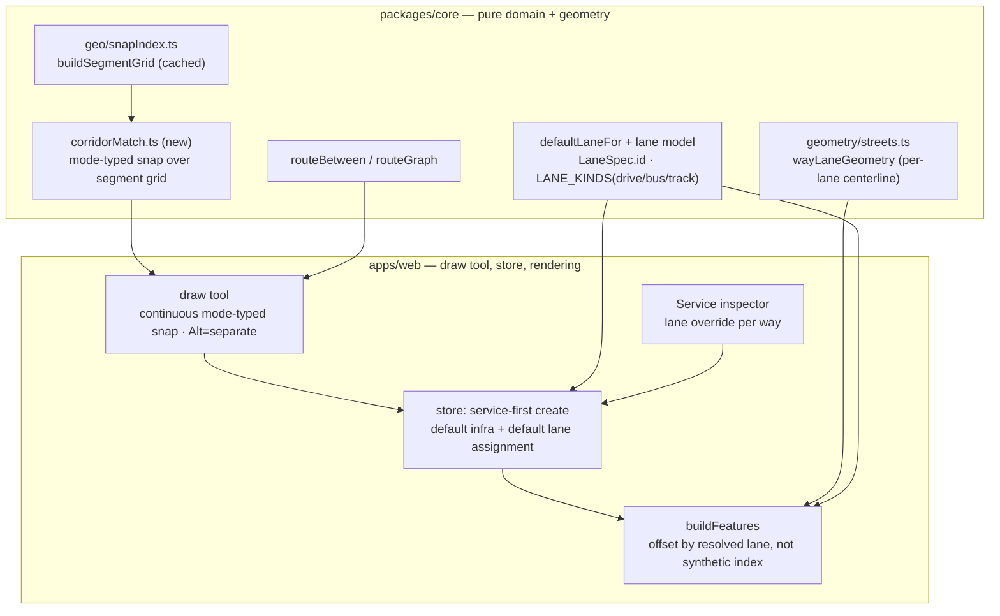

# Shared-Infrastructure Drawing — mode-grounded, lane-aware

**Status:** Design (approved in brainstorming) · **Date:** 2026-07-24

## Problem

Two transit lines that run down the same corridor are, in the real world, *sharing
infrastructure* — the same track, the same road, often the same lane. TransitMapper doesn't
model that. Every drawn line mints its own `Way`, and overlapping lines are independent ways
that happen to sit on top of each other. Two consequences:

- **Drawing** two routes along one street produces two stacked lines with no shared identity.
- **Import** is the pathological case: each GTFS shape becomes its own `Way` with no
  conflation (`gtfsImport.ts` appends `nodes:[]`, so not even junctions are derived), so a
  boulevard carrying ten routes imports as ten overlapping ways — the visible "mess."

Today, overlap is only handled *cosmetically*: services that happen to share the **same way
object** fan out as parallel offset lines (`BUNDLE_SPACING_PX` in `buildFeatures.ts`). Nothing
makes two *different* ways on the same ground share anything.

## The principle (user's framing)

> If a user draws multiple lines right next to each other or overlapping, it's expected they
> **share infrastructure** unless explicitly separated.

This inverts how the tool thinks:

- **Today:** drawing a line *is* creating a `Way`. Infrastructure is the thing you draw.
- **Under the principle:** you draw a **service**; **infrastructure is a byproduct** — reused
  wherever the path runs along existing infrastructure, created fresh only for new ground.

And the shared unit isn't a fuzzy "whatever's nearby" — it's **physically determined by mode**,
which is what makes this intelligent rather than heuristic:

| Mode | Shared unit | How a service sits on it | Snap tolerance |
|---|---|---|---|
| **Rail** (subway, commuter, light rail, tram, monorail) | the **track** (a rail-type way) | rides the track — sharing a track *is* overlapping, by definition | tight (a track is a precise line) |
| **Bus / BRT** | the **road**, + a **lane** | rightmost travel lane in its direction, or a **bus lane** if the road has one | wide (~carriageway width) |

The couplet question resolves itself: buses default to **rightmost-in-direction-of-travel**, so
divided roads and one-way pairs need no special logic.

## What already exists (why this is tractable)

The target representation is largely in place; this feature mostly *wires it together* and adds a
matcher.

- **Lane vocabulary exists.** `LANE_KINDS` already defines `drive`, `bus` (a bus lane —
  `role: "travel"`, `countsAsCapacity`, `directional`), and `track`, plus a `transitway` road
  class and `roadTransitway` type. No new lane roles needed.
- **Lanes are addressable.** `LaneSpec` (`model/system/way.ts`) has a stable `id`, so a service
  can name the exact lane it rides.
- **Mode↔infrastructure wiring exists.** `Mode.wayTypeIds` (`model/catalog.ts`) already maps
  bus→`road`, subway/commuterRail→`heavyRail`, tram/lightRail→`[lightRail, road]`, etc. This is
  exactly the filter for "snap to the right kind of shared unit," and `routeBetween(sys, a, b,
  { allowedTypeIds })` already routes services over existing compatible ways.
- **Per-lane geometry exists.** `wayLaneGeometry` (`geometry/streets.ts`) already computes each
  lane's centerline; rendering can offset a service onto its *real* lane instead of a synthetic
  index.
- **A spatial index exists.** `buildSegmentGrid` (`geo/snapIndex.ts`, cached on `system.ways`
  identity) is the acceleration structure the corridor matcher needs.
- **Junctions from coincidence exist.** Nodes are derived where control points coincide, and
  `buildFeatures` already draws junction footprints/trims from them — so "split a corridor where
  a route joins/leaves" has a home.

## Design

### 1. Data model — a service's lane assignment

A `Pattern` gains an optional, backward-compatible lane assignment keyed by way:

```ts
export interface Pattern {
  id: string;
  wayIds: string[];
  name?: string;
  /** Which lane this pattern rides on a given way. Missing/omitted → resolve
   *  the default at render time (rightmost travel lane in direction, or a bus
   *  lane if present). Keyed by wayId → LaneSpec.id. */
  lanes?: Record<string, string>;
}
```

- **Backward compatible:** existing patterns (no `lanes`) resolve to the default, so nothing
  breaks and imports need no migration.
- **Default resolver** (pure, core): `defaultLaneFor(way, direction) → LaneSpec.id` — a bus lane
  if the profile has one, else the rightmost `travel`-role lane in the pattern's direction of
  travel; for rail, the direction's track. Used both at placement (to seed `lanes`) and at
  render (to fill gaps).
- Lane assignment is **domain data** (which lane a service rides), never style — consistent with
  the separation-of-concerns rule. Lane *colors/widths* stay in the style layer.

### 2. `corridorMatch` — mode-typed snapping (pure, `packages/core`)

New module `model/geo/corridorMatch.ts`, built on the existing segment grid:

```ts
matchToCorridor(path: LngLat[], ways: Way[], opts: {
  allowedTypeIds: Set<string>;   // from mode.wayTypeIds
  toleranceM: number;            // tight for rail, road-width for bus
  headingTolDeg: number;
}): CorridorMatch[]   // stretches: { onWayId, arcRange } | { fresh, arcRange }
```

Direction-aware (parallel vs. anti-parallel), memoized on `(ways-identity, opts)` like the other
RTC-scale passes. **Draw-time only needs the incremental half:** as the in-progress stroke
extends, "am I riding a compatible existing way here?" The full segmentation is what import
conflation (later phase) will reuse.

### 3. Draw-time UX

Pick a mode → draw a **service** (not raw infrastructure):

1. The stroke **snaps to compatible corridors** (rail→tracks, tight; bus→roads, road-width),
   with live "you're sharing this" feedback — reuse the hover/`feature-state` highlight added in
   the perf pass.
2. On commit, matched stretches make the service **ride the existing ways** (shared); fresh
   stretches **mint new infrastructure** with a per-mode default cross-section (table below),
   which later services can in turn share.
3. The service gets a **default lane assignment** on each way (`defaultLaneFor`).
4. **`Alt`-drag = keep separate** — lay parallel new infrastructure instead of sharing (express/
   local tracks, a busway beside a road). This is the mandatory "explicitly separated" escape
   hatch.

This makes route-drafting (already in the store as `startRouteDraft`/`extendRouteDraft`/
`commitRouteDraft` over `routeBetween`) the *default* behavior of the draw tool, rather than a
separate mode.

### 4. View semantics — Network and Infrastructure are lenses, not canvases

**Invariant: switching views is lossless.** A line drawn in one view exists identically in the
other; the views differ only in how much physical detail they *reveal*. Nothing is converted or
silently mutated by switching. (This already holds — `beginWay` bakes a full `profile`
immediately; Network just collapses it to one line.)

- **Network view:** every way collapses to one schematic service line; grade/footprints/junction
  detail hidden; **only service-carrying infrastructure shown**.
- **Infrastructure view:** full cross-section revealed — lanes fanned to `wayCapacity`,
  true-scale metric lanes with surfaces/dividers/arrows at zoom (`wayLaneGeometry`), junction
  footprints, grade styling; **all** physical infrastructure shown including bare ways. This is
  the **refinement surface** where the user edits lane count, designates a bus lane, sets grade.

**Draw in Network → switch to Infrastructure** (the concrete answer):

- *Bus line:* Network shows one colored line; underneath it either joined an existing road or
  minted a default road, bus assigned to the curb lane. Infrastructure reveals that road at true
  width with the bus on its lane and junctions where it crosses other roads — where you then
  refine it.
- *Train line:* Network shows one colored line; Infrastructure reveals a **track** (a single rail
  line, not a multi-lane road) with the service on it; other services drawn on it share it.

**Per-mode default cross-section for freshly-drawn infrastructure** (two-way by default for
hand-drawing — distinct from GTFS import's one-way carriageways):

| Mode | Default fresh infrastructure | Service sits on |
|---|---|---|
| **Bus / BRT** | two-way road, one travel lane per direction (upgradeable to a bus lane) | rightmost lane, its direction |
| **Tram / streetcar** | two-way street with embedded track (single track if one-way armed) | the track |
| **Train / metro / commuter** | two-track line, one per direction (single if one-way armed) | its direction's track |

The transition reads as *"here's the physical reality of what I sketched"* only if these defaults
are sensible — a wrong default (bus → 6-lane freeway) makes it feel broken. Getting the defaults
right is a first-class requirement, not a detail.

### 5. Rendering — offsets become physically honest

Service offsets stop being a cosmetic fan (`i - (n-1)/2`) and become **real lane positions**:
two bus routes on the curb lane sit on the curb lane; a route on the bus lane sits there; trains
sit on the track. `wayLaneGeometry` already produces per-lane centerlines — drive the service
geometry from the pattern's resolved lane instead of a synthetic index. Where multiple services
share one lane, a small legibility offset within the lane keeps them distinguishable.

### Architecture



## Phasing (draw-time first; each phase a valid buildable commit)

- **Phase A — Mode-typed corridor snapping.** Draw a service → snaps to compatible shared ways;
  fresh ground mints default infra; `Alt` escape hatch; services share ways at the road/track
  level. Realizes "share by default." (`corridorMatch` incremental half, draw-tool + store
  changes, per-mode default infra.)
- **Phase B — Lane model + default assignment.** Seed `Pattern.lanes` via `defaultLaneFor`
  (rightmost-in-direction / bus lane / track); render services on their assigned lane geometry.
- **Phase C — Lane override UI.** Service inspector picks/overrides the lane per way.
- **Later (separate) — Import-time conflation.** Reuse `corridorMatch` (full segmentation) to
  collapse co-aligned GTFS/OSM shapes onto shared ways + junction nodes. Fixes the RTC mess at
  the source. Highest payoff, highest risk — sequenced after the engine proves out on drawing.

## Risks & mitigations

- **Continuous-snap jitter / snap-vs-not ambiguity.** Mode-scaled tolerance + hysteresis + clear
  "sharing this" visual feedback + the `Alt` escape hatch. Prototype the feel early.
- **Piecewise join/leave → way splitting at branch nodes.** The node/junction model supports it,
  but the draw tool must *materialize* the split (insert a coincident control point → derived
  node). Reuse the existing coincidence-based node derivation.
- **Lane assignment on messy profiles** (turn pockets, one-way carriageways, lane-count changes).
  `defaultLaneFor` resolves against `role: "travel"` + direction; overrides handle the rest;
  unresolved → nearest travel lane, never a crash.
- **Lane-count transitions in rendering** (a route moving between ways of different cross-section).
  Offsets are per-way; transitions happen at junction nodes where geometry already breaks.
- **RTC-scale performance.** `corridorMatch` memoized on ways-identity, same discipline as the
  perf pass; draw-time only touches the stroke's neighborhood via the grid.
- **Losslessness of view switching.** Guarded by a round-trip test (draw in Network → switch →
  switch back → identical system).

## Testing / verification

Extend `apps/web/scripts/verify.ts` (deterministic, `pnpm verify`) with:

- `matchToCorridor`: parallel co-aligned path matches; anti-parallel classified as opposite
  direction; a path that joins-then-leaves yields on/fresh/on segments; sub-tolerance jog stays
  matched.
- `defaultLaneFor`: bus → bus lane when present else rightmost travel lane in direction; rail →
  direction's track; one-way carriageway resolves correctly.
- Draw-time: drawing a bus line along an existing road adds a service to that road (no new
  overlapping way); `Alt` forces a separate way; fresh ground mints the per-mode default profile.
- View losslessness: system identical after Network→Infrastructure→Network round-trip.
- In-browser: draw two bus lines on one street → one road, two services bundled; flip to
  Infrastructure → both on the road's lanes with a junction at the crossing.

## Separation of concerns & new modules

- `packages/core/src/model/geo/corridorMatch.ts` — pure mode-typed corridor matcher (geometry).
- `packages/core/src/model/…/defaultLaneFor` — pure lane-assignment resolver (domain).
- `Pattern.lanes` — domain data; **no style**. Lane colors/widths stay in the style layer.
- `apps/web` — draw-tool interaction, snap feedback, lane-override UI, lane-driven rendering in
  `buildFeatures`. Extract any new param objects to named interfaces (no inline typedefs).

## Out of scope / deferred

- Import-time conflation (its own later phase, reuses the engine).
- Full lane-level routing through junctions (turn-by-turn lane connectors) beyond what
  `connectorCurves` already draws for a selected node.
- Automatic re-conflation of already-drawn independent ways (render-time bundling of co-aligned
  *separate* ways) — only if a residual-overlap problem remains after A–C.
