# Saved views in the editor

## Status

Approved on 2026-08-25 as the editor workflow for Phase 4 of the Views and map
workspace refactor. This specification is for a TransitMapper maintainer who
must implement named Views without creating another editor mode or putting
presentation state into a transit document.

## Decision

The editor will call the feature **Saved views**. A labeled `Saved views`
action will open a lazy-loaded dialog over the existing map. The responsive
action cluster may move that action into its existing overflow menu when the
top bar lacks room.

Saved views will not become a fourth choice beside Network, Infrastructure,
and Diagram. They will not add a route, permanent sidebar, or application
mode. Those controls choose how the current map renders. A saved view records
one complete presentation so a person can restore or publish it.

The implementation will keep the local library and publication workflow in
`apps/web`. The portable state contract remains in `@transitmapper/views`, and
the map workspace remains unaware of local storage and HTTP publication.

## Alternatives rejected

A permanent sidebar would compete with the selection inspector and consume map
space for a task that people perform occasionally. A new editor mode would mix
a collection of saved states with the existing representation choice. Adding
these controls to Share would also be wrong because restoring a local view does
not require a network request or a public link.

## Library and empty state

The dialog title will be `Saved views`. Its description will say that a saved
view remembers the current map position, visible layers, and selection. The
primary action will be `Save current view`.

An empty library will show the same explanation and primary action. It will not
show a placeholder map or onboarding sequence. The editor map remains visible
behind the dialog and already shows the state that the action will save.

Each saved view row will show its name and either `Only on this device` or
`Shared`. The row will expose an explicit `Open` action. Rename, Share, and
Delete will live in the row's action menu so they do not compete with Open.
The dialog will order rows by their most recent local update.

## Save and open

`Save current view` will reveal a name field in the dialog. The field will
start with `View 1`, `View 2`, and so on, using the first unused number for the
current document. Enter will save, and Escape will cancel. A blank name will
not save.

Saving will snapshot the current camera, representation, filters, and feature
selection. It will write a new local record under the active document ID. It
will not mutate `TransitSystem`, change `TransitSystem.updatedAt`, or create an
undo entry.

Open will restore the saved state through `MapViewStore` and the session's
`SelectionController`. The dialog will close after restoration so the person
can inspect the result. An unavailable selected feature will clear selection
without preventing the camera, representation, and filters from restoring.

## Rename

Rename will replace the row title with an inline text field. Enter will commit,
Escape will cancel, and a blank value will leave the old name unchanged. The
local rename succeeds without a network.

If the view has a public edit token, the editor will also update its public
title. A failed public update will keep the local rename and show a retryable
error in the dialog. The next Share action will send the current local name,
description, and state again.

## Share

Share will first publish the latest transit document through the existing
idempotent system-share flow. It will then create or update the public View
over that shared-system ID. This ordering keeps transit content ownership in
the existing share resource and presentation ownership in the View resource.

The first successful publication will store the returned public View ID and
one-time edit token in the local record. Later Share actions will update that
public View when the local record still has the token. If the browser no longer
has authority to update the referenced system share, the existing system-share
flow will create or recover the appropriate share before publication.

After publication, the dialog will show the canonical `/v/:id` URL in a
selectable field with `Copy link` and `Open` actions. The embed route remains
an alternate delivery of that same public View and does not need a second
editor control in this phase.

This sequence diagram shows publication. It does not describe editor rendering
or Worker deployment.

```mermaid
sequenceDiagram
    participant Person
    participant Dialog as Saved views dialog
    participant Share as System share client
    participant Views as View client
    participant Local as Local View library

    Person->>Dialog: Share saved view
    Dialog->>Share: Publish current transit document
    Share-->>Dialog: Shared-system ID
    Dialog->>Views: Create or update named View
    Views-->>Dialog: Public ID and edit token
    Dialog->>Local: Store publication authority
    Local-->>Dialog: Saved
    Dialog-->>Person: Show canonical link
```

## Delete

Deleting a local-only view will ask `Delete this saved view?` and explain that
the transit system will remain unchanged. Confirmation will remove only the
local record.

Deleting a published view will ask `Delete this saved view and stop sharing
it?` and explain that its public and embedded links will stop working. The
dialog will delete the public View first. It will remove the local record only
after the Worker accepts that deletion or reports that the View is already
gone. A network or authorization failure will keep the local record and its
edit token so the person can retry.

## Failure behavior

The dialog will render its frame and controls before IndexedDB resolves. A
library failure will keep `Save current view` visible and show a `Try again`
action. A failed save, rename, restore, publication, or deletion will keep the
dialog open and preserve the last confirmed local record.

Only the row performing a network operation will become busy. Other saved
views will remain usable. Closing the dialog will cancel in-flight fetches but
will not discard a Worker response that the local library already stored.

## Verification

Focused tests will prove the rules at the local-library and dialog boundaries.
They will cover empty state, name generation, local save, state restoration,
local rename during public failure, system-share-before-View publication,
public ID and token persistence, local-only deletion, and public-first
deletion. Tests will assert behavior and resource IDs rather than generated
asset filenames.

One browser check will save and reopen a view in the editor. It will then
publish the same view and open its `/v/:id` reader. The final repository check
will run after the whole phase instead of after each UI edit.
