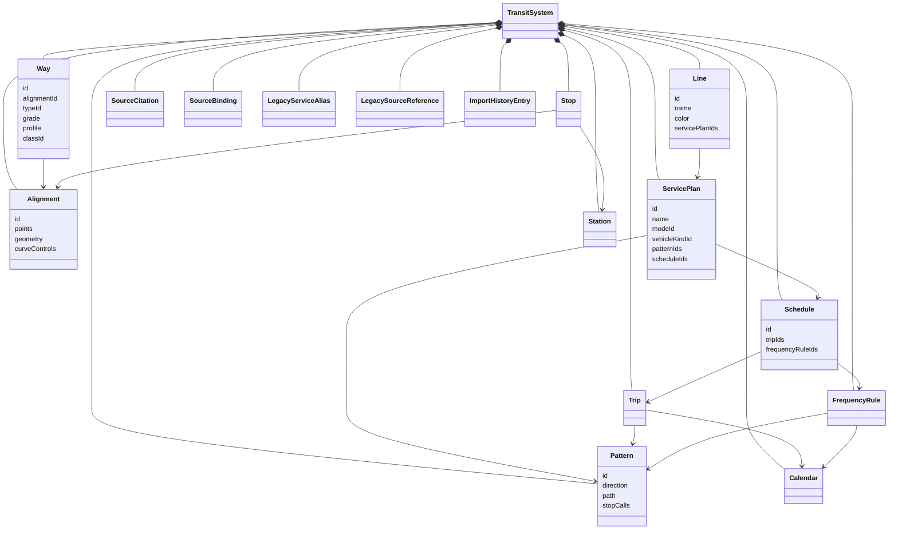
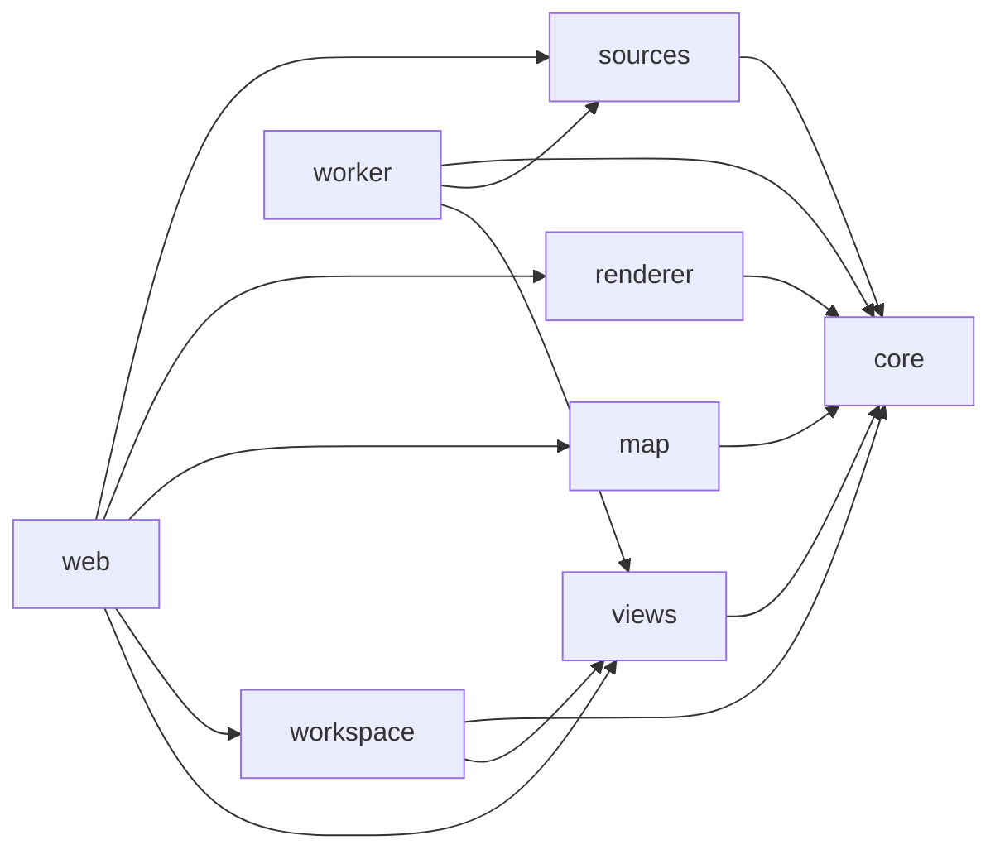

# Map data and rendering boundaries

> **Status:** Approved target design as of 2026-08-28. Production does not
> implement the target schemas or package graph yet.

This design is for TransitMapper maintainers who will correct the map and then
extend saved Views without breaking production documents. A maintainer who
finishes this work must leave the passenger map readable, keep the editor
responsive, and keep product-specific saved Views out of the renderer.

The [transit content architecture](2026-08-28-transit-content-architecture.md)
defines the storage roots and data flow. The companion
[transit data type reference](2026-08-28-transit-data-types.md) defines the
target vocabulary. This design applies those contracts to rendering, editing,
and package ownership. The
[implementation plan](../plans/2026-08-28-map-data-rendering-boundaries.md)
records the production sequence. Its Source, schema, and View phases require
synchronization with these contracts before execution.

The baseline is TransitMapper 0.7.3 on `origin/main` as of 2026-08-28. That
baseline already contains the `core`, `renderer`, `map`, `views`, and
`workspace` packages. It also contains the `/s/:id`, `/v/:id`, `/e/:id`, and
`/embed/:id` routes and the `0009_views.sql` migration. This design changes
those boundaries in place. It does not recreate them.

## Decision

TransitMapper will separate eight concerns that the current system still
mixes:

1. `TransitSystem` owns mutable authored content.
2. `Source` and `TransitDataset` own immutable source-backed content outside
   authored documents.
3. `Alignment` owns reusable geographic geometry.
4. `Way` states that an Alignment is physical infrastructure.
5. `ServicePlan`, `Pattern`, and `Schedule` separate passenger identity,
   geometry, and time beneath a public `Line`.
6. The renderer derives one visible Line span from any number of sibling
   Patterns.
7. The map adapter translates semantic scenes into MapLibre operations.
8. A saved View stores presentation and a generic content reference.

The visual correction can ship first through a schema-v16 compatibility
adapter. That adapter can use the current Way as its carrier and can treat each
current Service direction as a transient Pattern. The persisted migration can
then add Alignment, Pattern, ServicePlan, Schedule, and source bindings without
making renderer correctness depend on the migration date.

## Current failures

The current persisted model groups Services under Lines, but the renderer
still paints and hit-tests Service occurrences. The GTFS importer creates a
Service from each selected route-shape pairing. Directional variants can
therefore draw the same public Line many times. The feature count grows with
operational records instead of visible passenger information.

The current importer also chooses representative trips and reduces service to
coarse headway and span values. It does not preserve feed revisions, service
calendars, calendar exceptions, exact trip identity, or alerts. The current
`Service` record therefore cannot act as a source-backed schedule contract.

The current GTFS importer creates a physical Way for each GTFS shape even
though a GTFS shape does not prove that any road, track, or ferry channel
exists. Similar shape variants become separate physical records before the
renderer sees them.

The current `renderer` package imports MapLibre, `map`, and `views`. It owns
projection and browser publication at the same time. The current View contract
also persists a MapLibre source name in selection state. Those dependencies
make a renderer rename capable of breaking a saved View.

The current startup budgets permit delays of several seconds. Import and
projection can also monopolize the main thread. A technically complete load
does not matter when the browser stops accepting input.

## User experience contract

Network and Diagram show public Lines. Services do not become parallel route
stripes merely because they have different directions, schedules, short
turns, temporary patterns, or stopping patterns.

Within one public Line, sibling Patterns collapse wherever their paths are
spatially equivalent. Their paths split only where the passenger map must show
a real branch. The overlap resolver must use Line membership plus topology and
ordered path correspondence. Raw coordinate distance cannot authorize a
merge.

Different public Lines remain different stripes. The renderer may place those
stripes in one common casing when a resolved carrier, a reconciled Alignment,
or topology correspondence proves that they share a corridor. Legacy GTFS
documents require the topology case because each shape already became a
separate schema-v16 Way. The resolver requires shared semantic anchors,
compatible topology, and monotonic path correspondence. Distance alone proves
nothing. The renderer must never turn two public Lines into one identity.

### Line overlap Version 1

`line-overlap-v1` resolves overlap before projection. Two contributors on the
same semantic carrier overlap over the positive-length intersection of their
normalized carrier ranges. The resolver splits that intersection at every leg
and extent boundary. This exact-carrier case needs no geometry tolerance.

Different carriers require inferred correspondence. The resolver first finds
exact shared semantic anchors from complete `ResolvedTopologyWindow` records.
Each window carries its ordered anchored calls and binds each call to a listed
Pattern-leg boundary. Supplied Pattern stop-call path positions retain the
carrier position without deciding the boundary.
Two calls match when they name the same Stop. Different Stops may match through
the same explicit parent Station. A matching label or nearby coordinate is not
an anchor. The renderer never snaps a Stop to a path to manufacture one. The
resolver pairs anchors in monotonic path order. It permits the entire paired
path to run in the same or reverse direction. It rejects a pairing that
reverses inside the candidate span.

Each interval between adjacent paired anchors is one candidate. The resolver
accepts the whole interval or rejects the whole interval. It never accepts a
distance-only fragment between anchors. A candidate must satisfy all of these
rules:

- The shorter centerline measures at least 25 metres.
- Both centerlines are densified to segments no longer than 40 metres.
- Symmetric samples have a maximum nearest-centerline distance of 20 metres.
- Every sample has an undirected tangent difference of no more than 40
  degrees. Opposite travel directions therefore remain parallel.
- Two known Way grades match. A grade mismatch rejects the candidate. An
  unknown Alignment grade proves no Infrastructure overlap.

The geometric test uses the complete logical centerlines between the matched
anchors. It runs before viewport clipping, simplification, display LOD,
Diagram layout, or camera projection. Each centerline includes its exact
path-anchor endpoints. A curved carrier uses the core metric-curve algorithm
with a fixed maximum sagitta of 0.25 metres. Straight and freeform carriers use
their stored point sequences. Display tessellation never enters this test.

The resolver creates one candidate-local azimuthal-equidistant projection. It
uses a spherical Earth radius of `6,371,008.8` metres. It converts the four
path-anchor endpoints to unit vectors and sums them in semantic-anchor-key
order, then stable contributor-identity order. That contributor identity omits
Line rank. The normalized sum is the projection origin. A zero-length sum
rejects the candidate.

For longitude `lambda` and latitude `phi` in radians, the resolver wraps
`deltaLambda = lambda - lambda0` into `[-pi, pi)`. It computes:

```text
cosC = clamp(
  sin(phi0) sin(phi) + cos(phi0) cos(phi) cos(deltaLambda),
  -1,
  1
)
c = acos(cosC)
k = 1                                  when c = 0
k = c / sin(c)                         otherwise
x = R k cos(phi) sin(deltaLambda)
y = R k (
  cos(phi0) sin(phi) -
  sin(phi0) cos(phi) cos(deltaLambda)
)
```

The resolver rejects a nonfinite coordinate or `c >= pi - 1e-12`. It never
substitutes Web Mercator or a host projection. All arithmetic uses IEEE-754
binary64. Before any geometric test, it rounds each projected coordinate to
the nearest millimetre with halves away from zero:

```text
Q(value) = sign(value) floor(abs(value) * 1000 + 0.5) / 1000
```

The resolver removes consecutive points that become equal after rounding. It
rejects a centerline with fewer than two distinct points. It treats each
remaining adjacent pair as one closed straight segment. Centerline length is
the sum of its projected segment lengths with `Q` applied once to the sum. The
shorter rounded centerline must measure at least 25 metres.

For each nonzero segment of length `L`, the resolver sets
`n = max(1, ceil(L / 40))` and emits samples at `k / n` for integers from zero
through `n`. Each sample retains its emitting segment. An interior vertex
therefore emits one sample for each incident segment. The resolver neither
merges those samples nor averages their tangents.

For source sample `s` and target segment `a` to `b`, nearest-point distance is:

```text
v = b - a
t = clamp(((s - a) dot v) / (v dot v), 0, 1)
nearest = a + t v
distance = Q(length(s - nearest))
```

The sample's nearest distance is the minimum rounded distance over every
target segment. Every sample must be at most 20 metres from the other
centerline. The resolver runs the test in both directions. Every target
segment tied at the minimum rounded distance is eligible for tangent matching.
The source tangent is its emitting segment. A target tangent passes the
inclusive 40-degree undirected comparison when:

```text
(source dot target)^2 >=
  0.5868240888334652 *
  (source dot source) *
  (target dot target)
```

Each incident source tangent at a vertex must find a passing eligible target
tangent. Every equally nearest target tangent remains eligible. The resolver
never uses an averaged vertex tangent, an angle bisector, or segment-array
order. The candidate passes only when the length rule and every symmetric
distance and tangent sample pass.

The resolver splits accepted correspondence only at carrier boundaries, leg
boundaries, extent boundaries, and semantic anchors. It joins adjacent carrier
fragments only when their normalized ranges meet within `1e-9` and their
endpoints lie within 0.75 metres. It quantizes normalized ranges to six decimal
places before identity. A crossing has at most one shared anchor and therefore
cannot consolidate. Nearby parallel corridors with no shared anchors also
remain separate.

Topology fallback between different Lines also requires at least one shared
known mode and no known grade conflict. Same-Line consolidation ignores mode.
An exact shared carrier or shared Alignment does not need the mode check. This
rule lets a temporary bus ServicePlan remain part of its passenger Line while
blocking a nearby bus path from joining a rail Line through coordinates alone.

A closed path with fewer than two shared anchors has no inferred overlap. For
repeated anchors, the resolver chooses the correspondence with the greatest
accepted length. A tie prefers more exact Stop matches, then lower maximum
distance, then the lexicographically smallest stop-call ID sequence. Short
turns and branches share only the accepted intervals before divergence.

The canonical contributor is the lowest candidate under this fixed tuple:
Line rank, Line ID, ServicePlan ID, Pattern ID, leg index, carrier kind,
carrier ID, and normalized carrier range. A shared Alignment is canonical in
Network and Diagram. A shared physical carrier is canonical in Infrastructure.
The carrier-kind tuple orders Way before Alignment for topology-only matches.
The Line span uses that contributor's ascending full-carrier geometry without
averaging coordinates. An exact Line-span ID hashes `line-overlap-v1`, Line
identity, canonical carrier identity, and its quantized logical range. A
topology Line-span ID replaces carrier identity with the accepted semantic
anchor keys and contributor range. Neither ID includes contributor occurrence
identity. A bundle ID hashes its ordered Line-span IDs and accepted overlap
correspondence. Viewport clipping retains the logical span ID.

For each visible interval, the renderer selects the first contributor under
that same canonical order with a visible shard covering the interval. It then
uses the lowest UTF-8 shard ID from that contributor. A closure-only canonical
contributor therefore cannot suppress the visible sibling that seeded the
carrier group. This source choice changes only query-local fragment geometry.
It never changes Line-span identity, contributor membership, or stripe order.
The renderer clips a source path only within the transferred shard range. It
uses stored vertices for straight and freeform fragments. It resolves curved
fragments with the core metric-curve algorithm at a 0.25-metre sagitta before
clipping. Before metric work or slicing, it normalizes longitude continuity in
a local copy, so an antimeridian carrier emits continuous geometry without
requiring provider pre-unwrapping. For a shared Alignment, a Way maps its
source carrier range directly through its `alignmentExtent` before intersection.
It never maps through an inverse contributor range, because the exact fragment
endpoints enter the visible-fragment ID. It never joins shards or averages their
coordinates.

The transfer keeps query shards separate from logical Pattern-leg identity.
Each `ResolvedPatternLegFragment` carries a shard `id` and `carrierRange` for
the transferred geometry. It also carries a `logicalPatternLegFragmentId` and
`logicalCarrierRange` from the complete piece before query clipping. It carries
`logicalAlignmentRange` for the same complete piece. A `ResolvedWay` owns the
mapping from its normalized `[0, 1]` range to `alignmentExtent`. The mapping is
monotonic and affine. It uses the binding data contract's fixed binary64
operation order and endpoint short-circuits. A provider splits a Way before
normalization when one mapping cannot represent it. The fragment's Alignment
range is derived from that Way-owned mapping, so a Pattern occurrence cannot
invent another one.
Span assembly groups shards by the logical fields. It never indexes geometry
by the logical ID because several transferred shards may share it. It never
derives stable identity from viewport-clipped ranges.

The provider supplies the complete same-Line semantic carrier closure for each
`(Line, carrier)` pair seeded by a visible Pattern fragment. Candidate
normalization may retain closure and topology evidence with no visible shard.
The exact resolver admits a carrier group only when that group contains a
visible seed. It then keeps every closure-only contributor in that admitted
group, with an empty visible-shard evidence set, so exact boundaries remain
stable while a user pans. A topology window on another carrier remains
comparison evidence because the provider has not supplied complete same-Line
closure for that carrier. Only `visiblePatternLegFragmentIds` authorizes later
clipping and paint. The closure does not pull another Line, an unrelated
carrier from the same Pattern, or a ServicePlan excluded by the query.

Resolved-network projection first compares every repeated record that it
indexes by complete canonical value bytes. Equal repeats coalesce. A conflict
rejects the current projection before an insertion-order index can hide it.
Line assembly still validates the geometry records it consumes before it
normalizes logical fragments. These per-result checks do not replace the core
page assembler. That assembler owns cursor, query, accepted-page history, and
cross-page validation.

Before grouping, the renderer verifies the logical-fragment invariants from
the transit data contract. It rejects a new assembly when one logical ID names
different Pattern occurrence facts, semantic carriers, alignments, or logical
ranges, or when a transferred carrier or Alignment shard falls outside its
matching logical range. Pattern-leg preparation proves that the Alignment exists,
that a Way owns the named Alignment, and that any named lane exists before an
overlap rule may trust those identities. An Alignment carrier must use equal
carrier and Alignment ranges. A Way may use distinct ranges only through its
own `alignmentExtent`. The renderer validates every shard and logical range
against that mapping. It rejects invalid extents, reversals, endpoint
mismatches, and occurrence-owned mappings. Query clipping may leave legitimate
gaps between visible shards; those gaps remain query-local evidence. The last
accepted scene remains interactive after rejection.

The renderer keeps this proof in one Pattern-leg index. The index has one
validated logical Pattern leg for each logical ID and a direct lookup for each
transferred shard. Line candidate preparation adds Line and ServicePlan
membership to those records. Topology preparation reads the same records by
canonical shard ID. It does not rebuild carrier, Alignment, Way, or lane facts
from raw projection maps.

Topology preparation accepts a canonical window ID rather than a caller-supplied
window record. Its Pattern-leg index belongs to one resolved result, and a
window from another result must reject instead of reusing stale fragment proof.
The prepared record retains each supplied boundary, canonical Stop key, optional
Station key, and validated fragment reference. A Stop-call path anchor locates
evidence on its complete carrier. It never decides a topology-window boundary.

Topology-only comparison uses every fragment listed by both complete
anchor-to-anchor windows. It never decides from viewport-clipped geometry. The
resolver waits when a page or overflow artifact has not supplied one listed
fragment. The last accepted scene remains interactive during that wait.

Accepted contributors from one Line become one Line span. Accepted spans from
different Lines remain separate members inside one common bundle. Dataset
`lineOrder` fixes bundle member order. Pattern order, chunk order, query order,
and asynchronous completion never settle a tie. A missing Line, repeated Line
ID, repeated rank, negative rank, or fractional rank rejects the new scene
generation. The last accepted scene remains visible.

The resolver orients each connected bundle component from its lowest stable
span key. It visits semantic junctions in stable key order. It flips an
unvisited span when that flip preserves ranked stripe order across the
junction. A cycle conflict chooses the orientation with fewer Line-rank
inversions. For a remaining tie, the resolver builds one signature for each
whole-component orientation. It visits spans in stable key order and appends
each oriented start and end key. A semantic anchor supplies the endpoint key.
Otherwise the key uses carrier identity plus quantized position. The
lexicographically lower component signature wins. The resolver never swaps two
Lines locally to improve only one junction.

The required fixture corpus covers values at and immediately beyond every
numeric threshold. It also covers a crossing, nearby parallel corridors, a
one-way couplet, grade separation, a circle, a short turn, and a branch. The
corpus includes sibling Patterns under one Line and separate Lines sharing a
proven corridor. It repeats one logical span through one and three chunks,
reversed page order, reversed worker completion, and viewport clipping.

Infrastructure may show physically separate Ways, lanes, and tracks. A shared
Way does not prove a shared physical carrier. Infrastructure consolidates only
Services that occupy the same resolved lane or track segment with the same
extent, connector, and grade identity.

The exact-carrier stage defers a bare Alignment and a Way without a resolved
lane in Infrastructure. It does not assign either one an occurrence-derived
span identity. A later representation visibility rule may omit that deferred
path, but overlap resolution may not consolidate it or leak Pattern identity
into a stable Line span ID.

The editor may draw one temporary Pattern overlay while a person inspects or
edits that Pattern. The overlay owns that Pattern's path, arrows, termini, and
occurrence targets. This overlay is the only ordinary case where sibling
Patterns appear separately. It never enters viewer, embed, preview, SVG, PNG,
or exported passenger maps.

One Line may still appear on separate geometry where its Patterns take real,
nonoverlapping branches or physically distinct carriers. That geometry is not
a stack of complete operational routes. Each branch paints the Line once for
the Patterns that contribute to that span. A future comparison tool may show
more than one Pattern only as an explicit temporary analysis overlay. It must
not change the passenger map's default representation.

The map uses three detail bands:

- Overview shows public Lines, major Stations, major Stops, and interchanges.
  It hides ordinary Stop labels and direction-specific boarding details.
- District detail adds ordinary Stop markers. It labels selected, major, and
  collision-free boarding places.
- Street detail adds the remaining Stop detail. It still consolidates a
  Station or shared boarding place instead of stacking duplicate labels.

Selecting a Line emphasizes its stripe and relevant Stops. Selecting one of
its service plans happens through the labeled Services list in the inspector.
Selecting a Pattern happens through an explicit path-editing control. A second
click on route geometry does not silently descend from Line to ServicePlan or
Pattern.

Toolbars, sidebars, context menus, dialogs, popovers, and inspector panels use
short labels, values, and actions. They do not explain the TransitMapper object
model or narrate what an ordinary control does in permanent prose. Primary
actions carry visible labels. A complex control may use one reusable
rich-tooltip or help contract. That contract supports keyboard focus, pointer
click, touch, `aria-describedby`, and Escape dismissal. Native `title` text
does not satisfy it.

The shell, map gestures, cancellation, and selection remain usable while
projection or import continues. No data load, import, saved View, or style
recovery may place a full-screen blocking loader over the workspace.

## Persisted domain model

The following class diagram opens the authored `TransitSystem` root from the
[storage model](2026-08-28-transit-content-architecture.md#storage-roots). It
shows target persisted ownership. It does not show source-backed Dataset
records, renderer state, MapLibre state, or application state.



The proposed authored contracts separate passenger identity, geometry, and
time:

```ts
export interface Alignment {
  id: string;
  points: LngLat[];
  geometry: LineGeometry;
  curveControls?: CurveControl[];
}

export interface Way {
  id: string;
  alignmentId: string;
  typeId: string;
  grade: Grade;
  profile: CrossSection;
  classId?: string;
}

interface PatternLegBase {
  direction: LegDirection;
  extent: LegExtent;
}

export type PatternLeg =
  | (PatternLegBase & {
      kind: 'alignment';
      alignmentId: string;
    })
  | (PatternLegBase & {
      kind: 'way';
      wayId: string;
      lane: LegLane;
    });

export interface StopAnchor {
  alignmentId: string;
  t: number;
}

export interface Line {
  id: string;
  name: string;
  color: string;
  servicePlanIds: string[];
}

export interface ServicePlan {
  id: string;
  name?: string;
  modeId: string;
  vehicleKindId?: string;
  patternIds: string[];
  scheduleIds: string[];
  planningSummary?: {
    peakHeadwaySeconds?: number;
    spanStartSeconds?: number;
    spanEndSeconds?: number;
  };
}

export interface Pattern {
  id: string;
  direction?: PatternDirection;
  path: PatternPath;
  stopCalls: PatternStopCall[];
}

export interface Schedule {
  id: string;
  tripIds: string[];
  frequencyRuleIds: string[];
}

export interface TransitSystem {
  version: 17;
  id: string;
  name: string;
  description?: string;
  viewport: Viewport;
  createdAt: number;
  updatedAt: number;
  alignments: Alignment[];
  ways: Way[];
  lines: Line[];
  servicePlans: ServicePlan[];
  patterns: Pattern[];
  schedules: Schedule[];
  calendars: Calendar[];
  trips: Trip[];
  frequencyRules: FrequencyRule[];
  stops: Stop[];
  stations: Station[];
  facilities: Facility[];
  groups: Group[];
  nodes: Node[];
  namedWays: NamedWay[];
  vehicleKinds: VehicleKind[];
  palette: string[];
  drivingSide: DrivingSide;
  turnRestrictions: ComponentMap<TurnRestriction>;
  medians: ComponentMap<Median>;
  approachControls: ComponentMap<ApproachControl>;
  sourceCitations: SourceCitation[];
  sourceBindings: SourceBinding[];
  legacyServiceAliases: LegacyServiceAlias[];
  legacySourceReferences: LegacySourceReference[];
  importHistory: ImportHistoryEntry[];
}
```

An Alignment leg has no lane, grade, cross-section, or traffic-direction
meaning. A Way leg may use those physical rules. Physical routing remains
Way-only. A Pattern with unknown source geometry uses the explicit
`{ kind: 'unknown' }` path state instead of an empty list.

The first schema permits zero or one Way to own an Alignment. Distinct
physical carriers use distinct Alignments even when their coordinates match.
A bare Alignment leg is invalid when a Way owns that Alignment. This rule
stops a Pattern from bypassing lane and direction rules.

`Line.servicePlanIds` is the single stored Line-to-ServicePlan relationship.
`ServicePlan` does not gain `lineId`. Storing both directions would let them
drift. Line order remains the stable order for passenger-facing bundle
stripes.

One Pattern describes one direction, path, and ordered stop-call pattern. A
schedule-only change adds or changes Schedule facts. It does not create
another Pattern. A stopping-pattern or path change creates another Pattern.
Several Patterns may share one ServicePlan and one visible Line.

The schema-v16 decoder canonicalizes `Service.path.id` to `Service.id` before
migration. The migration retains every existing Line, Way, Stop, and Station
ID. It uses `legacyDerivedId(kind, ...parts)` only when schema v16 has no
predecessor identity.

For each schema-v16 Way, the migration creates an Alignment with the same ID.
It copies `points` and `geometry` without changing order or values. Each
schema-v16 curve control `{ pointIndex, radiusM }` becomes
`{ pointIndex, radiusMeters: radiusM }` at the same array position. It retains
the Way ID and sets `alignmentId` to that same ID. It copies `typeId`, `grade`,
and `classId`. Each profile lane `{ id, kindId, widthM, direction }` becomes
`{ id, kindId, widthMeters: widthM, direction }` at the same array position,
except schema-v16 `direction: 'backward'` becomes schema-v17
`direction: 'reverse'`. The other direction literals remain unchanged.
Existing Node, NamedWay, median, lane-connector, turn-restriction,
approach-control, and Pattern-leg references continue to name the retained
Way.

Each Stop anchor `{ wayId, t }` becomes `{ alignmentId: wayId, t }` at the same
array position. The migration leaves the Stop coordinate and every other Stop
field unchanged. The one-Way-per-Alignment invariant lets physical code recover
the carrier without changing the anchor position.

For each schema-v16 Service, the migration creates a ServicePlan with the same
ID. It copies `name`, `modeId`, and `vehicleKindId` without reinterpretation.
The owning Line replaces that Service ID with the same value in
`servicePlanIds`. Membership and array order remain unchanged. The migration
rejects a missing or duplicate Line membership instead of choosing an owner.

Every Service creates an outbound Pattern with
`legacyDerivedId('pattern', serviceId, 'outbound')`. It creates an inbound
Pattern with `legacyDerivedId('pattern', serviceId, 'inbound')` only when the
existing schema-v16 inbound run contains a leg. The migration calls the current
`patternRunLegs` expansion for each run, which expands shared sections, split
sections, and turnarounds in ride order. Each derived leg retains its Way and
lane. It maps the expanded `RunLeg.forward` value to target `forward` or
`reverse`; it never maps the stored leg direction after expansion. A
schema-v16 `{ kind: 'whole' }` extent becomes `{ start: 0, end: 1 }`. A
schema-v16 `{ kind: 'stretch', fromT, toT }` extent becomes
`{ start: fromT, end: toT }`. The migration neither sorts nor reverses those
normalized positions. An empty outbound path becomes the explicit unknown
path state. Each created Pattern carries `{ key: 'outbound' }` or
`{ key: 'inbound' }` as its direction.

The migration derives Pattern stop calls by run-leg occurrence. For each
expanded run leg in ride order, it examines Stops in document order and Stop
anchors in anchor-array order. An anchor is eligible when it names that leg's
Way, falls inside the leg's inclusive normalized extent, and the Stop is not in
the run's skipped-Stop set. For one Stop with several eligible anchors on one
leg occurrence, the migration retains the first anchor in travel order and
uses anchor-array order as the tie-break. It orders calls inside a forward
occurrence by increasing anchor position and inside a reverse occurrence by
decreasing position. Stop document order and then anchor-array order settle an
equal position.

The migration collapses two candidates for the same Stop only when one lies
exactly at the travel end of a run-leg occurrence and the other lies exactly at
the travel start of the immediately following occurrence. Those candidates
describe one boarding event at a shared leg boundary. A later visit to the
same Stop remains a repeated call. The migration does not use the current
set-based `patternStops` helper and does not use coordinate projection. Each
call ID is `legacyDerivedId('stop-call', serviceId, run, callIndex, stopId)`,
where `callIndex` is the zero-based position after boundary collapse.

The ServicePlan lists its outbound and optional inbound Pattern IDs in that
order. It lists one Schedule ID when the parsed Service has a nonempty detailed
schedule and no Schedule otherwise. One detailed schema-v16 schedule creates
`legacyDerivedId('schedule', serviceId)` with no Trip IDs. Its FrequencyRule
IDs follow SchedulePeriod order and then outbound-before-inbound Pattern order.

Each SchedulePeriod creates one Calendar and one FrequencyRule for every
migrated Pattern. Calendar IDs use
`legacyDerivedId('calendar', serviceId, periodIndex, periodId, run)`. Rule IDs
use `legacyDerivedId('frequency-rule', serviceId, periodIndex, periodId, run)`.
Every Calendar has unknown timezone, an unbounded date range, and no
exceptions. `daily` maps to Monday through Sunday, `weekday` maps to Monday
through Friday, and `weekend` maps to Saturday then Sunday. Each FrequencyRule
copies the period label, links its Pattern and Calendar, uses headway precision,
and has no template stop times.

The migration uses the existing trimmed `parseHhMm` grammar. It converts valid
minutes to seconds. When a detailed or paired quick end time is less than or
equal to its start, it adds 86,400 seconds to the end; equal endpoints retain
the current all-day meaning. It multiplies headway minutes by 60. Every emitted
service-day time and headway must be a nonnegative safe integer, and a headway
must be positive. A present invalid time, nonfinite or nonpositive headway, or
fractional-second result rejects migration. The optional quick headway and span
become a `planningSummary` only after the same conversion. They never create
exact Schedule, Calendar, or FrequencyRule facts.

The migration also rejects a nonfinite, out-of-range, or equal-ended legacy
stretch extent. It returns a discriminated incompatible result with the
original parsed v16 document and one or more issue codes:
`missing-legacy-line-membership`, `duplicate-legacy-line-membership`,
`invalid-legacy-leg-extent`, `invalid-legacy-service-time`, or
`invalid-legacy-headway`. Readers keep using the schema-v16 compatibility
provider for an incompatible document. Writers serialize v17 only after a
successful migration and never overwrite the original v16 value on failure.

The migration records one `LegacyServiceAlias` for each Service. Reader and
embed focus resolve the old Service to its Line. Editor selection resolves it
to the ServicePlan. A run-qualified path reference resolves to the matching
Pattern. A directionless decoder never chooses one Pattern arbitrarily.

The migration copies the document `id`, `name`, optional `description`,
`viewport`, `createdAt`, `updatedAt`, `stations`, `facilities`, `groups`,
`nodes`, `namedWays`, `vehicleKinds`, `palette`, `drivingSide`,
`turnRestrictions`, `medians`, and `approachControls` without reordering or
changing their values. It copies each Stop and replaces only its anchor shape.
It emits Alignments and Ways in schema-v16 Way order, Lines in Line order,
ServicePlans and legacy aliases in Service order, and LegacySourceReferences
in Way order. It emits Patterns in Service order with outbound before inbound.
It emits Schedules in Service order. It emits Calendars and FrequencyRules in
Service order, then SchedulePeriod order, then outbound-before-inbound Pattern
order. Schema v16 has no Trip records, so `trips` is empty. The migration also
initializes `sourceCitations`, `sourceBindings`, and `importHistory` as empty
arrays.

Nodes, `NamedWay`, medians, lane connectors, turn restrictions, and approach
controls remain Way-based. They describe infrastructure rather than geometry
alone.

## Stable transit identity

Core owns one portable reference union:

```ts
export type TransitEntityRef =
  | { kind: 'publisher'; id: string }
  | { kind: 'agency'; id: string }
  | { kind: 'operator'; id: string }
  | { kind: 'alignment'; id: string }
  | { kind: 'way'; id: string }
  | { kind: 'line'; id: string }
  | { kind: 'service-plan'; id: string }
  | { kind: 'pattern'; id: string }
  | { kind: 'schedule'; id: string }
  | { kind: 'calendar'; id: string }
  | { kind: 'trip'; id: string }
  | { kind: 'frequency-rule'; id: string }
  | { kind: 'operational-change'; id: string }
  | { kind: 'advisory'; id: string }
  | { kind: 'stop'; id: string }
  | { kind: 'station'; id: string }
  | { kind: 'facility'; id: string }
  | { kind: 'group'; id: string }
  | { kind: 'node'; id: string }
  | { kind: 'named-way'; id: string }
  | { kind: 'median'; id: string }
  | { kind: 'lane-connector'; id: string }
  | { kind: 'turn-restriction'; id: string }
  | { kind: 'approach-control'; id: string };
```

This reference never contains a MapLibre source ID, layer ID, feature ID,
URL, route name, publication mechanism, editor tool, or provider key.

Legacy `service` references remain a decoder concern. New contracts do not
keep the conflated identity after the migration.

## External sources

Source-backed networks remain outside `TransitSystem`. `Source` owns one
stable external-series identity. `SourceRevision` owns one immutable acquisition.
`TransitDataset` owns normalized immutable Dataset revisions. The
[transit content architecture](2026-08-28-transit-content-architecture.md)
defines those roots.

`normalize-v1` derives source-backed identity from provider-neutral external
evidence. `external-identity-v1` deduplicates only equal identities within one
Source. Version 1 does not merge cross-Source entities through names, public
codes, coordinates, or path similarity. `sourcePriority` orders distinct Lines
after normalization. It does not change identity.

An explicit import may copy selected source-backed facts into an authored
system. The system stores portable bindings for those copied targets:

```ts
export interface ExternalRef {
  sourceId: string;
  kind: string;
  id: string;
}

export interface SourceBinding {
  external: ExternalRef;
  target: TransitEntityRef;
  lastAppliedRevisionId: string;
  baseline: {
    sourceHash: string;
    targetHash: string;
    schemaVersion: '17';
    normalizerVersion: 'reviewed-import-v1';
  };
}
```

The acquisition boundary supplies a stable Source identity. A ZIP checksum
identifies bytes. It does not identify the provider series or the dates when
the service applies. A manual GTFS upload with no stable Source identity
remains a one-time import and does not claim safe reconciliation.

Several bindings may name the same target. One external record may also bind
to several targets after a person splits imported geometry. Active bindings
are unique by external reference and target. Applying another Source revision
updates `lastAppliedRevisionId`. Import history remains a separate event log.
Import progress, cancellation, and dialog choices remain application state.

Reviewed import selection is dependency-closed. Each post-normalization
candidate lists every direct authored entity that must exist before that
candidate can be copied. The list supports several dependencies. It does not
use one parent field. Core orders candidates topologically and rejects a
missing target, a cycle, a blocked candidate, or a selection that omits any
transitive dependency. The UI may select dependencies with one action, but the
planner never accepts an entity that the reviewed selection omits.

The dependency graph follows authored references. A Way requires its
Alignment. A Stop requires its optional Station and every anchored carrier. A
ServicePlan requires its sole owning Line. A Pattern requires its owning
ServicePlans, stop-call Stops, and the carriers of a complete authored path. A
Schedule requires its owning ServicePlans. A Trip or FrequencyRule requires
its owning Schedules, Pattern, and Calendar. Authored membership arrays contain
only accepted endpoints. A parent may therefore import without all children,
but no child imports without its owner.

Source values do not become guessed authored values. A candidate is blocked
when an authored Line lacks a name or color, a ServicePlan has unknown mode, a
Stop or Station has unknown location, or an Alignment has unknown path. A
known source Alignment maps to authored points with `freeform` geometry and no
curve controls. This fixed representation does not claim physical
infrastructure. An incomplete source Pattern maps to an authored unknown path
while retaining its direction metadata and accepted stop calls.

Reimport replaces a bound target only when its canonical current hash still
matches the stored baseline target hash. Canonical hashing sorts object keys,
preserves meaningful array order, and includes the recorded schema and
normalizer versions. A local edit produces a conflict or a field-level merge.
It never disappears under a source refresh.

Version 1 fixes those baseline hashes. `sourceHash` hashes canonical value
bytes for `{ version: 'source-binding-baseline-v1', schemaVersion: '17',
normalizerVersion: 'reviewed-import-v1', external, record }`. `targetHash`
hashes `{ version: 'target-binding-baseline-v1', schemaVersion: '17',
normalizerVersion: 'reviewed-import-v1', target, entity }`. The first value is
one normalized source record before authored conversion. The second is one
authored entity after conversion. Neither value hashes an entire Dataset or
System.

Source IDs remain portable across repositories. `sourceCitations` embeds the
name, publisher, attribution, and license needed to explain a binding when the
Source repository is unavailable.

The migration preserves every existing Line and Service-derived record.
Existing GTFS source strings do not contain enough information to identify
duplicate imports. The migration must not guess, merge, or delete those
records.

The migration preserves every string-valued schema-v16 `Way.source` as a
`LegacySourceReference` on the migrated Way. The opaque value does not become
an `ExternalRef`, `SourceCitation`, or `SourceBinding`. A later refresh cannot
use it as permission to overwrite an entity. A reviewed import may create a
managed binding only after its Source supplies an explicit namespace and
stable external identity.

OSM import creates an Alignment and a Way. Importing a GTFS path creates a
bare Alignment because a GTFS shape does not prove infrastructure. Core
reconciliation may replace matched portions of that path with Way legs when
it can prove a physical match. Unmatched geometry remains an Alignment leg.
The source package produces provider-neutral input. Core owns the authored
edit and conflict policy.

## Derived renderer model

The renderer derives these internal records and never serializes them:

```ts
export type TransitCarrierRef =
  { kind: 'alignment'; id: string } | { kind: 'way'; id: string; laneId?: string };

export interface LineSpanContributor {
  servicePlanId: string;
  patternId: string;
  legIndex: number;
  carrier: TransitCarrierRef;
  carrierRange: readonly [number, number];
  spanRange: readonly [number, number];
}

export interface LineSpan {
  id: string;
  lineId: string;
  contributors: readonly LineSpanContributor[];
  canonicalCarrier: TransitCarrierRef;
  canonicalCarrierRange: readonly [number, number];
}

export interface VisibleLineSpanFragment {
  id: string;
  lineSpanId: string;
  canonicalCarrierRange: readonly [number, number];
  sourceShardIds: readonly [string, ...string[]];
  geometry: LineString;
}

export interface LineBundle {
  id: string;
  members: readonly LineSpan[];
}

export interface VisibleLineBundleFragment {
  id: string;
  lineBundleId: string;
  memberFragmentIds: readonly [string, ...string[]];
  geometry: LineString;
}
```

The exact-carrier stage first emits semantic atoms without geometry or final
IDs. Its identity preimage is `{ version: 'line-overlap-v1', kind:
'exact-carrier', lineId, canonicalCarrier, canonicalCarrierRange }`.
Each position in `canonicalCarrierRange` uses
`floor(position * 1_000_000 + 0.5) / 1_000_000`; a negative zero becomes zero.
The atom retains the exact binary64 range for later clipping. A positive exact
range that collapses under identity quantization rejects the new scene instead
of reusing another span's identity. A projection Worker later hashes the
`canonical-value-v1` bytes of that preimage with SHA-256.

Line rank, ServicePlan, Pattern, leg, direction, logical-fragment ID, shard ID,
query bounds, coordinates, presentation, and completion order do not enter the
exact span identity. The atom retains ordered contributors for details.
Query-local shard evidence is a separate value keyed by atom and contributor
index. It cannot enter equality, cache identity, or a stable `LineSpan.id`.
The resolver accepts one explicit Line ID per call. It rejects a candidate from
another Line before sorting, and it returns an empty accepted result for an
empty Line partition. A projection Worker partitions Lines before it schedules
these calls, so this stage exposes no whole-result sort.

The resolver normalizes duplicate semantic contributors before it applies a
representation's carrier rule. Equal duplicates coalesce. Conflicting
direction, Alignment, or Way mapping rejects the new result. Infrastructure
deferral returns a semantic contributor without shard IDs and returns its
logical, transferred, and visible shard IDs in separate evidence. Bare
Alignments and Ways without a resolved lane therefore cannot bypass duplicate
validation or carry query state into a later semantic stage.

Network projection collapses spatially equivalent sibling Patterns within one
Line. It splits the Line at every contributor, Line-membership, and geometry
boundary. Infrastructure projection keeps distinct physical carriers while
still avoiding duplicate paint for sibling Patterns on the same resolved lane
or track segment.

`LineSpan` and `LineBundle` hold semantic identity. They never hold
viewport-clipped geometry. One semantic span or bundle may have several
disconnected visible fragments when a query clips its carrier in several
places. Each visible fragment keeps its query-local transferred shard IDs and
geometry. The renderer never joins disconnected shards with an invented
segment. It also never emits several geometry features with one stable
semantic feature ID.

A visible Line-span fragment ID hashes the canonical tuple
`['line-visible-fragment-v1', lineSpanId, canonicalCarrierRange]`. The range
uses its exact binary64 clipped endpoints. Two disconnected components have
distinct clipped ranges and therefore distinct query-local IDs. This exact
query-local range does not enter semantic `LineSpan.id`. `sourceShardIds`,
bounds, chunk order, page order, coordinates, and presentation do not enter the
preimage. They remain geometry lookup evidence.
A visible bundle-fragment ID hashes
`['line-visible-bundle-fragment-v1', lineBundleId,
...orderedMemberFragmentIds]`. The semantic `lineSpanId` and `lineBundleId`
remain the only domain bindings.

Projection then emits one stripe for each public Line in a bundle and one
common casing. It uses the dataset-neutral Line order supplied by the resolved
network result. A system provider derives that order from `TransitSystem.lines`.
A dataset provider uses the contiguous ranks from `normalize-v1`. Labels,
public codes, provider rows, chunks, pages, and worker completion never change
that order. A resumable job may derive one bundle in several sub-50 ms units,
but it publishes the replacement bundle atomically. The map never displays
half of an old bundle beside half of a new one.

Each stripe binds to its Line, every contributing ServicePlan and Pattern, and
every carrier. Core owns the shared `RenderScene`, patch, feature ID, and
identity protocols in a dependency-leaf contract module. Persisted transit
modules do not import that module. Renderer constructs those values. Map
consumes them.

The current identity index remains the forward semantic-to-feature index:

```ts
export interface RenderIdentityIndex {
  renderFeatureIdsByDomain: ReadonlyMap<RenderDomainIdentity, readonly RenderFeatureId[]>;
}
```

Map source state retains the matching feature-to-domain bindings. Ordinary hit
testing uses the stripe's semantic `lineId` and returns a Line reference. When
wide hit areas overlap, map chooses the nearest rendered stripe or opens a
labeled Line chooser. Repeated clicks remain on Line and never descend to
Service.

Explicit ServicePlan or Pattern editing resolves occurrences from each
contributor. The renderer does not duplicate transparent route GeoJSON for
every occurrence. It emits no permanent Line arrows because direction belongs
to Pattern.

Mode filters change the network query. The content provider pushes that filter
into local or remote resolution and returns the new contributing Pattern set.
The renderer keeps the last accepted scene interactive until it can reproject
and repack the affected bundle. It does not decide which remote records to
fetch or hide a stripe while leaving an empty slot or an oversized casing.

Scene growth is bounded by visible Line spans and physical carriers. It is not
bounded by Trip, Schedule, or Pattern occurrence count. `RenderScene` remains
the shared output for the live map, viewer, embed, SVG, PNG, preview, and
export paths.

## Saved View contracts

A View records presentation. It does not define a renderer, editor mode,
deployment, geographic scope, provider format, or MapLibre state. The
[content reference contract](2026-08-28-transit-data-types.md#content-references)
lets the same View target an authored `TransitSystem` or a source-backed
`TransitDataset`.

```ts
export interface MapPresentation {
  camera: {
    center: readonly [number, number];
    zoom: number;
    bearing: number;
    pitch: number;
  };
  representationId: string;
}

export interface ViewQuery {
  serviceTime: { kind: 'live' } | { kind: 'instant'; value: string };
  modes: { kind: 'all' } | { kind: 'only'; ids: readonly string[] };
  filters: Readonly<Record<string, ViewFilterValue>>;
}

export type ViewFilterValue = boolean | string | readonly string[];

export interface NamedViewV2 {
  schemaVersion: 2;
  id: string;
  title: string;
  description?: string;
  content: ContentRef;
  query: ViewQuery;
  presentation: MapPresentation;
}

export interface ViewLinkStateV2 {
  schemaVersion: 2;
  query?: ViewQuery;
  presentation: MapPresentation;
  focus?: TransitEntityRef;
}

export interface LegacyServiceFocus {
  kind: 'legacy-service';
  serviceId: string;
}

export type ViewV1OpenConversion =
  | { kind: 'ready'; linkState: ViewLinkStateV2 }
  | {
      kind: 'pending-legacy-service';
      linkState: Omit<ViewLinkStateV2, 'focus'>;
      focus: LegacyServiceFocus;
    };

export interface SavedViewV1Conversion {
  view: NamedViewV2;
  open: ViewV1OpenConversion;
}
```

API request and response types wrap this domain value. They do not become the
domain value or reuse database row interfaces. Edit tokens, timestamps, and
publication metadata belong to API resources.

Named Views do not persist selection or focus. A copied link may add semantic
focus because the person created that link for a specific object. The v1
decoder converts an ordinary known selection directly to semantic link focus.
For `selection.kind === 'service'`, it emits a pending legacy-Service focus.
After content resolution, the shared host resolves that value to a Line through
`LegacyServiceAlias`. The pending value never enters `NamedViewV2`,
`ViewLinkStateV2`, or a migrated database row. The decoder ignores
`selection.source`. The pure `convertSavedViewV1` function returns
`SavedViewV1Conversion`. Named-record migrations persist only `view`. A host
that opens the converted record consumes `open`. It uses `linkState` directly
for `ready`, or resolves the pending `LegacyServiceFocus` before it creates a
new `ViewLinkStateV2` for `pending-legacy-service`.

The Views parser enforces structure and size. The resolved transit content
validates representation, mode, and filter IDs against its own map definition.
Unknown values fall back to defaults without blocking the map. The map host
combines `ViewQuery` with visible bounds and derived detail before it asks the
content provider for a resolved network.

No content kind describes geographic scale. National, statewide, regional,
local, and international maps use the same ContentRef union and map surface.

## Package boundaries

The following component diagram shows the intended package graph. Every arrow
points toward a dependency.



`core` owns the persisted transit model, migrations, validation, semantic
identity, geometry, routing, and pure edits.

`sources` is the only new package in this graph. It owns GTFS and OSM adapters,
archive decoding, provider parsing, and conversion into provider-neutral
source records. It depends on core and never imports renderer, map, React,
workspace, or web. Core owns normalization policy and authored import plans.

`renderer` owns pure Line projection, Line consolidation, level of detail,
identity index construction, scene construction, scene diffing, and static
rendering. It depends on core. It does not import MapLibre, React, Views, GTFS,
OSM, browser globals, or editor state. A dependency-leaf core contract module
owns the shared scene and patch value types. Persisted transit modules do not
import that contract. Core does not own renderer policy.

`web` owns the browser projection host. It constructs Workers, exchanges
messages, schedules bounded renderer jobs, supplies paint opportunities,
cancels superseded generations, and falls back after Worker failure. Renderer
accepts host callbacks and pure inputs. It does not read animation frames,
timers, Worker globals, or browser message objects.

`map` owns MapLibre construction, source and layer installation, source banks,
camera operations, style recovery, scene publication, and hit testing. It
translates hit results through the identity index and returns
`TransitEntityRef`. Its neutral port publishes instance-scoped camera changes
with moving or settled phase and user or programmatic origin. Programmatic
changes repeat an optional caller token so workspace can reject feedback
loops. Unsubscribe and disposal stop all later events. Web resolves View
presentation before it calls map. Map does not import views.

`views` owns the portable View contracts and parsers. `workspace` owns React
composition and instance-scoped presentation state. Workspace receives an
injected map-surface port from a neutral core application contract and never
exposes a raw MapLibre map. Map implements that port. Workspace does not import
map.

`web` composes editor and read-only hosts. It resolves semantic references into
inspector content. `worker` owns the Source, Dataset, published-system, and
View repositories. It also serves the existing public routes. Neither
application defines a second domain parser.

Every package declares the repository-standard `lint`, `typecheck`, and
`verify` tasks. Packages that produce `dist` also keep their normal `build`
task. Turbo owns all task orchestration and caching. The implementation must
not add a custom TypeScript package builder or force source-only packages to
emit build artifacts.

## Performance contract

The fixed desktop audit uses five measured runs on Fast 4G and four-times CPU
throttling. It gates user-visible milestones rather than network idle.

- The editor shell renders within 500 ms and accepts its first control input
  within 1,000 ms.
- The viewer shell renders within 400 ms and accepts its first control input
  within 750 ms.
- The embed shell renders within 250 ms and accepts pan or zoom within 750 ms.
- The first meaningful transit geometry paints within 2,000 ms in the editor,
  1,500 ms in the viewer, and 1,250 ms in the embed.
- Input-to-next-paint p95 remains at or below 50 ms during startup, import,
  filtering, selection, and editing.
- No unexpected main-thread task exceeds 50 ms. Long-task time before the
  first accepted input stays below 300 ms in the editor and 200 ms in viewer
  and embed.
- Import publishes progress or a first batch within 250 ms after parsing
  starts. Cancellation stops new commits within 100 ms.
- Permanent visual and hit feature counts grow with visible Line spans and
  physical carriers. Trip, Schedule, and Pattern counts do not multiply them.
- An unchanged Turbo build restores every package task from cache. An
  editor-only change does not rebuild core, views, renderer, or map.

Basemap completion and total import duration remain diagnostics. They do not
block interaction when transit content can appear sooner.

## Rejected designs

Rendering every Pattern, Schedule, or Trip as a complete route was rejected
because it exposes operations as passenger identities and multiplies
projection and hit-test work.

Storing Line geometry was rejected because it duplicates geometry already
derived from Pattern paths and would require every Pattern edit to update a
second source of truth.

Adding `ServicePlan.lineId` was rejected because `Line.servicePlanIds` already
owns that relationship.

Merging different Lines by raw coordinate distance was rejected because it
can combine parallel or grade-separated infrastructure. A shared carrier or
reconciled Alignment may place those Lines in one bundle while keeping their
identities separate.

Making Way fields optional was rejected because it admits records that are
neither bare geometry nor valid infrastructure.

Persisting a MapLibre source, layer, or feature ID in a View was rejected
because renderer implementation details are not portable domain identity.

Adding a national route, mode, driver, or renderer branch was rejected because
geographic extent is data and presentation.

Giving the renderer a remote content-driver registry was rejected because
rendering must not own storage or acquisition. A content provider may hide the
published chunk format without exposing that format to the renderer.

## Known gaps

The target migration cannot identify duplicate GTFS imports already stored in
schema-v16 documents. It preserves them. New source bindings make later
imports idempotent. A future cleanup tool may offer a reviewed merge.

The first Line-first release can consolidate schema-v16 Service paths through
the compatibility adapter. Full carrier parity for imported GTFS data still
depends on the new source path producing shared Alignments instead of one fake
physical Way per shape.

Account-owned View policy and generated social previews per View remain
separate product decisions. The implementation plan selects
`dataset-chunk-json-v1` as the first remote cache encoding and defines the
Version 1 revision-retention matrix. Neither choice enters the renderer
contract.
