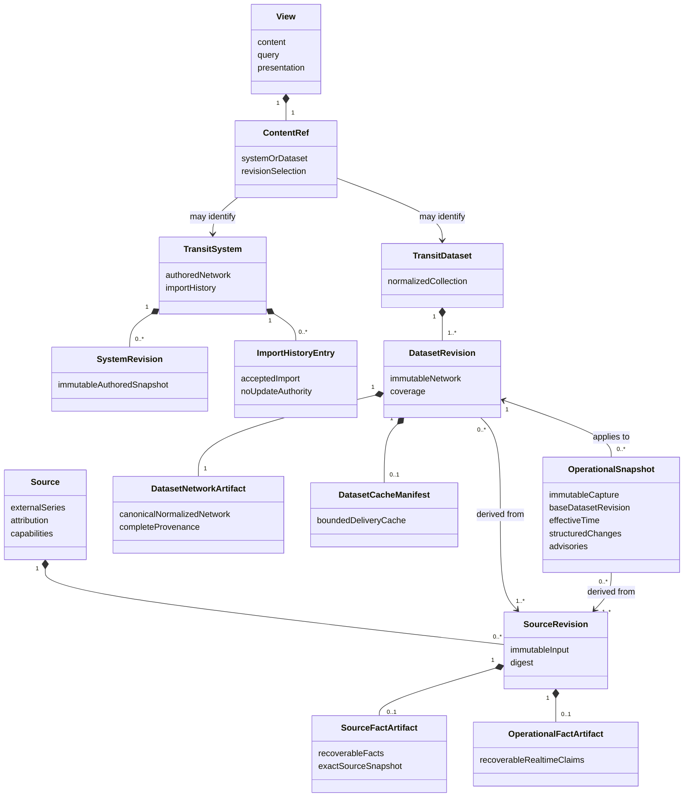
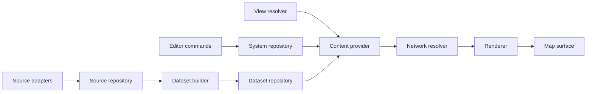
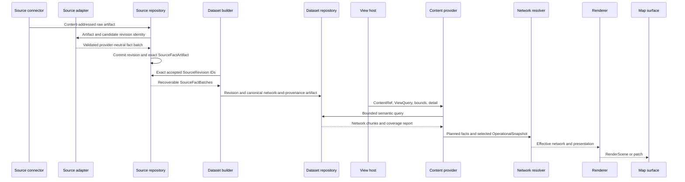

# Transit content architecture

> **Status:** Approved target architecture as of 2026-08-28. Production does
> not implement this storage model yet. The current editor stores schema-v16
> `TransitSystem` documents and converts managed GTFS archives directly into
> that authored document shape.

This explanation is for contributors who add sources, imports, saved Views,
publishing, or map rendering. It defines where each concern belongs. A
contributor should be able to place a new type or dependency after reading it
without coupling provider data to the editor or map.

The [current architecture](../../development/explanation/architecture.md) and
[current data model](../../product/reference/data-model.md) describe the code
that runs today. The companion
[transit data type reference](2026-08-28-transit-data-types.md) defines the
target vocabulary. The
[map data and rendering design](2026-08-28-map-data-rendering-boundaries-design.md)
applies these boundaries to the current renderer work.

## Storage roots

The target model has four top-level storage types. Each root owns a different
lifecycle and source of authority.

| Root             | Authority                         | Lifecycle                                        |
| ---------------- | --------------------------------- | ------------------------------------------------ |
| `TransitSystem`  | A person editing a network        | Mutable, versioned, and portable                 |
| `Source`         | One stable external data series   | Portable identity with immutable captured inputs |
| `TransitDataset` | Normalized source-backed content  | Immutable revisions built from Sources           |
| `View`           | A saved presentation and audience | Mutable metadata over a content reference        |

There is no `NationalTransitSystem` root. A national, statewide, regional,
local, or international map uses the same `TransitDataset` and `View` types.
Geographic scale comes from the queried content, camera, filters, time, and
detail level.

There is no top-level `TemporaryService` root. Planned and unplanned changes
modify the effective operation of ordinary Lines, Patterns, and Schedules for
a bounded time.

The following domain relationship diagram shows persisted ownership. It omits
API messages, database rows, editor state, and renderer state.

`SystemRevision`, `SourceRevision`, `SourceFactArtifact`, `DatasetRevision`,
`DatasetNetworkArtifact`, `OperationalFactArtifact`, and
`OperationalSnapshot` are supporting records. They do not create new product
modes. The fact and normalized-network artifacts preserve immutable revision
content. `DatasetCacheManifest`, network chunks, and `RenderScene` values are
derived caches. They are never authoritative storage.

## Component flow

The following component diagram names target responsibilities. It does not
prescribe source directories or require one package per box.

Source adapters understand GTFS, GTFS Realtime, MBTA records, OpenStreetMap,
and future provider formats. They preserve external identity and missing
fields. They emit provider-neutral local facts and finalized validation. The
accepted result carries one fact batch, while the rejected result carries no
batch. The acquisition host qualifies accepted facts and creates immutable
revision metadata.
Connector configuration owns endpoints, credentials, refresh cadence, and
retry policy. Those deployment values do not enter the portable `Source`
root.

The dataset builder validates and normalizes one or more Source revisions. It
owns normalized identity, source-scoped deduplication, conflict rejection,
provenance, and Line order. It creates an immutable `DatasetRevision` and
records the exact Source revisions and policy versions that produced it.

The content provider hides storage shape from the application surface. A
system provider reads an authored `TransitSystem`. A dataset provider queries
a `TransitDataset` by bounds, service time, mode, and detail level. Both return
the same semantic transfer contract.

The network resolver applies calendars and structured operational changes. It
returns only the effective Lines, Patterns, Stops, Stations, Alignments, and
advisories needed for one request. The Dataset revision records planned-source
normalization and Line order. The OperationalSnapshot records realtime-source
identity, precedence, and latest-selection policy. The resolver applies both
manifests. Arrival order never settles a source conflict. The renderer projects
those resolved facts into a `RenderScene`. The map surface publishes the scene
and owns MapLibre state.

The editor mutates only `TransitSystem`. It may import a reviewed subset of a
Dataset revision. That import is an explicit conversion with provenance. It
does not turn source-backed records into live editor dependencies.

A one-time file upload is not a stable external series. The editor records its
artifact digest and supplied citation in import history, but it creates no
active Source binding and claims no automatic reconciliation authority. Only
an import from a managed Dataset revision can bind authored entities to
portable Source identities.

## Acquisition and viewing sequence

The following sequence diagram shows source acquisition and one later map
query. Acquisition never calls the renderer. Viewing never asks a provider
adapter to parse raw data.

The repository stores canonical provider-neutral facts beside each accepted
SourceRevision. A later Dataset build can therefore reproduce the original
adapter output without executing adapter code that has since changed. The raw
artifact remains available for audit and an explicit future reparse. A rejected
revision records finalized validation and never supplies a Dataset build.

A DatasetRevision stores one canonical normalized-network artifact. Its
immutable envelope contains both the semantic network and the complete
provenance graph. Bounded D1 metadata points to that artifact instead of
embedding country-scale provenance. Query chunks derive from the artifact. A
cache rebuild decodes the retained artifact and never reruns a historical
adapter or normalizer.

A GTFS Realtime revision stores an `OperationalFactArtifact` instead of planned
facts. Version 1 requires exactly one `updates` relationship to a planned
Source. The operational normalizer resolves those external links through one
exact DatasetRevision and commits either complete state or ordered delta
mutations. Differential deletions remain explicit mutations. An unknown
revision is standalone evidence over planned service. It inherits no omitted
claim from an earlier realtime revision, and it leaves omitted operational
coverage unknown. Both Source-revision and Snapshot delta chains remain
explicit and acyclic.

## Source authority

TransitMapper stores what a source proves. It does not fill gaps with guesses
that look authoritative.

| Source class                  | Supported claim                                                  |
| ----------------------------- | ---------------------------------------------------------------- |
| Planned schedule              | Planned routes, trips, calendars, stop times, and supplied paths |
| Structured operational change | Supplied cancellations, skipped stops, replacements, and detours |
| Advisory                      | Rider text, affected entities, effect, and active period         |
| Authored or derived data      | A person or TransitMapper produced the value                     |

[GTFS Schedule](https://gtfs.org/documentation/schedule/reference/) is the
authority for planned service within its stated service dates. GTFS Realtime
contains distinct Trip Update, Trip Modification, Vehicle Position, and
Service Alert records. Each record class supports different claims. The GTFS
guidance on
[Schedule and Realtime](https://gtfs.org/resources/mobilitydata-recommendations/gtfs-schedule-vs-gtfs-realtime/)
keeps those roles separate.

A [Service Alert](https://gtfs.org/documentation/realtime/feed-entities/service-alerts/)
can prove that a disruption exists and identify affected entities. It cannot
prove a replacement path, stop sequence, timetable, or headway. TransitMapper
must show the advisory without inventing those facts.

Vehicle positions and predictions are outside this target. They need a
separate high-churn observation frame with observation time, uncertainty,
freshness, and Source revision lineage. They do not belong in an
OperationalChange.

Provider field names remain inside adapters. Core records do not contain GTFS
column names, MBTA enums, feed slugs, API URLs, or credentials. A `Source`
describes one portable external series, attribution, format, and capabilities.
`Publisher`, transit `Agency`, and `Operator` remain separate identities. One
publisher may own several Sources. One Source may contain several Agencies.

## Authored and source-backed content

`TransitSystem` and `TransitDataset` share transit concepts. They do not share
one persistence aggregate.

An authored system must support local edits, undo, partial sketches, user
catalog choices, and offline storage. A dataset must preserve provider
identity, exact service dates, immutable revisions, large coverage, and
bounded queries. Combining those needs in one document would make ordinary
editing carry provider history and would make broad viewing load one mutable
editor file.

Both roots resolve into the same read model. The read model uses passenger
Lines, directional Patterns, Stops, Stations, Alignments, Schedules, and
effective service state. A renderer therefore does not care whether the facts
came from an authored system or a source-backed dataset.

A Dataset may also contain Ways when a Source proves physical
infrastructure. An OpenStreetMap rail or road record can support that claim. A
GTFS shape supports an Alignment only. The Dataset capability manifest tells
the host whether Infrastructure representation is available for the queried
content.

An import copies accepted facts into a `TransitSystem`. It records an external
reference and the Source revision that supplied each copied fact. Later source
updates may offer a reviewed reconciliation. They cannot overwrite a local
edit merely because an external identifier still matches.

Schema migration is not source acquisition. A migrated `TransitSystem` may
retain opaque legacy source references and Service aliases so old documents,
undo records, and links remain readable. Those compatibility records belong to
the authored root. They create no Source identity, reconciliation authority,
or additional storage root.

## View and host boundaries

A `View` stores a content reference, a content query, and presentation. The
content query includes service time, an explicit all-or-only mode selector, and
filters. An empty only-mode list means that the user disabled every mode. It
never means all modes. Presentation includes camera and representation. A
named View does not persist semantic focus. A copied deep link may add focus
for one Line, Pattern, Stop, Station, or other transit fact. A View does not
store transit records, MapLibre identifiers, permissions, or application
chrome.

The content reference is a discriminated union. It identifies either a
`TransitSystem` or a `TransitDataset`. It also states whether the View follows
the latest revision or pins a specific revision. A pinned Dataset revision
reproduces the planned network after a provider publishes new data. A View
must also pin an OperationalSnapshot and use a fixed service instant to
reproduce the exact effective-service state.

The host decides capabilities. The editor host may expose mutation commands.
A full reader may expose search, filters, details, and sharing. An embed may
expose only pan, zoom, and selected filters. Those hosts mount the same map
surface and content contract.

No host checks for a national product mode. A country-scale saved View is one
ordinary View over a broad Dataset query. A regional deep link is another
ordinary View with different presentation and content bounds.

## Temporary service

A temporary service changes ordinary operations for a bounded period. Its
representation depends on the evidence supplied by the provider.

Suppose the MBTA closes part of the Red Line and runs shuttle buses.

| Available evidence | Stored fact                                                         | Map and details surface                                               |
| ------------------ | ------------------------------------------------------------------- | --------------------------------------------------------------------- |
| Planned schedule   | New Calendar, Patterns, Trips or frequency rules, and supplied path | Show the shuttle for the planned dates with its known stops and times |
| Structured update  | `OperationalChange` over a known Dataset revision                   | Apply only supplied changes during the effective period               |
| Advisory only      | `Advisory` with affected entity selectors and active period         | Show the warning and affected entities without drawing a shuttle path |

The original Red Line remains one passenger identity when the publisher
presents the shuttle as Red Line service. Its Line may then own one rail
ServicePlan and one temporary bus ServicePlan. Each plan keeps one mode. A
publisher may instead give the shuttle its own temporary passenger identity.
That case creates a temporary Line and links it as the replacement. The
renderer consolidates shared path segments and separates only supplied,
nonoverlapping physical geometry. Mode alone never authorizes another stripe.
A rail and bus ServicePlan beneath one Line still collapse on every shared
span.

Missing geometry stays unknown. The UI may draw a clearly marked
stop-to-stop aid as presentation. That aid does not become an Alignment and
does not participate in corridor consolidation.

## Dependency rules

The architecture has eight dependency rules:

1. Raw provider types never leave their adapter.
2. A Source revision and OperationalSnapshot are immutable after acquisition.
3. A Dataset revision records all Source revisions and normalization versions
   that produced it.
4. A View references content and never embeds it.
5. Geographic scale never appears as a domain kind or application mode.
6. The renderer receives resolved transit facts and presentation. It never
   receives provider records, database rows, editor commands, or View wire
   payloads.
7. Derived chunks and scenes may be deleted and rebuilt without losing data.
8. Missing source facts remain unknown.

## Rejected designs

| Design                                        | Reason                                                                 |
| --------------------------------------------- | ---------------------------------------------------------------------- |
| One national `TransitSystem` document         | It couples geographic scale to the editor and prevents bounded loading |
| Raw GTFS or provider records in core          | Provider changes would leak through every consumer                     |
| Source data stored inside authored documents  | Provider history and edit history have different authority             |
| Alert text converted into geometry or service | An advisory does not prove a path or timetable                         |
| Renderer-specific content drivers             | Rendering would own storage and acquisition policy                     |
| Separate editor and viewer map models         | The same transit facts would render differently by host                |

## Implementation choices

The first dataset cache uses canonical bounded JSON under the version
`dataset-chunk-json-v1`. It partitions normalized facts by bounds and detail
and keeps the format behind the content provider. A later cache format may use
vector tiles, FlatGeobuf, or another indexed encoding under a new version. It
cannot change the content-provider contract or domain identity.

Dataset normalization Version 1 uses the fixed manifest values `normalize-v1`,
`dataset-v1`, `external-identity-v1`, `reject-conflicts-v1`, and
`pattern-match-v1`. Stable external identity produces stable normalized
identity. Revision-local evidence includes its exact SourceRevision in the
identity. Canonically equal duplicates under one identity collapse and retain
all provenance. Conflicting values under one identity reject the build.
Derived evidence fills only missing or unknown fields.

Version 1 does not infer equivalence between Sources. Matching names, public
codes, coordinates, stop sequences, or paths never merges two cross-Source
records. `sourcePriority` contains each participating Source exactly once. It
orders Lines but never changes entity identity. A future cross-Source
conflation feature needs explicit equivalence evidence and a new policy
version.

Source-backed Pattern identity uses `pattern-match-v1`. It prefers a provider
identifier only when that fact declares `source-stable` identity. Otherwise it
uses Line identity, direction, ordered Stop calls, and supplied path evidence
from one Source. It excludes boarding rules because the normalized Pattern does
not own them. It also excludes schedule and row order. It does not match
Patterns across Sources. The normalizer resolves the Line identity through
exact Line-to-ServicePlan and ServicePlan-to-Pattern links. One Pattern may
belong to several ServicePlans under one Line. Zero or several distinct Line
owners reject the build. The Dataset build manifest records the version.

Retention Version 1 keeps every revision required by a retained or recoverable
pinned View. It also keeps the latest revision for each root. Unreferenced
accepted Source revisions remain for 30 days, rejected Source revisions and
unreferenced operational snapshots remain for 7 days, and the previous two
Dataset revisions remain for at least 30 days. Expiring Views keep dependencies
through expiry plus 7 days. Permanent Views keep dependencies until deletion.
The implementation plan defines the complete cleanup matrix and recovery gate.
